# Домашнее задание

Работа с загрузчиком 
__Задание__  
1. Включить отображение меню Grub. 
2. Попасть в систему без пароля несколькими способами. 
3. Установить систему с LVM, после чего переименовать VG.

**Цель:**

- Научиться попадать в систему без пароля; 
- Устанавливать систему с LVM и переименовывать в VG.

Для выполнения домашнего задания использовались ОС:

- Oracle Linux release 9.5 c заблокированной учетной записью root: 
[root@localhost ~]# passwd -S root 
root LK 1969-12-31 0 99999 7 -1 (Пароль заблокирован.)

- Ubuntu 24.04 c установленным паролем на root:

## Включить отображение меню Grub

По умолчанию меню загрузчика Grub скрыто и нет задержки при загрузке. Для отображения меню нужно отредактировать конфигурационный файл: 
nano /etc/default/grub

Комментируем строку, скрывающую меню и ставим задержку для выбора пункта меню в 10 секунд.
#GRUB_TIMEOUT_STYLE=hidden
GRUB_TIMEOUT=10

Oracle Linux: 
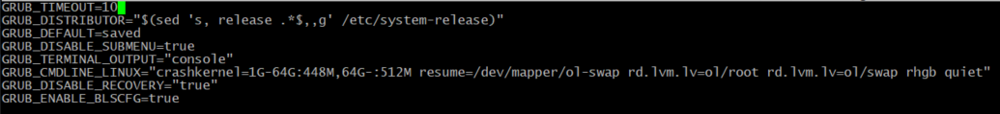
Ubuntu: 
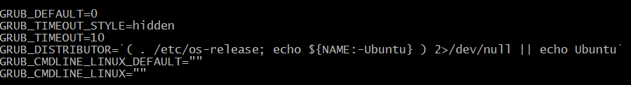

Обновляем конфигурацию загрузчика и перезагружаемся для проверки:
Oracle Linux:  grub2-set-default 1

Ubuntu:  update-grub

Перезагружаем системы, попадаем в меню загрузчика, нажимаем "e": 
Oracle Linux: 
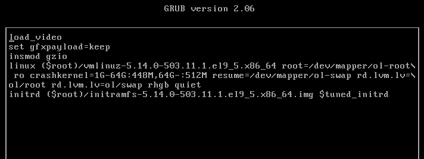
Ubuntu: 
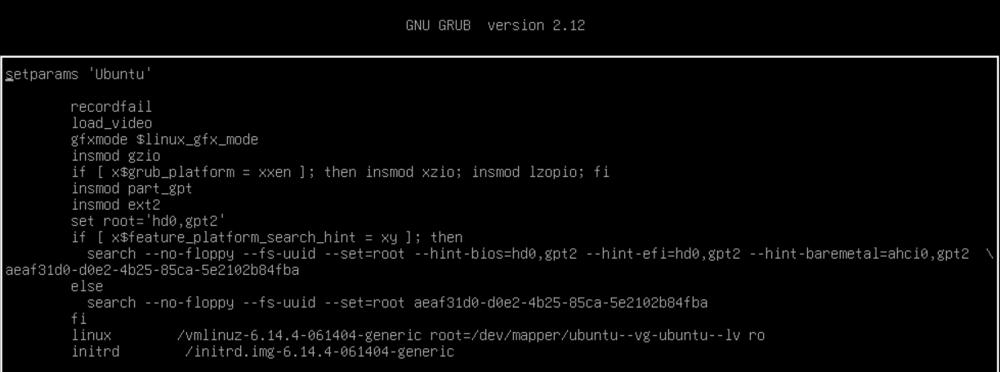

## Попасть в систему без пароля несколькими способами  
### Способ 1. init=/bin/bash

Oracle Linux: В конце строки, начинающейся с linux, добавляем **rd.break** и нажимаем сtrl-x для загрузки в систему: 
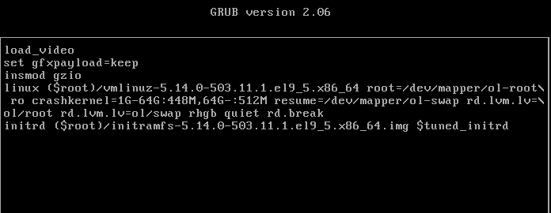 
Ubuntu: В конце строки, начинающейся с linux, добавляем **init=/bin/bash** , меняем **ro** на **rw** , и нажимаем сtrl-x для загрузки в систему: 
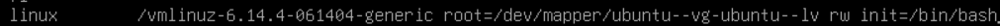

Сброс пароля root в ubuntu: 
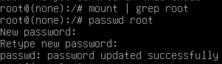  
перезагружаю систему и успешно авторизируюсь под root  с новым паролем: 
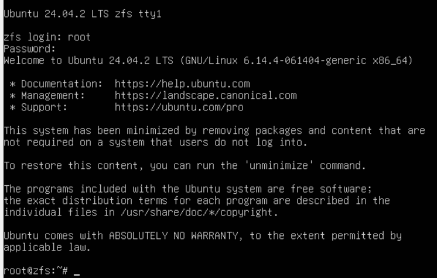

Сброс пароля root в Oracle Linux: 
Монтирование файловой системы в режим записи: 
 mount -o remount,rw /sysroot

 Заходим в chroot окружение: 
chroot /sysroot

 Сброс пароля и активация root: 
 nano /etc/shadow

в строке для root, удаляе всё во втором поле (после root:) и знак "!", для разблокировки учетной записи: 
root:::0:99999:7:::

Выходим из chroot: Ctrl+D 
Перезагружаемся: reboot -f

Заходим в систему под root без пароля и назначем новый пароль: 
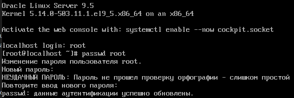

## Способ 2. Recovery mode

В меню загрузчика на первом уровне выбрать второй пункт (Advanced options…), далее загрузить пункт меню с указанием recovery mode в названии.  
Получим меню режима восстановления. 
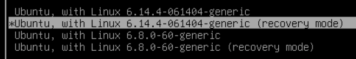

Система загружается сразу в консоль, нажимаем Enter и меняем пароль root: 
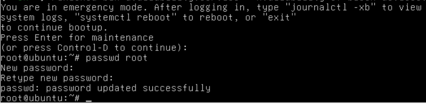

Перезагружаемся, проверяем вход с новым паролем: 
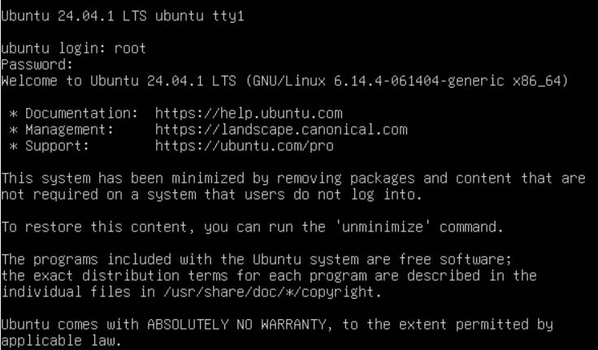

## Установить систему с LVM, после чего переименовать VG

Мы установили систему Ubuntu 24.04 со стандартной разбивкой диска с использованием  LVM. 
Первым делом посмотрим текущее состояние системы (список Volume Group): 
root@ubuntu:~# vgs  
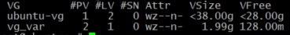

Нас интересует вторая строка с именем Volume Group. Приступим к переименованию: 
root@ubuntu:~# vgrename ubuntu-vg ubuntu-otus 
  Volume group "ubuntu-vg" successfully renamed to "ubuntu-otus"

Далее правим /boot/grub/grub.cfg. Везде заменяем старое название VG на новое (в файле дефис меняется на два дефиса ubuntu--vg ubuntu--otus): 
root@ubuntu:~# nano  /boot/grub/grub.cfg
 
После чего можем перезагружаться и, если все сделано правильно, успешно грузимся с новым именем Volume Group и проверяем: 
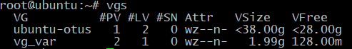

