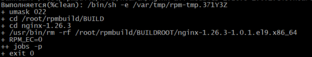
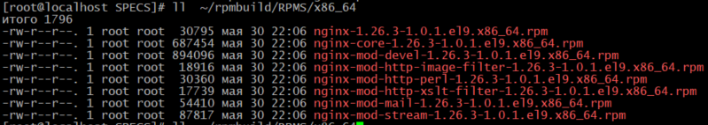
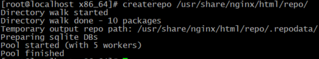
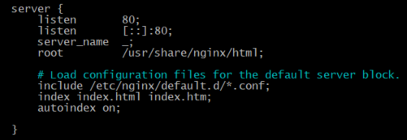
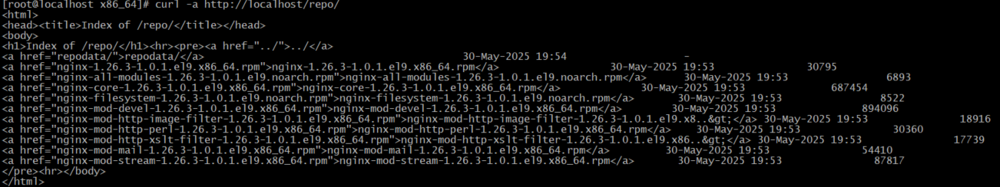
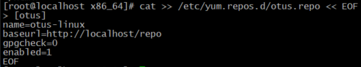
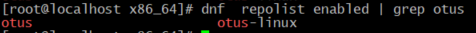
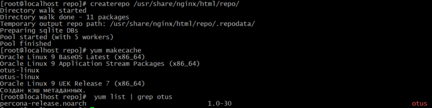
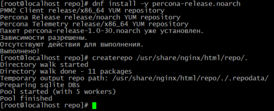
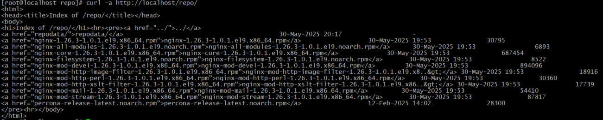

# Домашнее задание: Управление пакетами. Дистрибьюция софта 
## Сборка RPM-пакета и создание репозитория  
**Цель:** 
Научиться собирать RPM-пакеты. 
Создавать собственный RPM-репозиторий.

**Описание домашнего задания**  
Что нужно сделать:  
-    создать свой RPM (можно взять свое приложение, либо собрать к примеру Apache с определенными опциями);  
   - cоздать свой репозиторий и разместить там ранее собранный RPM;  
   - развернуть у себя через Nginx и дать ссылку на репозиторий.

## Создать свой RPM пакет
Версия нашей ОС:
[root@localhost ~]# cat /etc/oracle-release 
Oracle Linux Server release 9.6
 
-  Для данного задания нам понадобятся следующие установленные пакеты:
dnf install -y wget rpmdevtools rpm-build createrepo \  
 dnf-utils cmake gcc git nano 

- Для примера возьмем пакет Nginx и соберем его с дополнительным модулем ngx_broli 
-  Загрузим SRPM пакет Nginx для дальнейшей работы над ним:
[root@localhost ~]# mkdir rpm && cd rpm 
[root@localhost rpm]# yumdownloader --source nginx

- При установке такого пакета в домашней директории создается дерево каталогов для сборки, далее поставим все зависимости для сборки пакета Nginx: 
[root@localhost rpm]# rpm -Uvh nginx*.src.rpm 
[root@localhost rpm]# yum-builddep nginx

- Также нужно скачать исходный код модуля ngx_brotli — он
потребуется при сборке: 
[root@localhost /]# cd /root 
[root@localhost ~]# git clone --recurse-submodules -j8 \ https://github.com/google/ngx_brotli 
[root@localhost ~]# cd ngx_brotli/deps/brotli 
[root@localhost brotli]#  mkdir out && cd out

- Собираем модуль ngx_brotli: 
[root@localhost out]#  cmake -DCMAKE_BUILD_TYPE=Release -DBUILD_SHARED_LIBS=OFF -DCMAKE_C_FLAGS="-Ofast -m64 -march=native -mtune=native -flto -funroll-loops -ffunction-sections -fdata-sections -Wl,--gc-sections" -DCMAKE_CXX_FLAGS="-Ofast -m64 -march=native -mtune=native -flto -funroll-loops -ffunction-sections -fdata-sections -Wl,--gc-sections" -DCMAKE_INSTALL_PREFIX=./installed .. 
[root@localhost out]# cmake --build . --config Release -j 2 --target brotlienc 
[root@localhost out]# cd ../../../..

- Теперь можно приступить к сборке RPM пакета: 
[root@localhost ~]# cd ~/rpmbuild/SPECS/ 
[root@localhost SPECS]#  rpmbuild -ba nginx.spec -D 'debug_package %{nil}'  

- Убедимся, что пакеты создались: 
[root@localhost SPECS]# ll  ~/rpmbuild/RPMS/x86_64 

-  Копируем пакеты в общий каталог: 
[root@localhost SPECS]# cp ~/rpmbuild/RPMS/noarch/* ~/rpmbuild/RPMS/x86_64/ 
[root@localhost SPECS]#  cd ~/rpmbuild/RPMS/x86_64

- Теперь можно установить наш пакет и убедиться, что nginx работает: 
[root@localhost x86_64]# dnf localinstall *.rpm 
[root@localhost x86_64]# systemctl start nginx 
[root@localhost x86_64]# systemctl enable nginx 
[root@localhost x86_64]#  systemctl status ngin 
Unit ngin.service could not be found.

- Далее мы будем использовать его для доступа к своему репозиторию. 

## Создать свой репозиторий и разместить там ранее собранный RPM

- Теперь приступим к созданию своего репозитория. Директория для статики у Nginx по умолчанию /usr/share/nginx/html. Создадим там каталог repo:

[root@localhost x86_64]#  mkdir /usr/share/nginx/html/repo

- Копируем туда наши собранные RPM-пакеты:

[root@localhost x86_64]# cp ~/rpmbuild/RPMS/x86_64/*.rpm /usr/share/nginx/html/repo/

- Инициализируем репозиторий командой: 
[root@localhost x86_64]# createrepo /usr/share/nginx/html/repo/ 

- Для прозрачности настроим в NGINX доступ к листингу каталога. В файле /etc/nginx/nginx.conf в блоке server добавим следующие директивы: 
[root@localhost x86_64]# nano /etc/nginx/nginx.conf 
 

- Проверяем синтаксис и перезапускаем NGINX: 
[root@localhost x86_64]# nginx -t 
nginx: the configuration file /etc/nginx/nginx.conf syntax is ok 
nginx: configuration file /etc/nginx/nginx.conf test is successful 
[root@localhost x86_64]# nginx -s reload

 Теперь ради интереса можно посмотреть в браузере или с помощью curl: 
 [root@localhost x86_64]# curl -a http://localhost/repo/ 
 

- Все готово для того, чтобы протестировать репозиторий. 
- Добавим его в /etc/yum.repos.d: 
[root@localhost x86_64]# cat >> /etc/yum.repos.d/otus.repo << EOF 

- Убедимся, что репозиторий подключился и посмотрим, что в нем есть: 

- Добавим пакет в наш репозиторий: 
[root@localhost x86_64]#  cd /usr/share/nginx/html/repo/ 
[root@localhost repo]#  wget https://repo.percona.com/yum/percona-release-latest.noarch.rpm

- Обновим список пакетов в репозитории: 

- Так как Nginx у нас уже стоит, установим репозиторий percona-release: 
[root@localhost repo]# dnf install -y percona-release.noarch

-  Обновить репозиторий: 
 

