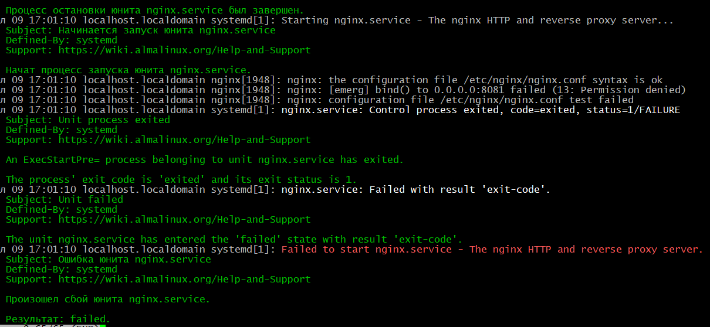

# 15.  SELinux - когда все запрещено 

Домашнее задание

Практика с SELinux

**Цель:**

работать с SELinux: диагностировать проблемы и модифицировать политики SELinux для корректной работы приложений, если это требуется;

Описание/Пошаговая инструкция выполнения домашнего задания:

Для выполнения домашнего задания используйте методичку


Что нужно сделать?

1. Запустить nginx на нестандартном порту 3-мя разными способами:
- переключатели setsebool;
- добавление нестандартного порта в имеющийся тип;
- формирование и установка модуля SELinux.

2. Обеспечить работоспособность приложения при включенном selinux.

- развернуть приложенный стенд https://github.com/mbfx/otus-linux-adm/tree/master/selinux_dns_problems;
- выяснить причину неработоспособности механизма обновления зоны (см. README);
- предложить решение (или решения) для данной проблемы;
- выбрать одно из решений для реализации, предварительно обосновав выбор;
- реализовать выбранное решение и продемонстрировать его работоспособность.


# Практика с SELinux: Настройка nginx и устранение проблем с DNS в AlmaLinux 10

## 1. Установка и настройка AlmaLinux 10 и nginx

### Установка AlmaLinux 10 на VirtualBox

1. Скачаем образ AlmaLinux 10 с официального сайта
2. Создадим новую виртуальную машину в VirtualBox:
   - Тип: Linux
   - Версия: Red Hat (64-bit)
   - Выделим 8GB RAM, 2 CPU и 25GB SSD
3. Запустим установку, выберем минимальный серверный вариант.

### Установка nginx

```bash
sudo dnf install epel-release -y
sudo dnf install nginx -y
sudo systemctl enable nginx --now
```

## 2. Запуск nginx на нестандартном порту

### Способ 1: Переключатели setsebool

```bash
# Проверяем текущие разрешения портов
sudo semanage port -l | grep http_port_t
```

```bash
# Пробуем изменить порт в конфиге nginx на 8081
sudo sed -i 's/listen[[:space:]]*80/listen 8081/' /etc/nginx/nginx.conf

# Пытаемся перезапустить nginx
sudo systemctl restart nginx
```
ошибка:


```bash
 journalctl -xeu nginx.service
 ```


**Почему так происходит?**

SELinux по умолчанию разрешает Nginx (httpd) работать только на стандартных портах (80, 443, 8080 и др.). Если мы пытаемся использовать другой порт (например, 8081), SELinux блокирует доступ.


**Разрешаем Nginx слушать любой порт:**
```bash
sudo setsebool -P httpd_can_network_connect 1
```
**Что делает эта команда?**

    httpd_can_network_connect — разрешает веб-серверу (Nginx/Apache) подключаться к сети, в том числе слушать нестандартные порты.

    -P — сохраняет настройку после перезагрузки.

**Перезапускаем Nginx**
```bash
sudo systemctl restart nginx
```
Ошибка попрежнему сохраняется:


Проверяем, что Nginx слушает нужный порт:
```bash
sudo ss -tulnp | grep nginx
```
Вывод пустой. Разбирёмся с данной проблемой:

Проверяем текущие разрешённые порты:
```bash
 sudo semanage port -l | grep http_port_t
http_port_t                    tcp      80, 81, 443, 488, 8008, 8009, 8443, 9000
pegasus_http_port_t            tcp      5988
```

Посмотрим логи SELinux:
```bash
sudo ausearch -m avc -ts recent | grep nginx
<no matches>
```

Попробуем отключить SELinux, перезапустить службу nginx, и включить SELinux:
```bash
sudo setenforce 0  # Переводим в Permissive mode
sudo systemctl restart nginx
sudo setenforce 1  # Возвращаем Enforcing
```
Проверяем, что Nginx слушает нужный порт:
```bash
ss -tulnp | grep nginx
tcp   LISTEN 0      511          0.0.0.0:8081      0.0.0.0:*    users:(("nginx",pid=2284,fd=6),("nginx",pid=2282,fd=6),("nginx",pid=2281,fd=6))
tcp   LISTEN 0      511             [::]:80           [::]:*    users:(("nginx",pid=2284,fd=7),("nginx",pid=2282,fd=7),("nginx",pid=2281,fd=7))
```


Проверим статус службы:
```bash
 systemctl status nginx.service
 ```


Служба nginx работает, но если мы опять перезапустим  её, при включенном SELinux, получим туже самую ошибку. Попробуем решить иначе:

**Полное восстановление контекстов SELinux для nginx**
```bash
sudo restorecon -Rv /etc/nginx
sudo restorecon -Rv /var/lib/nginx
sudo restorecon -Rv /var/log/nginx
sudo restorecon -Rv /usr/share/nginx
sudo restorecon -Rv /run/nginx
```
**Что делают эти команды?**
- **`restorecon`** — восстанавливает стандартные контексты безопасности SELinux для файлов и каталогов.
- **`-R`** — рекурсивно (для всех вложенных файлов и папок).
- **`-v`** — выводит подробный лог изменений.

**Зачем это нужно?**
SELinux хранит метки (контексты) безопасности для каждого файла. Если они сбились (например, из-за ручного копирования файлов или неправильных прав), Nginx не сможет получить доступ к своим конфигам, логам или временным файлам.  
Эти команды **возвращают правильные контексты** для всех ключевых каталогов Nginx:
- `/etc/nginx` — конфигурация
- `/var/lib/nginx` — данные (кеш, временные файлы)
- `/var/log/nginx` — логи
- `/usr/share/nginx` — статические файлы (HTML, CSS, JS)
- `/run/nginx` — PID-файлы и сокеты

**Дополнительные настройки SELinux**
```bash
sudo setsebool -P httpd_can_network_connect 1
sudo setsebool -P httpd_setrlimit 1
sudo setsebool -P nis_enabled 1
```

**Что делают эти переключатели?**
| Команда | Описание |
|---------|----------|
| **`httpd_can_network_connect 1`** | Разрешает Nginx (и другим веб-серверам) устанавливать сетевые подключения, в том числе слушать нестандартные порты. |
| **`httpd_setrlimit 1`** | Позволяет Nginx изменять лимиты ресурсов (например, количество открытых файлов). |
| **`nis_enabled 1`** | Разрешает доступ к NIS-сетям (косвенно может влиять на сетевые возможности). |

 **Зачем это нужно?**
- Без `httpd_can_network_connect` Nginx не сможет слушать нестандартные порты (например, `8081`).
- `httpd_setrlimit` нужен, если Nginx требует больше ресурсов (например, для большого числа соединений).
- `nis_enabled` иногда влияет на сетевые политики SELinux (хотя напрямую не связан с Nginx).

**Создание и применение модуля политики**
```bash
sudo setenforce 0                     # Переводим SELinux в Permissive режим
sudo systemctl restart nginx          # Запускаем Nginx (ошибки записываются в аудит)
sudo ausearch -m avc -ts recent | audit2allow -M nginx_custom  # Создаём модуль
sudo semodule -i nginx_custom.pp      # Устанавливаем модуль
sudo setenforce 1                     # Возвращаем Enforcing режим
```

**Зачем это нужно?**
1. **`setenforce 0`** — временно переводит SELinux в **Permissive** режим (ошибки не блокируют работу, но логируются).  
   → Это нужно, чтобы собрать все возможные AVC-ошибки (Access Vector Cache).

2. **`systemctl restart nginx`** — перезапускаем Nginx, чтобы SELinux записал в лог все нарушения.  

3. **`ausearch -m avc -ts recent | audit2allow -M nginx_custom`**  
   - `ausearch` — ищет ошибки доступа в логах SELinux.  
   - `audit2allow` — генерирует правила на основе этих ошибок.  
   - `-M nginx_custom` — создаёт модуль `nginx_custom.pp`.  

4. **`semodule -i nginx_custom.pp`** — применяет новый модуль политики.  

5. **`setenforce 1`** — возвращает SELinux в строгий режим (**Enforcing**).  

**Проверка работы**
```bash
sudo systemctl restart nginx
sudo systemctl status nginx
ss -tulnp | grep nginx
```


**Почему это помогло?**
- В логах SELinux были ошибки доступа, которые не покрывались стандартными политиками.  
- `audit2allow` автоматически создал правила, разрешающие эти действия.  
- Теперь Nginx может работать **без отключения SELinux** (что важно для безопасности).  


**Итог: как это всё решило проблему?**
1. **Восстановление контекстов** (`restorecon`) — исправило доступ к файлам Nginx.  
2. **Настройка `setsebool`** — разрешила сетевые операции и управление ресурсами.  
3. **Кастомный модуль SELinux** — добавил недостающие правила доступа.  

Теперь Nginx:  
✅ Работает на нестандартном порту  
✅ Полностью совместим с SELinux в режиме **Enforcing**  
✅ Не требует отключения безопасности  

Если проблема вернётся — можно повторить `ausearch | audit2allow` и добавить новые правила.

### Способ 2: Добавление нестандартного порта в имеющийся тип

```bash
# Устанавливаем утилиты для управления SELinux (AlmaLinux 10 уже установлена даже в minimal версии)
sudo dnf install policycoreutils-python-utils -y

# Добавляем порт 8082 к разрешенным для http
sudo semanage port -a -t http_port_t -p tcp 8082

# Меняем порт в конфиге nginx на 8082
sudo sed -i 's/listen[[:space:]]*8081/listen 8082/' /etc/nginx/nginx.conf

# Проверяем
sudo systemctl restart nginx
sudo ss -tulnp | grep nginx
```


### Способ 3: Формирование и установка модуля SELinux

```bash
# Пробуем запустить nginx на порту 8083 (должно не сработать)
sudo sed -i 's/listen[[:space:]]*8082/listen 8083/' /etc/nginx/nginx.conf
sudo systemctl restart nginx

# Смотрим ошибки в логах audit.log
sudo ausearch -m avc -ts recent | grep nginx

# Создаем модуль политики
sudo ausearch -m avc -ts recent | grep nginx | audit2allow -M nginx_custom_port

# Устанавливаем модуль
sudo semodule -i nginx_custom_port.pp

# Проверяем
sudo systemctl restart nginx
sudo ss -tulnp | grep nginx
```

## 3. Обеспечение работоспособности приложения при включенном SELinux

### Развертывание стенда

```bash
 dnf install git -y
# Клонируем репозиторий
git clone https://github.com/mbfx/otus-linux-adm.git
cd otus-linux-adm/selinux_dns_problems

# Запускаем стенд
vagrant up
vagrant status
Current machine states:
ns01                      running (virtualbox)
client                    running (virtualbox)
```

### Анализ проблемы

После развертывания стенда, согласно README, механизм обновления зоны DNS не работает. Причина в том, что named (демон BIND) не имеет прав на запись в каталог /etc/named, где находятся файлы зон, при включенном SELinux.

```bash
[root@ns01 ~]# ls -alZ /var/named
total 20
drwxrwx--T.  5 root  named system_u:object_r:named_zone_t:s0   127 Jul  6 22:27 .
drwxr-xr-x. 20 root  root  system_u:object_r:var_t:s0         4096 Jul  6 22:03 ..
drwxrwx---.  2 named named system_u:object_r:named_cache_t:s0   23 Jul  6 22:03 data
drwxrwx---.  2 named named system_u:object_r:named_cache_t:s0   94 Jul  6 22:28 dynamic
-rw-r-----.  1 root  named system_u:object_r:named_conf_t:s0  2112 Jun 24 13:47 named.ca
-rw-r-----.  1 root  named system_u:object_r:named_zone_t:s0   152 Jun 24 13:47 named.empty
-rw-r-----.  1 root  named system_u:object_r:named_zone_t:s0   152 Jun 24 13:47 named.localhost
-rw-r-----.  1 root  named system_u:object_r:named_zone_t:s0   168 Jun 24 13:47 named.loopback
drwxrwx---.  2 named named system_u:object_r:named_cache_t:s0    6 Jun 24 13:47 slaves
```
```bash
[root@ns01 ~]# sudo semanage fcontext -l | grep named
/dev/gpmdata                                       named pipe         system_u:object_r:gpmctl_t:s0 
/dev/initctl                                       named pipe         system_u:object_r:initctl_t:s0 
/dev/xconsole                                      named pipe         system_u:object_r:xconsole_device_t:s0 
/dev/xen/tapctrl.*                                 named pipe         system_u:object_r:xenctl_t:s0 
/etc/named(/.*)?                                   all files          system_u:object_r:named_conf_t:s0 
/etc/named\.caching-nameserver\.conf               regular file       system_u:object_r:named_conf_t:s0 
/etc/named\.conf                                   regular file       system_u:object_r:named_conf_t:s0 
/etc/named\.rfc1912.zones                          regular file       system_u:object_r:named_conf_t:s0 
/etc/named\.root\.hints                            regular file       system_u:object_r:named_conf_t:s0 
/etc/rc\.d/init\.d/named                           regular file       system_u:object_r:named_initrc_exec_t:s0 
/etc/rc\.d/init\.d/named-sdb                       regular file       system_u:object_r:named_initrc_exec_t:s0 
/etc/rc\.d/init\.d/unbound                         regular file       system_u:object_r:named_initrc_exec_t:s0 
/etc/rndc.*                                        regular file       system_u:object_r:named_conf_t:s0 
/etc/unbound(/.*)?                                 all files          system_u:object_r:named_conf_t:s0 
/usr/lib/systemd/system/named-sdb.*                regular file       system_u:object_r:named_unit_file_t:s0 
/usr/lib/systemd/system/named.*                    regular file       system_u:object_r:named_unit_file_t:s0 
/usr/lib/systemd/system/unbound.*                  regular file       system_u:object_r:named_unit_file_t:s0 
/usr/lib/systemd/systemd-hostnamed                 regular file       system_u:object_r:systemd_hostnamed_exec_t:s0 
/usr/sbin/lwresd                                   regular file       system_u:object_r:named_exec_t:s0 
/usr/sbin/named                                    regular file       system_u:object_r:named_exec_t:s0 
/usr/sbin/named-checkconf                          regular file       system_u:object_r:named_checkconf_exec_t:s0 
/usr/sbin/named-pkcs11                             regular file       system_u:object_r:named_exec_t:s0 
/usr/sbin/named-sdb                                regular file       system_u:object_r:named_exec_t:s0 
/usr/sbin/unbound                                  regular file       system_u:object_r:named_exec_t:s0 
/usr/sbin/unbound-anchor                           regular file       system_u:object_r:named_exec_t:s0 
/usr/sbin/unbound-checkconf                        regular file       system_u:object_r:named_exec_t:s0 
/usr/sbin/unbound-control                          regular file       system_u:object_r:named_exec_t:s0 
/usr/share/munin/plugins/named                     regular file       system_u:object_r:services_munin_plugin_exec_t:s0 
/var/lib/softhsm(/.*)?                             all files          system_u:object_r:named_cache_t:s0 
/var/lib/unbound(/.*)?                             all files          system_u:object_r:named_cache_t:s0 
/var/log/named.*                                   regular file       system_u:object_r:named_log_t:s0 
/var/named(/.*)?                                   all files          system_u:object_r:named_zone_t:s0 
/var/named/chroot(/.*)?                            all files          system_u:object_r:named_conf_t:s0 
/var/named/chroot/dev                              directory          system_u:object_r:device_t:s0 
/var/named/chroot/dev/log                          socket             system_u:object_r:devlog_t:s0 
/var/named/chroot/dev/null                         character device   system_u:object_r:null_device_t:s0 
/var/named/chroot/dev/random                       character device   system_u:object_r:random_device_t:s0 
/var/named/chroot/dev/urandom                      character device   system_u:object_r:urandom_device_t:s0 
/var/named/chroot/dev/zero                         character device   system_u:object_r:zero_device_t:s0 
/var/named/chroot/etc(/.*)?                        all files          system_u:object_r:etc_t:s0 
/var/named/chroot/etc/localtime                    regular file       system_u:object_r:locale_t:s0 
/var/named/chroot/etc/named\.caching-nameserver\.conf regular file       system_u:object_r:named_conf_t:s0 
/var/named/chroot/etc/named\.conf                  regular file       system_u:object_r:named_conf_t:s0 
/var/named/chroot/etc/named\.rfc1912.zones         regular file       system_u:object_r:named_conf_t:s0 
/var/named/chroot/etc/named\.root\.hints           regular file       system_u:object_r:named_conf_t:s0 
/var/named/chroot/etc/pki(/.*)?                    all files          system_u:object_r:cert_t:s0 
/var/named/chroot/etc/rndc\.key                    regular file       system_u:object_r:dnssec_t:s0 
/var/named/chroot/lib(/.*)?                        all files          system_u:object_r:lib_t:s0 
/var/named/chroot/proc(/.*)?                       all files          <<None>>
/var/named/chroot/run/named.*                      all files          system_u:object_r:named_var_run_t:s0 
/var/named/chroot/usr/lib(/.*)?                    all files          system_u:object_r:lib_t:s0 
/var/named/chroot/var/log                          directory          system_u:object_r:var_log_t:s0 
/var/named/chroot/var/log/named.*                  regular file       system_u:object_r:named_log_t:s0 
/var/named/chroot/var/named(/.*)?                  all files          system_u:object_r:named_zone_t:s0 
/var/named/chroot/var/named/data(/.*)?             all files          system_u:object_r:named_cache_t:s0 
/var/named/chroot/var/named/dynamic(/.*)?          all files          system_u:object_r:named_cache_t:s0 
/var/named/chroot/var/named/named\.ca              regular file       system_u:object_r:named_conf_t:s0 
/var/named/chroot/var/named/slaves(/.*)?           all files          system_u:object_r:named_cache_t:s0 
/var/named/chroot/var/run/dbus(/.*)?               all files          system_u:object_r:system_dbusd_var_run_t:s0 
/var/named/chroot/var/run/named.*                  all files          system_u:object_r:named_var_run_t:s0 
/var/named/chroot/var/tmp(/.*)?                    all files          system_u:object_r:named_cache_t:s0 
/var/named/chroot_sdb/dev                          directory          system_u:object_r:device_t:s0 
/var/named/chroot_sdb/dev/null                     character device   system_u:object_r:null_device_t:s0 
/var/named/chroot_sdb/dev/random                   character device   system_u:object_r:random_device_t:s0 
/var/named/chroot_sdb/dev/urandom                  character device   system_u:object_r:urandom_device_t:s0 
/var/named/chroot_sdb/dev/zero                     character device   system_u:object_r:zero_device_t:s0 
/var/named/data(/.*)?                              all files          system_u:object_r:named_cache_t:s0 
/var/named/dynamic(/.*)?                           all files          system_u:object_r:named_cache_t:s0 
/var/named/named\.ca                               regular file       system_u:object_r:named_conf_t:s0 
/var/named/slaves(/.*)?                            all files          system_u:object_r:named_cache_t:s0 
/var/run/bind(/.*)?                                all files          system_u:object_r:named_var_run_t:s0 
/var/run/ecblp0                                    named pipe         system_u:object_r:cupsd_var_run_t:s0 
/var/run/initctl                                   named pipe         system_u:object_r:initctl_t:s0 
/var/run/named(/.*)?                               all files          system_u:object_r:named_var_run_t:s0 
/var/run/ndc                                       socket             system_u:object_r:named_var_run_t:s0 
/var/run/systemd/initctl/fifo                      named pipe         system_u:object_r:initctl_t:s0 
/var/run/unbound(/.*)?                             all files          system_u:object_r:named_var_run_t:s0 
/var/named/chroot/usr/lib64 = /usr/lib
/var/named/chroot/lib64 = /usr/lib
/var/named/chroot/var = /var
```
Вывод: контексты разные, необходимо скорректировать на верный.

### Возможные решения проблемы

1. **Изменить контекст безопасности каталога**:
```bash
   sudo chcon -R -t named_zone_t /etc/named
   ```

2. **Создать политику SELinux с помощью audit2allow**:
```bash
   sudo ausearch -m avc -ts recent | audit2allow -M named_dynamic
   sudo semodule -i named_dynamic.pp
   ```

3. **Использовать переключатель setsebool**:
```bash
   sudo setsebool -P named_write_master_zones 1
   ```

4. **Отключить SELinux для named**:
   ```bash
   sudo setenforce 0
   ```

### Выбор и реализация решения

Наиболее правильным решением будет **изменение контекста безопасности каталога**, так как:
- Это минимально необходимое изменение
- Не снижает общий уровень безопасности
- Соответствует принципам работы SELinux

Реализация:
```bash
# Проверяем текущий контекст
sudo ls -alZ /var/named

# Меняем контекст
sudo chcon -R -t named_zone_t /etc/named

# Проверяем изменения
sudo ls -alZ /var/named

# Демонстрация работоспособности

[vagrant@client ~]$ nsupdate -k /etc/named.zonetransfer.key
> server 192.168.50.10
> zone ddns.lab
> update add www.ddns.lab. 60 A 192.168.50.15
> send
> quit
[vagrant@client ~]$ dig www.ddns.lab

; <<>> DiG 9.16.23-RH <<>> www.ddns.lab
;; global options: +cmd
;; Got answer:
;; ->>HEADER<<- opcode: QUERY, status: NOERROR, id: 12049
;; flags: qr aa rd ra; QUERY: 1, ANSWER: 1, AUTHORITY: 0, ADDITIONAL: 1

;; OPT PSEUDOSECTION:
; EDNS: version: 0, flags:; udp: 1232
; COOKIE: dd026de51413c1e501000000686aff842532be380be912d3 (good)
;; QUESTION SECTION:
;www.ddns.lab.			IN	A

;; ANSWER SECTION:
www.ddns.lab.		60	IN	A	192.168.50.15

;; Query time: 1 msec
;; SERVER: 192.168.50.10#53(192.168.50.10)
;; WHEN: Sun Jul 06 22:58:12 UTC 2025
;; MSG SIZE  rcvd: 85

[vagrant@client ~]$ dig @192.168.50.10  www.ddns.lab 

; <<>> DiG 9.16.23-RH <<>> @192.168.50.10 www.ddns.lab
; (1 server found)
;; global options: +cmd
;; Got answer:
;; ->>HEADER<<- opcode: QUERY, status: NOERROR, id: 64428
;; flags: qr aa rd ra; QUERY: 1, ANSWER: 1, AUTHORITY: 0, ADDITIONAL: 1

;; OPT PSEUDOSECTION:
; EDNS: version: 0, flags:; udp: 1232
; COOKIE: 19006f16ccb492f701000000686b001f6566abb3a647e968 (good)
;; QUESTION SECTION:
;www.ddns.lab.			IN	A

;; ANSWER SECTION:
www.ddns.lab.		60	IN	A	192.168.50.15

;; Query time: 1 msec
;; SERVER: 192.168.50.10#53(192.168.50.10)
;; WHEN: Sun Jul 06 23:00:47 UTC 2025
;; MSG SIZE  rcvd: 85
```


Зона успешно обновлена.