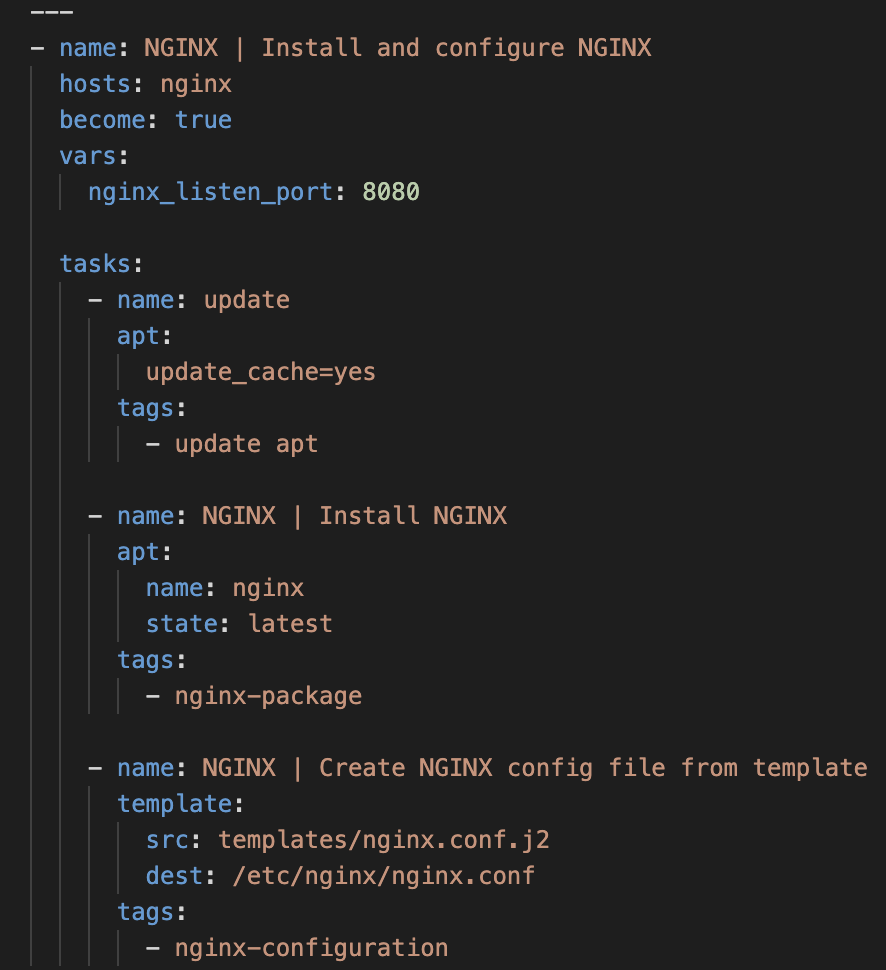
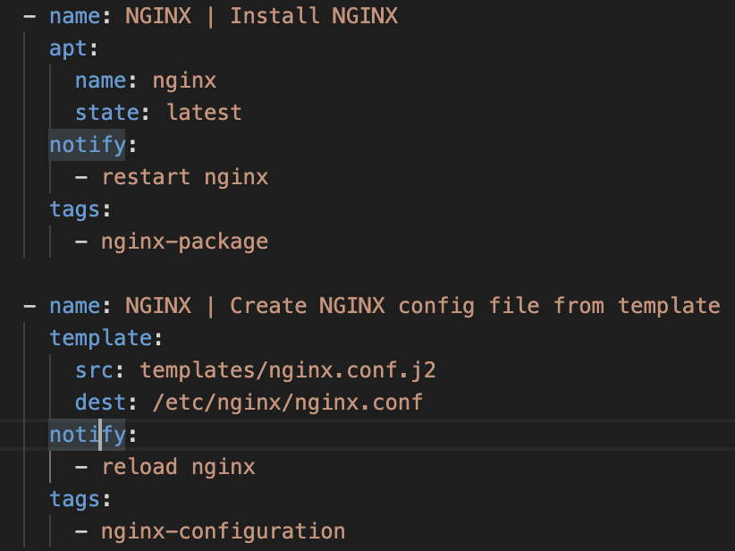
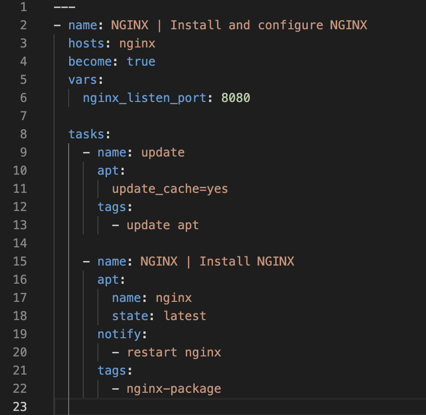
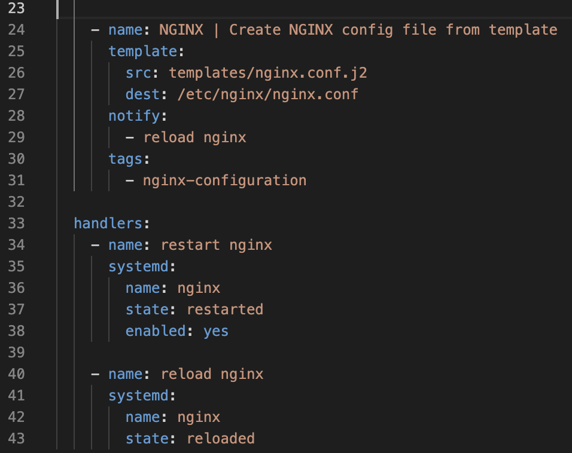
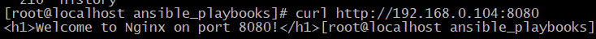
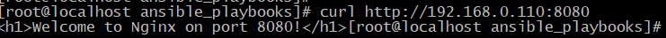

# 16.17 Автоматизация администрирования. Ansible

## Домашнее задание

Первые шаги с Ansible

**Цель:**

Написать первые шаги с Ansible.

Описание/Пошаговая инструкция выполнения домашнего задания:

Что нужно сделать?

Подготовить стенд на Vagrant как минимум с одним сервером. На этом сервере используя Ansible необходимо развернуть nginx со следующими условиями:

- необходимо использовать модуль yum/apt;
- конфигурационные файлы должны быть взяты из шаблона jinja2 с перемененными;
- после установки nginx должен быть в режиме enabled в systemd;
- должен быть использован notify для старта nginx после установки;
- сайт должен слушать на нестандартном порту - 8080, для этого использовать переменные в Ansible.

* Сделать все это с использованием Ansible роли

```bash
pipx install --include-deps ansible
python3 get-pip.py --user
python3 -m pip install --user ansible
dnf install ansible-collection-community-general
ansible --version
ansible [core 2.18.7]
  config file = /etc/ansible/ansible.cfg
  configured module search path = ['/root/.ansible/plugins/modules', '/usr/share/ansible/plugins/modules']
  ansible python module location = /root/.local/lib/python3.12/site-packages/ansible
  ansible collection location = /root/.ansible/collections:/usr/share/ansible/collections
  executable location = /root/.local/bin/ansible
  python version = 3.12.9 (main, Jun 20 2025, 00:00:00) [GCC 14.2.1 20250110 (Red Hat 14.2.1-7)] (/bin/python3)
  jinja version = 3.1.6
  libyaml = True

python3 -m pip -V
pip 25.2 from /root/.local/lib/python3.12/site-packages/pip (python 3.12)

 vagrant box add --name ubuntu/22.04 https://cloud-images.ubuntu.com/jammy/current/jammy-server-cloudimg-amd64-vagrant.box
==> box: Box file was not detected as metadata. Adding it directly...
==> box: Adding box 'ubuntu/22.04' (v0) for provider:
    box: Downloading: https://cloud-images.ubuntu.com/jammy/current/jammy-server-cloudimg-amd64-vagrant.box
==> box: Successfully added box 'ubuntu/22.04' (v0) for ''!

[root@localhost Ansible]# vagrant box list
ubuntu/22.04 (virtualbox, 0)

Скорректируем vagrantfile для использования локального образа Ubuntu, а не загрузки его через vagrantcloud.com (не работает на территории РФ без VPN), а российские зеркала для загрузки боксов МГТУ (MGTU) или БерТех (BerTech) перестали быть доступными:
```bash
nano Vagrantfile
```
```bash
# -*- mode: ruby -*-
# vim: set ft=ruby :

MACHINES = {
  :nginx => {
        :box_name => "ubuntu/22.04",
        :vm_name => "nginx",
        :net => [
           ["192.168.0.150",  2, "255.255.255.0", "mynet"],
        ]
  }
}

Vagrant.configure("2") do |config|

  MACHINES.each do |boxname, boxconfig|

    config.vm.define boxname do |box|

      box.vm.box = boxconfig[:box_name]
      box.vm.host_name = boxconfig[:vm_name]

      box.vm.provider "virtualbox" do |v|
        v.memory = 768
        v.cpus = 1
       end

      boxconfig[:net].each do |ipconf|
        box.vm.network("private_network", ip: ipconf[0], adapter: ipconf[1], netmask: ipconf[2], virtualbox__intnet: ipconf[3])
      end

      if boxconfig.key?(:public)
        box.vm.network "public_network", boxconfig[:public]
      end

      box.vm.provision "shell", inline: <<-SHELL
        mkdir -p ~root/.ssh
        cp ~vagrant/.ssh/auth* ~root/.ssh
        sudo sed -i 's/\#PasswordAuthentication no/PasswordAuthentication yes/g' /etc/ssh/sshd_config
        systemctl restart sshd
      SHELL
    end
  end
end
```
 
Пытаемся запустить установку:
vagrant up
Bringing machine 'nginx' up with 'virtualbox' provider...
==> nginx: Importing base box 'ubuntu/22.04'...
==> nginx: Matching MAC address for NAT networking...
==> nginx: Setting the name of the VM: Ansible_nginx_1754569330585_16241
Vagrant is currently configured to create VirtualBox synced folders with
the `SharedFoldersEnableSymlinksCreate` option enabled. If the Vagrant
guest is not trusted, you may want to disable this option. For more
information on this option, please refer to the VirtualBox manual:

  https://www.virtualbox.org/manual/ch04.html#sharedfolders

This option can be disabled globally with an environment variable:

  VAGRANT_DISABLE_VBOXSYMLINKCREATE=1

or on a per folder basis within the Vagrantfile:

  config.vm.synced_folder '/host/path', '/guest/path', SharedFoldersEnableSymlinksCreate: false
==> nginx: Clearing any previously set network interfaces...
==> nginx: Preparing network interfaces based on configuration...
    nginx: Adapter 1: nat
    nginx: Adapter 2: intnet
==> nginx: Forwarding ports...
    nginx: 22 (guest) => 2222 (host) (adapter 1)
==> nginx: Running 'pre-boot' VM customizations...
==> nginx: Booting VM...
There was an error while executing `VBoxManage`, a CLI used by Vagrant
for controlling VirtualBox. The command and stderr is shown below.

Command: ["startvm", "c42f02e3-2686-4188-bf81-16f79d33b348", "--type", "headless"]

Stderr: VBoxManage: error: VirtualBox can't operate in VMX root mode. Please disable the KVM kernel extension, recompile your kernel and reboot (VERR_VMX_IN_VMX_ROOT_MODE)
VBoxManage: error: Details: code NS_ERROR_FAILURE (0x80004005), component ConsoleWrap, interface IConsole

Ошибка VERR_VMX_IN_VMX_ROOT_MODE означает, что VirtualBox не может работать одновременно с KVM/Hyper-V, так как они конфликтуют за доступ к аппаратной виртуализации (VT-x/AMD-V).

### Решение:
Проверить, какие модули HyperV/KVM активны:
```bash
lsmod | grep -E 'kvm|hyperv'
kvm_intel             446464  0
kvm                  1400832  1 kvm_intel
 #Отключить KVM:
[root@localhost Ansible]# sudo rmmod kvm_intel kvm
#Проверить, что модули выгружены:
[root@localhost Ansible]# lsmod | grep kvm
# Вывод пустой, модуль отключен
```
```bash
vagrant up

Bringing machine 'nginx' up with 'virtualbox' provider...
==> nginx: Clearing any previously set forwarded ports...
==> nginx: Clearing any previously set network interfaces...
==> nginx: Preparing network interfaces based on configuration...
    nginx: Adapter 1: nat
    nginx: Adapter 2: intnet
==> nginx: Forwarding ports...
    nginx: 22 (guest) => 2222 (host) (adapter 1)
==> nginx: Running 'pre-boot' VM customizations...
==> nginx: Booting VM...
==> nginx: Waiting for machine to boot. This may take a few minutes...
    nginx: SSH address: 127.0.0.1:2222
    nginx: SSH username: vagrant
    nginx: SSH auth method: private key
    nginx: Warning: Connection reset. Retrying...
    nginx: Warning: Remote connection disconnect. Retrying...
    nginx:
    nginx: Vagrant insecure key detected. Vagrant will automatically replace
    nginx: this with a newly generated keypair for better security.
    nginx:
    nginx: Inserting generated public key within guest...
    nginx: Removing insecure key from the guest if it's present...
    nginx: Key inserted! Disconnecting and reconnecting using new SSH key...
==> nginx: Machine booted and ready!
==> nginx: Checking for guest additions in VM...
    nginx: The guest additions on this VM do not match the installed version of
    nginx: VirtualBox! In most cases this is fine, but in rare cases it can
    nginx: prevent things such as shared folders from working properly. If you see
    nginx: shared folder errors, please make sure the guest additions within the
    nginx: virtual machine match the version of VirtualBox you have installed on
    nginx: your host and reload your VM.
    nginx:
    nginx: Guest Additions Version: 6.0.0 r127566
    nginx: VirtualBox Version: 7.1
==> nginx: Setting hostname...
==> nginx: Configuring and enabling network interfaces...
==> nginx: Mounting shared folders...
    nginx: /etc/Ansible => /vagrant
==> nginx: Running provisioner: shell...
    nginx: Running: inline script
```
```bash
vagrant ssh-config                                                                                  Host nginx                                                                                                                HostName 127.0.0.1                                                                                                      User vagrant                                                                                                            Port 2222                                                                                                                 UserKnownHostsFile /dev/null                                                                                            StrictHostKeyChecking no                                                                                                PasswordAuthentication no                                                                                               IdentityFile C:/Temp/vagrant/.vagrant/machines/nginx/virtualbox/private_key                                             IdentitiesOnly yes                                                                                                      LogLevel FATAL                                                                                                          PubkeyAcceptedKeyTypes +ssh-rsa                                                                                         HostKeyAlgorithms +ssh-rsa 
 ```

Создадим свой первый inventory файл ```./staging/hosts```cо следующим содержимым:
```bash
mkdir -p ./staging  # Создаем папку staging, если её нет
touch ./staging/hosts  # Создаем файл hosts
 nano  ./staging/hosts

[web]nginx ansible_host=127.0.0.1 ansible_port=2222 ansible_user=vagrant ansible_private_key_file=.vagrant/machines/nginx/virtualbox/private_key

```
 Cоздадим файл ansible.cfg со следующим содержанием:
```bash
nano  ansible.cfg
 [defaults]
inventory = staging/hosts
remote_user = vagrant
host_key_checking = False
retry_files_enabled = False
```
Теперь из инвентори можно убрать информацию о пользователе:
```bash
[web]
nginx ansible_host=127.0.0.1 ansible_port=2222
ansible_private_key_file=.vagrant/machines/nginx/virtualbox/private_key
```
Посмотрим какое ядро установлено на хосте:
```bash
ansible nginx -m command -a "uname -r"
```
Проверим статус сервиса firewalld:
```bash
ansible nginx -m systemd -a uname=firewalld
```
Приступим к выполнению ДЗ, написанию Plabook для установки nginx:
```bash
nano nginx.yml
```


Сам шаблон будет выглядеть так:
```yml
# {{ ansible_managed }}
events {
    worker_connections 1024;
}

http {
    server {
        listen       {{ nginx_listen_port }} default_server;
        server_name  default_server;
        root         /usr/share/nginx/html;

        location / {
        }
    }
}
```
Теперь создадим handler и добавим notify к копирования шаблона. Теперь каждый раз когда конфиг будет изменяться - сервис перезагрузиться. Секция с handlers будет выглядеть следующим образом:

```yml
handlers: #Так же создадим handler для рестарта и включения сервиса при загрузке
- name: restart nginx
systemd:
name: nginx
state: restarted
enabled: yes	

- name: reload nginx #Перечитываем конфиг
systemd:
name: nginx
state: reloaded	
```
Notify будут выглядеть так:


Результирующий файл nginx.yml. Теперь можно его запустить:
 <br>


```bash
ansible-plabook ngix.yml
```
Теперь можно из консоли выполнить команду :
```bash
curl http://192.168.0.150:8080
```
<h1>Welcome to Nginx on port 8080!</h1>[root@localhost ansible_playbooks]


# Задание со *: Подготовка стенда с Ansible и развертывание Nginx при помощи роли

## 1. Настройка VirtualBox с двумя серверами

### 1.1 Создание виртуальных машин
1. Создайте две виртуальные машины в VirtualBox:
   - Сервер 1: AlmaLinux 10 (Ansible control node)
   - Сервер 2: AlmaLinux 10 (managed node)
    
2. Установите ОС на обе машины с минимальной установкой (Minimal Install).

### 1. Настройка Ansible на control node (Сервер 1)

```bash
sudo dnf install -y epel-release
pipx install --include-deps ansible
dnf install ansible-collection-community-general
python3 get-pip.py --user
python3 -m pip install --user ansible

# Проверка версии Ansible
ansible --version

ansible [core 2.18.7]
  config file = /etc/ansible/ansible.cfg
  configured module search path = ['/root/.ansible/plugins/modules', '/usr/share/ansible/plugins/modules']
  ansible python module location = /root/.local/lib/python3.12/site-packages/ansible
  ansible collection location = /root/.ansible/collections:/usr/share/ansible/collections
  executable location = /root/.local/bin/ansible
  python version = 3.12.9 (main, Jun 20 2025, 00:00:00) [GCC 14.2.1 20250110 (Red Hat 14.2.1-7)] (/bin/python3)
  jinja version = 3.1.6
  libyaml = True

# Проверка версии python
python3 -m pip -V
pip 25.2 from /root/.local/lib/python3.12/site-packages/pip (python 3.12)

# Создание SSH ключа
ssh-keygen -t rsa -b 4096

# Копирование ключа на управляемый узел (в новых версиях ОС, как показала практика, необязательная процедура)
ssh-copy-id nik@192.168.0.104
```
```bash
/bin/ssh-copy-id: INFO: Source of key(s) to be installed: "/root/.ssh/id_rsa.pub"
/bin/ssh-copy-id: INFO: attempting to log in with the new key(s), to filter out any that are already installed
/bin/ssh-copy-id: INFO: 1 key(s) remain to be installed -- if you are prompted now it is to install the new keys
nik@192.168.0.104's password:

Number of key(s) added: 1

Now try logging into the machine, with: "ssh 'nik@192.168.0.104'"
and check to make sure that only the key(s) you wanted were added.
```
### 2. Настройка firewalld на managed node (Сервер 2)
```bash
sudo firewall-cmd --permanent --add-port=8080/tcp
success

sudo firewall-cmd --reload
success
```
## 3. Создание Ansible роли для установки Nginx

### 3.1 Структура роли

```bash
mkdir -p ~/ansible_playbooks/roles/nginx/tasks
mkdir -p ~/ansible_playbooks/roles/nginx/templates
mkdir -p ~/ansible_playbooks/roles/nginx/defaults
mkdir -p ~/ansible_playbooks/roles/nginx/handlers
```

### 3.2 Создание файлов роли

1. `~/ansible_playbooks/roles/nginx/defaults/main.yml`:
```yaml
---
nginx_port: 8080
nginx_user: nginx
nginx_worker_processes: auto
nginx_error_log: /var/log/nginx/error.log
nginx_access_log: /var/log/nginx/access.log
```

2. `~/ansible_playbooks/roles/nginx/templates/nginx.conf.j2`:
```jinja2
user {{ nginx_user }};
worker_processes {{ nginx_worker_processes }};

error_log {{ nginx_error_log }};
pid /run/nginx.pid;

events {
    worker_connections 1024;
}

http {
    log_format  main  '$remote_addr - $remote_user [$time_local] "$request" '
                      '$status $body_bytes_sent "$http_referer" '
                      '"$http_user_agent" "$http_x_forwarded_for"';

    access_log  {{ nginx_access_log }}  main;

    sendfile            on;
    tcp_nopush          on;
    tcp_nodelay         on;
    keepalive_timeout   65;
    types_hash_max_size 2048;

    include             /etc/nginx/mime.types;
    default_type        application/octet-stream;

    server {
        listen       {{ nginx_port }};
        listen       [::]:{{ nginx_port }};
        server_name  _;

        location / {
            root   /usr/share/nginx/html;
            index  index.html index.htm;
        }

        error_page 404 /404.html;
            location = /40x.html {
        }

        error_page 500 502 503 504 /50x.html;
            location = /50x.html {
        }
    }
}
```

3. `~/ansible_playbooks/roles/nginx/tasks/main.yml`:
```yaml
---
- name: Install EPEL repository
  dnf:
    name: epel-release
    state: present

- name: Install nginx
  dnf:
    name: nginx
    state: present
  notify: enable and start nginx

- name: Configure nginx
  template:
    src: nginx.conf.j2
    dest: /etc/nginx/nginx.conf
    owner: root
    group: root
    mode: '0644'
  notify: restart nginx

- name: Create index.html
  copy:
    content: "<h1>Welcome to Nginx on port {{ nginx_port }}!</h1>"
    dest: /usr/share/nginx/html/index.html
    owner: root
    group: root
    mode: '0644'
```

4. `~/ansible_playbooks/roles/nginx/handlers/main.yml`:
```yaml
---
- name: enable and start nginx
  systemd:
    name: nginx
    state: started
    enabled: yes

- name: restart nginx
  systemd:
    name: nginx
    state: restarted
    daemon_reload: yes
```

### 3.3 Создание playbook

`~/ansible_playbooks/install_nginx.yml`:
```yaml
---
- hosts: webservers
  become: yes
  roles:
    - nginx
```

## 4. Настройка inventory файла

`~/ansible_playbooks/inventory.ini`:
```ini
[webservers]
192.168.0.150 ansible_user=nik

[all:vars]
ansible_python_interpreter=/usr/bin/python3
```

## 5. Проверка связи с сервером и запуск playbook

```bash
#переходим в директорию:
cd ~/ansible_playbooks

# проверка связи:
[root@localhost ansible_playbooks]# ansible -i inventory.ini webservers -m ping -b --ask-become-pass
BECOME password:
192.168.0.104 | SUCCESS => {
    "changed": false,
    "ping": "pong"
}

#запуск playbook:
[root@localhost ansible_playbooks]# ansible-playbook -i inventory.ini install_nginx.yml -b --ask-become-pass
BECOME password:

PLAY [webservers] ***************************************************************************************************************************************************************************

TASK [Gathering Facts] **********************************************************************************************************************************************************************
ok: [192.168.0.104]

TASK [nginx : Install EPEL repository] ******************************************************************************************************************************************************
changed: [192.168.0.104]

TASK [nginx : Install nginx] ****************************************************************************************************************************************************************
changed: [192.168.0.104]

TASK [nginx : Configure nginx] **************************************************************************************************************************************************************
changed: [192.168.0.104]

TASK [nginx : Create index.html] ************************************************************************************************************************************************************
changed: [192.168.0.104]

RUNNING HANDLER [nginx : enable and start nginx] ********************************************************************************************************************************************
changed: [192.168.0.104]

RUNNING HANDLER [nginx : restart nginx] *****************************************************************************************************************************************************
changed: [192.168.0.104]

PLAY RECAP **********************************************************************************************************************************************************************************
192.168.0.104              : ok=7    changed=6    unreachable=0    failed=0    skipped=0    rescued=0    ignored=0
```

## 6. Проверка работы

После выполнения playbook откроем в браузере:
```
http://192.168.0.104:8080
```


или

```bash
curl http://192.168.0.104:8080
```


## 7. Попробуем развернуть Nginx на Ubuntu 22.04 (Сервер 3) с использованием Ansible. Проверим какие файлы необходимо изменить для установки на 2х рахных ОС.

## Модификация Ansible роли для Ubuntu

### 0. Обновим структуру роли

roles/nginx/          # Корневая директория роли
├── tasks/            # Основные задачи
│   ├── main.yml      # Главный файл задач (обязателен)
│   ├── AlmaLinux.yml # Задачи для AlmaLinux
│   └── Ubuntu.yml    # Задачи для Ubuntu
├── templates/        # Шаблоны Jinja2 (например, nginx.conf.j2)
├── defaults/         # Переменные по умолчанию (main.yml)
└── handlers/         # Обработчики (main.yml)

Создадим директории (если каких-то не хватает):
```bash
mkdir -p roles/nginx/{tasks,templates,defaults,handlers}
```

Создадим необходимые файлы:
```bash
touch roles/nginx/tasks/{main.yml,AlmaLinux.yml,Ubuntu.yml}
touch roles/nginx/defaults/main.yml
touch roles/nginx/handlers/main.yml
```

### 1. Изменим файл defaults/main.yml
```bash
 nano  ~/ansible_playbooks/roles/nginx/defaults/main.yml
 ```
```yaml
---
# Базовые настройки Nginx
nginx_port: 8080
nginx_worker_processes: auto
nginx_error_log: /var/log/nginx/error.log
nginx_access_log: /var/log/nginx/access.log

# Платформо-зависимые настройки
nginx_user: "{{ 'www-data' if ansible_distribution == 'Ubuntu' else 'nginx' }}"
nginx_config_path: "{{ '/etc/nginx/nginx.conf' }}"
nginx_service_name: "nginx"

# Настройки пакетного менеджера
package_manager: "{{ 'apt' if ansible_distribution == 'Ubuntu' else 'dnf' }}"
epel_required: "{{ ansible_distribution != 'Ubuntu' }}"

# Настройки firewall
firewall_module: "{{ 'ufw' if ansible_distribution == 'Ubuntu' else 'firewalld' }}"
firewall_service: "{{ 'nginx' if ansible_distribution == 'Ubuntu' else 'http' }}"

# Настройки репозиториев
additional_repos:
  - name: "EPEL"
    enabled: "{{ ansible_distribution == 'Rocky' or ansible_distribution == 'AlmaLinux' }}"
    package: "epel-release"
```

### 2. Создание tasks/ubuntu.yml
```bash
 nano ~/ansible_playbooks/roles/nginx/tasks/ubuntu.yml
```

```yaml
---
- name: Install nginx on Ubuntu
  apt:
    name: ngnix
    state: present
    update_cache: yes
  notify: enable and start nginx

- name: Ensure nginx directories exist
  file:
    path: "{{ item }}"
    state: directory
    owner: root
    group: root
    mode: '0755'
  loop:
    - /etc/nginx/conf.d
    - /etc/nginx/sites-available
    - /etc/nginx/sites-enabled
```

### 3. Обновление tasks/main.yml
```bash
 nano ~/ansible_playbooks/roles/nginx/tasks/main.yml
 ```
```yaml
---
- name: Include OS-specific tasks
  include_tasks: "{{ ansible_distribution }}.yml"
  
- name: Configure nginx
  template:
    src: nginx.conf.j2
    dest: /etc/nginx/nginx.conf
    owner: root
    group: root
    mode: '0644'
  notify: restart nginx

- name: Create index.html
  copy:
    content: "<h1>Welcome to Nginx on port {{ nginx_port }}!</h1>"
    dest: /usr/share/nginx/html/index.html
    owner: root
    group: root
    mode: '0644'
```

## Обновление inventory файла

```ini
[webservers]
192.168.0.104 ansible_user=nik  # AlmaLinux сервер
192.168.0.110 ansible_user=nik  # Ubuntu сервер

[all:vars]
ansible_python_interpreter=/usr/bin/python3
```

## Добавим в роль новый handler:
```bash
 nano ~/ansible_playbooks/roles/nginx/handlers/main.yml
```

```yaml
---
- name: enable and start nginx
  systemd:
    name: nginx
    state: started
    enabled: yes

- name: restart nginx
  systemd:
    name: nginx
    state: restarted
    daemon_reload: yes

- name: allow nginx port in ufw
  ufw:
    rule: allow
    port: "{{ nginx_port }}"
    proto: tcp
  when: ansible_distribution == 'Ubuntu'
```

## Проверка связи и запуск playbook

```bash
# проверка связи:
ansible -i inventory.ini webservers -m ping -b --ask-become-pass

BECOME password:
192.168.0.110 | SUCCESS => {
    "changed": false,
    "ping": "pong"
}
192.168.0.104 | SUCCESS => {
    "changed": false,
    "ping": "pong"
}

#запуск playbook:
ansible-playbook -i inventory.ini install_nginx.yml -b --ask-become-pass 
```

## Проверка работы

```bash
curl http://192.168.0.110:8080
```




## Ключевые отличия для Ubuntu

1. **Менеджер пакетов**: Используется `apt` вместо `dnf`
2. **Пользователь Nginx**: `www-data` вместо `nginx`
3. **Firewall**: `ufw` вместо `firewalld`
4. **Пути конфигурации**: Немного отличаются стандартные пути конфигов
5. **Инициализация сервиса**: Systemd используется в обоих случаях, но с разными именами сервисов

Роль автоматически определяет ОС и применяет соответствующие настройки благодаря:
- Переменной `ansible_distribution`
- Условным операторам (`when`)
- Раздельным task-файлам для разных ОС

### **Выводы по работе с Ansible ролью для развертывания Nginx**

В ходе выполнения задачи была создана **Ansible-роль** для установки и настройки **Nginx** на сервере с **AlmaLinux**. Вот основные выводы:

## **1. Преимущества использования Ansible роли**
✅ **Модульность** – Роль разбита на логические части (`tasks`, `templates`, `handlers`, `defaults`), что упрощает поддержку и масштабирование.  
✅ **Повторное использование** – Роль можно применять на разных серверах без изменений, подставляя нужные переменные.  
✅ **Автоматизация** – Все шаги (установка, конфигурация, запуск) выполняются автоматически.  
✅ **Идемпотентность** – Ansible гарантирует, что повторный запуск не вызовет ошибок, а приведет систему к желаемому состоянию.  
✅ **Шаблонизация** – Конфигурация Nginx генерируется через **Jinja2**, что позволяет гибко настраивать параметры (например, порт через переменную `nginx_port`).  

**Итог**
Роль успешно автоматизирует развертывание **Nginx** с гибкой настройкой, что экономит время и уменьшает вероятность ошибок при ручном конфигурировании.  
**Ansible** доказал свою эффективность в управлении конфигурацией, а использование **ролей** делает код более структурированным и удобным для повторного использования.  
