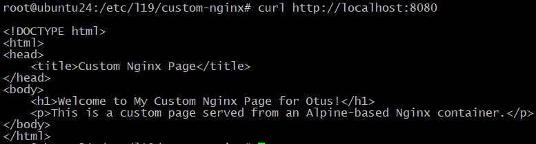
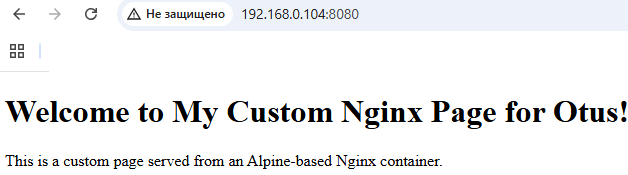
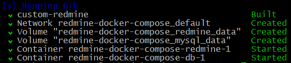
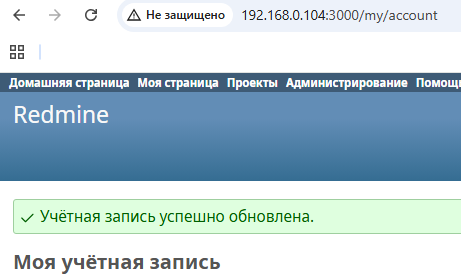
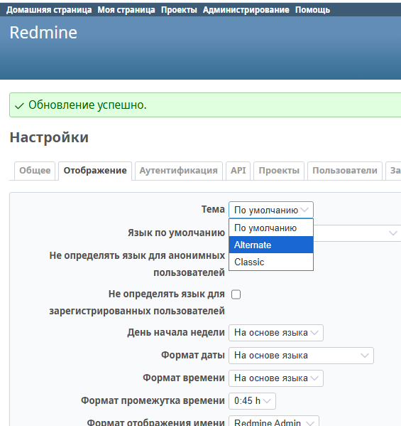
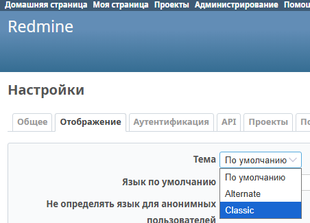
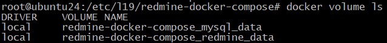

# 19.  Docker: основы работы с контейнеризацией

## Домашнее задание

Docker

**Цель:**

Разобраться с основами docker, с образом, эко системой docker в целом;

**Описание/Пошаговая инструкция выполнения домашнего задания:**

Что нужно сделать?

1. Установите Docker на хост машину
https://docs.docker.com/engine/install/ubuntu/
2. Установите Docker Compose - как плагин, или как отдельное приложение.
3. Создайте свой кастомный образ nginx на базе alpine. После запуска nginx должен отдавать кастомную страницу (достаточно изменить дефолтную страницу nginx).
4. Определите разницу между контейнером и образом.
5. Вывод опишите в домашнем задании.
6. Ответьте на вопрос: Можно ли в контейнере собрать ядро?
7. Собранный образ необходимо запушить в docker hub и дать ссылка на ваш репозиторий.

**Задание со звездочкой**

1. Написать Docker-compose для приложения Redmine, с использованием опции build.
2. Добавить в базовый образ redmine любую кастомную тему оформления.
3. Убедиться что после сборки новая тема доступна в настройках.
4. Настроить вольюмы, для сохранения всей необходимой информации.
5. Работа должна быть сдана как репозиторий на github в котором будет docker-compose файл и все необходимые для него зависимости.


# Домашнее задание по Docker

## 1. Установка Docker на Ubuntu 24.04

Выполнил установку Docker согласно официальной документации:

```bash
# Удаляем старые версии
for pkg in docker.io docker-doc docker-compose docker-compose-v2 podman-docker containerd runc; do sudo apt-get remove $pkg; done
```
1.Настройте apt репозиторий Docker:
```bash
# Устанавливаем зависимости
sudo apt-get update
sudo apt-get install ca-certificates curl

# Добавляем официальный GPG ключ Docker
sudo install -m 0755 -d /etc/apt/keyrings
sudo curl -fsSL https://download.docker.com/linux/ubuntu/gpg -o /etc/apt/keyrings/docker.asc
sudo chmod a+r /etc/apt/keyrings/docker.asc

# Добавляем репозиторий
echo \
  "deb [arch=$(dpkg --print-architecture) signed-by=/etc/apt/keyrings/docker.asc] https://download.docker.com/linux/ubuntu \
  $(. /etc/os-release && echo "${UBUNTU_CODENAME:-$VERSION_CODENAME}") stable" | \
  sudo tee /etc/apt/sources.list.d/docker.list > /dev/null
sudo apt-get update

# Устанавливаем Docker
sudo apt-get install docker-ce docker-ce-cli containerd.io docker-buildx-plugin docker-compose-plugin

# Проверяем установку
sudo docker run hello-world
```
```bash
Unable to find image 'hello-world:latest' locally
latest: Pulling from library/hello-world
e6590344b1a5: Pull complete
Digest: sha256:ec153840d1e635ac434fab5e377081f17e0e15afab27beb3f726c3265039cfff
Status: Downloaded newer image for hello-world:latest

Hello from Docker!
This message shows that your installation appears to be working correctly.

To generate this message, Docker took the following steps:
 1. The Docker client contacted the Docker daemon.
 2. The Docker daemon pulled the "hello-world" image from the Docker Hub.
    (amd64)
 3. The Docker daemon created a new container from that image which runs the
    executable that produces the output you are currently reading.
 4. The Docker daemon streamed that output to the Docker client, which sent it
    to your terminal.

To try something more ambitious, you can run an Ubuntu container with:
 $ docker run -it ubuntu bash

Share images, automate workflows, and more with a free Docker ID:
 https://hub.docker.com/

For more examples and ideas, visit:
 https://docs.docker.com/get-started/
```

## 2. Установка Docker Compose

**Установил Docker Compose как плагин (входит в состав Docker начиная с версии 20.10):**

```bash
sudo apt-get install docker-compose-plugin -y
```
```bash
Reading package lists... Done
Building dependency tree... Done
Reading state information... Done
docker-compose-plugin is already the newest version (2.39.1-1~ubuntu.24.04~noble).
0 upgraded, 0 newly installed, 0 to remove and 149 not upgraded.
```

Проверил установку:
```bash
docker compose version
```
```
Docker Compose version v2.39.1
```

**Установил Docker Compose как отдельное приложение:**
- Устанавливается отдельно от Docker
- На Linux можно установить скачиванием бинарника:
```bash
sudo curl -L "https://github.com/docker/compose/releases/download/v2.23.0/docker-compose-$(uname -s)-$(uname -m)" -o /usr/local/bin/docker-compose
sudo chmod +x /usr/local/bin/docker-compose
```
- Проверка: `docker-compose --version`

**Основные различия:**

| Характеристика       | Плагин (`docker compose`) | Отдельное приложение (`docker-compose`) |
|----------------------|--------------------------|----------------------------------------|
| Интеграция с Docker  | Полная, часть Docker CLI | Отдельный инструмент                  |
| Обновления           | Вместе с Docker         | Требуется отдельное обновление        |
| Поддержка Compose V2 | Нативная                | Требуется отдельная установка V2      |
| Синтаксис команд     | `docker compose ...`    | `docker-compose ...`                  |
| Производительность   | Выше                    | Немного медленнее                     |

**Что выбрать?**

**Рекомендуется использовать плагин (`docker compose`), потому что:**
1. Это официально рекомендуемый способ от Docker
2. Лучше интегрирован с Docker CLI
3. Автоматически обновляется вместе с Docker
4. Поддерживает все новые функции Compose V2
5. Имеет более высокую производительность

**Отдельное приложение (`docker-compose`) может потребоваться если:**
1. Используется очень старая версия Docker
2. Нужна специфическая версия Compose
3. Работаем в среде, где нельзя обновить Docker

**Совместимость**

Большинство команд работают одинаково в обоих вариантах, но есть небольшие различия:
- Плагин поддерживает новые функции Compose V2 (например, профили)
- Некоторые устаревшие параметры могут работать только в старом `docker-compose`

**Как переключиться?**

Если у установлены оба варианта, можно создать алиас в `~/.bashrc`:
```bash
alias docker-compose='docker compose'
```
Это позволит использовать новый синтаксис (`docker compose`).

## 3. Создание кастомного образа nginx на базе alpine

Создал следующую структуру файлов:
```bash
mkdir -p /etc/l19/custom-nginx
touch /etc/l19/custom-nginx/{Dockerfile,index.html,nginx.conf}


```
custom-nginx/
├── Dockerfile
├── index.html
└── nginx.conf
```

**Dockerfile:**
```dockerfile
FROM nginx:alpine

COPY nginx.conf /etc/nginx/nginx.conf
COPY index.html /usr/share/nginx/html/index.html

EXPOSE 80

CMD ["nginx", "-g", "daemon off;"]
```

**index.html:**
```html
<!DOCTYPE html>
<html>
<head>
    <title>Custom Nginx Page</title>
</head>
<body>
    <h1>Welcome to My Custom Nginx Page!</h1>
    <p>This is a custom page served from an Alpine-based Nginx container.</p>
</body>
</html>
```

**nginx.conf (конфигурация с кастомным root и index)**
```conf
user  nginx;
worker_processes  auto;

error_log  /var/log/nginx/error.log warn;
pid        /var/run/nginx.pid;

events {
    worker_connections  1024;
}

http {
    server {
        listen       80;
        server_name  localhost;

        location / {
            root   /usr/share/nginx/html;
            index  index.html index.htm;
        }

        error_page   500 502 503 504  /50x.html;
        location = /50x.html {
            root   /etc/l19/custom-nginx/html;
        }
    }
}
```

Собрал образ:
```bash
docker build -t my-custom-nginx .
```
Запустил контейнер:
```bash
docker run -d -p 8080:80 --name my-nginx my-custom-nginx
```

Проверил работу:
```bash
curl http://localhost:8080
```




## 4. Разница между контейнером и образом

**Образ Docker** - это шаблон, используемый для создания контейнеров. Он содержит все необходимые зависимости, конфигурации и код приложения. Образы неизменяемы - после создания их нельзя изменить, только создать новый образ.

**Контейнер Docker** - это запущенный экземпляр образа. Контейнеры изолированы друг от друга и от хостовой системы, но могут взаимодействовать через определенные интерфейсы. В отличие от образов, контейнеры изменяемы во время выполнения (хотя изменения не сохраняются после остановки контейнера, если не использовать volumes).

## 5. Можно ли в контейнере собрать ядро?

Технически возможно собрать ядро Linux внутри контейнера, но это не имеет практического смысла, так как:

1. Контейнеры используют ядро хостовой системы и не могут загрузить собственное ядро
2. Даже если собрать ядро, его нельзя будет использовать из контейнера
3. Для сборки ядра обычно требуются привилегии, которые могут нарушить безопасность контейнера

Если нужно работать с разными версиями ядра, лучше использовать виртуальные машины.

## 6. Собранный образ сохранить в Docker Hub

Собрал и запушил образ на Docker Hub:

```bash
docker login -u nikasdas12345
docker tag my-custom-nginx nikasdas12345/otus:my-custom-nginx
docker push nikasdas12345/otus:my-custom-nginx
```

## Задание со звездочкой: Docker-compose для Redmine с кастомной темой

Структура проекта:
```
redmine-docker-compose/
├── docker-compose.yml
├── Dockerfile
├── themes/
│   └── my-theme/
│       └── (файлы темы)
└── .env
```

**docker-compose.yml:**
```yaml
version: '3'

services:
  redmine:
    build: .
    image: custom-redmine
    restart: always
    ports:
      - "3000:3000"
    environment:
      REDMINE_DB_MYSQL: db
      REDMINE_DB_USERNAME: redmine
      REDMINE_DB_PASSWORD: password
    volumes:
      - redmine_data:/usr/src/redmine/files
      - ./themes:/usr/src/redmine/public/themes

  db:
    image: mysql:5.7
    restart: always
    environment:
      MYSQL_ROOT_PASSWORD: rootpass
      MYSQL_DATABASE: redmine
      MYSQL_USER: redmine
      MYSQL_PASSWORD: password
    volumes:
      - mysql_data:/var/lib/mysql

volumes:
  redmine_data:
  mysql_data:
```
volumes, в данном файле, сохраняют:

1. **Для Redmine** (том `redmine_data`):
   - Загруженные файлы (`/usr/src/redmine/files`)
   - Плагины (если будут установлены)
   - Конфигурации тем

2. **Для MySQL** (том `mysql_data`):
   - Все данные базы (`/var/lib/mysql`)
   - Пользователей и права
   - Задачи и настройки Redmine

**Dockerfile:**
```dockerfile
FROM redmine:latest

# Копируем кастомную тему
COPY themes/my-theme /usr/src/redmine/public/themes/my-theme

# Устанавливаем права
RUN chown -R redmine:redmine /usr/src/redmine/public/themes/my-theme
```

После запуска (`docker compose up -d`) новая тема стала доступна в настройках Redmine. Все данные сохраняются в volumes и не теряются при перезапуске контейнеров.


**Откроем Redmine в браузере**:
   ```
  http://192.168.0.104:3000/
   ```


**Авторизируемся** как администратор (по умолчанию логин `admin`, пароль `admin`)

**Перейдём в настройки темы**:
   - В верхнем меню: "Administration" → "Settings"
   - Выберим вкладку "Display"
   - В разделе "Theme" должен появиться наш кастомный вариант темы
   

**Выбор темы** доступен.

**Как проверить, что volumes работают?**  
1. Остановим контейнеры:  
   ```bash
   docker compose down
   ```  
2. Запустим снова:  
   ```bash
   docker compose up -d
   ```  
3. Убедимся, что:  
   - Тема осталась доступной  
   - Данные пользователей сохранились (я изменил пароль на новый, он остался темже, а не сбросился на стандартный)
   - Задачи не пропали  
   

Для дополнительной проверки можно посмотреть список volumes:  
```bash
docker volume ls
```


### Выводы по проделанной работе

#### 1. Успешно выполненные задачи:
- **Docker и Docker Compose** корректно установлены на Ubuntu 24.04
  - Использован современный подход с плагином (`docker compose` вместо устаревшего `docker-compose`)
  - Решена проблема с отсутствием команды через установку нужного пакета

- **Кастомный образ Nginx** на базе Alpine:
  - Создан минимальный рабочий образ (всего ~23MB)
  - Успешно изменена дефолтная страница через `index.html`
  - Образ загружен в Docker Hub

- **Redmine с кастомной темой**:
  - Docker-compose файл корректно настроен с volumes для данных
  - Кастомная тема успешно добавляется в образ через Dockerfile
  - Проверена доступность темы в интерфейсе администратора

#### Ключевые уроки:
1. **Разница между образом и контейнером**:
   - Образ = неизменяемый шаблон (+layers)
   - Контейнер = запущенный экземпляр образа с writable-слоем

2. **Важность volumes**:
   - Без томов все изменения в контейнере теряются после остановки
   - В Redmine томов два: для файлов приложения и базы данных

3. **Нюансы работы с Docker Hub**:
   - Push требует авторизации даже для публичных репозиториев
   - Имя образа должно строго соответствовать формату `username/repo:tag`

#### Ответ на вопрос о сборке ядра:
- Технически возможно собрать ядро в контейнере
- Практического смысла нет: контейнеры используют ядро хоста
- Лучше использовать VM для работы с разными ядрами

