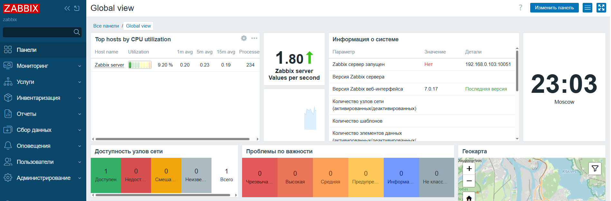
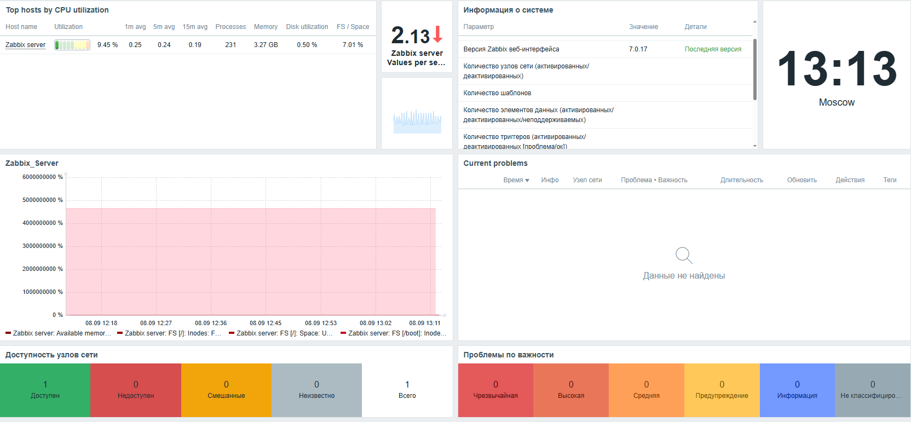
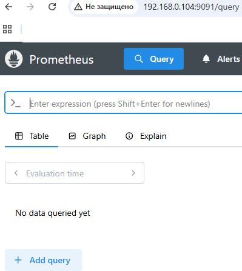
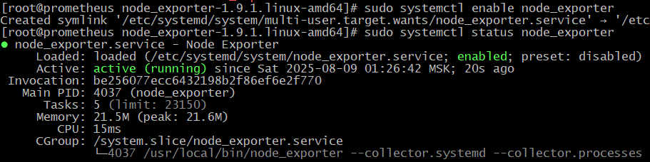
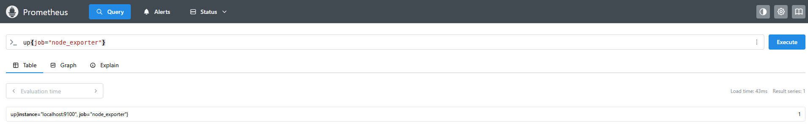
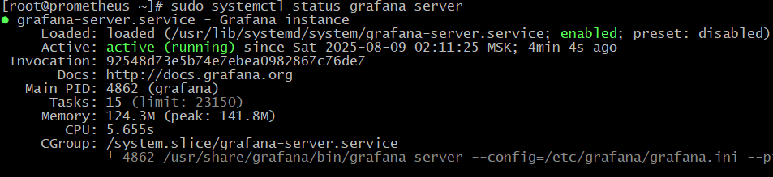
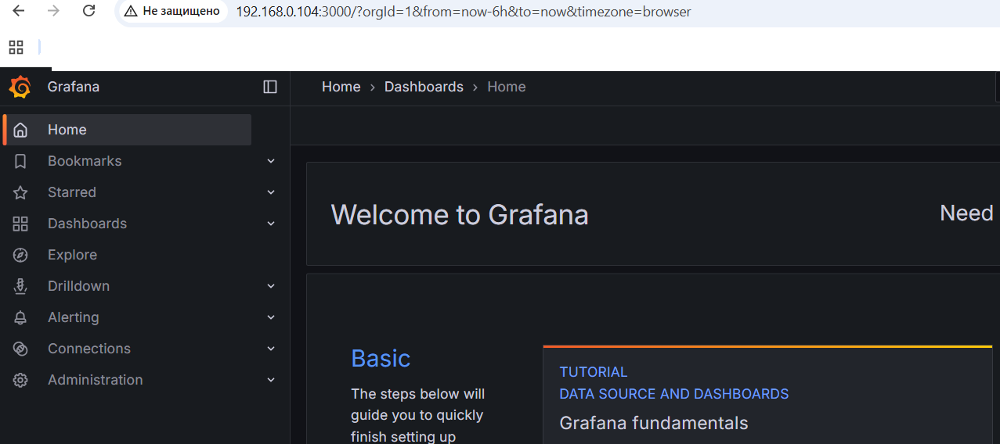
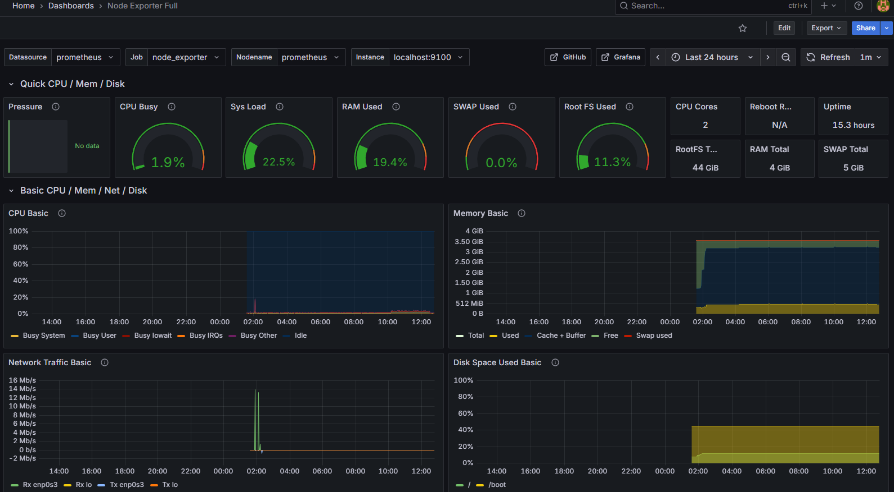
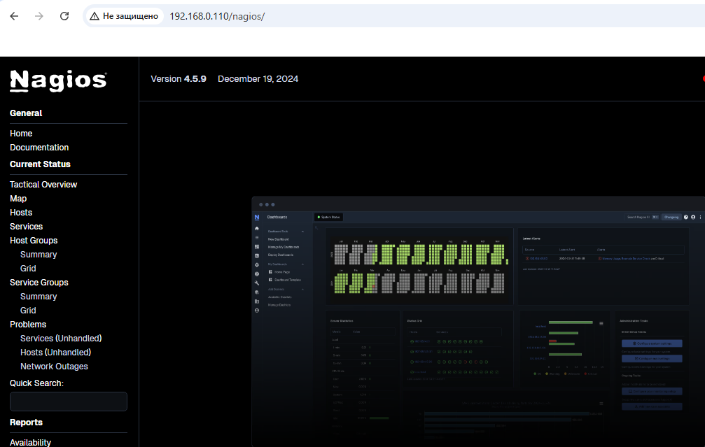

# 22.  Prometheus 

**Домашнее задание**

Настройка мониторинга

**Цель:**

научиться настраивать дашборд;

Что нужно сделать?

Настроить дашборд с 4-мя графиками

    - память;
    - процессор;
    - диск;
    - сеть.

Настроить на одной из систем:

    -zabbix, использовать screen (комплексный экран);
    - prometheus - grafana.

Использование систем, примеры которых не рассматривались на занятии*

Список возможных систем был приведен в презентации.

В качестве результата прислать скриншот экрана - дашборд должен содержать в названии имя приславшего.

# Установка и настройка систем мониторинга на AlmaLinux

## Сервер 1: Zabbix 7

### Установка Zabbix 7 на AlmaLinux 10

1. Установим репозитории Zabbix:
```bash
sudo dnf install -y https://repo.zabbix.com/zabbix/7.0/rhel/10/x86_64/zabbix-release-7.0-7.el10.noarch.rpm
sudo dnf clean all
```

2. Установим Zabbix сервер, веб-интерфейс и агент:
```bash
sudo dnf install zabbix-server-mysql zabbix-web-mysql zabbix-nginx-conf zabbix-sql-scripts zabbix-selinux-policy zabbix-agent
```
3. Установим MariaDB:
```bash
sudo dnf install -y mariadb-server
sudo systemctl enable --now mariadb
```

4. Настроим базу данных:
```bash
sudo mysql_secure_installation
mysql -uroot -p
```

В MariaDB выполним:
```sql
create database zabbix character set utf8mb4 collate utf8mb4_bin;
create user zabbix@localhost identified by 'password';
grant all privileges on zabbix.* to zabbix@localhost;
set global log_bin_trust_function_creators = 1;
quit;
```

5. Импортируем схему данных:
```bash
zcat /usr/share/zabbix-sql-scripts/mysql/server.sql.gz | mysql --default-character-set=utf8mb4 -uzabbix -p zabbix
```
Отключите опцию log_bin_trust_function_creators после импорта схемы базы данных:
```sql
mysql -uroot -p
password
set global log_bin_trust_function_creators = 0;
quit;
```

6. Настроим Zabbix сервер:
```bash
nano /etc/zabbix/zabbix_server.conf
```
Изменим параметры:
```
DBPassword=password
```
Настроим PHP для интерфейса Zabbix. Отредактируем файл `/etc/nginx/conf.d/zabbix.conf`, раскомментируем и зададим директивы «listen» и «server_name»:

```cfg
listen 8080;
server_name zabbix;
```

7. Запустим сервисы:
```bash
sudo systemctl restart zabbix-server zabbix-agent nginx php-fpm
sudo systemctl enable zabbix-server zabbix-agent nginx php-fpm
```

8. Настроим файрвол:
```bash
sudo firewall-cmd --add-service={http,https} --permanent
sudo firewall-cmd --add-port={10050/tcp,10051/tcp} --permanent
sudo firewall-cmd --add-port={8080/tcp} --permanent
sudo firewall-cmd --reload
```
Откроем веб-страницу Zabbix и донастроим сервер. Выполним первый вход под временными учетными данными в веб интерфейс: <br>

 логин: Admin<br>
 пароль: zabbix





### Настройка комплексного экрана (screen)

Добавим репозиторий EPEL (это необходимо ,т.к. пакет `screen` в AlmaLinux 8+ (и других современных дистрибутивах RHEL) перемещён в репозиторий EPEL ):
```bash
sudo dnf install -y epel-release
```

1. Установим screen:
```bash
sudo dnf install -y screen
```

2. Создадим конфигурационный файл для комплексного экрана:
```bash
nano ~/.screenrc
```
Добавим:
```
caption always "%{= kw}%-w%{= BW}%n %t%{-}%+w %-= @%H - %LD %d %LM - %c"
hardstatus alwayslastline "%-Lw%{= BW}%50>%n%f* %t%{-}%+Lw%<"
```

3. Запустим screen и добавим панели для мониторинга:
```bash
screen -S monitoring
# Внутри screen:
# Панель 1 - логи Zabbix
tail -f /var/log/zabbix/zabbix_server.log
# Ctrl+a c - создать новую панель
# Панель 2 - системные метрики
htop
# Ctrl+a c
# Панель 3 - сетевой мониторинг
iftop
```

## Сервер 2: Prometheus + Grafana

### Установка Prometheus

1. **Создадим пользователя для Prometheus:**
```bash
sudo useradd --no-create-home --shell /bin/false prometheus
```

2. **Создадим директории и настраиваем для них владельцев:**
```bash
sudo mkdir -p /etc/prometheus /var/lib/prometheus
sudo chown -R prometheus:prometheus /etc/prometheus /var/lib/prometheus
sudo chmod -R 775 /etc/prometheus /var/lib/prometheus
```

3. **Скачаем и установим Prometheus:**
```bash
wget https://github.com/prometheus/prometheus/releases/download/v3.5.0/prometheus-3.5.0.linux-amd64.tar.gz
tar xvf prometheus-3.5.0.linux-amd64.tar.gz
cd prometheus-3.5.0.linux-amd64/
sudo cp prometheus promtool /usr/local/bin/
sudo cp prometheus.yml /etc/prometheus/
```
4. **Создание systemd-юнита:**
```bash
sudo nano /etc/systemd/system/prometheus.service
```
Вставляем:
```ini
[Unit]
Description=Prometheus
Wants=network-online.target
After=network-online.target

[Service]
User=prometheus
Group=prometheus
ExecStart=/usr/local/bin/prometheus \
  --config.file=/etc/prometheus/prometheus.yml \
  --storage.tsdb.path=/var/lib/prometheus \
  --web.listen-address=0.0.0.0:9091

Restart=always

[Install]
WantedBy=multi-user.target
```
5. **Настроим конфигурацию `/etc/prometheus/prometheus.yml`**
```bash
sudo nano /etc/prometheus/prometheus.yml
```
Пример конфигурации:
```yaml
global:
  scrape_interval: 30s  # Частота сбора метрик
  evaluation_interval: 15s  # Частота проверки правил алертинга

scrape_configs:
  - job_name: "prometheus"
    static_configs:
      - targets: ["localhost:9090"]

  - job_name: "node_exporter"  # Добавляем новый job
    static_configs:
      - targets: ["localhost:9100"]  # Порт Node Exporter
```
**Проверка конфигурации**
После изменений проверим синтаксис:
```bash
 ./promtool check config /etc/prometheus/prometheus.yml
```
```bash
Checking /etc/prometheus/prometheus.yml
SUCCESS: /etc/prometheus/prometheus.yml is valid prometheus config file syntax
 ```
вывод содержит **SUCCESS**, конфиг корректен.

---

Перезапуск Prometheus:
```bash
sudo systemctl restart prometheus
```
Проверим логи на ошибки:
```bash
journalctl -u prometheus -f --no-pager
```
6. **Запустим Prometheus:**
```bash
sudo chown -R prometheus:prometheus /etc/prometheus /var/lib/prometheus
sudo systemctl daemon-reload
sudo systemctl start prometheus
sudo systemctl enable prometheus
```
Проверка:
```
http://192.168.0.104:9091/query
```



7. **Установка Node Exporter**

**Скачивание и распаковка**

```bash
wget https://github.com/prometheus/node_exporter/releases/download/v1.9.1/node_exporter-1.9.1.linux-amd64.tar.gz
tar xvf node_exporter-1.9.1.linux-amd64.tar.gz
cd node_exporter-1.9.1.linux-amd64/
```

**Копирование бинарного файла**

```bash
sudo cp node_exporter /usr/local/bin/
sudo chown root:root /usr/local/bin/node_exporter
```
**Настройка systemd-сервиса**

**Создание файла службы**

```bash
sudo nano /etc/systemd/system/node_exporter.service
```

### **Содержимое файла**
```ini
[Unit]
Description=Node Exporter
After=network.target

[Service]
User=node_exporter
Group=node_exporter
ExecStart=/usr/local/bin/node_exporter \
  --collector.systemd \
  --collector.processes \
  --collector.filesystem.ignored-mount-points="^/(sys|proc|dev|run)($|/)"

Restart=always

[Install]
WantedBy=multi-user.target
```

### **Создание пользователя**
```bash
sudo useradd --no-create-home --shell /bin/false node_exporter

**Запуск и автоматизация**

### **Перезагрузка systemd и запуск**
```bash
sudo systemctl daemon-reload
sudo systemctl start node_exporter
sudo systemctl enable node_exporter
```

### **Проверка статуса**
```bash
sudo systemctl status node_exporter
```


**Настройка Prometheus**

### **Добавление в конфиг Prometheus**
Откроем `/etc/prometheus/prometheus.yml` и добаввим:
```yaml
scrape_configs:
  - job_name: 'node_exporter'
    static_configs:
      - targets: ['localhost:9100']
```

### **Проверка конфига и перезапуск**
```bash
sudo ./promtool check config /etc/prometheus/prometheus.yml
sudo systemctl restart prometheus
```
**Настройка фаервола**

### **Открытие порта 9100**
```bash
sudo firewall-cmd --add-port=9100/tcp --permanent
sudo firewall-cmd --reload
```
**Проверка работы**

### **Проверка метрик вручную**
```bash
curl http://192.168.0.103:9100/metrics
```

### **Проверка в Prometheus UI**
1. `http://192.168.0.103:9091`
2. Введём в поиске: `up{job="node_exporter"}`
3. Вывод **1**



## 🔹 **Итог**
✅ **Node Exporter** установлен и собирает метрики  
✅ Prometheus настроен на сбор метрик с порта **9100**  
✅ Сервис добавлен в автозагрузку  

Для визуализации подключим **Grafana** и импортируем дашборд **Node Exporter Full** (ID: **1860**).

## Установка Grafana

###  Скачиваем пакет напрямую
```bash
wget https://dl.grafana.com/oss/release/grafana-12.1.0-1.x86_64.rpm
```
**Устанавливаем Grafana**
```bash
sudo rpm -ivh grafana-12.1.0-1.x86_64.rpm
```

**Запуск Grafana**
```bash
sudo systemctl daemon-reload
sudo systemctl start grafana-server
sudo systemctl enable grafana-server
```
Проверяем статус:
```bash
sudo systemctl status grafana-server
```



**Открытие Grafana в браузере**
```
http://192.168.0.104:3000/
```
- Логин: `admin`
- Пароль: `admin` (при первом входе попросил сменить).



## Настройка Grafana + Prometheus

### Добавление Prometheus как источника данных
1. В Grafana: **Connection → Data Sources → Add data source**.
2. Выбираем **Prometheus**.
3. В поле **URL** указываем `http://192.168.0.104:9091/`.
4. Нажимаем **Save & Test**


### **Импорт готового дашборда**
1. Переходим в **Create → Import**.
2. Вводим ID дашборда (например, `1860` для Node Exporter).
3. Выбираем источник данных **Prometheus**.
4. Нажимаем **Import**.



## **🔹 Итог**
✅ **Prometheus 3.5.0** работает на `http://192.168.0.104:9091/`  
✅ **Grafana 12.1** работает на `http://192.168.0.104:3000`  
✅ Данные из Prometheus отображаются в Grafana.  

## Задание со звездочкой: Сервер 3 - Nagios 

### Установка Nagios

1. Установим зависимости:
```bash
sudo dnf install -y gcc glibc glibc-common make gettext automake autoconf wget openssl-devel net-snmp net-snmp-utils epel-release
sudo dnf install -y perl-Net-SNMP nginx php-fpm php-gd php-mbstring php-pear php-xml
```

2. Создадим пользователя и группу:
```bash
sudo useradd nagios
sudo groupadd nagcmd
sudo usermod -a -G nagcmd nagios
sudo usermod -a -G nagcmd nginx
```

3. Скачаем и установим Nagios:
```bash
wget https://assets.nagios.com/downloads/nagioscore/releases/nagios-4.5.9.tar.gz
tar xzf nagios-4.5.9.tar.gz
cd nagios-4.5.9
./configure --with-command-group=nagcmd --with-httpd-conf=/etc/nginx/conf.d
make all
sudo make install
sudo make install-commandmode
sudo make install-init
sudo make install-config
sudo make install-webconf
```

4. Установим Nagios Plugins:
```bash
wget https://nagios-plugins.org/download/nagios-plugins-2.4.11.tar.gz
tar xzf nagios-plugins-2.4.11.tar.gz
cd nagios-plugins-2.4.11
./configure --with-nagios-user=nagios --with-nagios-group=nagios
make
sudo make install
```

5. Настроим Nginx

Создадим конфигурационный файл для Nagios:

```bash
sudo nano /etc/nginx/conf.d/nagios.conf
```
Добавим следующее:
```nginx
server {
    listen       80;
    server_name  nagios;

    root /usr/local/nagios/share;
    index index.php;

    auth_basic "Nagios Access";
    auth_basic_user_file /usr/local/nagios/etc/htpasswd.users;

    location / {
        try_files $uri $uri/ /index.php?$args;
    }

    location ~ \.php$ {
        try_files $uri =404;
        fastcgi_pass unix:/run/php-fpm/www.sock;
        fastcgi_index index.php;
        fastcgi_param SCRIPT_FILENAME $document_root$fastcgi_script_name;
        include fastcgi_params;
    }

    location /nagios {
        alias /usr/local/nagios/share;
    }

    location ~ \.cgi$ {
        root /usr/local/nagios/sbin;
        rewrite ^/nagios/cgi-bin/(.*)\.cgi /$1.cgi break;
        fastcgi_pass unix:/run/fcgiwrap.sock;
        include fastcgi_params;
        fastcgi_param SCRIPT_FILENAME /usr/local/nagios/sbin/$fastcgi_script_name;
        fastcgi_param AUTH_USER $remote_user;
        fastcgi_param REMOTE_USER $remote_user;
    }
}
```
6. Установим и настроим uwsgi для обработки CGI:
```bash
sudo dnf install -y epel-release
sudo dnf install -y uwsgi
```

 7. Настройте PHP-FPM:
 ```bash
 sudo nano /etc/php-fpm.d/www.conf
 ```
добавим следующие настройки:
```bash
user = nginx
group = nginx
listen = /run/php-fpm/www.sock
listen.owner = nginx
listen.group = nginx
```
8. Установите пакет httpd-tools (содержит htpasswd):
```bash
sudo dnf install -y httpd-tools
```
Создайте директорию:

```bash
sudo mkdir -p /usr/local/nagios/etc
```
9. Создадим файл с пользователем `nagiosadmin` и пароль для доступа:
```bash
sudo htpasswd -c /usr/local/nagios/etc/htpasswd.users nagiosadmin
```
Права доступа к файлу:
```bash
sudo chown nagios:nagios /usr/local/nagios/etc/htpasswd.users
sudo chmod 640 /usr/local/nagios/etc/htpasswd.users
sudo chown -R nagios:nagios /usr/local/nagios
sudo chown -R nginx:nginx /usr/local/nagios/share
sudo usermod -a -G nagcmd nginx
```
10. Запустим сервисы:
```bash
sudo systemctl enable --now nagios nginx php-fpm uwsgi
sudo systemctl restart nagios nginx php-fpm
```
11. Проверим конфигурацию Nginx:
```bash
 sudo nginx -t
 ```
```bash
nginx: the configuration file /etc/nginx/nginx.conf syntax is ok
nginx: configuration file /etc/nginx/nginx.conf test is successful
```
12. Откроем порт в firewall:
```bash
sudo firewall-cmd --add-service=http --permanent
sudo firewall-cmd --reload
```
13. Настроим SELinux, чтобы не блокировал трафик:
```bash
udo setsebool -P httpd_can_network_connect on
sudo chcon -R -t httpd_sys_content_t /usr/local/nagios/share/
sudo chcon -R -t httpd_sys_content_t /usr/local/nagios/sbin/
sudo restorecon -Rv /usr/local/nagios
```

### Настройка мониторинга

1. Настроим мониторинг локальной системы:
```bash
sudo nano /usr/local/nagios/etc/objects/localhost.cfg
```
Добавим сервисы:
```
define service {
    use                 generic-service
    host_name           localhost
    service_description CPU Load
    check_command       check_nrpe!check_load
}

define service {
    use                 generic-service
    host_name           localhost
    service_description Memory Usage
    check_command       check_nrpe!check_mem
}

define service {
    use                 generic-service
    host_name           localhost
    service_description Disk Usage
    check_command       check_nrpe!check_disk
}

define service {
    use                 generic-service
    host_name           localhost
    service_description Network Traffic
    check_command       check_nrpe!check_network
}
```

2. Установим и настроим NRPE:
```bash
wget https://github.com/NagiosEnterprises/nrpe/releases/download/nrpe-4.1.0/nrpe-4.1.0.tar.gz
tar xzf nrpe-4.1.0.tar.gz
cd nrpe-4.1.0
./configure
make all
sudo make install
sudo make install-config
sudo make install-init
```

3. Настроим NRPE:
```bash
sudo nano /usr/local/nagios/etc/nrpe.cfg
```
Добавим команды:
```
command[check_load]=/usr/local/nagios/libexec/check_load -w 5,4,3 -c 10,8,6
command[check_mem]=/usr/local/nagios/libexec/check_mem -w 20 -c 10
command[check_disk]=/usr/local/nagios/libexec/check_disk -w 20% -c 10% -p /
command[check_network]=/usr/local/nagios/libexec/check_network -w 80% -c 90%
```

4. Запустим NRPE:
```bash
sudo systemctl start nrpe
sudo systemctl enable nrpe
```

5. Перезагрузим Nagios:
```bash
sudo systemctl restart nagios
```
