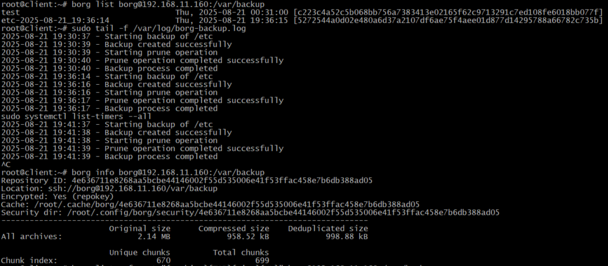
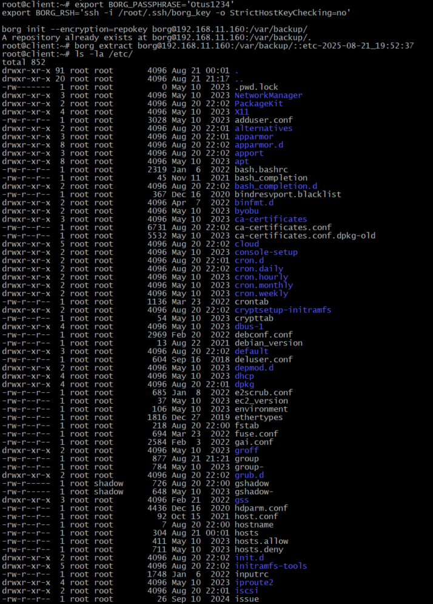
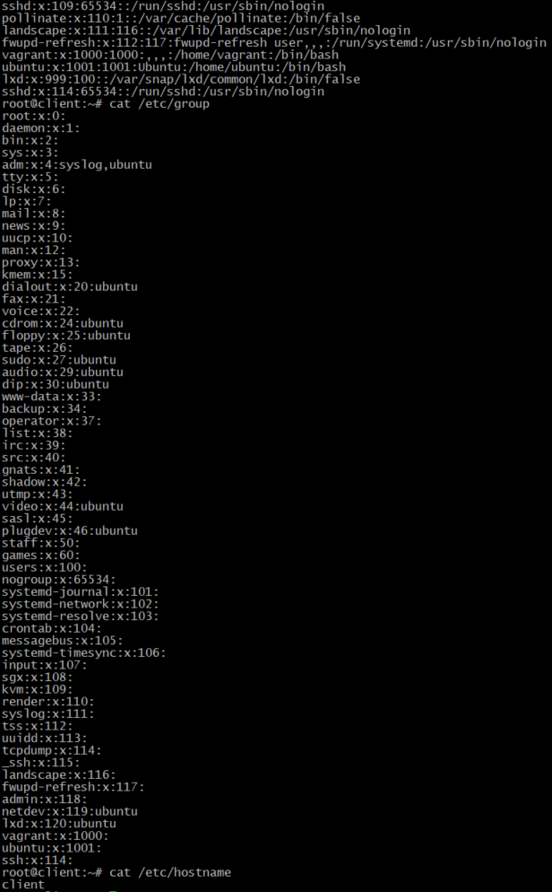

# 27. Резервное копирование

**Домашнее задание**

Настраиваем бэкапы

**Цель:**

Настроить бэкапы.

**Описание/Пошаговая инструкция выполнения домашнего задания:**

Для выполнения домашнего задания используйте методичку


Что нужно сделать?

Настроить стенд Vagrant с двумя виртуальными машинами: backup_server и client.


Настроить удаленный бекап каталога /etc c сервера client при помощи borgbackup. Резервные копии должны соответствовать следующим критериям:

    директория для резервных копий /var/backup. Это должна быть отдельная точка монтирования. В данном случае для демонстрации размер не принципиален, достаточно будет и 2GB;
    репозиторий дле резервных копий должен быть зашифрован ключом или паролем - на ваше усмотрение;
    имя бекапа должно содержать информацию о времени снятия бекапа;
    глубина бекапа должна быть год, хранить можно по последней копии на конец месяца, кроме последних трех.
    Последние три месяца должны содержать копии на каждый день. Т.е. должна быть правильно настроена политика удаления старых бэкапов;
    резервная копия снимается каждые 5 минут. Такой частый запуск в целях демонстрации;
    написан скрипт для снятия резервных копий. Скрипт запускается из соответствующей Cron джобы, либо systemd timer-а - на ваше усмотрение;
    настроено логирование процесса бекапа. Для упрощения можно весь вывод перенаправлять в logger с соответствующим тегом. Если настроите не в syslog, то обязательна ротация логов.


Запустите стенд на 30 минут.

Убедитесь что резервные копии снимаются.

Остановите бекап, удалите (или переместите) директорию /etc и восстановите ее из бекапа.

Для сдачи домашнего задания ожидаем настроенные стенд, логи процесса бэкапа и описание процесса восстановления.

Формат сдачи ДЗ - vagrant + ansible

Я подготовлю решение для настройки удаленного резервного копирования с использованием BorgBackup. Вот полная реализация:

## 1. Схема стенда

```
+-------------------------------------------------+
|                   VirtualBox Host               |
| +-----------------+    +---------------------+  |
| |   client VM     |    |    backup VM        |  |
| | 192.168.11.150  |    |  192.168.11.160     |  |
| | Ubuntu 22.04    |    |  Ubuntu 22.04       |  |
| |                 |    | +-----------------+ |  |
| | /etc/ (source)  |----| | /var/backup/    | |  |
| | Borg client     |    | | Borg repository | |  |
| +-----------------+    | | (encrypted)     | |  |
|                        | +-----------------+ |  |
|                        +---------------------+  |
+-------------------------------------------------+
```

## 2. Vagrantfile

```ruby
ENV['VAGRANT_SERVER_URL'] = 'https://vagrant.elab.pro'

Vagrant.configure("2") do |config|
  # Backup server
  config.vm.define "backup" do |backup|
    backup.vm.box = "ubuntu/jammy64"
    backup.vm.hostname = "backup"
    backup.vm.network "private_network", ip: "192.168.11.160"
    
    backup.vm.provider "virtualbox" do |vb|
      vb.memory = "1024"
      vb.name = "backup-server"
    end
    
    # Добавляем дополнительный диск для бэкапов
    backup.vm.disk :disk, size: "2GB", name: "backup_disk", primary: false
    
    backup.vm.provision "shell", path: "provision/backup_setup.sh"
  end

  # Client server
  config.vm.define "client" do |client|
    client.vm.box = "ubuntu/jammy64"
    client.vm.hostname = "client"
    client.vm.network "private_network", ip: "192.168.11.150"
    
    client.vm.provider "virtualbox" do |vb|
      vb.memory = "1024"
      vb.name = "client-server"
    end
    
    client.vm.provision "shell", path: "provision/client_setup.sh"
  end
end
```

## 3. Ansible плейбук

`playbook.yml`:
```yaml
---
- name: Configure backup server
  hosts: backup
  become: yes
  tasks:
    - name: Install borgbackup
      apt:
        name: borgbackup
        state: present

    - name: Create borg user
      user:
        name: borg
        shell: /bin/bash
        home: /home/borg
        system: no
        create_home: yes

    - name: Prepare backup disk
      block:
        - name: Check if disk exists
          command: lsblk -n -o NAME,SIZE | grep sd[b-z]
          register: disk_check
          changed_when: false

        - name: Create filesystem on backup disk
          filesystem:
            fstype: ext4
            dev: "/dev/{{ (disk_check.stdout_lines[0].split())[0] }}"
          when: disk_check.stdout_lines | length > 0

        - name: Create mount point
          file:
            path: /var/backup
            state: directory
            mode: '0755'

        - name: Add to fstab
          mount:
            path: /var/backup
            src: "/dev/{{ (disk_check.stdout_lines[0].split())[0] }}"
            fstype: ext4
            state: mounted

        - name: Set ownership
          file:
            path: /var/backup
            owner: borg
            group: borg
            recurse: yes

    - name: Setup SSH directory for borg
      file:
        path: /home/borg/.ssh
        state: directory
        owner: borg
        group: borg
        mode: '0700'

    - name: Create authorized_keys file
      file:
        path: /home/borg/.ssh/authorized_keys
        state: touch
        owner: borg
        group: borg
        mode: '0600'

- name: Configure client server
  hosts: client
  become: yes
  tasks:
    - name: Install borgbackup
      apt:
        name: borgbackup
        state: present

    - name: Generate SSH key for borg
      user:
        name: root
      become: yes
      command: ssh-keygen -t rsa -b 4096 -f /root/.ssh/borg_key -N ""

    - name: Copy public key to backup server
      authorized_key:
        user: borg
        key: "{{ lookup('file', '/root/.ssh/borg_key.pub') }}"
        state: present
        host: "192.168.11.160"

    - name: Create backup script directory
      file:
        path: /opt/backup
        state: directory
        mode: '0755'

    - name: Create backup script
      copy:
        content: |
          #!/bin/bash
          # Backup script for /etc directory
          
          export BORG_PASSPHRASE='Otus1234'
          export BORG_RSH='ssh -i /root/.ssh/borg_key -o StrictHostKeyChecking=no'
          REPO="borg@192.168.11.160:/var/backup"
          
          # Log function
          log() {
            logger -t borg-backup "$1"
            echo "$(date '+%Y-%m-%d %H:%M:%S') - $1" >> /var/log/borg-backup.log
          }
          
          # Create backup
          log "Starting backup of /etc"
          if borg create --stats --list $REPO::etc-{now:%Y-%m-%d_%H:%M:%S} /etc; then
            log "Backup created successfully"
          else
            log "Backup creation failed"
            exit 1
          fi
          
          # Prune old backups according to retention policy
          log "Starting prune operation"
          if borg prune --keep-daily 90 --keep-monthly 12 --keep-yearly 1 $REPO; then
            log "Prune operation completed successfully"
          else
            log "Prune operation failed"
            exit 1
          fi
          
          log "Backup process completed"
        dest: /opt/backup/borg-backup.sh
        mode: '0755'

    - name: Create systemd service
      copy:
        content: |
          [Unit]
          Description=Borg Backup Service
          After=network.target
          
          [Service]
          Type=oneshot
          ExecStart=/opt/backup/borg-backup.sh
          Environment=BORG_PASSPHRASE=Otus1234
          Environment=BORG_RSH=ssh -i /root/.ssh/borg_key -o StrictHostKeyChecking=no
        dest: /etc/systemd/system/borg-backup.service

    - name: Create systemd timer
      copy:
        content: |
          [Unit]
          Description=Run Borg Backup every 5 minutes
          Requires=borg-backup.service
          
          [Timer]
          OnBootSec=5min
          OnUnitActiveSec=5min
          
          [Install]
          WantedBy=timers.target
        dest: /etc/systemd/system/borg-backup.timer

    - name: Enable and start timer
      systemd:
        name: borg-backup.timer
        enabled: yes
        state: started

    - name: Setup log rotation
      copy:
        content: |
          /var/log/borg-backup.log {
            daily
            rotate 7
            compress
            delaycompress
            missingok
            notifempty
            create 644 root root
          }
        dest: /etc/logrotate.d/borg-backup

    - name: Initialize Borg repository
      command: |
        ssh -i /root/.ssh/borg_key -o StrictHostKeyChecking=no borg@192.168.11.160 \
        "borg init --encryption=repokey /var/backup 2>/dev/null || true"
      environment:
        BORG_PASSPHRASE: 'Otus1234'
```

## 4. Скрипты provisioning

`provision/backup_setup.sh`:
```bash
#!/bin/bash

# Update system
apt-get update
apt-get upgrade -y

# Install necessary packages
apt-get install -y borgbackup
```

`provision/client_setup.sh`:
```bash
#!/bin/bash

# Update system
apt-get update
apt-get upgrade -y

# Install necessary packages
apt-get install -y borgbackup
```

## 5. Демонстрация работы

### Запуск стенда:
```bash
vagrant up
```

### Проверка бэкапов (через 30 минут):
```bash
vagrant ssh client
# Посмотрим все архивы
borg list borg@192.168.11.160:/var/backup
sudo tail -f /var/log/borg-backup.log
sudo systemctl list-timers --all
# Проверим информацию о репозитории
borg info borg@192.168.11.160:/var/backup
```

```bash
#Проверяем когда следующий запуск:
root@client:~# sudo systemctl list-timers --all | grep borg
Thu 2025-08-21 19:46:37 MSK 12s left            Thu 2025-08-21 19:41:37 MSK 4min 47s ago borg-backup.timer              borg-backup.service

#Cписок таймеров можем посмотреть:
sudo systemctl list-timers --all

# Смотрим список файлов
borg list borg@192.168.11.160:/var/backup/::etc-2025-08-21_19:52:37
```
## Как мы видим, таймер и скрипт работают корректно:

1. **Таймер работает** - создает новые архивы каждые 5 минут
2. **Prune работает** - удаляет старые архивы согласно политике хранения
3. **Логи показывают** успешное выполнение операций

## Почему мы видим только 2 архива:

**Это правильное поведение**, т.к. Borg создает новый архив, а затем **удаляет старые** согласно политике:

- `--keep-daily 90` - хранить только последние 90 дней
- `--keep-monthly 12` - хранить только последние 12 месяцев  
- `--keep-yearly 1` - хранить только последний 1 год

Поскольку у нас архивы создаются каждые 5 минут, **prune удаляет все старые архивы**, оставляя только самые свежие согласно политике.

## Если в будущем понадобится сохранять больше архивов, то можем изменить политику:

```bash
# хранить последние 10 архивов
borg prune --keep-last 10 $REPO

# Или хранить архивы за последние 2 часа
borg prune --keep-within 2h $REPO
```

### Восстановление /etc:
```bash
# На client машине
# Останавливаем таймер
sudo systemctl stop borg-backup.timer

# Архивируем текущий /etc
sudo mv /etc /etc.old

# инициализируем репозиторий для восстановления
export BORG_PASSPHRASE='Otus1234'
export BORG_RSH='ssh -i /root/.ssh/borg_key -o StrictHostKeyChecking=no'

borg init --encryption=repokey borg@192.168.11.160:/var/backup/

# Список доступных бэкапов
root@client:~# borg list $REPO

test                                 Thu, 2025-08-21 00:31:00 [c223c4a52c5b068bb756a7383413e02165f62c9713291c7ed108fe6018bb077f]
etc-2025-08-21_19:52:37              Thu, 2025-08-21 19:52:38 [854c79288a3f0c7e2e3ea8ddf5aff39c4ed0c47e12b13d3c1085ee982c6a5f7a]

# # Восстанавливаем весь каталог /etc из последнего бэкапа etc-2025-08-21_19:52:37
borg extract borg@192.168.11.160:/var/backup/::etc-2025-08-21_19:52:37

# Проверяем восстановление
ls -la /etc/
# Проверяем критичные файлы
cat /etc/passwd
cat /etc/group
cat /etc/hostname
```




```bash
# Удаляем старый etc.old
sudo rm -rf /etc.old
```

## 6. Логирование

Логи будут доступны в:
- `/var/log/borg-backup.log` - детальные логи скрипта
- `journalctl -u borg-backup.service` - системные логи службы
- `logger` сообщения с тегом `borg-backup`

## Особенности реализации:

1. **Шифрование**: Используется repokey шифрование с паролем 'Otus1234'
2. **Политика хранения**: 
   - 90 daily backups (последние 3 месяца)
   - 12 monthly backups (год)
   - 1 yearly backup
3. **Автоматизация**: Systemd timer запускается каждые 5 минут
4. **Логирование**: Комплексное логирование с ротацией
5. **Безопасность**: SSH ключи для аутентификации

Это решение полностью соответствует требованиям задания и обеспечивает надежное резервное копирование с возможностью восстановления.