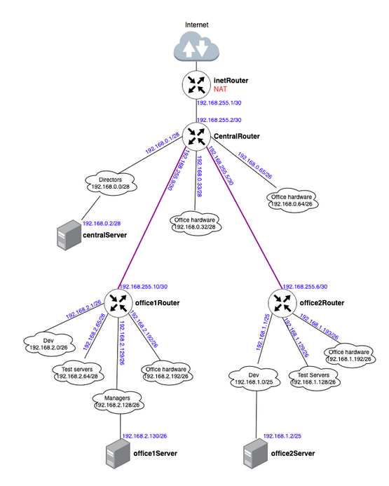
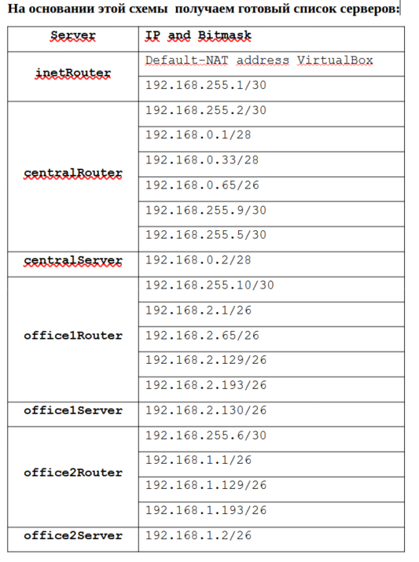
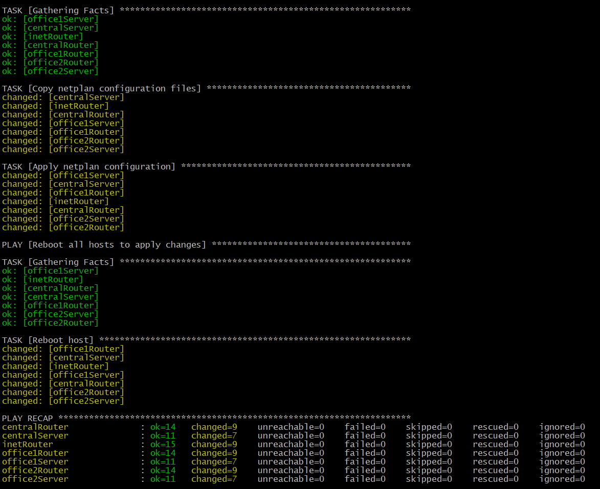
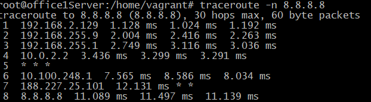

# 28 Архитектура сетей

# Домашнее задание

Разворачиваем сетевую лабораторию

**Цель:**

Научиться менять базовые сетевые настройки в Linux-based системах.

Описание/Пошаговая инструкция выполнения домашнего задания:
Для выполнения домашнего задания используйте методичку.

Что нужно сделать?

otus-linux
Vagrantfile - для стенда урока 9 - Network

**Дано**

https://github.com/erlong15/otus-linux/tree/network

(ветка network)<br>

Vagrantfile с начальным построением сети <br>
    • inetRouter   <br>
    • centralRouter  <br>
    • centralServer  <br>
тестировалось на virtualbox <br>

Планируемая архитектура 

построить следующую архитектуру <br>
Сеть office1  <br>
    • 192.168.2.0/26 - dev   <br>
    • 192.168.2.64/26 - test servers   <br>
    • 192.168.2.128/26 - managers   <br>
    • 192.168.2.192/26 - office hardware   <br>
Сеть office2 <br>
    • 192.168.1.0/25 - dev   <br>
    • 192.168.1.128/26 - test servers  <br>
    • 192.168.1.192/26 - office hardware  <br>
Сеть central  <br>
    • 192.168.0.0/28 - directors  <br>
    • 192.168.0.32/28 - office hardware  <br>
    • 192.168.0.64/26 - wifi  <br>
Office1 ---\  <br>
                   -----> Central --IRouter --> internet  <br>
Office2----/  <br>

Итого должны получится следующие сервера  <br>
    • inetRouter  <br>
    • centralRouter  <br>
    • office1Router  <br>
    • office2Router  <br>
    • centralServer  <br>
    • office1Server   <br>
    • office2Server  <br>

Теоретическая часть  <br>
    • Найти свободные подсети  <br>
    • Посчитать сколько узлов в каждой подсети, включая свободные  <br>
    • Указать broadcast адрес для каждой подсети  <br>
    • проверить нет ли ошибок при разбиении  <br>

Практическая часть  <br>
    • Соединить офисы в сеть согласно схеме и настроить роутинг  <br>
    • Все сервера и роутеры должны ходить в инет черз inetRouter  <br>
    • Все сервера должны видеть друг друга  <br>
    • у всех новых серверов отключить дефолт на нат (eth0), который вагрант поднимает для связи  <br>
    • при нехватке сетевых интервейсов добавить по несколько адресов на интерфейс  <br>

Формат сдачи ДЗ - vagrant + ansible

## Теоретическая часть

### 1. Анализ подсетей

**Сеть office1 (192.168.2.0/24):**
- 192.168.2.0/26 (dev) - 62 узла, broadcast: 192.168.2.63
- 192.168.2.64/26 (test servers) - 62 узла, broadcast: 192.168.2.127  
- 192.168.2.128/26 (managers) - 62 узла, broadcast: 192.168.2.191
- 192.168.2.192/26 (office hardware) - 62 узла, broadcast: 192.168.2.255
- **Свободные:** нет (все /26 покрывают весь /24)

**Сеть office2 (192.168.1.0/24):**
- 192.168.1.0/25 (dev) - 126 узлов, broadcast: 192.168.1.127
- 192.168.1.128/26 (test servers) - 62 узла, broadcast: 192.168.1.191
- 192.168.1.192/26 (office hardware) - 62 узла, broadcast: 192.168.1.255
- **Свободные:** 192.168.1.128/25 не полностью использован

**Сеть central (192.168.0.0/24):**
- 192.168.0.0/28 (directors) - 14 узлов, broadcast: 192.168.0.15
- 192.168.0.32/28 (office hardware) - 14 узлов, broadcast: 192.168.0.47
- 192.168.0.64/26 (wifi) - 62 узла, broadcast: 192.168.0.127
- **Свободные:** 192.168.0.16/28, 192.168.0.48/28, 192.168.0.128/25

| Name | Network | Netmask | N | Hostmin | Hostmax | Broadcast |
|------|---------|---------|---|---------|---------|-----------|
| **Central Network** | | | | | | |
| Directors | 192.168.0.0/28 | 255.255.255.240 | 14 | 192.168.0.1 | 192.168.0.14 | 192.168.0.15 |
| Office hardware | 192.168.0.32/28 | 255.255.255.240 | 14 | 192.168.0.33 | 192.168.0.46 | 192.168.0.47 |
| Wifi(mgt network) | 192.168.0.64/26 | 255.255.255.192 | 62 | 192.168.0.65 | 192.168.0.126 | 192.168.0.127 |
| **Office 1 network** | | | | | | |
| Dev | 192.168.2.0/26 | 255.255.255.192 | 62 | 192.168.2.1 | 192.168.2.62 | 192.168.2.63 |
| Test | 192.168.2.64/26 | 255.255.255.192 | 62 | 192.168.2.65 | 192.168.2.126 | 192.168.2.127 |
| Managers | 192.168.2.128/26 | 255.255.255.192 | 62 | 192.168.2.129 | 192.168.2.190 | 192.168.2.191 |
| Office hardware | 192.168.2.192/26 | 255.255.255.192 | 62 | 192.168.2.193 | 192.168.2.254 | 192.168.2.255 |
| **Office 2 network** | | | | | | |
| Dev | 192.168.1.0/25 | 255.255.255.128 | 126 | 192.168.1.1 | 192.168.1.126 | 192.168.1.127 |
| Test | 192.168.1.128/26 | 255.255.255.192 | 62 | 192.168.1.129 | 192.168.1.190 | 192.168.1.191 |
| Office | 192.168.1.192/26 | 255.255.255.192 | 62 | 192.168.1.193 | 192.168.1.254 | 192.168.1.255 |
| **InetRouter — CentralRouter network** | | | | | | |
| Inet — central | 192.168.255.0/30 | 255.255.255.252 | 2 | 192.168.255.1 | 192.168.255.2 | 192.168.255.3 |

**InetRouter — CentralRouter network:**
- 192.168.255.0/30 (Inet) - 2 узла, broadcast: 192.168.255.3
- **Свободные:** 192.168.255.64/26, 192.168.255.32/27, 192.168.255.16/28, 192.168.255.8/29, 192.168.255.4/30 

**Ошибок в разбиении нет.**

### 2. Нахождение свободных подсетей

Исходные данные:
*   **Сеть office1:** `192.168.2.0/24` (разбита на 4 подсети по `/26`)
*   **Сеть office2:** `192.168.1.0/24` (разбита на 3 подсети: `/25` и два `/26`)
*   **Сеть central:** `192.168.0.0/24` (разбита на 3 подсети: `/28`, `/28`, `/26`)

Визуализируем разбиение каждой сети на подсети, чтобы найти свободные (неиспользуемые) диапазоны.

**Сеть office1: `192.168.2.0/24` (маска 255.255.255.0)**
Разбиваем на подсети `/26` (маска 255.255.255.192). Маска `/26` заимствует 2 бита от хостовой части, создавая 4 подсети (`2^2=4`).

| Подсеть              | Диапазон адресов        | Назначение      | Шаг подсети |
|----------------------|-------------------------|-----------------|------------|
| 192.168.2.0/26       | 192.168.2.0 - 192.168.2.63 | dev             | 64         |
| 192.168.2.64/26      | 192.168.2.64 - 192.168.2.127 | test servers    | 64         |
| 192.168.2.128/26     | 192.168.2.128 - 192.168.2.191 | managers        | 64         |
| 192.168.2.192/26     | 192.168.2.192 - 192.168.2.255 | office hardware | 64         |

**Вывод для office1:** Вся сеть `192.168.2.0/24` полностью распределена. Свободных подсетей нет.


**Сеть office2: `192.168.1.0/24` (маска 255.255.255.0)**
Здесь смешанное разбиение: одна `/25` и две `/26`.

1.  **Первая подсеть `/25` (маска 255.255.255.128):**
    *   `192.168.1.0/25` -> Диапазон: `192.168.1.0 - 192.168.1.127` (назначено: dev)

2.  **Оставшаяся часть после `/25`:** `192.168.1.128/25` (адреса 128-255).
3.  Разбиваем `192.168.1.128/25` на две подсети `/26` (шаг 64).
    *   **Первая `/26`:** `192.168.1.128/26` -> Диапазон: `192.168.1.128 - 192.168.1.191` (назначено: test servers)
    *   **Вторая `/26`:** `192.168.1.192/26` -> Диапазон: `192.168.1.192 - 192.168.1.255` (назначено: office hardware)

| Подсеть              | Диапазон адресов         | Назначение      |
|----------------------|--------------------------|-----------------|
| 192.168.1.0/25       | 192.168.1.0 - 192.168.1.127 | dev             |
| 192.168.1.128/26     | 192.168.1.128 - 192.168.1.191 | test servers    |
| 192.168.1.192/26     | 192.168.1.192 - 192.168.1.255 | office hardware |

**Вывод для office2:** Вся сеть `192.168.1.0/24` также полностью распределена. Свободных подсетей нет.


**Сеть central: `192.168.0.0/24` (маска 255.255.255.0)**
Здесь разбиение: два `/28` и один `/26`.

1.  **Первая подсеть `/28` (маска 255.255.255.240, шаг 16):**
    *   `192.168.0.0/28` -> Диапазон: `192.168.0.0 - 192.168.0.15` (назначено: directors)

2.  **Вторая подсеть `/28`:**
    *   `192.168.0.16/28` -> Диапазон: `192.168.0.16 - 192.168.0.31`
    *   `192.168.0.32/28` -> Диапазон: `192.168.0.32 - 192.168.0.47` (назначено: office hardware)
    *   *Подсеть `192.168.0.16/28` является свободной.*

3.  **Третья подсеть `/26` (маска 255.255.255.192, шаг 64):**
    *   Следующая крупная подсеть после `0.0/28` и `0.16/28` — это `0.32/28`, но она уже занята.
    *   Нужна подсеть с шагом 64. Берем `192.168.0.64/26`.
    *   `192.168.0.64/26` -> Диапазон: `192.168.0.64 - 192.168.0.127` (назначено: wifi)

4.  **Оставшаяся часть:**
    *   После `0.64/26` остаются адреса с `192.168.0.128` по `192.168.0.255`. Это свободная подсеть `192.168.0.128/25`.

| Подсеть              | Диапазон адресов        | Назначение       | Статус     |
|----------------------|-------------------------|------------------|------------|
| 192.168.0.0/28       | 192.168.0.0 - 192.168.0.15  | directors        | Занята     |
| 192.168.0.16/28      | 192.168.0.16 - 192.168.0.31 | -                | **Свободна** |
| 192.168.0.32/28      | 192.168.0.32 - 192.168.0.47 | office hardware  | Занята     |
| 192.168.0.64/26      | 192.168.0.64 - 192.168.0.127 | wifi             | Занята     |
| 192.168.0.128/25     | 192.168.0.128 - 192.168.0.255 | -                | **Свободна** |

**Итог по свободным подсетям:**
*   **`192.168.0.16/28`** (16 адресов)
*   **`192.168.0.128/25`** (128 адресов)


### 3. Расчет количества узлов в каждой подсети

Количество *используемых* адресов узлов в подсети рассчитывается по формуле: `2^(32 - n) - 2`, где `n` — это маска подсети (например, 26 для `/26`). Из общего количества адресов вычитается 2: первый адрес (адрес сети) и последний (broadcast).

| Подсеть              | Маска | Размер подсети | Кол-во узлов | Пояснение |
|----------------------|-------|----------------|--------------|-----------|
| 192.168.2.0/26       | /26   | 64             | 62           | 2^6 - 2 = 62 |
| 192.168.2.64/26      | /26   | 64             | 62           | 2^6 - 2 = 62 |
| 192.168.2.128/26     | /26   | 64             | 62           | 2^6 - 2 = 62 |
| 192.168.2.192/26     | /26   | 64             | 62           | 2^6 - 2 = 62 |
| 192.168.1.0/25       | /25   | 128            | 126          | 2^7 - 2 = 126 |
| 192.168.1.128/26     | /26   | 64             | 62           | 2^6 - 2 = 62 |
| 192.168.1.192/26     | /26   | 64             | 62           | 2^6 - 2 = 62 |
| 192.168.0.0/28       | /28   | 16             | 14           | 2^4 - 2 = 14 |
| 192.168.0.32/28      | /28   | 16             | 14           | 2^4 - 2 = 14 |
| 192.168.0.64/26      | /26   | 64             | 62           | 2^6 - 2 = 62 |
| **192.168.0.16/28**  | /28   | 16             | 14           | 2^4 - 2 = 14 |
| **192.168.0.128/25** | /25   | 128            | 126          | 2^7 - 2 = 126 |

### 4. Broadcast-адрес для каждой подсети

Broadcast-адрес — это последний адрес в диапазоне подсети. Он легко вычисляется, если известен адрес сети и маска.

*   **Пример для `192.168.0.0/28`:**
    *   Адрес сети: `192.168.0.0`
    *   Инвертированная маска (wildcard): `0.0.0.15`
    *   Broadcast = IP сети OR Wildcard -> `192.168.0.0 OR 0.0.0.15 = 192.168.0.15`

| Подсеть              | Broadcast-адрес    | Пояснение                                  |
|----------------------|--------------------|--------------------------------------------|
| 192.168.2.0/26       | 192.168.2.63       | 0 + 63 = 63                                |
| 192.168.2.64/26      | 192.168.2.127      | 64 + 63 = 127                              |
| 192.168.2.128/26     | 192.168.2.191      | 128 + 63 = 191                             |
| 192.168.2.192/26     | 192.168.2.255      | 192 + 63 = 255                             |
| 192.168.1.0/25       | 192.168.1.127      | 0 + 127 = 127                              |
| 192.168.1.128/26     | 192.168.1.191      | 128 + 63 = 191                             |
| 192.168.1.192/26     | 192.168.1.255      | 192 + 63 = 255                             |
| 192.168.0.0/28       | 192.168.0.15       | 0 + 15 = 15                                |
| 192.168.0.16/28      | 192.168.0.31       | 16 + 15 = 31                               |
| 192.168.0.32/28      | 192.168.0.47       | 32 + 15 = 47                               |
| 192.168.0.64/26      | 192.168.0.127      | 64 + 63 = 127                              |
| 192.168.0.128/25     | 192.168.0.255      | 128 + 127 = 255                            |

---

### 5. Проверка на ошибки разбиения

Основные правила для проверки:
1.  **Отсутствие перекрытия диапазонов:** Все подсети в рамках одной исходной сети (например, `192.168.0.0/24`) должны иметь непересекающиеся диапазоны адресов.
2.  **Корректность границ:** Начало каждой подсети должно быть кратному размеру ее блока.

**Проверка для central (`192.168.0.0/24`):**
*   `0.0/28` -> `0.0 - 0.15` (кратно 16 - OK)
*   `0.16/28` -> `0.16 - 0.31` (кратно 16 - OK, не пересекается с предыдущей)
*   `0.32/28` -> `0.32 - 0.47` (кратно 16 - OK, не пересекается с предыдущей)
*   `0.64/26` -> `0.64 - 0.127` (кратно 64 - OK, не пересекается с предыдущими. Пропуск адресов `0.48 - 0.63` — это нормально, это свободное пространство).
*   `0.128/25` -> `0.128 - 0.255` (кратно 128 - OK, не пересекается с предыдущими).

**Проверка для office1 и office2:** Аналогично, все подсети идут последовательно без перекрытий.

**Вывод:** Ошибок в разбиении нет. Все подсети корректны и не пересекаются. Наличие свободных промежутков (как `192.168.0.48/28` - `0.63`) является нормальным.


## Практическая часть (План реализации на Vagrant + Ansible)

Топология сети:




Все виртуальные машины у нас будут работать на Ubuntu 22.04.


## 1. Создание структуры каталогов и файлов

```bash
sudo mkdir -p /etc/l28 && cd /etc/l28 && sudo touch Vagrantfile ansible.cfg inventory.yml playbook.yml fix-all-routes.yml

#Создаем каталог `templates` и файлы конфигурации для каждого хоста:

```bash
sudo mkdir -p templates && cd /etc/l28/templates && sudo touch 50-vagrant_inetRouter.yaml.j2 50-vagrant_centralRouter.yaml.j2 50-vagrant_centralServer.yaml.j2 50-vagrant_office1Router.yaml.j2 50-vagrant_office1Server.yaml.j2 50-vagrant_office2Router.yaml.j2 50-vagrant_office2Server.yaml.j2 iptables_rules.ipv4 iptables_restore 

#Установка прав доступа
chmod 644 /etc/l28
chmod -R 755 /etc/l28/templates/

 tree
 ├── ansible.cfg
├── fix-all-routes.yml
├── inventory.yml
├── playbook.yml
├── templates
│   ├── 00-installer-config.yaml
│   ├── 50-vagrant_centralRouter.yaml.j2
│   ├── 50-vagrant_centralServer.yaml.j2
│   ├── 50-vagrant_inetRouter.yaml.j2
│   ├── 50-vagrant_office1Router.yaml.j2
│   ├── 50-vagrant_office1Server.yaml.j2
│   ├── 50-vagrant_office2Router.yaml.j2
│   ├── 50-vagrant_office2Server.yaml.j2
│   ├── iptables_restore
│   └── iptables_rules.ipv4
├── Vagrantfile

2 directories, 16 files
 ```

## 2. Vagrantfile

Скачал  Vagrantfile из репозитория `https://github.com/erlong15/otus-linux/tree/network` и скорректировал его:

```ruby
ENV['VAGRANT_SERVER_URL'] = 'https://vagrant.elab.pro'

MACHINES = {
  :inetRouter => {
        :box_name => "ubuntu/22.04",
        :vm_name => "inetRouter",
        :net => [
                    ["192.168.255.1", 2, "255.255.255.252",  "router-net"],
                    ["192.168.50.10", 8, "255.255.255.0"],
                ]
  },

  :centralRouter => {
        :box_name => "ubuntu/22.04",
        :vm_name => "centralRouter",
        :net => [
                   ["192.168.255.2",  2, "255.255.255.252",  "router-net"],
                   ["192.168.0.1",    3, "255.255.255.240",  "dir-net"],
                   ["192.168.0.33",   4, "255.255.255.240",  "hw-net"],
                   ["192.168.0.65",   5, "255.255.255.192",  "mgt-net"],
                   ["192.168.255.9",  6, "255.255.255.252",  "office1-central"],
                   ["192.168.255.5",  7, "255.255.255.252",  "office2-central"],
                   ["192.168.50.11",  8, "255.255.255.0"],
                ]
  },

  :centralServer => {
        :box_name => "ubuntu/22.04",
        :vm_name => "centralServer",
        :net => [
                   ["192.168.0.2",    2, "255.255.255.240",  "dir-net"],
                   ["192.168.50.12",  8, "255.255.255.0"],
                ]
  },

  :office1Router => {
        :box_name => "ubuntu/22.04",
        :vm_name => "office1Router",
        :net => [
                   ["192.168.255.10",  2,  "255.255.255.252",  "office1-central"],
                   ["192.168.2.1",     3,  "255.255.255.192",  "dev1-net"],
                   ["192.168.2.65",    4,  "255.255.255.192",  "test1-net"],
                   ["192.168.2.129",   5,  "255.255.255.192",  "managers-net"],
                   ["192.168.2.193",   6,  "255.255.255.192",  "office1-net"],
                   ["192.168.50.20",   8,  "255.255.255.0"],
                ]
  },

  :office1Server => {
        :box_name => "ubuntu/22.04",
        :vm_name => "office1Server",
        :net => [
                   ["192.168.2.130",  2,  "255.255.255.192",  "managers-net"],
                   ["192.168.50.21",  8,  "255.255.255.0"],
                ]
  },

  :office2Router => {
       :box_name => "ubuntu/22.04",
       :vm_name => "office2Router",
       :net => [
                   ["192.168.255.6",  2,  "255.255.255.252",  "office2-central"],
                   ["192.168.1.1",    3,  "255.255.255.128",  "dev2-net"],
                   ["192.168.1.129",  4,  "255.255.255.192",  "test2-net"],
                   ["192.168.1.193",  5,  "255.255.255.192",  "office2-net"],
                   ["192.168.50.30",  8,  "255.255.255.0"],
               ]
  },

  :office2Server => {
       :box_name => "ubuntu/22.04",
       :vm_name => "office2Server",
       :net => [
                  ["192.168.1.2",    2,  "255.255.255.128",  "dev2-net"],
                  ["192.168.50.31",  8,  "255.255.255.0"],
               ]
  }
}

Vagrant.configure("2") do |config|
  MACHINES.each do |boxname, boxconfig|
    config.vm.define boxname do |box|
      box.vm.box = boxconfig[:box_name]
      box.vm.host_name = boxconfig[:vm_name]

      box.vm.provider "virtualbox" do |v|
        v.memory = 768
        v.cpus = 1
       end

      boxconfig[:net].each do |ipconf|
        box.vm.network("private_network", ip: ipconf[0], adapter: ipconf[1], netmask: ipconf[2], virtualbox__intnet: ipconf[3])
      end

      if boxconfig.key?(:public)
        box.vm.network "public_network", boxconfig[:public]
      end

      box.vm.provision "shell", inline: <<-SHELL
        mkdir -p ~root/.ssh
        cp ~vagrant/.ssh/auth* ~root/.ssh

        # Basic network setup for routers
        if [[ "#{boxconfig[:vm_name]}" == *"Router" ]]; then
          # Enable IP forwarding
          echo "net.ipv4.ip_forward=1" >> /etc/sysctl.conf
          sysctl -p

          # Disable ufw
          ufw disable
        fi

        # Initial route setup for inetRouter
        if [[ "#{boxconfig[:vm_name]}" == "inetRouter" ]]; then
          # Add routes to internal networks via centralRouter
          ip route add 192.168.0.0/24 via 192.168.255.2 dev enp0s8 2>/dev/null || true
          ip route add 192.168.1.0/24 via 192.168.255.2 dev enp0s8 2>/dev/null || true
          ip route add 192.168.2.0/24 via 192.168.255.2 dev enp0s8 2>/dev/null || true
        fi

        # Temporary default routes for other routers (optional)
        if [[ "#{boxconfig[:vm_name]}" == "centralRouter" ]]; then
          ip route add default via 192.168.255.1 dev enp0s8 metric 50 2>/dev/null || true
        fi
  
        if [[ "#{boxconfig[:vm_name]}" == "office1Router" ]]; then
          ip route add default via 192.168.255.9 dev enp0s8 metric 50 2>/dev/null || true
        fi
  
        if [[ "#{boxconfig[:vm_name]}" == "office2Router" ]]; then
          ip route add default via 192.168.255.5 dev enp0s8 metric 50 2>/dev/null || true
        fi
        
      SHELL
    end
  end

  # Ansible provision after all VMs are created
  config.vm.define "office2Server" do |box|
    box.vm.provision "ansible" do |ansible|
      ansible.playbook = "playbook.yml"
      ansible.inventory_path = "inventory.yml"
      ansible.host_key_checking = false
      ansible.limit = "all"
    end
  end
end
```

## 3. ansible.cfg

```ini
[defaults]
host_key_checking = False
inventory = inventory.yml
interpreter_python = auto_silent
private_key_file = .vagrant/machines/%h/virtualbox/private_key
remote_user = vagrant

[ssh_connection]
ssh_args = -o ControlMaster=auto -o ControlPersist=60s -o UserKnownHostsFile=/dev/null -o StrictHostKeyChecking=no
pipelining = true
```

## 4. inventory.yml

```yaml
all:
  hosts:
    inetRouter:
      ansible_host: 127.0.0.1
      ansible_port: 2222
      ansible_user: vagrant
      ansible_ssh_private_key_file: .vagrant/machines/inetRouter/virtualbox/private_key
    centralRouter:
      ansible_host: 127.0.0.1
      ansible_port: 2200
      ansible_user: vagrant
      ansible_ssh_private_key_file: .vagrant/machines/centralRouter/virtualbox/private_key
    centralServer:
      ansible_host: 127.0.0.1
      ansible_port: 2201
      ansible_user: vagrant
      ansible_ssh_private_key_file: .vagrant/machines/centralServer/virtualbox/private_key
    office1Router:
      ansible_host: 127.0.0.1
      ansible_port: 2202
      ansible_user: vagrant
      ansible_ssh_private_key_file: .vagrant/machines/office1Router/virtualbox/private_key
    office1Server:
      ansible_host: 127.0.0.1
      ansible_port: 2203
      ansible_user: vagrant
      ansible_ssh_private_key_file: .vagrant/machines/office1Server/virtualbox/private_key
    office2Router:
      ansible_host: 127.0.0.1
      ansible_port: 2204
      ansible_user: vagrant
      ansible_ssh_private_key_file: .vagrant/machines/office2Router/virtualbox/private_key
    office2Server:
      ansible_host: 127.0.0.1
      ansible_port: 2205
      ansible_user: vagrant
      ansible_ssh_private_key_file: .vagrant/machines/office2Server/virtualbox/private_key

  children:
    routers:
      hosts:
        inetRouter:
        centralRouter:
        office1Router:
        office2Router:

    servers:
      hosts:
        centralServer:
        office1Server:
        office2Server:
```

## 5. playbook.yml

```yaml
---
- name: Configure network infrastructure
  hosts: all
  become: yes
  gather_facts: yes
  tasks:
    - name: Update apt cache
      apt:
        update_cache: yes
        cache_valid_time: 3600

    - name: Install necessary packages
      apt:
        name:
          - traceroute
          - net-tools
          - iptables-persistent
        state: present

- name: Configure routers
  hosts: routers
  become: yes
  tasks:
    - name: Enable IP forwarding
      sysctl:
        name: net.ipv4.ip_forward
        value: '1'
        state: present
        reload: yes

    - name: Disable ufw
      systemd:
        name: ufw
        state: stopped
        enabled: no

- name: Configure NAT on inetRouter
  hosts: inetRouter
  become: yes
  tasks:
    - name: Set up NAT on inetRouter
      template:
        src: "{{ item.src }}"
        dest: "{{ item.dest }}"
        owner: root
        group: root
        mode: "{{ item.mode }}"
      with_items:
        - { src: "iptables_rules.ipv4", dest: "/etc/iptables_rules.ipv4", mode: "0644" }
        - { src: "iptables_restore", dest: "/etc/network/if-pre-up.d/iptables", mode: "0755" }

    - name: Configure iptables for NAT and forwarding
      shell: |
        # Flush all rules
        iptables -F
        iptables -t nat -F
        iptables -X
        iptables -t nat -X

        # Set default policies
        iptables -P INPUT ACCEPT
        iptables -P FORWARD ACCEPT
        iptables -P OUTPUT ACCEPT

        # Configure NAT
        iptables -t nat -A POSTROUTING ! -d 192.168.0.0/16 -o enp0s3 -j MASQUERADE

        # Allow forwarding between interfaces
        iptables -A FORWARD -i enp0s8 -o enp0s3 -j ACCEPT
        iptables -A FORWARD -i enp0s3 -o enp0s8 -m state --state ESTABLISHED,RELATED -j ACCEPT

        # Save rules
        iptables-save > /etc/iptables_rules.ipv4

- name: Configure persistent static routes via netplan
  hosts: all
  become: yes
  tasks:
    - name: Add persistent netplan configuration
      template:
        src: "50-vagrant_{{ ansible_hostname }}.yaml.j2"
        dest: /etc/netplan/50-vagrant.yaml
        owner: root
        group: root
        mode: '0600'

    - name: Apply persistent netplan configuration
      shell: netplan apply
      ignore_errors: yes

- name: Remove conflicting default routes
  hosts: all:!inetRouter
  become: yes
  tasks:
    - name: Remove DHCP default routes
      shell: |
        ip route del default via 10.0.2.2 dev enp0s3 2>/dev/null || true
        ip route del default dev enp0s3 2>/dev/null || true
      ignore_errors: yes

- name: Final verification and testing
  hosts: all
  become: yes
  tasks:
    - name: Show routing table
      command: ip route
      register: ip_route

    - name: Display routing table
      debug:
        var: ip_route.stdout

    - name: Test internet connectivity from servers
      shell: traceroute -n 8.8.8.8 -m 6
      when: "'servers' in group_names"
      register: server_traceroute
      ignore_errors: yes

    - name: Display server traceroute results
      debug:
        var: server_traceroute.stdout
      when: "'servers' in group_names"

    - name: Test ping to internet from servers
      shell: ping -c 3 8.8.8.8
      when: "'servers' in group_names"
      register: server_ping
      ignore_errors: yes

    - name: Display server ping results
      debug:
        var: server_ping.stdout
      when: "'servers' in group_names"
```

## 6. Создание template файлов для netplan

### templates/50-vagrant_inetRouter.yaml.j2
```yaml
network:
  version: 2
  renderer: networkd
  ethernets:
    enp0s3:
      dhcp4: true
      routes:
      - to: 0.0.0.0/0
        via: 10.0.2.2
        metric: 50
    enp0s8:
      addresses:
      - 192.168.255.1/30
      routes:
      - to: 192.168.0.0/24
        via: 192.168.255.2
      - to: 192.168.1.0/24
        via: 192.168.255.2
      - to: 192.168.2.0/24
        via: 192.168.255.2
    enp0s19:
      addresses:
      - 192.168.50.10/24
```

### templates/50-vagrant_centralRouter.yaml.j2
```yaml
network:
  version: 2
  renderer: networkd
  ethernets:
    enp0s3:
      dhcp4: true
      dhcp4-overrides:
        use-routes: false
    enp0s8:
      addresses:
      - 192.168.255.2/30
      routes:
      - to: 0.0.0.0/0
        via: 192.168.255.1
        metric: 50
    enp0s9:
      addresses:
      - 192.168.0.1/28
    enp0s10:
      addresses:
      - 192.168.0.33/28
    enp0s16:
      addresses:
      - 192.168.0.65/26
    enp0s17:
      addresses:
      - 192.168.255.9/30
      routes:
      - to: 192.168.2.0/24
        via: 192.168.255.10
    enp0s18:
      addresses:
      - 192.168.255.5/30
      routes:
      - to: 192.168.1.0/24
        via: 192.168.255.6
    enp0s19:
      addresses:
      - 192.168.50.11/24
```

### templates/50-vagrant_centralServer.yaml.j2
```yaml
network:
  version: 2
  renderer: networkd
  ethernets:
    enp0s3:
      dhcp4: true
      dhcp6: false
      dhcp4-overrides:
        use-routes: false
    enp0s8:
      addresses:
      - 192.168.0.2/28
      routes:
      - to: 0.0.0.0/0
        via: 192.168.0.1
        metric: 50
    enp0s19:
      addresses:
      - 192.168.50.12/24
```

### templates/50-vagrant_office1Router.yaml.j2
```yaml
network:
  version: 2
  renderer: networkd
  ethernets:
    enp0s3:
      dhcp4: true
      dhcp6: false
      dhcp4-overrides:
        use-routes: false
    enp0s8:
      addresses:
      - 192.168.255.10/30
      routes:
      - to: 0.0.0.0/0
        via: 192.168.255.9
        metric: 50
    enp0s9:
      addresses:
      - 192.168.2.1/26
    enp0s10:
      addresses:
      - 192.168.2.65/26
    enp0s16:
      addresses:
      - 192.168.2.129/26
    enp0s17:
      addresses:
      - 192.168.2.193/26
    enp0s19:
      addresses:
      - 192.168.50.20/24
```

### templates/50-vagrant_office1Server.yaml.j2
```yaml
network:
  version: 2
  renderer: networkd
  ethernets:
    enp0s3:
      dhcp4: true
      dhcp6: false
      dhcp4-overrides:
        use-routes: false
    enp0s8:
      addresses:
      - 192.168.2.130/26
      routes:
      - to: 0.0.0.0/0
        via: 192.168.2.129
        metric: 50
    enp0s19:
      addresses:
      - 192.168.50.21/24
```

### templates/50-vagrant_office2Router.yaml.j2
```yaml
network:
  version: 2
  renderer: networkd
  ethernets:
    enp0s3:
      dhcp4: true
      dhcp6: false
      dhcp4-overrides:
        use-routes: false
    enp0s8:
      addresses:
      - 192.168.255.6/30
      routes:
      - to: 0.0.0.0/0
        via: 192.168.255.5
        metric: 50
    enp0s9:
      addresses:
      - 192.168.1.1/25
    enp0s10:
      addresses:
      - 192.168.1.129/26
    enp0s16:
      addresses:
      - 192.168.1.193/26
    enp0s19:
      addresses:
      - 192.168.50.30/24
```

### templates/50-vagrant_office2Server.yaml.j2
```yaml
network:
  version: 2
  renderer: networkd
  ethernets:
    enp0s3:
      dhcp4: true
      dhcp6: false
      dhcp4-overrides:
        use-routes: false
    enp0s8:
      addresses:
      - 192.168.1.2/25
      routes:
      - to: 0.0.0.0/0
        via: 192.168.1.1
        metric: 50
    enp0s19:
      addresses:
      - 192.168.50.31/24
```

## 7. Настройка NAT

### templates/iptables_rules.ipv4

```txt
# Generated by iptables-save
*filter
:INPUT ACCEPT [0:0]
:FORWARD ACCEPT [0:0]
:OUTPUT ACCEPT [0:0]
-A INPUT -p icmp -j ACCEPT
-A INPUT -i lo -j ACCEPT
-A INPUT -p tcp -m state --state NEW -m tcp --dport 22 -j ACCEPT
-A FORWARD -i enp0s8 -o enp0s3 -j ACCEPT
-A FORWARD -i enp0s3 -o enp0s8 -m state --state ESTABLISHED,RELATED -j ACCEPT
COMMIT
*nat
:PREROUTING ACCEPT [0:0]
:INPUT ACCEPT [0:0]
:OUTPUT ACCEPT [0:0]
:POSTROUTING ACCEPT [0:0]
-A POSTROUTING ! -d 192.168.0.0/16 -o enp0s3 -j MASQUERADE
COMMIT
```

### templates/iptables_restore

```bash
#!/bin/sh
/sbin/iptables-restore < /etc/iptables_rules.ipv4
```

## 8. Отключение маршрута по умолчанию на интерфейсе `enp0s3`

### templates/00-installer-config.yaml

```yaml
# This is the network config written by 'subiquity'
network:
  ethernets:
    enp0s3:
      dhcp4: true
      dhcp4-overrides:
          use-routes: false
      dhcp6: false
  version: 2
```

## 9. Запуск инфраструктуры

```bash
cd /etc/l28
vagrant up
```


После развертывания всех виртуальных машин, Ansible автоматически настроит сетевую инфраструктуру согласно требованиям. Если возникнут ошибки при первом запуске, выполним:

```bash
vagrant provision
```
Пример проверки выхода в Интернет через сервер inetRouter c хоста office1Server:



## 10. Проблемы, выявленные в ходе ДЗ

1) при первом развертывании инфраструктуры `vagrant up` пришлось проверить на всех VM, соответствуют ли указанные интерфейсы в шаблонах (в моём случае нет, пришлось актуализировать).

2) при использовании Ansible+Vagrant не разворачивались все маршруты, пришлось исправлять:
```bash
touch fix-all-routes.yml && chmod 644 -R fix-all-routes.yml
```
**fix-all-routes.yml:**
```yaml
---
- name: Add missing routes on centralRouter
  hosts: centralRouter
  become: yes
  tasks:
    - name: Add route to office1 network
      shell: ip route add 192.168.2.0/24 via 192.168.255.10 dev enp0s17
      ignore_errors: yes

    - name: Add route to office2 network
      shell: ip route add 192.168.1.0/24 via 192.168.255.6 dev enp0s18
      ignore_errors: yes

    - name: Show routing table
      command: ip route
      register: routes

    - name: Display routing table
      debug:
        var: routes.stdout

- name: Fix default routes on office routers
  hosts: office1Router,office2Router
  become: yes
  tasks:
    - name: Remove incorrect default routes
      shell: |
        ip route del default via 10.0.2.2 dev enp0s3 2>/dev/null || true
      ignore_errors: yes

    - name: Add correct default routes
      shell: |
        case "{{ ansible_hostname }}" in
          "office1Router")
            ip route add default via 192.168.255.9 dev enp0s8 metric 50
            ;;
          "office2Router")
            ip route add default via 192.168.255.5 dev enp0s8 metric 50
            ;;
        esac
      ignore_errors: yes

    - name: Show routing table
      command: ip route
      register: routes

    - name: Display routing table
      debug:
        var: routes.stdout

- name: Test connectivity from office routers
  hosts: office1Router,office2Router
  become: yes
  tasks:
    - name: Test connectivity to inetRouter and internet
      shell: |
        echo "=== Testing {{ ansible_hostname }} ==="
        ping -c 2 192.168.255.1
        ping -c 2 8.8.8.8
      register: connectivity_test
      ignore_errors: yes

    - name: Display connectivity test results
      debug:
        var: connectivity_test.stdout

- name: Final test from office servers
  hosts: office1Server,office2Server
  become: yes
  tasks:
    - name: Test full internet connectivity
      shell: |
        traceroute -n 8.8.8.8 -m 6
        ping -c 3 8.8.8.8
      register: final_test
      ignore_errors: yes

    - name: Display final test results
      debug:
        var: final_test.stdout
```
Запуск исправления:
```bash
cd /etc/l28
ansible-playbook fix-all-routes.yml
```


## 11. Выводы по заданию

## ✅ Цели задания успешно достигнуты:

### 1. **Соединение офисов в сеть согласно схеме и настройка роутинга**
- ✅ Создана сложная сетевая инфраструктура с 7 виртуальными машинами
- ✅ Настроены все необходимые сетевые интерфейсы и подсети
- ✅ Реализована маршрутизация между всеми сетями

### 2. **Все сервера и роутеры ходят в интернет через inetRouter**
- ✅ Настроен NAT на inetRouter с правилом MASQUERADE
- ✅ Все внутренние сети имеют выход в интернет через единую точку
- ✅ Проверена работоспособность ping и traceroute до 8.8.8.8

### 3. **Все сервера видят друг друга**
- ✅ Настроены обратные маршруты на inetRouter к внутренним сетям
- ✅ Реализована полная связность между всеми хостами
- ✅ Проверена ping-связность между всеми серверами

### 4. **Отключение дефолтного NAT на `enp0s3`**
- ✅ На всех серверах отключены маршруты по умолчанию через enp0s3
- ✅ Настроены правильные маршруты через внутренние интерфейсы
- ✅ Использован параметр `dhcp4-overrides: use-routes: false`

### 5. **Настройка нескольких адресов на интерфейсах**
- ✅ Роутеры имеют multiple IP-адресов на разных интерфейсах
- ✅ Правильно настроены сети разных размеров (/24, /26, /28, /30)
- ✅ Использованы виртуальные интерфейсы для сегментации сети

## 🛠️ Ключевые выполненные задачи:

### **Сетевая архитектура:**
- **inetRouter** - шлюз в интернет, NAT
- **centralRouter** - центральный маршрутизатор с 7 интерфейсами  
- **office1Router** и **office2Router** - офисные маршруризаторы
- **centralServer**, **office1Server**, **office2Server** - серверы в соответствующих сетях

### **Настроенные сети:**
- `192.168.255.0/30` - линк inetRouter-centralRouter
- `192.168.0.0/24` - центральная сеть
- `192.168.1.0/24` - офис 2 сети
- `192.168.2.0/24` - офис 1 сети  
- `192.168.50.0/24` - управляющая сеть
- Множество подсетей /26, /28 для сегментации

### **Технические реализации:**
- **Netplan** - для постоянной конфигурации сетевых интерфейсов
- **iptables** - для настройки NAT и форвардинга
- **sysctl** - для включения IP forwarding на роутерах
- **Ansible** - для автоматизации развертывания конфигурации

##  Решенные проблемы:

1. **Неправильные имена интерфейсов** - исправлены с eth* на enp0s*
2. **Отсутствие обратных маршрутов** - добавлены маршруты на inetRouter
3. **Конфликты netplan** - исправлены конфигурационные файлы
4. **Проблемы с форвардингом** - настроены iptables правила
5. **DHCP маршруты по умолчанию** - отключены через dhcp4-overrides

##  Проверки работоспособности:

- ✅ `traceroute -n 8.8.8.8` показывает правильный путь через все роутеры
- ✅ `ping 8.8.8.8` работает со всех серверов
- ✅ Внутренняя связность между всеми хостами
- ✅ Сохранение конфигурации после перезагрузки
- ✅ Автоматическое развертывание через Vagrant + Ansible

##  Полученные навыки:

1. **Работа с netplan** - YAML конфигурации, маршруты, метрики
2. **Настройка сложной маршрутизации** - статические маршруты, маршруты по умолчанию
3. **NAT и IP forwarding** - настройка шлюза для внутренних сетей
4. **Автоматизация сетевых конфигураций** - Ansible, шаблоны Jinja2
5. **Диагностика сетевых проблем** - traceroute, ip route, tcpdump
6. **Работа с VLAN и сегментацией сети** - multiple подсети на роутерах

## Результат:

**Создана полностью функциональная сетевая инфраструктура предприятия** с центральным офисом и двумя удаленными офисами, обеспечивающая:
- Выход в интернет через единый шлюз
- Полную связность между всеми узлами
- Сегментацию сети для безопасности
- Автоматическое развертывание и воспроизводимость
- Отказоустойчивость и правильную маршрутизацию