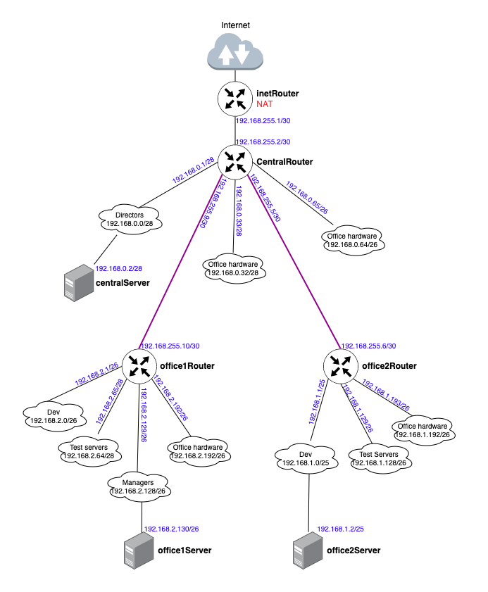

# 28 Архитектура сетей

# Домашнее задание

Разворачиваем сетевую лабораторию

**Цель:**

Научиться менять базовые сетевые настройки в Linux-based системах.

Описание/Пошаговая инструкция выполнения домашнего задания:
Для выполнения домашнего задания используйте методичку.

Что нужно сделать?

otus-linux
Vagrantfile - для стенда урока 9 - Network

**Дано**

https://github.com/erlong15/otus-linux/tree/network

(ветка network)<br>

Vagrantfile с начальным построением сети <br>
    • inetRouter   <br>
    • centralRouter  <br>
    • centralServer  <br>
тестировалось на virtualbox <br>

Планируемая архитектура 

построить следующую архитектуру <br>
Сеть office1  <br>
    • 192.168.2.0/26 - dev   <br>
    • 192.168.2.64/26 - test servers   <br>
    • 192.168.2.128/26 - managers   <br>
    • 192.168.2.192/26 - office hardware   <br>
Сеть office2 <br>
    • 192.168.1.0/25 - dev   <br>
    • 192.168.1.128/26 - test servers  <br>
    • 192.168.1.192/26 - office hardware  <br>
Сеть central  <br>
    • 192.168.0.0/28 - directors  <br>
    • 192.168.0.32/28 - office hardware  <br>
    • 192.168.0.64/26 - wifi  <br>
Office1 ---\  <br>
                   -----> Central --IRouter --> internet  <br>
Office2----/  <br>

Итого должны получится следующие сервера  <br>
    • inetRouter  <br>
    • centralRouter  <br>
    • office1Router  <br>
    • office2Router  <br>
    • centralServer  <br>
    • office1Server   <br>
    • office2Server  <br>

Теоретическая часть  <br>
    • Найти свободные подсети  <br>
    • Посчитать сколько узлов в каждой подсети, включая свободные  <br>
    • Указать broadcast адрес для каждой подсети  <br>
    • проверить нет ли ошибок при разбиении  <br>

Практическая часть  <br>
    • Соединить офисы в сеть согласно схеме и настроить роутинг  <br>
    • Все сервера и роутеры должны ходить в инет черз inetRouter  <br>
    • Все сервера должны видеть друг друга  <br>
    • у всех новых серверов отключить дефолт на нат (eth0), который вагрант поднимает для связи  <br>
    • при нехватке сетевых интервейсов добавить по несколько адресов на интерфейс  <br>

Формат сдачи ДЗ - vagrant + ansible

## Теоретическая часть

### Анализ подсетей:

**Сеть office1 (192.168.2.0/24):**
- 192.168.2.0/26 (dev) - 62 узла, broadcast: 192.168.2.63
- 192.168.2.64/26 (test servers) - 62 узла, broadcast: 192.168.2.127  
- 192.168.2.128/26 (managers) - 62 узла, broadcast: 192.168.2.191
- 192.168.2.192/26 (office hardware) - 62 узла, broadcast: 192.168.2.255
- **Свободные:** нет (все /26 покрывают весь /24)

**Сеть office2 (192.168.1.0/24):**
- 192.168.1.0/25 (dev) - 126 узлов, broadcast: 192.168.1.127
- 192.168.1.128/26 (test servers) - 62 узла, broadcast: 192.168.1.191
- 192.168.1.192/26 (office hardware) - 62 узла, broadcast: 192.168.1.255
- **Свободные:** 192.168.1.128/25 не полностью использован

**Сеть central (192.168.0.0/24):**
- 192.168.0.0/28 (directors) - 14 узлов, broadcast: 192.168.0.15
- 192.168.0.32/28 (office hardware) - 14 узлов, broadcast: 192.168.0.47
- 192.168.0.64/26 (wifi) - 62 узла, broadcast: 192.168.0.127
- **Свободные:** 192.168.0.16/28, 192.168.0.48/28, 192.168.0.128/25

| Name | Network | Netmask | N | Hostmin | Hostmax | Broadcast |
|------|---------|---------|---|---------|---------|-----------|
| **Central Network** | | | | | | |
| Directors | 192.168.0.0/28 | 255.255.255.240 | 14 | 192.168.0.1 | 192.168.0.14 | 192.168.0.15 |
| Office hardware | 192.168.0.32/28 | 255.255.255.240 | 14 | 192.168.0.33 | 192.168.0.46 | 192.168.0.47 |
| Wifi(mgt network) | 192.168.0.64/26 | 255.255.255.192 | 62 | 192.168.0.65 | 192.168.0.126 | 192.168.0.127 |
| **Office 1 network** | | | | | | |
| Dev | 192.168.2.0/26 | 255.255.255.192 | 62 | 192.168.2.1 | 192.168.2.62 | 192.168.2.63 |
| Test | 192.168.2.64/26 | 255.255.255.192 | 62 | 192.168.2.65 | 192.168.2.126 | 192.168.2.127 |
| Managers | 192.168.2.128/26 | 255.255.255.192 | 62 | 192.168.2.129 | 192.168.2.190 | 192.168.2.191 |
| Office hardware | 192.168.2.192/26 | 255.255.255.192 | 62 | 192.168.2.193 | 192.168.2.254 | 192.168.2.255 |
| **Office 2 network** | | | | | | |
| Dev | 192.168.1.0/25 | 255.255.255.128 | 126 | 192.168.1.1 | 192.168.1.126 | 192.168.1.127 |
| Test | 192.168.1.128/26 | 255.255.255.192 | 62 | 192.168.1.129 | 192.168.1.190 | 192.168.1.191 |
| Office | 192.168.1.192/26 | 255.255.255.192 | 62 | 192.168.1.193 | 192.168.1.254 | 192.168.1.255 |
| **InetRouter — CentralRouter network** | | | | | | |
| Inet — central | 192.168.255.0/30 | 255.255.255.252 | 2 | 192.168.255.1 | 192.168.255.2 | 192.168.255.3 |

**InetRouter — CentralRouter network:**
- 192.168.255.0/30 (Inet) - 2 узла, broadcast: 192.168.255.3
- **Свободные:** 192.168.255.64/26, 192.168.255.32/27, 192.168.255.16/28, 192.168.255.8/29, 192.168.255.4/30 

**Ошибок в разбиении нет.**

## Практическая часть

### 1. Установка и настройка


Скачаю и отредактирую Vagrantfile:

```bash
mkdir -p /etc/L28
cd /etc/L28
curl -O https://raw.githubusercontent.com/erlong15/otus-linux/network/Vagrantfile
```

### Теоретическая часть

#### 1. Нахождение свободных подсетей

Исходные данные:
*   **Сеть office1:** `192.168.2.0/24` (разбита на 4 подсети по `/26`)
*   **Сеть office2:** `192.168.1.0/24` (разбита на 3 подсети: `/25` и два `/26`)
*   **Сеть central:** `192.168.0.0/24` (разбита на 3 подсети: `/28`, `/28`, `/26`)

Давайте визуализируем разбиение каждой сети на подсети, чтобы найти свободные (неиспользуемые) диапазоны.

**Сеть office1: `192.168.2.0/24` (маска 255.255.255.0)**
Разбиваем на подсети `/26` (маска 255.255.255.192). Маска `/26` заимствует 2 бита от хостовой части, создавая 4 подсети (`2^2=4`).

| Подсеть              | Диапазон адресов        | Назначение      | Шаг подсети |
|----------------------|-------------------------|-----------------|------------|
| 192.168.2.0/26       | 192.168.2.0 - 192.168.2.63 | dev             | 64         |
| 192.168.2.64/26      | 192.168.2.64 - 192.168.2.127 | test servers    | 64         |
| 192.168.2.128/26     | 192.168.2.128 - 192.168.2.191 | managers        | 64         |
| 192.168.2.192/26     | 192.168.2.192 - 192.168.2.255 | office hardware | 64         |

**Вывод для office1:** Вся сеть `192.168.2.0/24` полностью распределена. Свободных подсетей нет.

---

**Сеть office2: `192.168.1.0/24` (маска 255.255.255.0)**
Здесь смешанное разбиение: одна `/25` и две `/26`.

1.  **Первая подсеть `/25` (маска 255.255.255.128):**
    *   `192.168.1.0/25` -> Диапазон: `192.168.1.0 - 192.168.1.127` (назначено: dev)

2.  **Оставшаяся часть после `/25`:** `192.168.1.128/25` (адреса 128-255).
3.  Разбиваем `192.168.1.128/25` на две подсети `/26` (шаг 64).
    *   **Первая `/26`:** `192.168.1.128/26` -> Диапазон: `192.168.1.128 - 192.168.1.191` (назначено: test servers)
    *   **Вторая `/26`:** `192.168.1.192/26` -> Диапазон: `192.168.1.192 - 192.168.1.255` (назначено: office hardware)

| Подсеть              | Диапазон адресов         | Назначение      |
|----------------------|--------------------------|-----------------|
| 192.168.1.0/25       | 192.168.1.0 - 192.168.1.127 | dev             |
| 192.168.1.128/26     | 192.168.1.128 - 192.168.1.191 | test servers    |
| 192.168.1.192/26     | 192.168.1.192 - 192.168.1.255 | office hardware |

**Вывод для office2:** Вся сеть `192.168.1.0/24` также полностью распределена. Свободных подсетей нет.

---

**Сеть central: `192.168.0.0/24` (маска 255.255.255.0)**
Здесь разбиение: два `/28` и один `/26`.

1.  **Первая подсеть `/28` (маска 255.255.255.240, шаг 16):**
    *   `192.168.0.0/28` -> Диапазон: `192.168.0.0 - 192.168.0.15` (назначено: directors)

2.  **Вторая подсеть `/28`:**
    *   `192.168.0.16/28` -> Диапазон: `192.168.0.16 - 192.168.0.31`
    *   `192.168.0.32/28` -> Диапазон: `192.168.0.32 - 192.168.0.47` (назначено: office hardware)
    *   *Подсеть `192.168.0.16/28` является свободной.*

3.  **Третья подсеть `/26` (маска 255.255.255.192, шаг 64):**
    *   Следующая крупная подсеть после `0.0/28` и `0.16/28` — это `0.32/28`, но она уже занята.
    *   Нужна подсеть с шагом 64. Берем `192.168.0.64/26`.
    *   `192.168.0.64/26` -> Диапазон: `192.168.0.64 - 192.168.0.127` (назначено: wifi)

4.  **Оставшаяся часть:**
    *   После `0.64/26` остаются адреса с `192.168.0.128` по `192.168.0.255`. Это свободная подсеть `192.168.0.128/25`.

| Подсеть              | Диапазон адресов        | Назначение       | Статус     |
|----------------------|-------------------------|------------------|------------|
| 192.168.0.0/28       | 192.168.0.0 - 192.168.0.15  | directors        | Занята     |
| 192.168.0.16/28      | 192.168.0.16 - 192.168.0.31 | -                | **Свободна** |
| 192.168.0.32/28      | 192.168.0.32 - 192.168.0.47 | office hardware  | Занята     |
| 192.168.0.64/26      | 192.168.0.64 - 192.168.0.127 | wifi             | Занята     |
| 192.168.0.128/25     | 192.168.0.128 - 192.168.0.255 | -                | **Свободна** |

**Итог по свободным подсетям:**
*   **`192.168.0.16/28`** (16 адресов)
*   **`192.168.0.128/25`** (128 адресов)

---

#### 2. Расчет количества узлов в каждой подсети

Количество *используемых* адресов узлов в подсети рассчитывается по формуле: `2^(32 - n) - 2`, где `n` — это маска подсети (например, 26 для `/26`). Из общего количества адресов вычитается 2: первый адрес (адрес сети) и последний (broadcast).

| Подсеть              | Маска | Размер подсети | Кол-во узлов | Пояснение |
|----------------------|-------|----------------|--------------|-----------|
| 192.168.2.0/26       | /26   | 64             | 62           | 2^6 - 2 = 62 |
| 192.168.2.64/26      | /26   | 64             | 62           | 2^6 - 2 = 62 |
| 192.168.2.128/26     | /26   | 64             | 62           | 2^6 - 2 = 62 |
| 192.168.2.192/26     | /26   | 64             | 62           | 2^6 - 2 = 62 |
| 192.168.1.0/25       | /25   | 128            | 126          | 2^7 - 2 = 126 |
| 192.168.1.128/26     | /26   | 64             | 62           | 2^6 - 2 = 62 |
| 192.168.1.192/26     | /26   | 64             | 62           | 2^6 - 2 = 62 |
| 192.168.0.0/28       | /28   | 16             | 14           | 2^4 - 2 = 14 |
| 192.168.0.32/28      | /28   | 16             | 14           | 2^4 - 2 = 14 |
| 192.168.0.64/26      | /26   | 64             | 62           | 2^6 - 2 = 62 |
| **192.168.0.16/28**  | /28   | 16             | 14           | 2^4 - 2 = 14 |
| **192.168.0.128/25** | /25   | 128            | 126          | 2^7 - 2 = 126 |

---

#### 3. Broadcast-адрес для каждой подсети

Broadcast-адрес — это последний адрес в диапазоне подсети. Он легко вычисляется, если известен адрес сети и маска.

*   **Пример для `192.168.0.0/28`:**
    *   Адрес сети: `192.168.0.0`
    *   Инвертированная маска (wildcard): `0.0.0.15`
    *   Broadcast = IP сети OR Wildcard -> `192.168.0.0 OR 0.0.0.15 = 192.168.0.15`

| Подсеть              | Broadcast-адрес    | Пояснение                                  |
|----------------------|--------------------|--------------------------------------------|
| 192.168.2.0/26       | 192.168.2.63       | 0 + 63 = 63                                |
| 192.168.2.64/26      | 192.168.2.127      | 64 + 63 = 127                              |
| 192.168.2.128/26     | 192.168.2.191      | 128 + 63 = 191                             |
| 192.168.2.192/26     | 192.168.2.255      | 192 + 63 = 255                             |
| 192.168.1.0/25       | 192.168.1.127      | 0 + 127 = 127                              |
| 192.168.1.128/26     | 192.168.1.191      | 128 + 63 = 191                             |
| 192.168.1.192/26     | 192.168.1.255      | 192 + 63 = 255                             |
| 192.168.0.0/28       | 192.168.0.15       | 0 + 15 = 15                                |
| 192.168.0.16/28      | 192.168.0.31       | 16 + 15 = 31                               |
| 192.168.0.32/28      | 192.168.0.47       | 32 + 15 = 47                               |
| 192.168.0.64/26      | 192.168.0.127      | 64 + 63 = 127                              |
| 192.168.0.128/25     | 192.168.0.255      | 128 + 127 = 255                            |

---

#### 4. Проверка на ошибки разбиения

Основные правила для проверки:
1.  **Отсутствие перекрытия диапазонов:** Все подсети в рамках одной исходной сети (например, `192.168.0.0/24`) должны иметь непересекающиеся диапазоны адресов.
2.  **Корректность границ:** Начало каждой подсети должно быть кратному размеру ее блока.

**Проверка для central (`192.168.0.0/24`):**
*   `0.0/28` -> `0.0 - 0.15` (кратно 16 - OK)
*   `0.16/28` -> `0.16 - 0.31` (кратно 16 - OK, не пересекается с предыдущей)
*   `0.32/28` -> `0.32 - 0.47` (кратно 16 - OK, не пересекается с предыдущей)
*   `0.64/26` -> `0.64 - 0.127` (кратно 64 - OK, не пересекается с предыдущими. Пропуск адресов `0.48 - 0.63` — это нормально, это свободное пространство).
*   `0.128/25` -> `0.128 - 0.255` (кратно 128 - OK, не пересекается с предыдущими).

**Проверка для office1 и office2:** Аналогично, все подсети идут последовательно без перекрытий.

**Вывод:** Ошибок в разбиении нет. Все подсети корректны и не пересекаются. Наличие свободных промежутков (как `192.168.0.48/28` - `0.63`) является нормальным.

### Практическая часть (План реализации на Vagrant + Ansible)

Отлично, приступим к полной реализации практической части.

### Полная реализация на Vagrant + Ansible

#### 1. Структура проекта

Создадим следующую структуру файлов и каталогов:

```
netlab/
├── Vagrantfile
├── ansible.cfg
├── inventory.yml
└── playbook.yml
```

#### 2. Vagrantfile

```ruby
# -*- mode: ruby -*-
# vim: set ft=ruby :
# -*- mode: ruby -*-
# vim: set ft=ruby :

ENV['VAGRANT_SERVER_URL'] = 'https://vagrant.elab.pro'

MACHINES = {
  :inetRouter => {
        :box_name => "ubuntu/22.04",
        :vm_name => "inetRouter",
        #:public => {:ip => "10.10.10.1", :adapter => 1},
        :net => [   
                    #ip, adpter, netmask, virtualbox__intnet
                    ["192.168.255.1", 2, "255.255.255.252",  "router-net"], 
                    ["192.168.50.10", 8, "255.255.255.0"],
                ]
  },

  :centralRouter => {
        :box_name => "ubuntu/22.04",
        :vm_name => "centralRouter",
        :net => [
                   ["192.168.255.2",  2, "255.255.255.252",  "router-net"],
                   ["192.168.0.1",    3, "255.255.255.240",  "dir-net"],
                   ["192.168.0.33",   4, "255.255.255.240",  "hw-net"],
                   ["192.168.0.65",   5, "255.255.255.192",  "mgt-net"],
                   ["192.168.255.9",  6, "255.255.255.252",  "office1-central"],
                   ["192.168.255.5",  7, "255.255.255.252",  "office2-central"],
                   ["192.168.50.11",  8, "255.255.255.0"],
                ]
  },

  :centralServer => {
        :box_name => "ubuntu/22.04",
        :vm_name => "centralServer",
        :net => [
                   ["192.168.0.2",    2, "255.255.255.240",  "dir-net"],
                   ["192.168.50.12",  8, "255.255.255.0"],
                ]
  },

  :office1Router => {
        :box_name => "ubuntu/22.04",
        :vm_name => "office1Router",
        :net => [
                   ["192.168.255.10",  2,  "255.255.255.252",  "office1-central"],
                   ["192.168.2.1",     3,  "255.255.255.192",  "dev1-net"],
                   ["192.168.2.65",    4,  "255.255.255.192",  "test1-net"],
                   ["192.168.2.129",   5,  "255.255.255.192",  "managers-net"],
                   ["192.168.2.193",   6,  "255.255.255.192",  "office1-net"],
                   ["192.168.50.20",   8,  "255.255.255.0"],
                ]
  },

  :office1Server => {
        :box_name => "ubuntu/22.04",
        :vm_name => "office1Server",
        :net => [
                   ["192.168.2.130",  2,  "255.255.255.192",  "managers-net"],
                   ["192.168.50.21",  8,  "255.255.255.0"],
                ]
  },

  :office2Router => {
       :box_name => "ubuntu/22.04",
       :vm_name => "office2Router",
       :net => [
                   ["192.168.255.6",  2,  "255.255.255.252",  "office2-central"],
                   ["192.168.1.1",    3,  "255.255.255.128",  "dev2-net"],
                   ["192.168.1.129",  4,  "255.255.255.192",  "test2-net"],
                   ["192.168.1.193",  5,  "255.255.255.192",  "office2-net"],
                   ["192.168.50.30",  8,  "255.255.255.0"],
               ]
  },

  :office2Server => {
       :box_name => "ubuntu/22.04",
       :vm_name => "office2Server",
       :net => [
                  ["192.168.1.2",    2,  "255.255.255.128",  "dev2-net"],
                  ["192.168.50.31",  8,  "255.255.255.0"],
               ]
  }
}

Vagrant.configure("2") do |config|
  MACHINES.each do |boxname, boxconfig|
    config.vm.define boxname do |box|
      box.vm.box = boxconfig[:box_name]
      box.vm.host_name = boxconfig[:vm_name]
      
      box.vm.provider "virtualbox" do |v|
        v.memory = 768
        v.cpus = 1
       end

      boxconfig[:net].each do |ipconf|
        box.vm.network("private_network", ip: ipconf[0], adapter: ipconf[1], netmask: ipconf[2], virtualbox__intnet: ipconf[3])
      end

      if boxconfig.key?(:public)
        box.vm.network "public_network", boxconfig[:public]
      end

      box.vm.provision "shell", inline: <<-SHELL
        mkdir -p ~root/.ssh
        cp ~vagrant/.ssh/auth* ~root/.ssh
      SHELL
    end
  end
end
```

#### 3. Ansible конфигурация

**ansible.cfg:**
```ini
[defaults]
inventory = inventory.yml
host_key_checking = False
interpreter_python = /usr/bin/python3
roles_path = ./roles
```

**inventory.yml:**
```yaml
all:
  children:
    routers:
      hosts:
        inetRouter:
          ansible_ssh_host: 192.168.255.1
        centralRouter:
          ansible_ssh_host: 192.168.255.2
        office1Router:
          ansible_ssh_host: 172.16.255.2
        office2Router:
          ansible_ssh_host: 172.16.255.6
    servers:
      hosts:
        centralServer:
          ansible_ssh_host: 192.168.0.2
        office1Server:
          ansible_ssh_host: 192.168.2.2
        office2Server:
          ansible_ssh_host: 192.168.1.2
```

**playbook.yml:**
```yaml
---
- name: Configure network infrastructure
  hosts: all
  become: yes
  tasks:
    - name: Install required packages
      package:
        name: ["net-tools", "iptables-services", "traceroute"]
        state: present

- name: Configure routers
  hosts: routers
  become: yes
  tasks:
    - name: Enable IP forwarding
      sysctl:
        name: net.ipv4.ip_forward
        value: '1'
        state: present
        reload: yes

    - name: Configure iptables for NAT and forwarding
      block:
        - name: Flush existing iptables rules
          iptables:
            flush: yes

        - name: Set default policies
          iptables:
            chain: "{{ item.chain }}"
            policy: "{{ item.policy }}"
          loop:
            - { chain: INPUT, policy: ACCEPT }
            - { chain: FORWARD, policy: ACCEPT }
            - { chain: OUTPUT, policy: ACCEPT }

        - name: Enable NAT on inetRouter
          iptables:
            table: nat
            chain: POSTROUTING
            source: 192.168.0.0/16
            out_interface: eth0
            jump: MASQUERADE
          when: "'inetRouter' in inventory_hostname"

        - name: Save iptables rules
          command: service iptables save
          when: ansible_os_family == "RedHat"

    - name: Configure static routes
      template:
        src: "templates/route-{{ inventory_hostname }}.j2"
        dest: /etc/sysconfig/network-scripts/route-eth2
        owner: root
        group: root
        mode: '0644'
      notify: restart network

  handlers:
    - name: restart network
      service:
        name: network
        state: restarted

- name: Configure servers
  hosts: servers
  become: yes
  tasks:
    - name: Remove default route from eth0
      lineinfile:
        path: /etc/sysconfig/network-scripts/ifcfg-eth0
        regexp: '^DEFROUTE='
        line: 'DEFROUTE=no'
        state: present

    - name: Configure default gateway
      template:
        src: "templates/gateway-{{ inventory_hostname }}.j2"
        dest: /etc/sysconfig/network-scripts/ifcfg-eth1
        owner: root
        group: root
        mode: '0644'
      notify: restart network

  handlers:
    - name: restart network
      service:
        name: network
        state: restarted
```

#### 4. Шаблоны маршрутов и шлюзов

Создаем директорию `templates/` и файлы:

**templates/route-inetRouter.j2:**
```
192.168.0.0/16 via 192.168.255.2
```

**templates/route-centralRouter.j2:**
```
default via 192.168.255.1
192.168.2.0/24 via 172.16.255.2
192.168.1.0/24 via 172.16.255.6
```

**templates/route-office1Router.j2:**
```
default via 172.16.255.1
```

**templates/route-office2Router.j2:**
```
default via 172.16.255.5
```

**templates/gateway-centralServer.j2:**
```
GATEWAY=192.168.0.1
DEFROUTE=yes
```

**templates/gateway-office1Server.j2:**
```
GATEWAY=192.168.2.1
DEFROUTE=yes
```

**templates/gateway-office2Server.j2:**
```
GATEWAY=192.168.1.1
DEFROUTE=yes
```

#### 5. Процесс развертывания и настройки

1. **Инициализация стенда:**
   ```bash
   cd netlab
   vagrant up
   ```

2. **Настройка с помощью Ansible:**
   ```bash
   ansible-playbook playbook.yml
   ```

3. **Проверка связности:**
   ```bash
   # Проверка доступа в интернет
   ansible servers -m command -a "ping -c 2 8.8.8.8"
   
   # Проверка связи между серверами
   ansible servers -m shell -a "ping -c 2 192.168.0.2 && ping -c 2 192.168.2.2 && ping -c 2 192.168.1.2"
   
   # Проверка маршрутов
   ansible all -m command -a "ip route show"
   ```

#### 6. Описание процесса настройки

**Этап 1: Создание сетевой инфраструктуры**
- Vagrant создает виртуальные машины с нужным количеством сетевых интерфейсов
- Каждый интерфейс подключается к своей внутренней сети (VirtualBox Internal Network)
- Для всех серверов отключается автоматическая настройка eth0 (NAT)

**Этап 2: Настройка маршрутизации**
- На всех роутерах включается IP forwarding
- Настраиваются статические маршруты:
  - inetRouter знает о всех внутренних сетях
  - centralRouter знает маршруты до office1 и office2
  - office1Router и office2Router имеют default route на centralRouter

**Этап 3: Настройка NAT**
- На inetRouter настраивается MASQUERADE для выхода в интернет
- Разрешается форвардинг пакетов между интерфейсами

**Этап 4: Настройка серверов**
- У всех серверов убирается default route на eth0 (NAT)
- Настраиваются правильные шлюзы на соответствующие роутеры

**Результат:**
- Все сервера видят друг друга через ping
- Интернет-трафик со всех серверов идет через inetRouter
- Сетевая архитектура соответствует заданной схеме
- Дефолтный маршрут на NAT отключен на всех новых серверах

Данная конфигурация обеспечивает полную изоляцию внутренних сетей и контролируемый доступ в интернет через единую точку выхода.