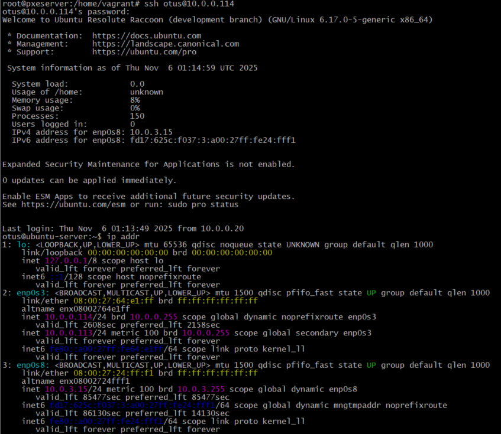

 # 29. DHCP, PXE 

 **Цель домашнего задания** <br>
Отработать навыки установки и настройки DHCP, TFTP, PXE загрузчика и автоматической загрузки


**Описание домашнего задания** <br>
1. Настроить загрузку по сети дистрибутива Ubuntu 24 <br>
2. Установка должна проходить из HTTP-репозитория. <br>
3. Настроить автоматическую установку c помощью файла user-data <br>
*4. Настроить автоматическую загрузку по сети дистрибутива Ubuntu 24 c использованием UEFI <br>
Задания со звёздочкой выполняются по желанию <br>
Формат сдачи ДЗ: vagrant + ansible

# Выполнение домашнего задания

## Создаю структуру
```bash
 mkdir -p /etc/l29/ansible &&  touch Vagrantfile &&  cd /etc/l29/ansible/ && touch provision.yml hosts
#предоставляю права
chmod 644 -R /etc/l29/
chmod 755 -R /etc/l29/ansible/

tree

├── ansible
│   ├── hosts
│   └── provision.yml
└── Vagrantfile
```

## Vagrantfile

```ruby
ENV['VAGRANT_SERVER_URL'] = 'https://vagrant.elab.pro'

Vagrant.configure("2") do |config|
  config.vm.define "pxeserver" do |server|
    server.vm.box = "bento/ubuntu-24.04"
    server.vm.host_name = 'pxeserver'
    server.vm.network "forwarded_port", guest: 80, host: 8080
    server.vm.network :private_network,
      ip: "10.0.0.20",
      virtualbox__intnet: 'pxenet'
    server.vm.network :private_network, ip: "192.168.50.10", adapter: 3

    server.vm.provider "virtualbox" do |vb|
      vb.memory = "1024"
      vb.customize ["modifyvm", :id, "--natdnshostresolver1", "on"]
    end

    server.vm.provision "ansible" do |ansible|
      ansible.playbook = "ansible/provision.yml"
      ansible.inventory_path = "ansible/hosts"
      ansible.host_key_checking = "false"
      ansible.limit = "all"
      ansible.verbose = "v"
    end
  end

  config.vm.define "pxeclient" do |pxeclient|
    pxeclient.vm.box = "bento/ubuntu-24.04"
    pxeclient.vm.host_name = 'pxeclient'
    pxeclient.vm.network :private_network, ip: "10.0.0.21"

    pxeclient.vm.provider :virtualbox do |vb|
      vb.memory = "4096"
      vb.customize ["modifyvm", :id, "--natdnshostresolver1", "on"]
      vb.customize [
        'modifyvm', :id,
        '--nic1', 'intnet',
        '--intnet1', 'pxenet',
        '--nic2', 'nat',
        '--boot1', 'net',
        '--boot2', 'none',
        '--boot3', 'none',
        '--boot4', 'none'
      ]
    end
  end
end
```

## Ansible плейбук (ansible/provision.yml)

```yaml
---
- name: Configure PXE Server
  hosts: pxeserver
  become: yes
  tasks:
    - name: Stop and disable ufw
      systemd:
        name: ufw
        state: stopped
        enabled: no

    - name: Update apt cache
      apt:
        update_cache: yes
        cache_valid_time: 3600

    - name: Install required packages
      apt:
        name:
          - dnsmasq
          - apache2
          - wget
          - curl
        state: present

    - name: Create dnsmasq PXE configuration
      copy:
        content: |
          interface=eth1
          bind-interfaces
          dhcp-range=10.0.0.100,10.0.0.120
          dhcp-boot=pxelinux.0
          dhcp-match=set:efi-x86_64,option:client-arch,7
          dhcp-boot=tag:efi-x86_64,bootx64.efi
          enable-tftp
          tftp-root=/srv/tftp/amd64
        dest: /etc/dnsmasq.d/pxe.conf

    - name: Create directories
      file:
        path: "{{ item }}"
        state: directory
        mode: '0755'
      loop:
        - /srv/tftp
        - /srv/images
        - /srv/ks

    - name: Set permissions for other TFTP files
      file:
        path: /srv/tftp/amd64/
        mode: '0644'
        recurse: yes

    - name: Download Ubuntu 24.04 netboot files with retry
      command: >
        wget --tries=3 --timeout=30
        http://cdimage.ubuntu.com/ubuntu-server/daily-live/current/resolute-netboot-amd64.tar.gz
        -O /tmp/resolute-netboot-amd64.tar.gz
      args:
        creates: /tmp/resolute-netboot-amd64.tar.gz
      register: download_netboot
      retries: 3
      delay: 10
      until: download_netboot is succeeded

    - name: Extract netboot files
      unarchive:
        src: /tmp/resolute-netboot-amd64.tar.gz
        dest: /srv/tftp
        remote_src: yes
        creates: /srv/tftp/amd64

    - name: Download Ubuntu 24.04 ISO with retry
      command: >
        wget --tries=3 --timeout=60
        http://cdimage.ubuntu.com/ubuntu-server/daily-live/current/resolute-live-server-amd64.iso
        -O /srv/images/resolute-live-server-amd64.iso
      args:
        creates: /srv/images/resolute-live-server-amd64.iso
      register: download_iso
      retries: 3
      delay: 10
      until: download_iso is succeeded

    - name: Configure Apache virtual host
      copy:
        content: |
          <VirtualHost 10.0.0.20:80>
            DocumentRoot /
            <Directory /srv/ks>
              Options Indexes MultiViews
              AllowOverride All
              Require all granted
            </Directory>
            <Directory /srv/images>
              Options Indexes MultiViews
              AllowOverride All
              Require all granted
            </Directory>
          </VirtualHost>
        dest: /etc/apache2/sites-available/ks-server.conf

    - name: Enable Apache site
      command: a2ensite ks-server.conf

    - name: Disable default Apache site
      command: a2dissite 000-default.conf

    - name: Configure PXELinux default
      copy:
        content: |
          DEFAULT install
          LABEL install
          KERNEL linux
          INITRD initrd
          APPEND root=/dev/ram0 ramdisk_size=3000000 ip=dhcp iso-url=http://10.0.0.20/srv/images/resolute-live-server-amd64.iso autoinstall ds=nocloud-net;s=http://10.0.0.20/srv/ks/
        dest: /srv/tftp/amd64/pxelinux.cfg/default

    - name: Create cloud-init user-data
      copy:
        content: |
          #cloud-config
          autoinstall:
            apt:
              disable_components: []
              geoip: true
              preserve_sources_list: false
              primary:
                - arches:
                    - amd64
                    - i386
                  uri: http://us.archive.ubuntu.com/ubuntu
                - arches:
                    - default
                  uri: http://ports.ubuntu.com/ubuntu-ports
            drivers:
              install: false
            identity:
              hostname: linux
              password: "123"
              realname: otus
              username: otus
            kernel:
              package: linux-generic
            keyboard:
              layout: us
              toggle: null
              variant: ''
            locale: en_US.UTF-8
            network:
              ethernets:
                enp0s3:
                  dhcp4: true
                enp0s8:
                  dhcp4: true
              version: 2
            ssh:
              allow-pw: true
              authorized-keys: []
            install-server: true
            updates: security
        dest: /srv/ks/user-data

    - name: Create empty meta-data file
      file:
        path: /srv/ks/meta-data
        state: touch

    - name: Restart services
      systemd:
        name: "{{ item }}"
        state: restarted
        enabled: yes
      loop:
        - dnsmasq
        - apache2

    - name: Clean up temporary files
      file:
        path: /tmp/resolute-netboot-amd64.tar.gz
        state: absent
```
Если необходимо, то `password: "123"` можем поменять на зашифрованный пароль:
```bash
# подключаюсь на сервер pxeserver
vagrant ssh pxeserver
# Создаю  зашифрованный пароль и копирую результат
openssl passwd -6 -salt saltsalt 123
$6$saltsalt$jhMcrtY3ukOcUwpbonLyr5vJ9oBNjkbXKIR3/xa7nj5WgSrFg0zeFHBBWFr4KD5qu3DU3CjM8G7fz3iT9v19P1
# Меняю в provision.yml password: "123" на:
password: $6$saltsalt$jhMcrtY3ukOcUwpbonLyr5vJ9oBNjkbXKIR3/xa7nj5WgSrFg0zeFHBBWFr4KD5qu3DU3CjM8G7fz3iT9v19P1
```

## Ansible inventory (ansible/hosts)

```ini
[pxeserver]
pxeserver ansible_host=192.168.50.10 ansible_user=vagrant ansible_ssh_private_key_file=.vagrant/machines/pxeserver/virtualbox/private_key

[pxeclient]
pxeclient ansible_host=10.0.0.21 ansible_user=vagrant ansible_ssh_private_key_file=.vagrant/machines/pxeclient/virtualbox/private_key
```

## Инструкция по запуску:

 Запускаю стенд:
```bash
vagrant up
#Дожидаюсь окончания установки и запускаю 
vagrant up pxeclient
#Мониторю статус на pxeserver
sudo tail -f /var/log/syslog | grep dnsmasq
# т.к. логи не появляются ,на VirtualBox перезагружаю VM pxeclient
#проверяю логи
sudo tail -f /var/log/syslog | grep dnsmasq
2025-11-06T00:04:29.312378+00:00 vagrant dnsmasq-dhcp[7756]: DHCPDISCOVER(eth1) 08:00:27:64:e1:ff
2025-11-06T00:04:29.321733+00:00 vagrant dnsmasq-dhcp[7756]: DHCPOFFER(eth1) 10.0.0.114 08:00:27:64:e1:ff
2025-11-06T00:04:30.354850+00:00 vagrant dnsmasq-dhcp[7756]: DHCPDISCOVER(eth1) 08:00:27:64:e1:ff
2025-11-06T00:04:30.355001+00:00 vagrant dnsmasq-dhcp[7756]: DHCPOFFER(eth1) 10.0.0.114 08:00:27:64:e1:ff
2025-11-06T00:04:32.386540+00:00 vagrant dnsmasq-dhcp[7756]: DHCPREQUEST(eth1) 10.0.0.114 08:00:27:64:e1:ff
2025-11-06T00:04:32.386722+00:00 vagrant dnsmasq-dhcp[7756]: DHCPACK(eth1) 10.0.0.114 08:00:27:64:e1:ff
2025-11-06T00:04:32.594918+00:00 vagrant dnsmasq-tftp[7756]: sent /srv/tftp/amd64/pxelinux.0 to 10.0.0.114
2025-11-06T00:04:32.652642+00:00 vagrant dnsmasq-tftp[7756]: sent /srv/tftp/amd64/ldlinux.c32 to 10.0.0.114
2025-11-06T00:04:32.656281+00:00 vagrant dnsmasq-tftp[7756]: file /srv/tftp/amd64/pxelinux.cfg/20ad6e4d-8998-473a-b81b-69d108073ed1 not found for 10.0.0.114
2025-11-06T00:04:32.656593+00:00 vagrant dnsmasq-tftp[7756]: file /srv/tftp/amd64/pxelinux.cfg/01-08-00-27-64-e1-ff not found for 10.0.0.114
2025-11-06T00:04:32.656981+00:00 vagrant dnsmasq-tftp[7756]: file /srv/tftp/amd64/pxelinux.cfg/0A000071 not found for 10.0.0.114
2025-11-06T00:04:32.657060+00:00 vagrant dnsmasq-tftp[7756]: file /srv/tftp/amd64/pxelinux.cfg/0A00007 not found for 10.0.0.114
2025-11-06T00:04:32.657741+00:00 vagrant dnsmasq-tftp[7756]: file /srv/tftp/amd64/pxelinux.cfg/0A0000 not found for 10.0.0.114
2025-11-06T00:04:32.657849+00:00 vagrant dnsmasq-tftp[7756]: file /srv/tftp/amd64/pxelinux.cfg/0A000 not found for 10.0.0.114
2025-11-06T00:04:32.658028+00:00 vagrant dnsmasq-tftp[7756]: file /srv/tftp/amd64/pxelinux.cfg/0A00 not found for 10.0.0.114
2025-11-06T00:04:32.658309+00:00 vagrant dnsmasq-tftp[7756]: file /srv/tftp/amd64/pxelinux.cfg/0A0 not found for 10.0.0.114
2025-11-06T00:04:32.658678+00:00 vagrant dnsmasq-tftp[7756]: file /srv/tftp/amd64/pxelinux.cfg/0A not found for 10.0.0.114
2025-11-06T00:04:32.659178+00:00 vagrant dnsmasq-tftp[7756]: file /srv/tftp/amd64/pxelinux.cfg/0 not found for 10.0.0.114
2025-11-06T00:04:32.659683+00:00 vagrant dnsmasq-tftp[7756]: sent /srv/tftp/amd64/pxelinux.cfg/default to 10.0.0.114
2025-11-06T00:04:36.510439+00:00 vagrant dnsmasq-tftp[7756]: sent /srv/tftp/amd64/linux to 10.0.0.114
2025-11-06T00:04:53.633554+00:00 vagrant dnsmasq-tftp[7756]: sent /srv/tftp/amd64/initrd to 10.0.0.114
2025-11-06T00:05:05.416237+00:00 vagrant dnsmasq-dhcp[7756]: DHCPDISCOVER(eth1) 08:00:27:64:e1:ff
2025-11-06T00:05:05.417231+00:00 vagrant dnsmasq-dhcp[7756]: DHCPOFFER(eth1) 10.0.0.114 08:00:27:64:e1:ff
2025-11-06T00:05:05.420880+00:00 vagrant dnsmasq-dhcp[7756]: DHCPREQUEST(eth1) 10.0.0.114 08:00:27:64:e1:ff
2025-11-06T00:05:05.421148+00:00 vagrant dnsmasq-dhcp[7756]: DHCPACK(eth1) 10.0.0.114 08:00:27:64:e1:ff
2025-11-06T00:05:52.967196+00:00 vagrant dnsmasq-dhcp[7756]: DHCPREQUEST(eth1) 10.0.0.114 08:00:27:64:e1:ff
2025-11-06T00:05:52.982388+00:00 vagrant dnsmasq-dhcp[7756]: DHCPNAK(eth1) 10.0.0.114 08:00:27:64:e1:ff wrong address
2025-11-06T00:05:52.982830+00:00 vagrant dnsmasq-dhcp[7756]: DHCPDISCOVER(eth1) 10.0.0.114 08:00:27:64:e1:ff
2025-11-06T00:05:52.982895+00:00 vagrant dnsmasq-dhcp[7756]: DHCPOFFER(eth1) 10.0.0.114 08:00:27:64:e1:ff
2025-11-06T00:05:52.983953+00:00 vagrant dnsmasq-dhcp[7756]: DHCPREQUEST(eth1) 10.0.0.114 08:00:27:64:e1:ff
2025-11-06T00:05:52.984023+00:00 vagrant dnsmasq-dhcp[7756]: DHCPACK(eth1) 10.0.0.114 08:00:27:64:e1:ff ubuntu-server
2025-11-06T00:06:15.081745+00:00 vagrant dnsmasq-dhcp[7756]: DHCPREQUEST(eth1) 10.0.0.114 08:00:27:64:e1:ff
2025-11-06T00:06:15.081903+00:00 vagrant dnsmasq-dhcp[7756]: DHCPACK(eth1) 10.0.0.114 08:00:27:64:e1:ff ubuntu-server
```

После того как pxeclient завершит установку:
1. Выключим VM pxeclient <br>
2. В настройках VirtualBox: System → Boot Order → поставить "Hard Disk" первым <br>
3. Запустим VM и подключимся: <br>
```bash
ssh otus@10.0.0.114
#**Пароль**: `123`
```


## Особенности реализации:

1. **Использование правильного box**: `ubuntu/24.04` как требуется
2. **Первая строка Vagrantfile**: Установка сервера Vagrant для РФ
3. **Автоматизация через Ansible**: Все шаги ручной настройки перенесены в Ansible плейбук
4. **Настройка сетей**: Сохранена оригинальная схема сетей
5. **PXE загрузка**: Клиент настроен на загрузку по сети
6. **Автоматическая установка**: Настроена через cloud-init config

Примечание: Vagrant up для pxeclient завершится с ошибкой из-за таймаута PXE загрузки - это ожидаемое поведение. После установки нужно вручную изменить настройки VM в VirtualBox для загрузки с диска.
