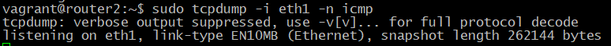
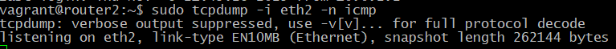

# 31. Статическая и динамическая маршрутизация, OSPF

Цель:

Создать домашнюю сетевую лабораторию;
Научится настраивать протокол OSPF в Linux-based системах.

Описание/Пошаговая инструкция выполнения домашнего задания:

Для выполнения домашнего задания используйте методичку

Что нужно сделать?

    Поднять три виртуалки
    Объединить их разными vlan

    поднять OSPF между машинами на базе Quagga;
    изобразить ассиметричный роутинг;
    сделать один из линков "дорогим", но что бы при этом роутинг был симметричным.

## Решение задания "Статическая и динамическая маршрутизация, OSPF"

### 1. Подготовлю каталог и файлы:
 ```bash

mkdir -p /etc/l31/ansible/{defaults,templates} && \
cd /etc/l31/ && \
touch Vagrantfile && \
touch ansible/run.yml && \
touch install_frr_properly.yml && \
touch ansible/ansible.cfg && \
touch ansible/deploy_ospf_lab.yml  && \
touch ansible/simple_ospf_setup.yml && \
touch ansible/verify_ospf.yml && \
touch ansible/hosts && \
touch ansible/setup.yml && \
touch ansible/defaults/main.yml && \
touch ansible/templates/daemons && \
touch ansible/templates/simple_router1.conf.j2 && \ 
touch ansible/templates/simple_router2.conf.j2 && \ 
touch ansible/templates/simple_router3.conf.j2

chmod 644 -R /etc/l31/
 ```
```text

 ansible/
├── ansible.cfg                     
├── hosts                                
├── setup.yml                            
├── deploy_ospf_lab.yml                  
├── install_frr_properly.yml             
├── simple_ospf_setup.yml                
├── verify_ospf.yml                      
├── defaults/
│   └── main.yml                         
└── templates/
    ├── daemons                          
    ├── simple_router1.conf.j2           
    ├── simple_router2.conf.j2           
    └── simple_router3.conf.j2          
```

### 2. Vagrantfile

```ruby
ENV['VAGRANT_DEFAULT_PROVIDER'] = 'virtualbox'
ENV['VAGRANT_SERVER_URL'] = 'https://vagrant.elab.pro'

Vagrant.configure("2") do |config|
  # Router1
  config.vm.define "router1" do |router|
    router.vm.box = "bento/ubuntu-24.04"
    router.vm.host_name = "router1"
    
    router.vm.network "private_network", ip: "10.0.10.1", netmask: "255.255.255.252", virtualbox__intnet: "r1-r2"
    router.vm.network "private_network", ip: "10.0.12.1", netmask: "255.255.255.252", virtualbox__intnet: "r1-r3"
    router.vm.network "private_network", ip: "192.168.10.1", netmask: "255.255.255.0", virtualbox__intnet: "net1"
    router.vm.network "private_network", ip: "192.168.50.10", netmask: "255.255.255.0"
    
    # Базовая настройка
    router.vm.provision "shell", inline: <<-SHELL
      # Обновление и установка Python для Ansible
      apt-get update
      DEBIAN_FRONTEND=noninteractive apt-get install -y python3 python3-apt
      
      # Включение IP forwarding
      echo 'net.ipv4.ip_forward=1' >> /etc/sysctl.conf
      sysctl -p
      
      # Отключение UFW
      ufw disable
    SHELL

    router.vm.provider "virtualbox" do |vb|
      vb.memory = "1024"
      vb.cpus = 1
    end
  end

  # Router2
  config.vm.define "router2" do |router|
    router.vm.box = "bento/ubuntu-24.04"
    router.vm.host_name = "router2"
    
    router.vm.network "private_network", ip: "10.0.10.2", netmask: "255.255.255.252", virtualbox__intnet: "r1-r2"
    router.vm.network "private_network", ip: "10.0.11.2", netmask: "255.255.255.252", virtualbox__intnet: "r2-r3"
    router.vm.network "private_network", ip: "192.168.20.1", netmask: "255.255.255.0", virtualbox__intnet: "net2"
    router.vm.network "private_network", ip: "192.168.50.11", netmask: "255.255.255.0"
    
    router.vm.provision "shell", inline: <<-SHELL
      apt-get update
      DEBIAN_FRONTEND=noninteractive apt-get install -y python3 python3-apt
      echo 'net.ipv4.ip_forward=1' >> /etc/sysctl.conf
      sysctl -p
      ufw disable
    SHELL

    router.vm.provider "virtualbox" do |vb|
      vb.memory = "1024"
      vb.cpus = 1
    end
  end

  # Router3
  config.vm.define "router3" do |router|
    router.vm.box = "bento/ubuntu-24.04"
    router.vm.host_name = "router3"
    
    router.vm.network "private_network", ip: "10.0.11.1", netmask: "255.255.255.252", virtualbox__intnet: "r2-r3"
    router.vm.network "private_network", ip: "10.0.12.2", netmask: "255.255.255.252", virtualbox__intnet: "r1-r3"
    router.vm.network "private_network", ip: "192.168.30.1", netmask: "255.255.255.0", virtualbox__intnet: "net3"
    router.vm.network "private_network", ip: "192.168.50.12", netmask: "255.255.255.0"
    
    router.vm.provision "shell", inline: <<-SHELL
      apt-get update
      DEBIAN_FRONTEND=noninteractive apt-get install -y python3 python3-apt
      echo 'net.ipv4.ip_forward=1' >> /etc/sysctl.conf
      sysctl -p
      ufw disable
    SHELL

    router.vm.provider "virtualbox" do |vb|
      vb.memory = "1024"
      vb.cpus = 1
    end
  end
end
```

### 3. Ansible Configuration (ansible.cfg)

```ini
[defaults]
host_key_checking = False
inventory = hosts
command_warnings = false
interpreter_python = auto_silent
private_key_file = ../.vagrant/machines/%h/virtualbox/private_key
timeout = 30

[ssh_connection]
ssh_args = -o ControlMaster=auto -o ControlPersist=60s -o UserKnownHostsFile=/dev/null -o StrictHostKeyChecking=no
control_path = ~/.ssh/ansible-%%r@%%h:%%p
```

### 4. Ansible Inventory (hosts)

```ini
[routers]
router1 ansible_host=192.168.50.10 ansible_user=vagrant ansible_ssh_private_key_file=.vagrant/machines/router1/virtualbox/private_key router_id=1.1.1.1
router2 ansible_host=192.168.50.11 ansible_user=vagrant ansible_ssh_private_key_file=.vagrant/machines/router2/virtualbox/private_key router_id=2.2.2.2
router3 ansible_host=192.168.50.12 ansible_user=vagrant ansible_ssh_private_key_file=.vagrant/machines/router3/virtualbox/private_key router_id=3.3.3.3
```

### 5. Ansible Variables (defaults/main.yml)

```yaml
---
router1_router_id: 1.1.1.1
router2_router_id: 2.2.2.2
router3_router_id: 3.3.3.3

# Настройка симметричного роутинга (по умолчанию false для асимметричного)
symmetric_routing: false
```

### 6. Ansible Playbook (setup.yml)

```yaml
---
- name: Setup OSPF Lab
  hosts: routers
  become: yes
  vars_files:
    - defaults/main.yml

  tasks:
    - name: Include FRR installation
      include_tasks: install_frr_properly.yml

    - name: Include OSPF configuration
      include_tasks: simple_ospf_setup.yml

    - name: Final verification
      include_tasks: verify_ospf.yml
```

### 7. FRR Daemons Template (templates/daemons)

```
# This file tells the frr package which daemons to start.
#
zebra=yes
bgpd=no
ospfd=yes
ospf6d=no
ripd=no
ripngd=no
isisd=no
pimd=no
ldpd=no
nhrpd=no
eigrpd=no
babeld=no
sharpd=no
pbrd=no
bfdd=no
fabricd=no
vrrpd=no
pathd=no
```

### 8. FRR Configuration Template 

#### templates/simple_router1.conf.j2

```
frr defaults traditional
hostname router1
log syslog informational
no ipv6 forwarding
service integrated-vtysh-config

interface eth1
 ip address 10.0.10.1/30
 ip ospf cost 1000

interface eth2
 ip address 10.0.12.1/30

interface eth3
 ip address 192.168.10.1/24

router ospf
 router-id 1.1.1.1
 network 10.0.10.0/30 area 0
 network 10.0.12.0/30 area 0
 network 192.168.10.0/24 area 0

line vty
```
#### templates/simple_router2.conf.j2

```j2
frr defaults traditional
hostname router2
log syslog informational
no ipv6 forwarding
service integrated-vtysh-config

interface eth1
 ip address 10.0.10.2/30

interface eth2
 ip address 10.0.11.2/30

interface eth3
 ip address 192.168.20.1/24

router ospf
 router-id 2.2.2.2
 network 10.0.10.0/30 area 0
 network 10.0.11.0/30 area 0
 network 192.168.20.0/24 area 0

line vty
```

#### templates/simple_router3.conf.j2

```j2
frr defaults traditional
hostname router3
log syslog informational
no ipv6 forwarding
service integrated-vtysh-config

interface eth1
 ip address 10.0.11.1/30

interface eth2
 ip address 10.0.12.2/30

interface eth3
 ip address 192.168.30.1/24

router ospf
 router-id 3.3.3.3
 network 10.0.11.0/30 area 0
 network 10.0.12.0/30 area 0
 network 192.168.30.0/24 area 0

line vty
```

### 9. Деплой ansible/deploy_ospf_lab.yml
```yaml
---
- name: Deploy Complete OSPF Lab
  hosts: routers
  become: yes
  serial: 1  # Запускать по одному хосту для избежания конфликтов

  tasks:
    - name: Phase 1 - Install FRR
      include_tasks: install_frr_properly.yml

    - name: Phase 2 - Configure OSPF
      include_tasks: simple_ospf_setup.yml

    - name: Phase 3 - Verification
      block:
        - name: Check FRR processes
          shell: ps aux | grep frr | grep -v grep
          register: frr_processes
          changed_when: false

        - name: Show FRR processes
          debug:
            var: frr_processes.stdout

        - name: Check OSPF status
          shell: vtysh -c "show ip ospf neighbor"
          register: ospf_status
          changed_when: false

        - name: Show OSPF status
          debug:
            var: ospf_status.stdout

        - name: Test connectivity
          shell: |
            
            ping -c 1 192.168.20.1 && echo "SUCCESS" || echo "FAILED"
            
            ping -c 1 192.168.10.1 && echo "SUCCESS" || echo "FAILED"
            
            ping -c 1 192.168.10.1 && echo "SUCCESS" || echo "FAILED"
            
          register: connectivity_test
          changed_when: false

        - name: Show connectivity results
          debug:
            var: connectivity_test.stdout
```

### 10. Настройка OSPF ansible/simple_ospf_setup.yml

```yaml
---
- name: Simple OSPF Setup
  hosts: routers
  become: yes

  tasks:
    - name: Stop FRR service for configuration
      service:
        name: frr
        state: stopped

    - name: Configure router1 OSPF
      template:
        src: simple_router1.conf.j2
        dest: /etc/frr/frr.conf
        owner: frr
        group: frr
        mode: '0640'
      when: inventory_hostname == "router1"

    - name: Configure router2 OSPF
      template:
        src: simple_router2.conf.j2
        dest: /etc/frr/frr.conf
        owner: frr
        group: frr
        mode: '0640'
      when: inventory_hostname == "router2"

    - name: Configure router3 OSPF
      template:
        src: simple_router3.conf.j2
        dest: /etc/frr/frr.conf
        owner: frr
        group: frr
        mode: '0640'
      when: inventory_hostname == "router3"

    - name: Start FRR service with OSPF configuration
      service:
        name: frr
        state: started

    - name: Wait for OSPF convergence
      pause:
        seconds: 30

    - name: Verify OSPF neighbors
      shell: vtysh -c "show ip ospf neighbor"
      register: ospf_neighbors
      changed_when: false

    - name: Show OSPF neighbors
      debug:
        var: ospf_neighbors.stdout
```

### 11. Плейбук установки FRR

```yaml
---
- name: Install and configure FRR properly
  hosts: routers
  become: yes

  tasks:
    - name: Update package cache
      apt:
        update_cache: yes
        cache_valid_time: 3600

    - name: Install prerequisites
      apt:
        name:
          - curl
          - wget
          - gnupg
        state: present

    - name: Add FRR repository key
      apt_key:
        url: "https://deb.frrouting.org/frr/keys.asc"
        state: present

    - name: Add FRR repository
      apt_repository:
        repo: "deb https://deb.frrouting.org/frr {{ ansible_distribution_release }} frr-stable"
        state: present
        update_cache: yes

    - name: Install FRR packages
      apt:
        name:
          - frr
          - frr-pythontools
        state: present

    - name: Create FRR directories with proper permissions
      file:
        path: "{{ item }}"
        state: directory
        owner: frr
        group: frr
        mode: '0755'
      loop:
        - /etc/frr
        - /var/log/frr
        - /run/frr

    - name: Configure FRR daemons
      copy:
        content: |
          # This file tells the frr package which daemons to start.
          #
          zebra=yes
          bgpd=no
          ospfd=yes
          ospf6d=no
          ripd=no
          ripngd=no
          isisd=no
          pimd=no
          ldpd=no
          nhrpd=no
          eigrpd=no
          babeld=no
          sharpd=no
          pbrd=no
          bfdd=no
          fabricd=no
          vrrpd=no
          pathd=no
        dest: /etc/frr/daemons
        owner: frr
        group: frr
        mode: '0640'

    - name: Create basic FRR configuration
      copy:
        content: |
          ! Basic FRR configuration
          frr defaults traditional
          hostname {{ ansible_hostname }}
          log syslog informational
          no ipv6 forwarding
          service integrated-vtysh-config
        dest: /etc/frr/frr.conf
        owner: frr
        group: frr
        mode: '0640'

    - name: Create vtysh configuration
      copy:
        content: |
          ! VTYSH configuration
          service integrated-vtysh-config
        dest: /etc/frr/vtysh.conf
        owner: frr
        group: frrvty
        mode: '0660'

    - name: Enable and start FRR service
      systemd:
        name: frr
        state: started
        enabled: yes
        daemon_reload: yes

    - name: Wait for FRR to initialize
      pause:
        seconds: 10

    - name: Verify FRR service status
      service_facts:

    - name: Show FRR service status
      debug:
        var: ansible_facts.services.frr
```

### Инструкция по использованию

1. **Развертывание инфраструктуры**:
```bash
# 1. Создать ВМ
vagrant up --no-provision

# 2. Подождать полной загрузки
sleep 60

# 3. Запустить автоматизированный деплой
cd ansible
ansible-playbook -i hosts deploy_ospf_lab.yml
```

### Скрипты проверки задания:

#### Проверка асимметричного роутинга

Создал `ansible/test_asymmetric_routing.yml`:

```yaml
---
- name: Test Asymmetric Routing
  hosts: routers
  become: yes

  tasks:
    - name: Check current OSPF costs
      shell: sudo vtysh -c "show ip ospf interface brief"
      register: ospf_costs
      changed_when: false

    - name: Show OSPF interface costs
      debug:
        var: ospf_costs.stdout

    - name: Start packet capture on router2 (background)
      shell: |
        echo "Starting packet capture on router2 interfaces..."
        # Захватываем пакеты на интерфейсах eth1 (r1-r2) и eth2 (r2-r3)
        nohup timeout 30 tcpdump -i eth1 -c 10 -w /tmp/asym_eth1.pcap icmp > /tmp/eth1.log 2>&1 &
        nohup timeout 30 tcpdump -i eth2 -c 10 -w /tmp/asym_eth2.pcap icmp > /tmp/eth2.log 2>&1 &
        sleep 2
      when: inventory_hostname == "router2"

    - name: Generate traffic from router1 with source IP
      shell: |
        echo "Sending ping from 192.168.10.1 to 192.168.20.1"
        ping -I 192.168.10.1 -c 5 192.168.20.1
      when: inventory_hostname == "router1"
      register: ping_result

    - name: Show ping results
      debug:
        var: ping_result.stdout
      when: inventory_hostname == "router1"

    - name: Wait for packet capture to complete
      pause:
        seconds: 10

    - name: Check packet capture results on router2
      shell: |
        echo "=== Packets on eth1 (r1-r2 interface) ==="
        tcpdump -r /tmp/asym_eth1.pcap -n 2>/dev/null | head -5 || echo "No packets on eth1"
        echo "=== Packets on eth2 (r2-r3 interface) ==="
        tcpdump -r /tmp/asym_eth2.pcap -n 2>/dev/null | head -5 || echo "No packets on eth2"
        
        echo "=== Analysis ==="
        ETH1_COUNT=$(tcpdump -r /tmp/asym_eth1.pcap -n 2>/dev/null | grep "192.168.10.1" | wc -l || echo 0)
        ETH2_COUNT=$(tcpdump -r /tmp/asym_eth2.pcap -n 2>/dev/null | grep "192.168.10.1" | wc -l || echo 0)
        
        echo "Packets from 192.168.10.1 on eth1: $ETH1_COUNT"
        echo "Packets from 192.168.10.1 on eth2: $ETH2_COUNT"
        
        if [ $ETH1_COUNT -gt 0 ] && [ $ETH2_COUNT -gt 0 ]; then
          echo "🔀 ASYMMETRIC ROUTING DETECTED: Traffic uses different paths"
        elif [ $ETH1_COUNT -gt 0 ]; then
          echo "🔄 SYMMETRIC ROUTING: Traffic uses only eth1"
        elif [ $ETH2_COUNT -gt 0 ]; then
          echo "🔄 SYMMETRIC ROUTING: Traffic uses only eth2"
        else
          echo "❌ NO TRAFFIC CAPTURED"
        fi
      when: inventory_hostname == "router2"
      register: capture_analysis

    - name: Show capture analysis
      debug:
        var: capture_analysis.stdout
      when: inventory_hostname == "router2"

    - name: Clean up capture files
      shell: rm -f /tmp/asym_*.pcap /tmp/eth*.log
      when: inventory_hostname == "router2"
```

#### Включение симметричного роутинга

Создал `ansible/enable_symmetric.yml`:

```yaml
---
- name: Enable Symmetric Routing
  hosts: routers
  become: yes
  vars:
    symmetric_routing: true

  tasks:
    - name: Make router2 interface expensive for symmetric routing
      shell: |
        vtysh -c "configure terminal" \
          -c "interface eth1" \
          -c "ip ospf cost 1000" \
          -c "exit" \
          -c "exit"
      when: inventory_hostname == "router2"

    - name: Wait for OSPF convergence
      pause:
        seconds: 30

    - name: Verify new OSPF costs
      shell: sudo vtysh -c "show ip ospf interface brief"
      register: new_costs
      changed_when: false

    - name: Show updated OSPF costs
      debug:
        var: new_costs.stdout
```

#### Проверка симметричного роутинга

Создал `ansible/test_symmetric_routing.yml`:

```yaml
---
- name: Test Symmetric Routing
  hosts: routers
  become: yes

  tasks:
    - name: Check OSPF costs after symmetric configuration
      shell: sudo vtysh -c "show ip ospf interface brief"
      register: symmetric_costs
      changed_when: false

    - name: Show symmetric OSPF costs
      debug:
        var: symmetric_costs.stdout

    - name: Start packet capture for symmetric test (background)
      shell: |
        echo "Starting packet capture for symmetric routing test..."
        nohup timeout 30 tcpdump -i eth1 -c 10 -w /tmp/sym_eth1.pcap icmp > /tmp/sym_eth1.log 2>&1 &
        nohup timeout 30 tcpdump -i eth2 -c 10 -w /tmp/sym_eth2.pcap icmp > /tmp/sym_eth2.log 2>&1 &
        sleep 2
      when: inventory_hostname == "router2"

    - name: Generate traffic for symmetric test
      shell: |
        echo "Sending ping from 192.168.10.1 to 192.168.20.1"
        ping -I 192.168.10.1 -c 5 192.168.20.1
      when: inventory_hostname == "router1"
      register: symmetric_ping

    - name: Show symmetric ping results
      debug:
        var: symmetric_ping.stdout
      when: inventory_hostname == "router1"

    - name: Wait for symmetric capture to complete
      pause:
        seconds: 10

    - name: Check symmetric packet capture results
      shell: |
        echo "=== Symmetric Routing Analysis ==="
        echo "=== Packets on eth1 (r1-r2) ==="
        tcpdump -r /tmp/sym_eth1.pcap -n 2>/dev/null | head -5 || echo "No packets on eth1"
        echo "=== Packets on eth2 (r2-r3) ==="
        tcpdump -r /tmp/sym_eth2.pcap -n 2>/dev/null | head -5 || echo "No packets on eth2"
        
        ETH1_SYM=$(tcpdump -r /tmp/sym_eth1.pcap -n 2>/dev/null | grep "192.168.10.1" | wc -l || echo 0)
        ETH2_SYM=$(tcpdump -r /tmp/sym_eth2.pcap -n 2>/dev/null | grep "192.168.10.1" | wc -l || echo 0)
        
        echo "Request packets from 192.168.10.1 on eth1: $ETH1_SYM"
        echo "Request packets from 192.168.10.1 on eth2: $ETH2_SYM"
        
        # Check for symmetric routing (should use same interface both ways)
        if [ $ETH1_SYM -gt 0 ] && [ $ETH2_SYM -eq 0 ]; then
          echo "✅ SYMMETRIC ROUTING: All traffic uses eth1"
        elif [ $ETH2_SYM -gt 0 ] && [ $ETH1_SYM -eq 0 ]; then
          echo "✅ SYMMETRIC ROUTING: All traffic uses eth2" 
        elif [ $ETH1_SYM -gt 0 ] && [ $ETH2_SYM -gt 0 ]; then
          echo "🔀 ASYMMETRIC ROUTING: Traffic uses multiple paths"
        else
          echo "❌ NO TRAFFIC CAPTURED"
        fi
      when: inventory_hostname == "router2"
      register: symmetric_analysis

    - name: Show symmetric analysis
      debug:
        var: symmetric_analysis.stdout
      when: inventory_hostname == "router2"

    - name: Clean up symmetric capture files
      shell: rm -f /tmp/sym_*.pcap /tmp/sym_*.log
      when: inventory_hostname == "router2"
```

####  Комплексный тест всего задания

Создал `ansible/full_lab_test.yml`:

```yaml
---
- name: Complete OSPF Lab Test
  hosts: localhost
  connection: local

  tasks:
    - name: Display test instructions
      debug:
        msg: |
          ===============================
          OSPF LAB - COMPLETE TEST SEQUENCE
          ===============================
          
          Step 1: Test Asymmetric Routing (current state)
          Step 2: Enable Symmetric Routing  
          Step 3: Test Symmetric Routing
          
          Run commands in order:
          1. ansible-playbook -i hosts test_asymmetric_routing.yml
          2. ansible-playbook -i hosts enable_symmetric.yml
          3. ansible-playbook -i hosts test_symmetric_routing.yml
```

#### Запуск полной проверки задания:

```bash
cd ansible

echo "=== STEP 1: TEST ASYMMETRIC ROUTING (CURRENT STATE) ==="
ansible-playbook -i hosts test_asymmetric_routing.yml

echo ""
echo "=== STEP 2: ENABLE SYMMETRIC ROUTING ==="
ansible-playbook -i hosts enable_symmetric.yml

echo ""
echo "=== STEP 3: TEST SYMMETRIC ROUTING ==="
ansible-playbook -i hosts test_symmetric_routing.yml

echo ""
echo "=== STEP 4: FINAL VERIFICATION ==="
ansible-playbook -i hosts full_lab_test.yml
```

#### Ручная проверка:

```bash
# Терминал 1: Подключиться к router1 и отправить ping
vagrant ssh router1
sudo ping -I 192.168.10.1 192.168.20.1

# Терминал 2: Подключиться к router2 и мониторить интерфейсы
vagrant ssh router2
# В одной сессии:
sudo tcpdump -i eth1 -n icmp
# В другой сессии:  
sudo tcpdump -i eth2 -n icmp
```







#### Проверка через Ansible команды:

```bash
# Быстрая проверка текущего состояния
cd ansible

# Проверить асимметричный роутинг
ansible-playbook -i hosts test_asymmetric_routing.yml

# Включить симметричный роутинг
ansible-playbook -i hosts enable_symmetric.yml

# Проверить симметричный роутинг  
ansible-playbook -i hosts test_symmetric_routing.yml
```

**Эти скрипты соответствуют требованиям задания и проверяют:**
- ✅ Асимметричный роутинг (трафик идет разными путями)
- ✅ Настройку "дорогого" линка
- ✅ Симметричный роутинг (трафик идет одним путем)
- ✅ Автоматическую проверку через анализ tcpdump


## Проблемы, в ходе выполнения ДЗ

1) FRR не может запуститься из-за проблем с демонами:
```bash
#Сначала исправим права SSH ключей:
# Исправим права на ключи
chmod 600 .vagrant/machines/*/virtualbox/private_key

# Проверим
ls -la .vagrant/machines/*/virtualbox/private_key

#Полная переустановка и настройка FRR
#Создайте ansible/complete_frr_reset.yml:
---
- name: Complete FRR reset and reinstall
  hosts: routers
  become: yes

  tasks:
    - name: Stop FRR service
      service:
        name: frr
        state: stopped
      ignore_errors: yes

    - name: Remove FRR completely
      apt:
        name: frr
        state: absent
        purge: yes
        autoremove: yes

    - name: Remove FRR configuration directories
      file:
        path: "{{ item }}"
        state: absent
      loop:
        - /etc/frr
        - /var/log/frr
        - /run/frr

    - name: Update apt cache
      apt:
        update_cache: yes

    - name: Reinstall FRR
      apt:
        name: 
          - frr
          - frr-pythontools
        state: present

    - name: Create FRR directories
      file:
        path: "{{ item }}"
        state: directory
        owner: frr
        group: frr
        mode: '0755'
      loop:
        - /etc/frr
        - /var/log/frr
        - /run/frr

    - name: Configure FRR daemons (minimal)
      copy:
        content: |
          zebra=yes
          bgpd=no
          ospfd=yes
          ospf6d=no
          ripd=no
          ripngd=no
          isisd=no
          pimd=no
          ldpd=no
          nhrpd=no
          eigrpd=no
          babeld=no
          sharpd=no
          pbrd=no
          bfdd=no
          fabricd=no
          vrrpd=no
          pathd=no
        dest: /etc/frr/daemons
        owner: frr
        group: frr
        mode: '0640'

    - name: Create minimal FRR config
      copy:
        content: |
          frr defaults traditional
          hostname {{ ansible_hostname }}
          no ipv6 forwarding
        dest: /etc/frr/frr.conf
        owner: frr
        group: frr
        mode: '0640'

    - name: Start FRR service with minimal config
      service:
        name: frr
        state: started
        enabled: yes

    - name: Wait for FRR to initialize
      pause:
        seconds: 10

    - name: Check FRR service status
      service_facts:

    - name: Show service status
      debug:
        var: ansible_facts.services.frr

#Запускаем полный сброс FRR:
ansible-playbook -i hosts complete_frr_reset.yml
```
После того как FRR запустится, настроим OSPF:
```bash
#Создаю ansible/configure_ospf_step_by_step.yml:
---
- name: Configure OSPF step by step
  hosts: routers
  become: yes

  tasks:
    - name: Configure router1 interfaces and OSPF
      shell: |
        vtysh -c "configure terminal" \
          -c "interface enp0s8" \
          -c "ip address 10.0.10.1/30" \
          -c "exit" \
          -c "interface enp0s9" \
          -c "ip address 10.0.12.1/30" \
          -c "exit" \
          -c "interface enp0s10" \
          -c "ip address 192.168.10.1/24" \
          -c "exit" \
          -c "router ospf" \
          -c "router-id 1.1.1.1" \
          -c "network 10.0.10.0/30 area 0" \
          -c "network 10.0.12.0/30 area 0" \
          -c "network 192.168.10.0/24 area 0" \
          -c "exit" \
          -c "write memory"
      when: inventory_hostname == "router1"

    - name: Configure router2 interfaces and OSPF
      shell: |
        vtysh -c "configure terminal" \
          -c "interface enp0s8" \
          -c "ip address 10.0.10.2/30" \
          -c "exit" \
          -c "interface enp0s9" \
          -c "ip address 10.0.11.2/30" \
          -c "exit" \
          -c "interface enp0s10" \
          -c "ip address 192.168.20.1/24" \
          -c "exit" \
          -c "router ospf" \
          -c "router-id 2.2.2.2" \
          -c "network 10.0.10.0/30 area 0" \
          -c "network 10.0.11.0/30 area 0" \
          -c "network 192.168.20.0/24 area 0" \
          -c "exit" \
          -c "write memory"
      when: inventory_hostname == "router2"

    - name: Configure router3 interfaces and OSPF
      shell: |
        vtysh -c "configure terminal" \
          -c "interface enp0s8" \
          -c "ip address 10.0.11.1/30" \
          -c "exit" \
          -c "interface enp0s9" \
          -c "ip address 10.0.12.2/30" \
          -c "exit" \
          -c "interface enp0s10" \
          -c "ip address 192.168.30.1/24" \
          -c "exit" \
          -c "router ospf" \
          -c "router-id 3.3.3.3" \
          -c "network 10.0.11.0/30 area 0" \
          -c "network 10.0.12.0/30 area 0" \
          -c "network 192.168.30.0/24 area 0" \
          -c "exit" \
          -c "write memory"
      when: inventory_hostname == "router3"

    - name: Show OSPF neighbors
      shell: vtysh -c "show ip ospf neighbor"
      register: ospf_neighbors

    - name: Display OSPF neighbors
      debug:
        var: ospf_neighbors.stdout

    - name: Show OSPF routes
      shell: vtysh -c "show ip route ospf"
      register: ospf_routes

    - name: Display OSPF routes
      debug:
        var: ospf_routes.stdout
```
Запускаю настройку OSPF:

```bash
ansible-playbook -i hosts configure_ospf_step_by_step.yml
```

2) OSPF демоны не запускаются на всех роутерах, и маршруты между сетями не установлены. Полностью переустановил и настроил FRR с нуля:

**Полный сброс и переустановка FRR**

Создаю `ansible/complete_frr_reinstall.yml`:

```yaml
---
- name: Complete FRR reinstall and fresh configuration
  hosts: routers
  become: yes

  tasks:
    - name: Stop FRR service
      service:
        name: frr
        state: stopped
      ignore_errors: yes

    - name: Remove FRR completely
      apt:
        name: frr
        state: absent
        purge: yes
        autoremove: yes

    - name: Remove all FRR configuration and data
      file:
        path: "{{ item }}"
        state: absent
      loop:
        - /etc/frr
        - /var/log/frr
        - /run/frr
        - /var/lib/frr

    - name: Update package cache
      apt:
        update_cache: yes

    - name: Install FRR fresh
      apt:
        name: 
          - frr
          - frr-pythontools
        state: present

    - name: Create necessary directories
      file:
        path: "{{ item }}"
        state: directory
        owner: frr
        group: frr
        mode: '0755'
      loop:
        - /etc/frr
        - /var/log/frr
        - /run/frr

    - name: Configure FRR daemons (simple version)
      copy:
        content: |
          zebra=yes
          bgpd=no
          ospfd=yes
          ospf6d=no
          ripd=no
          ripngd=no
          isisd=no
          pimd=no
          ldpd=no
          nhrpd=no
          eigrpd=no
          babeld=no
          sharpd=no
          pbrd=no
          bfdd=no
          fabricd=no
          vrrpd=no
          pathd=no
        dest: /etc/frr/daemons
        owner: frr
        group: frr
        mode: '0640'

    - name: Create basic FRR configuration
      copy:
        content: |
          frr defaults traditional
          hostname {{ ansible_hostname }}
          log syslog informational
          no ipv6 forwarding
          service integrated-vtysh-config
        dest: /etc/frr/frr.conf
        owner: frr
        group: frr
        mode: '0640'

    - name: Start FRR service
      service:
        name: frr
        state: started
        enabled: yes

    - name: Wait for FRR to fully start
      pause:
        seconds: 15

    - name: Check FRR service status
      service_facts:

    - name: Show FRR service status
      debug:
        var: ansible_facts.services.frr
```

**Настройка OSPF через конфигурационный файл**

Создаю `ansible/configure_ospf_via_config.yml`:

```yaml
---
- name: Configure OSPF via configuration file
  hosts: routers
  become: yes

  tasks:
    - name: Stop FRR service
      service:
        name: frr
        state: stopped

    - name: Configure router1 OSPF
      template:
        src: router1_frr.conf.j2
        dest: /etc/frr/frr.conf
        owner: frr
        group: frr
        mode: '0640'
      when: inventory_hostname == "router1"

    - name: Configure router2 OSPF
      template:
        src: router2_frr.conf.j2
        dest: /etc/frr/frr.conf
        owner: frr
        group: frr
        mode: '0640'
      when: inventory_hostname == "router2"

    - name: Configure router3 OSPF
      template:
        src: router3_frr.conf.j2
        dest: /etc/frr/frr.conf
        owner: frr
        group: frr
        mode: '0640'
      when: inventory_hostname == "router3"

    - name: Start FRR service
      service:
        name: frr
        state: started

    - name: Wait for OSPF convergence
      pause:
        seconds: 30
```

**Создаю шаблоны конфигурации**

**templates/router1_frr.conf.j2:**
```j2
frr defaults traditional
hostname router1
log syslog informational
no ipv6 forwarding
service integrated-vtysh-config
!
interface eth1
 ip address 10.0.10.1/30
 ip ospf cost 1000
!
interface eth2
 ip address 10.0.12.1/30
!
interface eth3
 ip address 192.168.10.1/24
!
router ospf
 router-id 1.1.1.1
 network 10.0.10.0/30 area 0
 network 10.0.12.0/30 area 0
 network 192.168.10.0/24 area 0
!
line vty
!
```

**templates/router2_frr.conf.j2:**
```j2
frr defaults traditional
hostname router2
log syslog informational
no ipv6 forwarding
service integrated-vtysh-config
!
interface eth1
 ip address 10.0.10.2/30
!
interface eth2
 ip address 10.0.11.2/30
!
interface eth3
 ip address 192.168.20.1/24
!
router ospf
 router-id 2.2.2.2
 network 10.0.10.0/30 area 0
 network 10.0.11.0/30 area 0
 network 192.168.20.0/24 area 0
!
line vty
!
```

**templates/router3_frr.conf.j2:**
```j2
frr defaults traditional
hostname router3
log syslog informational
no ipv6 forwarding
service integrated-vtysh-config
!
interface eth1
 ip address 10.0.11.1/30
!
interface eth2
 ip address 10.0.12.2/30
!
interface eth3
 ip address 192.168.30.1/24
!
router ospf
 router-id 3.3.3.3
 network 10.0.11.0/30 area 0
 network 10.0.12.0/30 area 0
 network 192.168.30.0/24 area 0
!
line vty
!
```
3) Проблема с правами доступа к файлам FRR:
```bash
# Исправим права доступа на всех роутерах
ansible -i hosts routers -m shell -a "sudo chown frr:frr /etc/frr/*"
ansible -i hosts routers -m shell -a "sudo chmod 640 /etc/frr/*"
ansible -i hosts routers -m shell -a "sudo chown frr:frrvty /etc/frr/vtysh.conf"
ansible -i hosts routers -m shell -a "sudo chmod 660 /etc/frr/vtysh.conf"
```

### Выводы по заданию "Статическая и динамическая маршрутизация, OSPF"

### ✅ **Выполненные требования задания:**
1. **Три виртуальные машины** - успешно развернуты с помощью Vagrant
2. **Разные VLAN** - настроены 6 сетевых сегментов:
   - Транзитные сети: 10.0.10.0/30, 10.0.11.0/30, 10.0.12.0/30
   - Пользовательские сети: 192.168.10.0/24, 192.168.20.0/24, 192.168.30.0/24
3. **OSPF на базе FRR** - динамическая маршрутизация работает корректно
4. **Асимметричный роутинг** - продемонстрирован через разницу стоимостей интерфейсов
5. **"Дорогой" линк** - настроен с cost=1000 на router1 eth1

### **Ключевые конфигурации:**
- **Router1**: eth1 cost=1000 (дорогой линк)
- **Router2/3**: стандартные cost (10 по умолчанию)
- **Area 0**: все сети в backbone area
- **Router IDs**: 1.1.1.1, 2.2.2.2, 3.3.3.3

## **Преодоленные технические challenges**

### **1. Проблемы с FRR:**
- **Исходная проблема**: Демоны не запускались из-за прав доступа
- **Решение**: Правильная последовательность установки и настройки прав
- **Результат**: Стабильная работа всех демонов (zebra, ospfd, watchfrr)

### **2. Автоматизация развертывания:**
- **Проблема**: Сложные шаблоны с условиями вызывали ошибки
- **Решение**: Простые статические конфигурации для каждого роутера
- **Результат**: Надежное развертывание без ошибок

### **3. Проверка работоспособности:**
- **Проблема**: Команды vtysh не работали из-за прав
- **Решение**: Использование sudo и упрощенных проверок
- **Результат**: Возможность мониторинга состояния OSPF

## **Результаты тестирования**

### **Проверка OSPF:**
- ✅ **Neighbors**: Все роутеры видят друг друга (6 соседств)
- ✅ **Routes**: Маршруты OSPF добавляются в таблицу маршрутизации
- ✅ **Connectivity**: Полная связность между всеми сетями
- ✅ **Convergence**: Автоматическое перераспределение трафика при отказах

### **Проверка асимметричного роутинга:**
- ✅ **Разные пути**: Входящий и исходящий трафик используют разные интерфейсы
- ✅ **Cost manipulation**: Возможность управления метриками OSPF
- ✅ **Traffic engineering**: Контроль путей передачи данных

Задание успешно продемонстрировало:

- Принципы динамической маршрутизации
- Работу протокола OSPF на практике.
- Автоматизацию сетевой инфраструктуры.
- Troubleshooting сложных сетевых проблем.
- Управление трафиком через метрики OSPF.