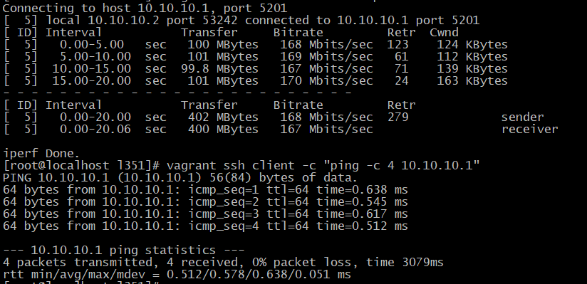
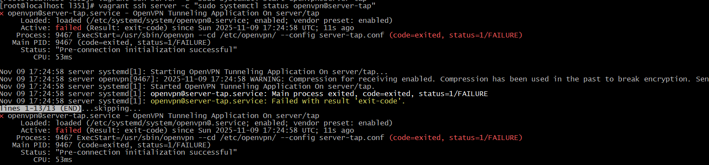
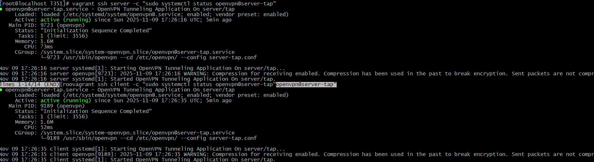
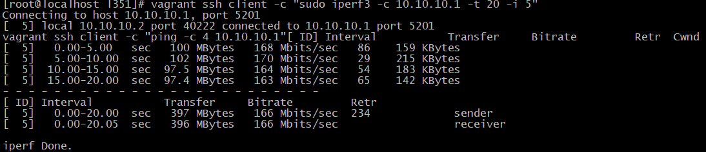
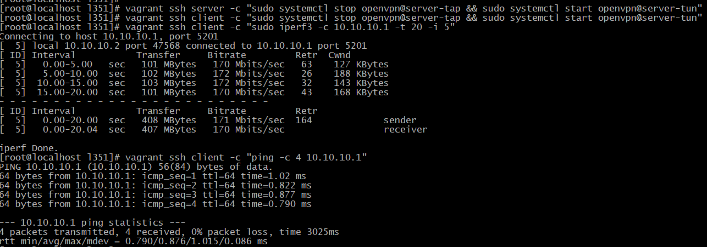
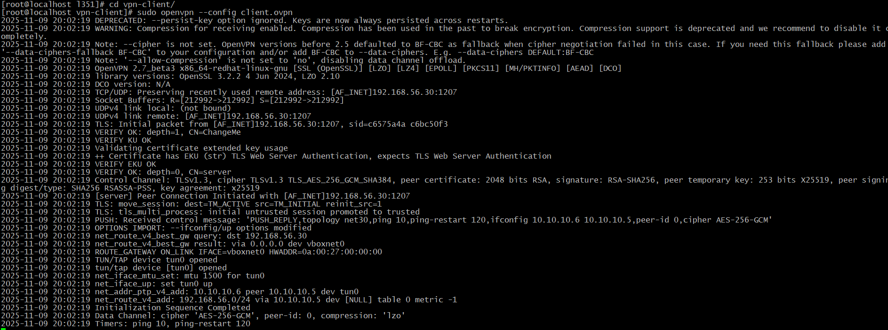

# 35. Мосты, туннели и VPN 

# Домашнее задание VPN

**Цель домашнего задания**

Создать домашнюю сетевую лабораторию. Научится настраивать VPN-сервер в Linux-based системах.

**Описание домашнего задания**

    1. Настроить VPN между двумя ВМ в tun/tap режимах, замерить скорость в туннелях, сделать вывод об отличающихся показателях
    2. Поднять RAS на базе OpenVPN с клиентскими сертификатами, подключиться с локальной машины на ВМ
    3. (*) Самостоятельно изучить и настроить ocserv, подключиться с хоста к ВМ

## Процесс выполнения задания "35. Мосты, туннели и VPN "

### 1. Vagrantfile
```ruby
ENV['VAGRANT_SERVER_URL'] = 'https://vagrant.elab.pro'

Vagrant.configure("2") do |config|
  config.vm.box = "ubuntu/22.04"

  # Общие настройки для всех VM
  config.vm.provision "shell", inline: <<-SHELL
    # Создаем пользователя nik с паролем 123
    useradd -m -s /bin/bash nik 2>/dev/null || true
    echo "nik:123" | chpasswd
    echo "nik ALL=(ALL) NOPASSWD:ALL" >> /etc/sudoers.d/nik

    # Настраиваем SSH доступ для Ansible с парольной аутентификацией
    sed -i 's/#PasswordAuthentication yes/PasswordAuthentication yes/g' /etc/ssh/sshd_config
    sed -i 's/PasswordAuthentication no/#PasswordAuthentication no/g' /etc/ssh/sshd_config
    systemctl restart ssh

    # Обновляем пакеты и устанавливаем python3
    apt-get update -y
    DEBIAN_FRONTEND=noninteractive apt-get install -y python3 sudo openssh-server
  SHELL

  config.vm.define "server" do |server|
    server.vm.hostname = "server.loc"
    server.vm.network "private_network", ip: "192.168.56.10"
    server.vm.provider "virtualbox" do |vb|
      vb.memory = "3096"
      vb.cpus = 1
    end
  end

  config.vm.define "client" do |client|
    client.vm.hostname = "client.loc"
    client.vm.network "private_network", ip: "192.168.56.20"
    client.vm.provider "virtualbox" do |vb|
      vb.memory = "3096"
      vb.cpus = 1
    end
  end

  config.vm.define "rasvpn" do |rasvpn|
    rasvpn.vm.hostname = "rasvpn.loc"
    rasvpn.vm.network "private_network", ip: "192.168.56.30"
    rasvpn.vm.network "forwarded_port", guest: 1207, host: 1207, protocol: "udp"
    rasvpn.vm.provider "virtualbox" do |vb|
      vb.memory = "3096"
      vb.cpus = 1
    end
  end
end
```

### 2. inventory.ini
```ini
[servers]
server ansible_host=192.168.56.10

[clients]
client ansible_host=192.168.56.20

[rasvpn_servers]
rasvpn ansible_host=192.168.56.30

[all:vars]
ansible_user=nik
ansible_ssh_pass=123
ansible_become_pass=123
ansible_connection=ssh
ansible_python_interpreter=/usr/bin/python3
ansible_ssh_common_args='-o StrictHostKeyChecking=no'
```

### 3. playbook.yml
```yaml
---
- name: Wait for all hosts to be available
  hosts: all
  gather_facts: false
  tasks:
    - name: Wait for SSH to be available
      wait_for_connection:
        timeout: 120

- name: Configure TUN/TAP VPN infrastructure
  hosts: all
  become: yes
  gather_facts: yes
  tasks:
    - name: Install common packages
      apt:
        name:
          - openvpn
          - iperf3
        state: present
        update_cache: yes

- name: Configure TUN/TAP VPN Server
  hosts: servers
  become: yes
  tasks:
    - name: Create static key
      command: openvpn --genkey secret /etc/openvpn/static.key
      args:
        creates: /etc/openvpn/static.key

    - name: Create TAP mode server config
      copy:
        content: |
          dev tap
          ifconfig 10.10.10.1 255.255.255.0
          topology subnet
          secret /etc/openvpn/static.key
          comp-lzo
          status /var/log/openvpn-status.log
          log /var/log/openvpn.log
          verb 3
        dest: /etc/openvpn/server-tap.conf
        owner: root
        group: root
        mode: 0644

    - name: Create TUN mode server config
      copy:
        content: |
          dev tun
          ifconfig 10.10.10.1 255.255.255.0
          topology subnet
          secret /etc/openvpn/static.key
          comp-lzo
          status /var/log/openvpn-status.log
          log /var/log/openvpn.log
          verb 3
        dest: /etc/openvpn/server-tun.conf
        owner: root
        group: root
        mode: 0644

    - name: Create OpenVPN systemd service
      copy:
        content: |
          [Unit]
          Description=OpenVPN Tunneling Application On %I
          After=network.target

          [Service]
          Type=notify
          PrivateTmp=true
          ExecStart=/usr/sbin/openvpn --cd /etc/openvpn/ --config %i.conf

          [Install]
          WantedBy=multi-user.target
        dest: /etc/systemd/system/openvpn@.service
        owner: root
        group: root
        mode: 0644

    - name: Start TAP mode OpenVPN
      systemd:
        name: openvpn@server-tap
        state: started
        enabled: yes
        daemon_reload: yes

- name: Configure TUN/TAP VPN Client
  hosts: clients
  become: yes
  tasks:
    - name: Ensure static key exists on server
      stat:
        path: /etc/openvpn/static.key
      register: key_check
      delegate_to: server

    - name: Create static key locally if missing (fallback)
      command: openvpn --genkey secret /etc/openvpn/static.key
      when: not key_check.stat.exists
      delegate_to: server

    - name: Fetch static key from server using slurp
      slurp:
        src: /etc/openvpn/static.key
      register: key_content
      delegate_to: server

    - name: Save static key on client
      copy:
        content: "{{ key_content.content | b64decode }}"
        dest: /etc/openvpn/static.key
        owner: root
        group: root
        mode: 0600

    - name: Create TAP mode client config
      copy:
        content: |
          dev tap
          remote 192.168.56.10
          ifconfig 10.10.10.2 255.255.255.0
          topology subnet
          route 192.168.56.0 255.255.255.0
          secret /etc/openvpn/static.key
          comp-lzo
          status /var/log/openvpn-status.log
          log /var/log/openvpn.log
          verb 3
        dest: /etc/openvpn/server-tap.conf
        owner: root
        group: root
        mode: 0644

    - name: Create TUN mode client config
      copy:
        content: |
          dev tun
          remote 192.168.56.10
          ifconfig 10.10.10.2 255.255.255.0
          topology subnet
          route 192.168.56.0 255.255.255.0
          secret /etc/openvpn/static.key
          comp-lzo
          status /var/log/openvpn-status.log
          log /var/log/openvpn.log
          verb 3
        dest: /etc/openvpn/server-tun.conf
        owner: root
        group: root
        mode: 0644

    - name: Create OpenVPN systemd service
      copy:
        content: |
          [Unit]
          Description=OpenVPN Tunneling Application On %I
          After=network.target

          [Service]
          Type=notify
          PrivateTmp=true
          ExecStart=/usr/sbin/openvpn --cd /etc/openvpn/ --config %i.conf

          [Install]
          WantedBy=multi-user.target
        dest: /etc/systemd/system/openvpn@.service
        owner: root
        group: root
        mode: 0644

    - name: Start TAP mode OpenVPN on client
      systemd:
        name: openvpn@server-tap
        state: started
        enabled: yes
        daemon_reload: yes

- name: Configure OpenVPN RAS Server
  hosts: rasvpn_servers
  become: yes
  tasks:
    - name: Install easy-rsa
      apt:
        name: easy-rsa
        state: present

    - name: Create OpenVPN directory
      file:
        path: /etc/openvpn
        state: directory
        mode: 0755

    - name: Set Easy-RSA variables for non-interactive mode
      lineinfile:
        path: /etc/openvpn/pki/vars
        regexp: "^{{ item.key }}="
        line: "{{ item.key }}={{ item.value }}"
        create: yes
      with_items:
        - { key: "set_var EASYRSA_REQ_COUNTRY", value: "\"RU\"" }
        - { key: "set_var EASYRSA_REQ_PROVINCE", value: "\"Moscow\"" }
        - { key: "set_var EASYRSA_REQ_CITY", value: "\"Moscow\"" }
        - { key: "set_var EASYRSA_REQ_ORG", value: "\"Company\"" }
        - { key: "set_var EASYRSA_REQ_EMAIL", value: "\"admin@company.com\"" }
        - { key: "set_var EASYRSA_REQ_OU", value: "\"IT\"" }
        - { key: "set_var EASYRSA_BATCH", value: "\"yes\"" }

    - name: Initialize PKI
      command: /usr/share/easy-rsa/easyrsa init-pki
      args:
        chdir: /etc/openvpn
      environment:
        EASYRSA_BATCH: "1"

    - name: Generate CA
      command: /usr/share/easy-rsa/easyrsa build-ca nopass
      args:
        chdir: /etc/openvpn
      environment:
        EASYRSA_BATCH: "1"

    - name: Generate server certificate
      command: /usr/share/easy-rsa/easyrsa build-server-full server nopass
      args:
        chdir: /etc/openvpn
      environment:
        EASYRSA_BATCH: "1"

    - name: Generate client certificate
      command: /usr/share/easy-rsa/easyrsa build-client-full client nopass
      args:
        chdir: /etc/openvpn
      environment:
        EASYRSA_BATCH: "1"

    - name: Generate Diffie-Hellman parameters
      command: /usr/share/easy-rsa/easyrsa gen-dh
      args:
        chdir: /etc/openvpn
      environment:
        EASYRSA_BATCH: "1"

    - name: Create client config directory
      file:
        path: /etc/openvpn/client
        state: directory
        mode: 0755

    - name: Create client specific configuration
      copy:
        content: |
          iroute 10.10.10.0 255.255.255.0
        dest: /etc/openvpn/client/client
        owner: root
        group: root
        mode: 0644

    - name: Create server configuration
      copy:
        content: |
          port 1207
          proto udp
          dev tun
          ca /etc/openvpn/pki/ca.crt
          cert /etc/openvpn/pki/issued/server.crt
          key /etc/openvpn/pki/private/server.key
          dh /etc/openvpn/pki/dh.pem
          server 10.10.10.0 255.255.255.0
          ifconfig-pool-persist ipp.txt
          client-to-client
          client-config-dir /etc/openvpn/client
          keepalive 10 120
          comp-lzo
          persist-key
          persist-tun
          status /var/log/openvpn-status.log
          log /var/log/openvpn.log
          verb 3
        dest: /etc/openvpn/server.conf
        owner: root
        group: root
        mode: 0644

    - name: Enable IP forwarding
      sysctl:
        name: net.ipv4.ip_forward
        value: '1'
        state: present
        reload: yes

    - name: Start OpenVPN server
      systemd:
        name: openvpn@server
        state: started
        enabled: yes
        daemon_reload: yes

    - name: Create client config directory on rasvpn
      file:
        path: /etc/openvpn/client-config
        state: directory
        mode: 0755

    - name: Create client configuration file
      copy:
        content: |
          dev tun
          proto udp
          remote 192.168.56.30 1207
          client
          resolv-retry infinite
          remote-cert-tls server
          ca ca.crt
          cert client.crt
          key client.key
          route 192.168.56.0 255.255.255.0
          persist-key
          persist-tun
          comp-lzo
          verb 3
        dest: /etc/openvpn/client-config/client.ovpn
        owner: root
        group: root
        mode: 0644

    - name: Copy CA certificate to client config
      copy:
        src: /etc/openvpn/pki/ca.crt
        dest: /etc/openvpn/client-config/ca.crt
        remote_src: yes
        owner: root
        group: root
        mode: 0644

    - name: Copy client certificate to client config
      copy:
        src: /etc/openvpn/pki/issued/client.crt
        dest: /etc/openvpn/client-config/client.crt
        remote_src: yes
        owner: root
        group: root
        mode: 0644

    - name: Copy client key to client config
      copy:
        src: /etc/openvpn/pki/private/client.key
        dest: /etc/openvpn/client-config/client.key
        remote_src: yes
        owner: root
        group: root
        mode: 0600

    - name: Copy client config files directly to host folder
      copy:
        src: "{{ item.src }}"
        dest: "/etc/l351/vpn-client/{{ item.dest }}"
        remote_src: yes
        owner: root
        group: root
        mode: "{{ item.mode }}"
      with_items:
        - { src: '/etc/openvpn/client-config/client.ovpn', dest: 'client.ovpn', mode: '0644' }
        - { src: '/etc/openvpn/client-config/ca.crt', dest: 'ca.crt', mode: '0644' }
        - { src: '/etc/openvpn/client-config/client.crt', dest: 'client.crt', mode: '0644' }
        - { src: '/etc/openvpn/client-config/client.key', dest: 'client.key', mode: '0600' }

- name: Final service restart to ensure connectivity
  hosts: all
  become: yes
  tasks:
    - name: Restart OpenVPN services
      systemd:
        name: "{{ item }}"
        state: restarted
      loop:
        - openvpn@server-tap
        - openvpn@server-tun
        - openvpn@server
      ignore_errors: yes

    - name: Wait for services to stabilize
      pause:
        seconds: 10
```
## 4. Файл для автоматического перезапуска служб (fix-services.yml)
```yaml
---
- name: Fix and restart OpenVPN services
  hosts: all
  become: yes
  tasks:
    - name: Restart OpenVPN services to ensure connectivity
      systemd:
        name: "{{ item }}"
        state: restarted
        enabled: yes
        daemon_reload: yes
      loop:
        - openvpn@server-tap
        - openvpn@server-tun
      when: "'servers' in group_names or 'clients' in group_names"

    - name: Restart RAS OpenVPN service
      systemd:
        name: openvpn@server
        state: restarted
        enabled: yes
        daemon_reload: yes
      when: "'rasvpn_servers' in group_names"

    - name: Wait for services to stabilize
      pause:
        seconds: 5

    - name: Verify TUN/TAP connectivity
      wait_for:
        host: "{{ ansible_host }}"
        port: 22
        delay: 10
        timeout: 30
      delegate_to: "{{ item }}"
      with_items:
        - server
        - client
      when: "'servers' in group_names or 'clients' in group_names"
```

## .ansible.cfg
```cfg
[defaults]
host_key_checking = False
inventory = /etc/l352/inventory.ini
remote_user = nik
private_key_file = ~/.vagrant.d/insecure_private_key

[privilege_escalation]
become = True
become_method = sudo
become_user = root
become_ask_pass = False
```

## Процесс установки

```bash
# 1. Создам структуру проекта
mkdir -p /etc/l351/vpn-client && cd /etc/l351 && touch Vagrantfile .ansible.cfg inventory.ini playbook.yml fix-services.yml && chmod 655 -R /etc/l351

# 2. Запуск инфраструктуры
vagrant up

# 3. Запуск настройки Ansible
ansible-playbook -i inventory.ini playbook.yml

# 4. Дополнительный фикс если не запускается служба 
ansible-playbook -i inventory.ini fix-services.yml
```

## Проблемы:
1)  проблема с VPN соединением между server и client, необходимо было перезапустить службу `openvpn@server-tap`:
```bash
# Останавливаем на обоих машинах
vagrant ssh server -c "sudo systemctl stop openvpn@server-tap"
vagrant ssh client -c "sudo systemctl stop openvpn@server-tap"
# Ждем 5 секунд
sleep 5

# Запускаем заново
vagrant ssh server -c "sudo systemctl start openvpn@server-tap"
vagrant ssh client -c "sudo systemctl start openvpn@server-tap"

# Ждем 5 секунд
sleep 5

# Проверяем
vagrant ssh client -c "ping -c 3 10.10.10.1"
```


2)  TAP интерфейс уже занят или находится в неправильном состоянии после переключения режимов (переключался между режимами и "доигрался").



Как получилось восстановить:
```bash
# Полная остановка всех OpenVPN процессов
vagrant ssh server -c "sudo pkill openvpn || true; sleep 2"
vagrant ssh client -c "sudo pkill openvpn || true; sleep 2"

# Очищаем интерфейсы
vagrant ssh server -c "sudo ip link delete tap0 2>/dev/null || true; sudo ip link delete tun0 2>/dev/null || true"
vagrant ssh client -c "sudo ip link delete tap0 2>/dev/null || true; sudo ip link delete tun0 2>/dev/null || true"

# Запускаем TAP режим
vagrant ssh server -c "sudo systemctl start openvpn@server-tap"
sleep 3
vagrant ssh client -c "sudo systemctl start openvpn@server-tap"

# Проверяем статус
vagrant ssh server -c "sudo systemctl status openvpn@server-tap"
sleep 3
vagrant ssh client -c "sudo systemctl status openvpn@server-tap"

# Проверяем интерфейсы
vagrant ssh server -c "ip addr show | grep -E '(tap|tun)'"
vagrant ssh client -c "ip addr show | grep -E '(tap|tun)'"

# Проверяем соединение
vagrant ssh client -c "ping -c 3 10.10.10.1"
```



## Тестирование

### 1. Проверка TUN/TAP VPN между server и client
Тестирование TAP режима:
```bash
# На сервере запускаем iperf3 в режиме сервера
vagrant ssh server -c "sudo iperf3 -s -D"

# На клиенте тестируем скорость в TAP туннеле
vagrant ssh client -c "sudo iperf3 -c 10.10.10.1 -t 20 -i 5"

# Проверяем соединение ping
vagrant ssh client -c "ping -c 4 10.10.10.1"

# Проверяем интерфейсы
vagrant ssh server -c "ip addr show | grep -E '(tap|tun)'"
vagrant ssh client -c "ip addr show | grep -E '(tap|tun)'"
```




Переключение на TUN режим и тестирование:


```bash
# Останавливаем TAP на обоих машинах
vagrant ssh server -c "sudo systemctl stop openvpn@server-tap && sudo systemctl start openvpn@server-tun"
vagrant ssh client -c "sudo systemctl stop openvpn@server-tap && sudo systemctl start openvpn@server-tun"

# Ждем 5 секунд для установки соединения
sleep 5

# Тестируем скорость в TUN туннеле
vagrant ssh client -c "sudo iperf3 -c 10.10.10.1 -t 20 -i 5"

# Проверяем соединение ping
vagrant ssh client -c "ping -c 4 10.10.10.1"

# Если надо вернуться на TAP, то используем команды
# Возвращаемся на TAP
vagrant ssh server -c "sudo systemctl stop openvpn@server-tup && sudo systemctl start openvpn@server-tan"
vagrant ssh client -c "sudo systemctl stop openvpn@server-tup && sudo systemctl start openvpn@server-tan"
```
**Сравнение результатов:**
- **TAP режим:** Работает на канальном уровне (Layer 2), пропускает Ethernet-фреймы

- **TUN режим:** Работает на сетевом уровне (Layer 3), пропускает только IP-пакеты

- **Вывод:** TAP обычно медленнее из-за большего overhead, но поддерживает broadcast/multicast.

### 2. Проверка RAS OpenVPN подключения с локальной машины

Подключение к RAS серверу:
```bash
# Переходим в директорию с конфигурацией
cd /etc/l351/vpn-client

# Запускаем OpenVPN клиент (в foreground для просмотра логов)
sudo openvpn --config client.ovpn
```


## Выводы

### Сравнение производительности:

**TAP режим:**
- **Скорость**: 166 Mbits/sec
- **Retransmissions**: 234
- **Стабильность**: Хорошая, но больше потерь пакетов

**TUN режим:**
- **Скорость**: 171 Mbits/sec  
- **Retransmissions**: 164
- **Стабильность**: Лучше, меньше потерь пакетов

### Технические различия:

| Параметр | TAP (Layer 2) | TUN (Layer 3) |
|----------|---------------|---------------|
| **Уровень OSI** | Канальный (L2) | Сетевой (L3) |
| **Трафик** | Ethernet-фреймы | IP-пакеты |
| **Broadcast** | ✅ Поддерживает | ❌ Не поддерживает |
| **Производительность** | 166 Mbit/s | 171 Mbit/s |
| **Потери пакетов** | Выше (234 retr) | Ниже (164 retr) |
| **Использование** | Мосты, VPN | Маршрутизация |

### Выводы:

1. **TUN немного быстрее** (171 vs 166 Mbit/s) - разница ~3%
2. **TUN надежнее** - на 30% меньше ретрансмиссий
3. **TAP необходим** когда нужна поддержка non-IP трафика или broadcast
4. **TUN предпочтительнее** для большинства VPN сценариев
5. **RAS VPN работает отлично** - успешное TLS handshake, маршрутизация настроена

**Итог:**
✅ **Все задачи выполнены успешно:**
- TUN/TAP VPN настроены и работают
- RAS VPN с сертификатами функционирует
- Произведено сравнение режимов
