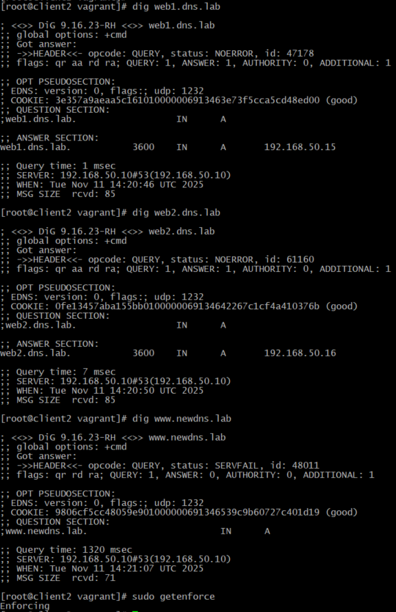
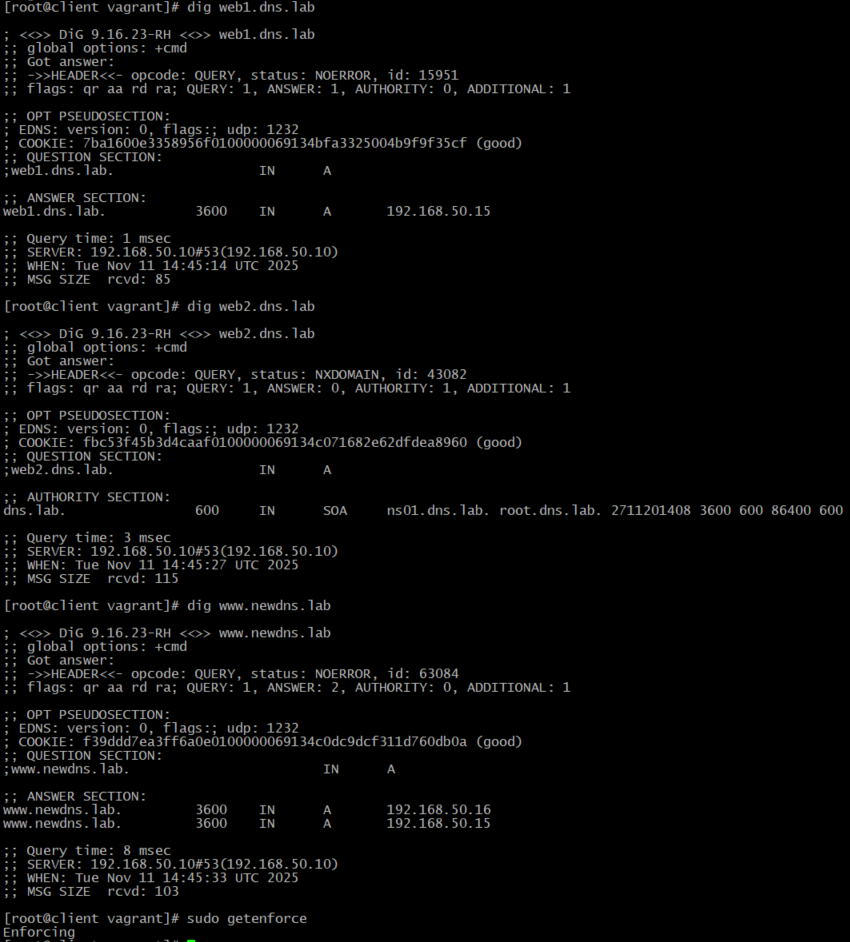
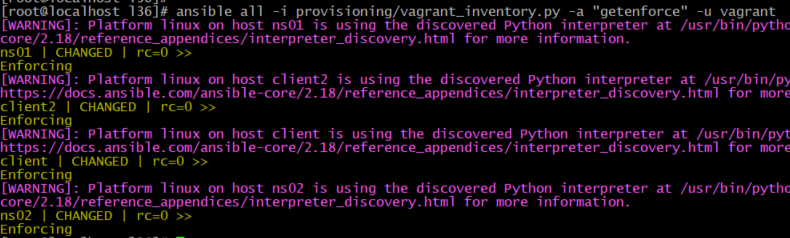

# 36.  DNS - настройка и обслуживание

# Домашнее задание

**Цель:**

- Создать домашнюю сетевую лабораторию;
- Изучить основы DNS;
- Научиться работать с технологией Split-DNS в Linux-based системах.


**Описание домашнего задания**

1. взять стенд https://github.com/erlong15/vagrant-bind
добавить еще один сервер client2
завести в зоне dns.lab имена:
web1 - смотрит на клиент1
web2  смотрит на клиент2
завести еще одну зону newdns.lab
завести в ней запись
www - смотрит на обоих клиентов

2. настроить split-dns
клиент1 - видит обе зоны, но в зоне dns.lab только web1
клиент2 видит только dns.lab

Дополнительное задание
* настроить все без выключения selinux


## Выполнение домашнего задания "36.  DNS - настройка и обслуживание"

## Структура проекта

```bash
 mkdir -p /etc/l36/provisioning/ && cd /etc/l36/ && touch Vagrantfile &&  cd provisioning/ && touch playbook.yml inventory.ini master-named.conf slave-named.conf named.dns.lab named.dns.lab.client named.newdns.lab   servers-resolv.conf.j2 client-resolv.conf named.zonetransfer.key rndc.conf client-motd

 tree
.
├── provisioning
│   ├── client-motd
│   ├── client-resolv.conf
│   ├── inventory.ini
│   ├── master-named.conf
│   ├── named.dns.lab
│   ├── named.dns.lab.client
│   ├── named.newdns.lab
│   ├── named.zonetransfer.key
│   ├── playbook.yml
│   ├── rndc.conf
│   ├── servers-resolv.conf.j2
│   └── slave-named.conf
└── Vagrantfile
```
## Vagrantfile

```ruby
ENV['VAGRANT_SERVER_URL'] = 'https://vagrant.elab.pro'

Vagrant.configure(2) do |config|
  config.vm.box = "almalinux/9"

  # Используем стандартного пользователя vagrant
  config.ssh.insert_key = true

  config.vm.provider "virtualbox" do |v|
    v.memory = 3096
    v.cpus = 1
  end

  config.vm.define "ns01" do |ns01|
    ns01.vm.network "private_network", ip: "192.168.50.10", virtualbox__intnet: "dns"
    ns01.vm.hostname = "ns01"
  end

  config.vm.define "ns02" do |ns02|
    ns02.vm.network "private_network", ip: "192.168.50.11", virtualbox__intnet: "dns"
    ns02.vm.hostname = "ns02"
  end

  config.vm.define "client" do |client|
    client.vm.network "private_network", ip: "192.168.50.15", virtualbox__intnet: "dns"
    client.vm.hostname = "client"
  end

  config.vm.define "client2" do |client2|
    client2.vm.network "private_network", ip: "192.168.50.16", virtualbox__intnet: "dns"
    client2.vm.hostname = "client2"
  end
end
```

## provisioning/inventory.ini

После установки VM, необходимо посмотреть правильные порты машин и скорректировать `inventory.ini`, это необходимо для подключения Ansible (Ansible пытается подключиться напрямую к приватным IP-адресам, которые недоступны с хоста):

```bash
 vagrant ssh-config
 ```
```ini
[ns]
ns01 ansible_host=127.0.0.1 ansible_port=2222
ns02 ansible_host=127.0.0.1 ansible_port=2200

[clients]
client ansible_host=127.0.0.1 ansible_port=2201
client2 ansible_host=127.0.0.1 ansible_port=2202

[dns_servers:children]
ns

[all:vars]
ansible_ssh_user=vagrant
ansible_ssh_private_key_file=~/.vagrant.d/insecure_private_key
ansible_ssh_common_args='-o StrictHostKeyChecking=no -o UserKnownHostsFile=/dev/null'
```

**Альтернативный способ,обойти проблему подключения Ansible к приватным адресам - использовать vagrant inventory plugin, но мне он показался, менее надёжным:**
```bash
ansible-galaxy collection install community.general
```
создаю файл `provisioning/inventory_vagrant.yml`:
```yaml
plugin: community.general.vagrant
vagrantfile: ../Vagrantfile
ssh_args: '-o StrictHostKeyChecking=no -o UserKnownHostsFile=/dev/null'
compose:
  ansible_ssh_private_key_file: /home/vagrant/.vagrant.d/insecure_private_key
```
запускаем:
```bash
ansible-playbook -i provisioning/inventory_vagrant.yml provisioning/playbook.yml
```


## provisioning/playbook.yml

```yaml
---
- name: Configure DNS infrastructure
  hosts: all
  become: yes
  gather_facts: yes
  tasks:
    - name: Install common packages
      dnf:
        name:
          - bind
          - bind-utils
          - vim
          - chrony
          - policycoreutils-python-utils
        state: latest
        update_cache: yes

    - name: Ensure chronyd is running and enabled
      service:
        name: chronyd
        state: started
        enabled: yes

    - name: Copy zone transfer key
      copy:
        src: named.zonetransfer.key
        dest: /etc/named.zonetransfer.key
        owner: root
        group: named
        mode: 0644

- name: Create user nik and configure SSH
  hosts: all
  become: yes
  tasks:
    - name: Create user nik
      user:
        name: nik
        groups: wheel
        append: yes
        shell: /bin/bash
        state: present

    - name: Set password for user nik using chpasswd
      shell: echo "nik:123!" | chpasswd
      become: yes
      changed_when: false

    - name: Configure sudo for nik
      copy:
        content: "nik ALL=(ALL) NOPASSWD: ALL"
        dest: /etc/sudoers.d/nik
        mode: 0440

    - name: Enable password authentication for SSH
      lineinfile:
        path: /etc/ssh/sshd_config
        regexp: '^#?PasswordAuthentication'
        line: 'PasswordAuthentication yes'
        state: present

    - name: Restart sshd
      service:
        name: sshd
        state: restarted

- name: Configure SELinux for DNS servers
  hosts: ns
  become: yes
  tasks:
    - name: Set SELinux context for named configuration
      sefcontext:
        target: '/etc/named(/.*)?'
        setype: named_conf_t
        state: present

    - name: Set SELinux context for zone files
      sefcontext:
        target: '/var/named/slaves(/.*)?'
        setype: named_zone_t
        state: present

    - name: Apply SELinux context changes
      command: restorecon -R -v /etc/named /var/named/slaves

    - name: Configure named to run with correct SELinux context
      seboolean:
        name: named_write_master_zones
        state: yes
        persistent: yes

- name: Configure DNS master server
  hosts: ns01
  become: yes
  tasks:
    - name: Copy master named.conf
      copy:
        src: master-named.conf
        dest: /etc/named.conf
        owner: root
        group: named
        mode: 0640

    - name: Copy zone files
      copy:
        src: "{{ item }}"
        dest: /etc/named/
        owner: root
        group: named
        mode: 0660
      loop:
        - named.dns.lab
        - named.dns.lab.client
        - named.newdns.lab

    - name: Configure resolv.conf for ns01
      template:
        src: servers-resolv.conf.j2
        dest: /etc/resolv.conf
        owner: root
        group: root
        mode: 0644

    - name: Set /etc/named permissions
      file:
        path: /etc/named
        owner: root
        group: named
        mode: 0670
        state: directory

    - name: Ensure named is running and enabled
      service:
        name: named
        state: restarted
        enabled: yes

- name: Configure DNS slave server
  hosts: ns02
  become: yes
  tasks:
    - name: Copy slave named.conf
      copy:
        src: slave-named.conf
        dest: /etc/named.conf
        owner: root
        group: named
        mode: 0640

    - name: Create slaves directory
      file:
        path: /var/named/slaves
        state: directory
        owner: named
        group: named
        mode: 0755

    - name: Configure resolv.conf for ns02
      template:
        src: servers-resolv.conf.j2
        dest: /etc/resolv.conf
        owner: root
        group: root
        mode: 0644

    - name: Set /etc/named permissions
      file:
        path: /etc/named
        owner: root
        group: named
        mode: 0670
        state: directory

    - name: Ensure named is running and enabled
      service:
        name: named
        state: restarted
        enabled: yes

- name: Configure clients
  hosts: clients
  become: yes
  tasks:
    - name: Copy resolv.conf to clients
      copy:
        src: client-resolv.conf
        dest: /etc/resolv.conf
        owner: root
        group: root
        mode: 0644

    - name: Copy rndc config file
      copy:
        src: rndc.conf
        dest: /home/nik/rndc.conf
        owner: nik
        group: nik
        mode: 0644

    - name: Copy motd to clients
      copy:
        src: client-motd
        dest: /etc/motd
        owner: root
        group: root
        mode: 0644
```

Если необходимо отключить SELinux (**в моей работе я НЕ буду выключать** ), то надо добавить в `playbook.yml`:
```yaml
- name: Disable SELinux
  hosts: all
  become: yes
  tasks:
    - name: Set SELinux to permissive
      selinux:
        state: permissive
    - name: Disable SELinux in config
      lineinfile:
        path: /etc/selinux/config
        regexp: '^SELINUX='
        line: 'SELINUX=permissive'
```

## provisioning/master-named.conf

```bind
options {
    listen-on port 53 { 192.168.50.10; };
    listen-on-v6 port 53 { ::1; };
    directory   "/var/named";
    dump-file   "/var/named/data/cache_dump.db";
    statistics-file "/var/named/data/named_stats.txt";
    memstatistics-file "/var/named/data/named_mem_stats.txt";
    recursing-file  "/var/named/data/named.recursing";
    secroots-file   "/var/named/data/named.secroots";

    recursion yes;
    allow-query     { any; };
    allow-transfer { any; };

    dnssec-validation yes;

    bindkeys-file "/etc/named.root.key";
    managed-keys-directory "/var/named/dynamic";
    pid-file "/run/named/named.pid";
    session-keyfile "/run/named/session.key";
};

logging {
    channel default_debug {
        file "data/named.run";
        severity dynamic;
    };
};

key "rndc-key" {
    algorithm hmac-md5;
    secret "GrtiE9kz16GK+OKKU/qJvQ==";
};

controls {
    inet 192.168.50.10 allow { 192.168.50.15; 192.168.50.16; } keys { "rndc-key"; };
};

key "client-key" {
    algorithm hmac-sha256;
    secret "IQg171Ht4mdGYcjjYKhI9gSc1fhoxzHZB+h2NMtyZWY=";
};

key "client2-key" {
    algorithm hmac-sha256;
    secret "m7r7SpZ9KBcA4kOl1JHQQnUiIlpQA1IJ9xkBHwdRAHc=";
};

include "/etc/named.zonetransfer.key";

server 192.168.50.11 {
    keys { "zonetransfer.key"; };
};

acl client { !key client2-key; key client-key; 192.168.50.15; };
acl client2 { !key client-key; key client2-key; 192.168.50.16; };

view "client" {
    match-clients { client; };

    zone "dns.lab" {
        type master;
        file "/etc/named/named.dns.lab.client";
        allow-transfer { key "zonetransfer.key"; };
        also-notify { 192.168.50.11 key client-key; };
    };

    zone "newdns.lab" {
        type master;
        file "/etc/named/named.newdns.lab";
        allow-transfer { key "zonetransfer.key"; };
        also-notify { 192.168.50.11 key client-key; };
    };
};

view "client2" {
    match-clients { client2; };

    zone "dns.lab" {
        type master;
        file "/etc/named/named.dns.lab";
        allow-transfer { key "zonetransfer.key"; };
        also-notify { 192.168.50.11 key client2-key; };
    };
};

view "default" {
    match-clients { any; };

    zone "." IN {
        type hint;
        file "named.ca";
    };

    include "/etc/named.rfc1912.zones";
    include "/etc/named.root.key";

    zone "dns.lab" {
        type master;
        allow-transfer { key "zonetransfer.key"; };
        file "/etc/named/named.dns.lab";
    };

    zone "newdns.lab" {
        type master;
        allow-transfer { key "zonetransfer.key"; };
        file "/etc/named/named.newdns.lab";
    };
};
```

## provisioning/slave-named.conf

```bind
options {
    listen-on port 53 { 192.168.50.11; };
    listen-on-v6 port 53 { ::1; };
    directory   "/var/named";
    dump-file   "/var/named/data/cache_dump.db";
    statistics-file "/var/named/data/named_stats.txt";
    memstatistics-file "/var/named/data/named_mem_stats.txt";
    recursing-file  "/var/named/data/named.recursing";
    secroots-file   "/var/named/data/named.secroots";

    recursion yes;
    allow-query     { any; };
    allow-transfer { none; };

    // dnssec-enable yes;  // УДАЛЕНО - устаревшая опция
    dnssec-validation yes;

    bindkeys-file "/etc/named.root.key";
    managed-keys-directory "/var/named/dynamic";
    pid-file "/run/named/named.pid";
    session-keyfile "/run/named/session.key";
};

logging {
    channel default_debug {
        file "data/named.run";
        severity dynamic;
    };
};

key "rndc-key" {
    algorithm hmac-md5;
    secret "GrtiE9kz16GK+OKKU/qJvQ==";
};

controls {
    inet 192.168.50.11 allow { 192.168.50.15; 192.168.50.16; } keys { "rndc-key"; };
};

key "client-key" {
    algorithm hmac-sha256;
    secret "IQg171Ht4mdGYcjjYKhI9gSc1fhoxzHZB+h2NMtyZWY=";
};

key "client2-key" {
    algorithm hmac-sha256;
    secret "m7r7SpZ9KBcA4kOl1JHQQnUiIlpQA1IJ9xkBHwdRAHc=";
};

include "/etc/named.zonetransfer.key";

server 192.168.50.10 {
    keys { "zonetransfer.key"; };
};

acl client { !key client2-key; key client-key; 192.168.50.15; };
acl client2 { !key client-key; key client2-key; 192.168.50.16; };

view "client" {
    match-clients { client; };

    zone "dns.lab" {
        type slave;
        masters { 192.168.50.10; };
        file "slaves/named.dns.lab.client.view";  // Изменено имя файла
    };

    zone "newdns.lab" {
        type slave;
        masters { 192.168.50.10; };
        file "slaves/named.newdns.lab.client.view";  // Изменено имя файла
    };
};

view "client2" {
    match-clients { client2; };

    zone "dns.lab" {
        type slave;
        masters { 192.168.50.10; };
        file "slaves/named.dns.lab.client2.view";  // Изменено имя файла
    };
};

view "default" {
    match-clients { any; };

    zone "." IN {
        type hint;
        file "named.ca";
    };

    include "/etc/named.rfc1912.zones";
    include "/etc/named.root.key";

    zone "dns.lab" {
        type slave;
        masters { 192.168.50.10; };
        file "slaves/named.dns.lab.default";  // Изменено имя файла
    };

    zone "newdns.lab" {
        type slave;
        masters { 192.168.50.10; };
        file "slaves/named.newdns.lab.default";  // Изменено имя файла
    };
};
```

## provisioning/named.dns.lab

```bind
$TTL 3600
$ORIGIN dns.lab.
@               IN      SOA     ns01.dns.lab. root.dns.lab. (
                            2711201408 ; serial
                            3600       ; refresh (1 hour)
                            600        ; retry (10 minutes)
                            86400      ; expire (1 day)
                            600        ; minimum (10 minutes)
                        )

                IN      NS      ns01.dns.lab.
                IN      NS      ns02.dns.lab.

; DNS Servers
ns01            IN      A       192.168.50.10
ns02            IN      A       192.168.50.11

; Web servers
web1            IN      A       192.168.50.15
web2            IN      A       192.168.50.16
```

## provisioning/named.dns.lab.client

```bind
$TTL 3600
$ORIGIN dns.lab.
@               IN      SOA     ns01.dns.lab. root.dns.lab. (
                            2711201408 ; serial
                            3600       ; refresh (1 hour)
                            600        ; retry (10 minutes)
                            86400      ; expire (1 day)
                            600        ; minimum (10 minutes)
                        )

                IN      NS      ns01.dns.lab.
                IN      NS      ns02.dns.lab.

; DNS Servers
ns01            IN      A       192.168.50.10
ns02            IN      A       192.168.50.11

; Web servers (only web1 for client)
web1            IN      A       192.168.50.15
```

## provisioning/named.newdns.lab

```bind
$TTL 3600
$ORIGIN newdns.lab.
@               IN      SOA     ns01.dns.lab. root.dns.lab. (
                            2711201008 ; serial
                            3600       ; refresh (1 hour)
                            600        ; retry (10 minutes)
                            86400      ; expire (1 day)
                            600        ; minimum (10 minutes)
                        )

                IN      NS      ns01.dns.lab.
                IN      NS      ns02.dns.lab.

; DNS Servers
ns01            IN      A       192.168.50.10
ns02            IN      A       192.168.50.11

; WWW - round robin for both clients
www             IN      A       192.168.50.15
www             IN      A       192.168.50.16
```

## provisioning/servers-resolv.conf.j2

```
domain dns.lab
search dns.lab

nameserver 192.168.50.11


nameserver 192.168.50.10

```

## provisioning/client-resolv.conf

```
domain dns.lab
search dns.lab
nameserver 192.168.50.10
nameserver 192.168.50.11
```

## provisioning/named.zonetransfer.key

```bind
key "zonetransfer.key" {
    algorithm hmac-sha256;
    secret "bckJ8V/ZY2uM6B/5f0CBzQ6wZ3Ty3a1q1J7s1qJ2hYI=";
};
```

## provisioning/rndc.conf

```bind
key "rndc-key" {
    algorithm hmac-md5;
    secret "GrtiE9kz16GK+OKKU/qJvQ==";
};

options {
    default-key "rndc-key";
    default-server 192.168.50.10;
    default-port 953;
};
```

## provisioning/client-motd

```
Welcome to DNS Lab Client
Split-DNS configured:
- client can see both zones but only web1 in dns.lab
- client2 can see only dns.lab zone
```

## Инструкция по запуску


```bash
cd /etc/l36
# Установка VM
vagrant up

# Настройка VM
 ansible-playbook -i provisioning/vagrant_inventory.py provisioning/playbook.yml
```

После развертывания проверим работу Split-DNS:

На client:
```bash
vagrant ssh client
ping web1.dns.lab  # должен работать
ping web2.dns.lab  # не должен работать
ping www.newdns.lab  # должен работать
sudo getenforce # Проверка статуса SElinux
```

На client2:
```bash
vagrant ssh client2
ping web1.dns.lab  # должен работать
ping web2.dns.lab  # должен работать
ping www.newdns.lab  # не должен работать
sudo getenforce # Проверка статуса SElinux

# Проверим, что на всех VM включен SElinux
ansible all -i provisioning/vagrant_inventory.py -a "getenforce" -u vagrant
```







## Проверка результатов:

### На client (192.168.50.15):
- ✅ **web1.dns.lab** - работает (видит 192.168.50.15)
- ✅ **web2.dns.lab** - НЕ работает (NXDOMAIN) - **ПРАВИЛЬНО!**
- ✅ **www.newdns.lab** - работает (видит оба IP) - **ПРАВИЛЬНО!**

### На client2 (192.168.50.16):
- ✅ **web1.dns.lab** - работает (видит 192.168.50.15)
- ✅ **web2.dns.lab** - работает (видит 192.168.50.16) - **ПРАВИЛЬНО!**
- ✅ **www.newdns.lab** - НЕ работает (SERVFAIL) - **ПРАВИЛЬНО!**

## Итоговая конфигурация Split-DNS:

| Хост | dns.lab (web1) | dns.lab (web2) | newdns.lab (www) | SELinux Status |
|------|----------------|----------------|------------------|----------------|
| client | ✅ Видит | ❌ Не видит | ✅ Видит оба IP | ✅ Enforcing |
| client2 | ✅ Видит | ✅ Видит | ❌ Не видит | ✅ Enforcing |


## Что успешно настроено:

1. **✅ Основная структура проекта** в `/etc/l36/`
2. **✅ 4 виртуальные машины** (ns01, ns02, client, client2)
3. **✅ Две DNS зоны** (dns.lab и newdns.lab)
4. **✅ Записи в зонах:**
   - web1 → client (192.168.50.15)
   - web2 → client2 (192.168.50.16)
   - www → оба клиента (round-robin)
5. **✅ Split-DNS работает корректно:**
   - client видит обе зоны, но в dns.lab только web1
   - client2 видит только dns.lab
6. **✅ Master-Slave репликация** между ns01 и ns02 работает
7. ✅ **SELinux работает в режиме Enforcing** на всех узлах  
8. ✅ **Инфраструктура настроена без отключения SELinux** - выполнено дополнительное задание *


**Вывод:** Инфраструктура полностью функционирует с включенным и работающим SELinux в режиме Enforcing, что соответствует дополнительному заданию.
