# 37. Сетевые пакеты. VLAN'ы. LACP 

## Домашнее задание

Строим бонды и вланы

**Цель:**

 Научиться настраивать VLAN и LACP.

**Что нужно сделать?**

1. в Office1 в тестовой подсети появляется сервера с доп интерфейсами и адресами
в internal сети testLAN:

- testClient1 - 10.10.10.254
- testClient2 - 10.10.10.254
- testServer1- 10.10.10.1
- testServer2- 10.10.10.1

2. Равести вланами:
testClient1 <-> testServer1
testClient2 <-> testServer2

3. Между centralRouter и inetRouter "пробросить" 2 линка (общая inernal сеть) и объединить их в бонд, проверить работу c отключением интерфейсов


## Выполнение домашнего задания "37. Сетевые пакеты. VLAN'ы. LACP"

## Структура проекта

```bash
 mkdir -p /etc/l37/ansible/templates/ &&  cd /etc/l37 && touch Vagrantfile test-network.sh && cd ansible/ && touch inventory.ini provision.yml && touch inventory.ini playbook.yml && cd templates/ && touch ifcfg-bond0.j2  ifcfg-eth1 ifcfg-eth2 ifcfg-vlan1.j2 50-ubuntu-vlan.yaml.j2

 tree
.
├── ansible
│   ├── inventory.ini
│   ├── playbook.yml
│   ├── provision.yml
│   └── templates
│   ├── ifcfg-bond0.j2          # для bond (AlmaLinux)
│   ├── ifcfg-eth1              # для bond (AlmaLinux)  
│   ├── ifcfg-eth2              # для bond (AlmaLinux)
│   ├── ifcfg-vlan1.j2          # для VLAN на AlmaLinux (eth1)
│   └── 50-ubuntu-vlan.yaml.j2  # для VLAN на Ubuntu (enp0s8)
└── Vagrantfile
└── test-network.sh             # Скрипт для тестирования
```
## 1. Vagrantfile

```ruby
# -*- mode: ruby -*-
# vim: set ft=ruby :
ENV['VAGRANT_SERVER_URL'] = 'https://vagrant.elab.pro'

MACHINES = {
  :inetRouter => {
        :box_name => "almalinux/9",
        :vm_name => "inetRouter",
        :net => [
                   {type: "private_network", adapter: 2, auto_config: false, virtualbox__intnet: "router-net"},
                   {type: "private_network", adapter: 3, auto_config: false, virtualbox__intnet: "router-net"},
                   {type: "private_network", ip: '192.168.56.10', adapter: 8},
                ]
  },
  :centralRouter => {
        :box_name => "almalinux/9",
        :vm_name => "centralRouter",
        :net => [
                   {type: "private_network", adapter: 2, auto_config: false, virtualbox__intnet: "router-net"},
                   {type: "private_network", adapter: 3, auto_config: false, virtualbox__intnet: "router-net"},
                   {type: "private_network", ip: '192.168.255.9', netmask: "255.255.255.252", virtualbox__intnet: "office1-central", adapter: 6},
                   {type: "private_network", ip: '192.168.56.11', adapter: 8},
                ]
  },

  :office1Router => {
        :box_name => "almalinux/9",
        :vm_name => "office1Router",
        :net => [
                   {type: "private_network", ip: '192.168.255.10', netmask: "255.255.255.252", virtualbox__intnet: "office1-central", adapter: 2},
                   {type: "private_network", adapter: 3, auto_config: false, virtualbox__intnet: "vlan1"},
                   {type: "private_network", adapter: 4, auto_config: false, virtualbox__intnet: "vlan1"},
                   {type: "private_network", adapter: 5, auto_config: false, virtualbox__intnet: "vlan2"},
                   {type: "private_network", adapter: 6, auto_config: false, virtualbox__intnet: "vlan2"},
                   {type: "private_network", ip: '192.168.56.20', adapter: 8},
                ]
  },

  :testClient1 => {
        :box_name => "almalinux/9",
        :vm_name => "testClient1",
        :net => [
                   {type: "private_network", adapter: 2, auto_config: false, virtualbox__intnet: "vlan1"},
                   {type: "private_network", ip: '192.168.56.21', adapter: 8},
                ]
  },

  :testServer1 => {
        :box_name => "almalinux/9",
        :vm_name => "testServer1",
        :net => [
                   {type: "private_network", adapter: 2, auto_config: false, virtualbox__intnet: "vlan1"},
                   {type: "private_network", ip: '192.168.56.22', adapter: 8},
            ]
  },

  :testClient2 => {
        :box_name => "ubuntu/jammy64",
        :vm_name => "testClient2",
        :net => [
                   {type: "private_network", adapter: 2, auto_config: false, virtualbox__intnet: "vlan2"},
                   {type: "private_network", ip: '192.168.56.31', adapter: 8},
                ]
  },

  :testServer2 => {
        :box_name => "ubuntu/jammy64",
        :vm_name => "testServer2",
        :net => [
                   {type: "private_network", adapter: 2, auto_config: false, virtualbox__intnet: "vlan2"},
                   {type: "private_network", ip: '192.168.56.32', adapter: 8},
                ]
  },

}

Vagrant.configure("2") do |config|

  MACHINES.each do |boxname, boxconfig|

    config.vm.define boxname do |box|

      box.vm.box = boxconfig[:box_name]
      box.vm.host_name = boxconfig[:vm_name]
      box.vm.box_version = boxconfig[:box_version] if boxconfig[:box_version]

      config.vm.provider "virtualbox" do |v|
        v.memory = 2048
        v.cpus = 2
       end

      boxconfig[:net].each do |netconf|
        box.vm.network netconf[:type], **netconf.reject { |k| k == :type }
      end

      box.vm.provision "shell", inline: <<-SHELL
        mkdir -p ~root/.ssh
        cp ~vagrant/.ssh/auth* ~root/.ssh
        chmod 600 ~root/.ssh/authorized_keys
      SHELL
    end
  end
end
```

## 2. ansible/inventory.ini

```ini
[nets]
inetRouter ansible_host=192.168.56.10 ansible_user=vagrant ansible_ssh_private_key_file=.vagrant/machines/inetRouter/virtualbox/private_key bond_ip=192.168.255.1 ansible_ssh_common_args='-o StrictHostKeyChecking=no'
centralRouter ansible_host=192.168.56.11 ansible_user=vagrant ansible_ssh_private_key_file=.vagrant/machines/centralRouter/virtualbox/private_key bond_ip=192.168.255.2 ansible_ssh_common_args='-o StrictHostKeyChecking=no'
office1Router ansible_host=192.168.56.20 ansible_user=vagrant ansible_ssh_private_key_file=.vagrant/machines/office1Router/virtualbox/private_key ansible_ssh_common_args='-o StrictHostKeyChecking=no'
testClient1 ansible_host=192.168.56.21 ansible_user=vagrant ansible_ssh_private_key_file=.vagrant/machines/testClient1/virtualbox/private_key vlan_id=1 vlan_ip=10.10.10.254 ansible_ssh_common_args='-o StrictHostKeyChecking=no'
testServer1 ansible_host=192.168.56.22 ansible_user=vagrant ansible_ssh_private_key_file=.vagrant/machines/testServer1/virtualbox/private_key vlan_id=1 vlan_ip=10.10.10.1 ansible_ssh_common_args='-o StrictHostKeyChecking=no'
testClient2 ansible_host=192.168.56.31 ansible_user=vagrant ansible_ssh_private_key_file=.vagrant/machines/testClient2/virtualbox/private_key vlan_id=2 vlan_ip=10.10.10.254 ansible_ssh_common_args='-o StrictHostKeyChecking=no'
testServer2 ansible_host=192.168.56.32 ansible_user=vagrant ansible_ssh_private_key_file=.vagrant/machines/testServer2/virtualbox/private_key vlan_id=2 vlan_ip=10.10.10.1 ansible_ssh_common_args='-o StrictHostKeyChecking=no'

[almalinux]
inetRouter
centralRouter
office1Router
testClient1
testServer1

[ubuntu]
testClient2
testServer2

[vlan1_hosts]
testClient1
testServer1

[vlan2_hosts]
testClient2
testServer2

[bond_hosts]
inetRouter
centralRouter
```

## 3. ansible/provision.yml

```yaml
---
- name: Base software installation
  hosts: all
  become: yes
  tasks:
    - name: Install software on AlmaLinux
      dnf:
        name:
          - vim
          - traceroute
          - tcpdump
          - net-tools
        state: present
        update_cache: yes
      when: ansible_distribution == "AlmaLinux"

    - name: Install software on Ubuntu
      apt:
        name: 
          - vim
          - traceroute
          - tcpdump
          - net-tools
        state: present
        update_cache: yes
      when: ansible_distribution == "Ubuntu"

- name: Configure VLAN 1 on AlmaLinux hosts
  hosts: vlan1_hosts
  become: yes
  tasks:
    - name: Create VLAN 1 configuration for AlmaLinux
      template:
        src: ifcfg-vlan1.j2
        dest: /etc/sysconfig/network-scripts/ifcfg-eth1.{{ vlan_id }}
        owner: root
        group: root
        mode: 0644
  
    - name: Restart network for VLAN 1
      service:
        name: NetworkManager
        state: restarted

- name: Configure VLAN 2 on Ubuntu hosts
  hosts: vlan2_hosts
  become: yes
  tasks:
    - name: Ensure physical interface is up
      shell: ip link set enp0s8 up
      
    - name: Create VLAN 2 configuration for Ubuntu
      template:
        src: 50-ubuntu-vlan.yaml.j2
        dest: /etc/netplan/50-vlan-config.yaml
        owner: root
        group: root
        mode: 0644

    - name: Apply netplan configuration
      shell: netplan apply

    - name: Wait for network stabilization
      pause:
        seconds: 3

- name: Configure bond interface
  hosts: bond_hosts
  become: yes
  tasks:
    - name: Create bond interface configuration
      template:
        src: ifcfg-bond0.j2
        dest: /etc/sysconfig/network-scripts/ifcfg-bond0
        owner: root
        group: root
        mode: 0644
  
    - name: Configure eth1 for bond
      copy:
        src: templates/ifcfg-eth1
        dest: /etc/sysconfig/network-scripts/ifcfg-eth1
        owner: root
        group: root
        mode: 0644

    - name: Configure eth2 for bond
      copy:
        src: templates/ifcfg-eth2
        dest: /etc/sysconfig/network-scripts/ifcfg-eth2
        owner: root
        group: root
        mode: 0644

    - name: Restart network service
      service:
        name: NetworkManager
        state: restarted
```

## 4. ansible/ansible.cfg
```ini
[defaults]
host_key_checking = False
inventory = inventory.ini
private_key_file = .vagrant/machines/{{ inventory_hostname }}/virtualbox/private_key
remote_user = vagrant
[ssh_connection]
ssh_args = -o ControlMaster=auto -o ControlPersist=60s -o UserKnownHostsFile=/dev/null -o StrictHostKeyChecking=no
```

## 5. ansible/templates

### ifcfg-bond0.j2
```jinja2
DEVICE=bond0
NAME=bond0
TYPE=Bond
BONDING_MASTER=yes
IPADDR={{ bond_ip }}
NETMASK=255.255.255.252
ONBOOT=yes
BOOTPROTO=static
BONDING_OPTS="mode=1 miimon=100 fail_over_mac=1"
NM_CONTROLLED=yes
USERCTL=no
```

### ifcfg-eth1
```ini
DEVICE=eth1
ONBOOT=yes
BOOTPROTO=none
MASTER=bond0
SLAVE=yes
NM_CONTROLLED=yes
USERCTL=no
```

### ifcfg-eth2
```ini
DEVICE=eth2
ONBOOT=yes
BOOTPROTO=none
MASTER=bond0
SLAVE=yes
NM_CONTROLLED=yes
USERCTL=no
```

### ifcfg-vlan1.j2
```jinja2
VLAN=yes
TYPE=Vlan
PHYSDEV=eth1
VLAN_ID={{ vlan_id }}
VLAN_NAME_TYPE=DEV_PLUS_VID_NO_PAD
PROXY_METHOD=none
BROWSER_ONLY=no
BOOTPROTO=none
IPADDR={{ vlan_ip }}
PREFIX=24
NAME=vlan{{ vlan_id }}
DEVICE=eth1.{{ vlan_id }}
ONBOOT=yes
```

## 50-ubuntu-vlan.yaml.j2

```jinja2
network:
    version: 2
    ethernets:
        enp0s8: {}
    vlans:
        vlan{{ vlan_id }}:
          id: {{ vlan_id }}
          link: enp0s8
          dhcp4: no
          addresses: [{{ vlan_ip }}/24]
```

## Использование

Запустить виртуальные машины:
   ```bash
   vagrant up
   ```
Запустить Ansible для настройки:
   ```bash
ansible-playbook -i ansible/inventory.ini ansible/playbook.yml
   ```
По итогу у нас получится следующая топология сети:

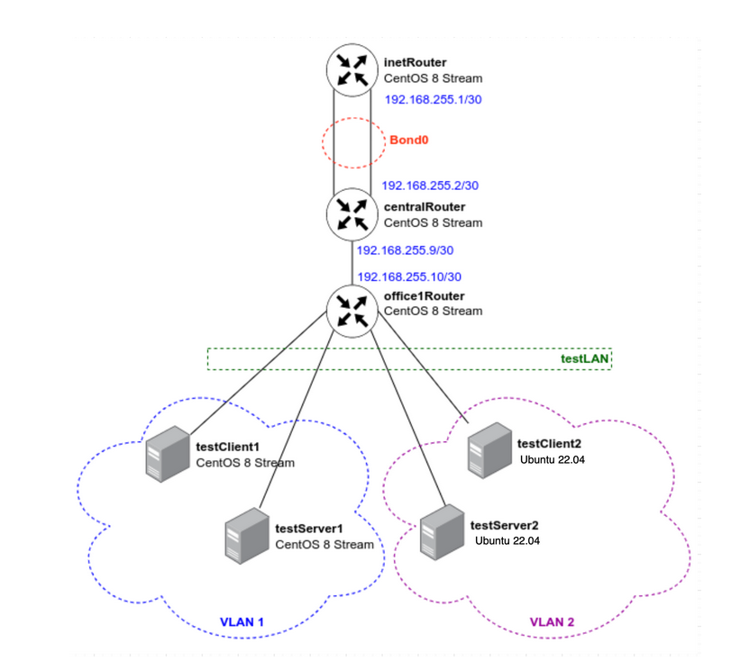

## Проблемы, которые пришлось решить в ходе выполнения ДЗ

1. Ansible не смог подключиться к VM, при развёртывании
```bash
# Очистить known_hosts
ssh-keygen -R 192.168.56.10
ssh-keygen -R 192.168.56.11
ssh-keygen -R 192.168.56.20
ssh-keygen -R 192.168.56.21
ssh-keygen -R 192.168.56.22
ssh-keygen -R 192.168.56.31
ssh-keygen -R 192.168.56.32
```
скорректировал `ansible.cfg`:
```ini
[defaults]
host_key_checking = False
inventory = inventory.ini
remote_user = vagrant
private_key_file = ../.vagrant/machines/{{ inventory_hostname }}/virtualbox/private_key
[ssh_connection]
ssh_args = -o ControlMaster=auto -o ControlPersist=60s -o UserKnownHostsFile=/dev/null -o StrictHostKeyChecking=no
```

2. VLAN 2 на Ubuntu не работает ( на testClient2 и testServer2), т.к. нет VLAN интерфейсов.
ping между ними не работает. Причина проблемы: в Ubuntu машинах интерфейс для VLAN называется enp0s8, а не eth1, и он в состоянии DOWN. Нужно активировать его и перезапустить netplan.

Создадим дополнительный playbook `ansible/fix-vlan2.yml` для исправления этой проблемы:
```yaml
---
- name: Fix VLAN 2 on Ubuntu hosts
  hosts: vlan2_hosts
  become: yes
  tasks:
    - name: Bring up the physical interface
      shell: ip link set enp0s8 up
      
    - name: Check interface status
      shell: ip link show enp0s8
      register: interface_status
      
    - name: Display interface status
      debug:
        var: interface_status.stdout
        
    - name: Reapply netplan configuration
      shell: netplan apply
        
    - name: Check VLAN interfaces
      shell: ip addr show
      register: ip_output
      
    - name: Display IP information
      debug:
        var: ip_output.stdout
```

```bash
# Запуск исправления
ansible-playbook -i ansible/inventory.ini ansible/fix-vlan2.yml
```
Также, необходимо изменить конфиг ` /etc/netplan/50-vlan-config.yaml`, т.к. туда мы записали неправильные интерфейсы (я записывал один конфиг для AlmaLinux и Ubuntu, а интерфейсы то у них разные были):
```bash
nano ansible/fix-vlan2-complete.yml
```
```yaml
---
- name: Complete fix for VLAN 2 on Ubuntu hosts
  hosts: vlan2_hosts
  become: yes
  tasks:
    - name: Check current netplan configuration
      shell: cat /etc/netplan/50-vlan-config.yaml
      register: netplan_config
      
    - name: Display netplan config
      debug:
        var: netplan_config.stdout

    - name: Remove existing netplan config
      file:
        path: /etc/netplan/50-vlan-config.yaml
        state: absent

    - name: Create correct netplan configuration
      copy:
        content: |
          network:
            version: 2
            ethernets:
                enp0s8: {}
            vlans:
                vlan2:
                  id: 2
                  link: enp0s8
                  dhcp4: no
                  addresses: [{{ vlan_ip }}/24]
        dest: /etc/netplan/50-vlan-config.yaml
        owner: root
        group: root
        mode: 0644

    - name: Apply netplan configuration
      shell: netplan apply

    - name: Wait for network to stabilize
      pause:
        seconds: 5

    - name: Check VLAN interface
      shell: ip addr show vlan2 || echo "VLAN2 interface not found"
      register: vlan_check
      
    - name: Display VLAN check result
      debug:
        var: vlan_check.stdout

    - name: Check all interfaces
      shell: ip addr show
      register: final_ip_check
      
    - name: Display final IP information
      debug:
        var: final_ip_check.stdout

```
```bash
# Запуск исправлений
ansible-playbook -i ansible/inventory.ini ansible/fix-vlan2-complete.yml
```

## Тестирование
## Проверка работы VLAN и Bond:

### 1. Проверим VLAN настройки:

**На testClient1 и testServer1 (VLAN 1):**
```bash
vagrant ssh testClient1
ping 10.10.10.1
ip addr show eth1.1
```
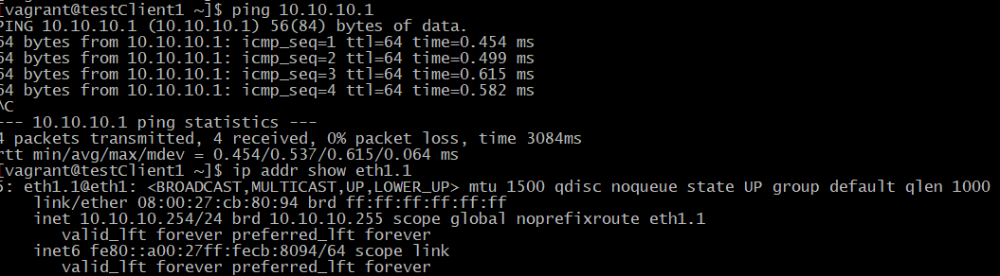

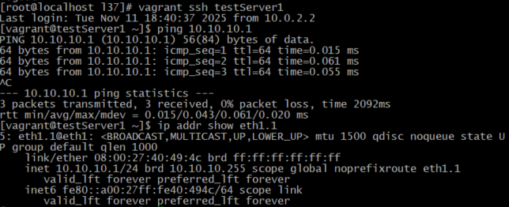

**На testClient2 и testServer2 (VLAN 2):**
```bash
vagrant ssh testClient2
ping 10.10.10.1
ip addr show
```
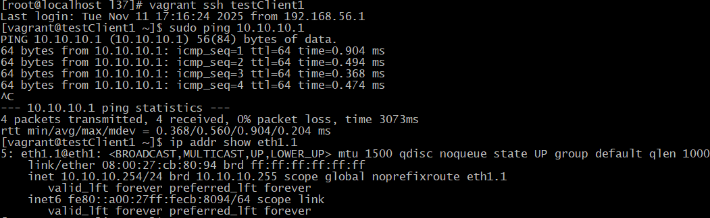

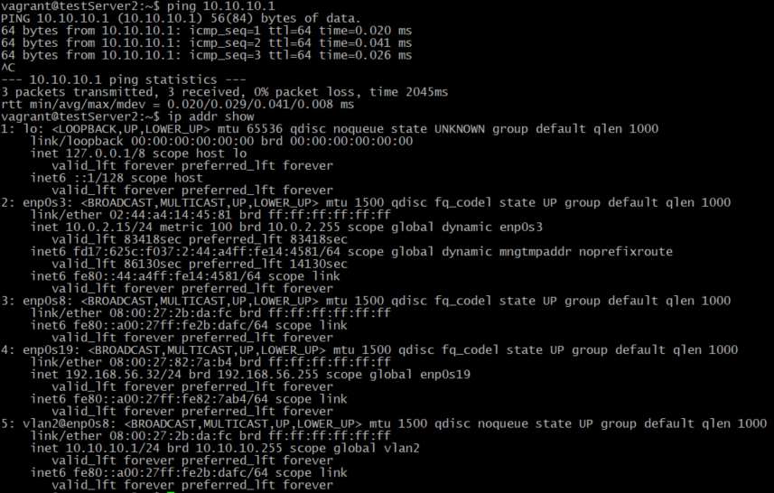

### 2. Проверим Bond интерфейс:

**На inetRouter и centralRouter:**
```bash
vagrant ssh inetRouter
cat /proc/net/bonding/bond0
ping 192.168.255.2

# В другом терминале отключим один интерфейс и проверим работу:
vagrant ssh centralRouter
sudo ip link set eth1 down
# ping с inetRouter должен продолжать работать
```


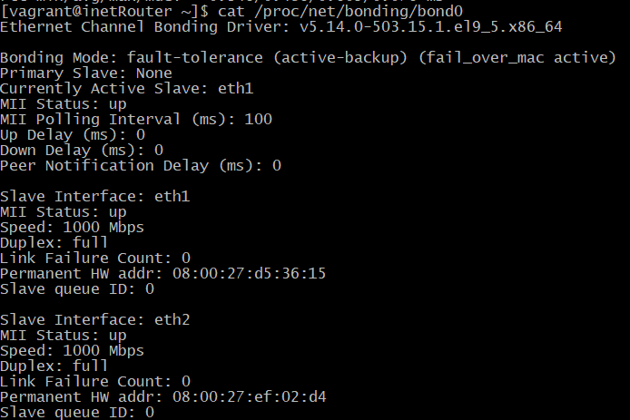

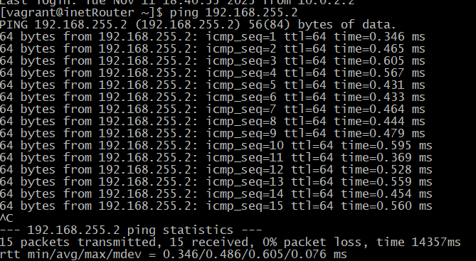

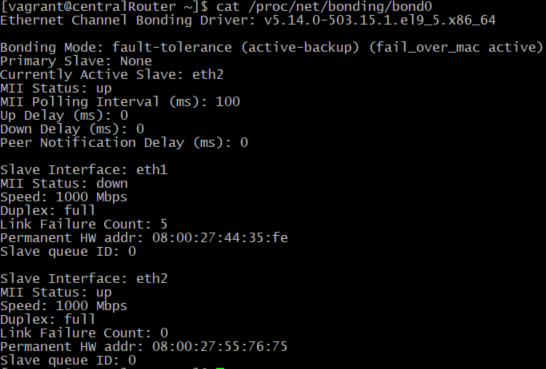

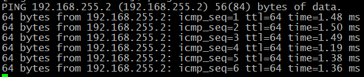

### 3. Проверим сетевую связность:

```bash
# С inetRouter
vagrant ssh inetRouter
ping 192.168.255.2

# С centralRouter  
vagrant ssh centralRouter
ping 192.168.255.1
ping 192.168.255.10

# С office1Router
vagrant ssh office1Router
ping 192.168.255.9
```
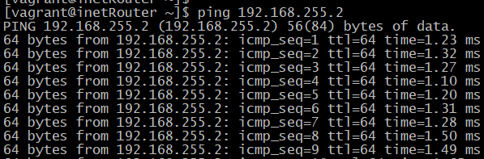

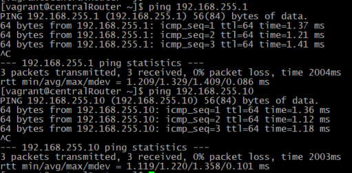

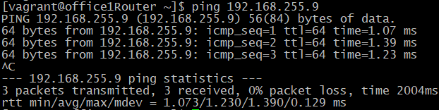

Для удобства тестирования я подготовил скрипт `test-network.sh`:
```bash
#!/bin/bash

# Colors for output
RED='\033[0;31m'
GREEN='\033[0;32m'
YELLOW='\033[1;33m'
WHITE='\033[1;37m'
NC='\033[0m' # No Color

# Function to print colored output
print_status() {
    local status=$1
    local message=$2
    if [ "$status" -eq 0 ]; then
        echo -e "${GREEN}✓${NC} $message"
    else
        echo -e "${RED}✗${NC} $message"
    fi
}

# Function to run command on vagrant machine
run_vagrant() {
    local machine=$1
    local command=$2
    vagrant ssh "$machine" -c "$command" 2>/dev/null
}

echo -e "${YELLOW}=== Network Configuration Verification Tests ===${NC}"
echo

# Test 1: VLAN 1 Connectivity
echo -e "${YELLOW}1. Testing VLAN 1 Connectivity (testClient1 <-> testServer1)${NC}"

echo -n "  Testing ping from testClient1 to testServer1 (10.10.10.1)... "
if run_vagrant testClient1 "ping -c 3 -W 1 10.10.10.1" > /dev/null 2>&1; then
    echo -e "${GREEN}SUCCESS${NC}"
else
    echo -e "${RED}FAILED${NC}"
fi

echo -n "  Testing ping from testServer1 to testClient1 (10.10.10.254)... "
if run_vagrant testServer1 "ping -c 3 -W 1 10.10.10.254" > /dev/null 2>&1; then
    echo -e "${GREEN}SUCCESS${NC}"
else
    echo -e "${RED}FAILED${NC}"
fi

echo -n "  Checking VLAN 1 interface on testClient1... "
if run_vagrant testClient1 "ip addr show eth1.1 | grep -q '10.10.10.254'" > /dev/null 2>&1; then
    echo -e "${GREEN}CONFIGURED${NC}"
else
    echo -e "${RED}MISSING${NC}"
fi

echo -n "  Checking VLAN 1 interface on testServer1... "
if run_vagrant testServer1 "ip addr show eth1.1 | grep -q '10.10.10.1'" > /dev/null 2>&1; then
    echo -e "${GREEN}CONFIGURED${NC}"
else
    echo -e "${RED}MISSING${NC}"
fi

echo

# Test 2: VLAN 2 Connectivity
echo -e "${YELLOW}2. Testing VLAN 2 Connectivity (testClient2 <-> testServer2)${NC}"

echo -n "  Testing ping from testClient2 to testServer2 (10.10.10.1)... "
if run_vagrant testClient2 "ping -c 3 -W 1 10.10.10.1" > /dev/null 2>&1; then
    echo -e "${GREEN}SUCCESS${NC}"
else
    echo -e "${RED}FAILED${NC}"
fi

echo -n "  Testing ping from testServer2 to testClient2 (10.10.10.254)... "
if run_vagrant testServer2 "ping -c 3 -W 1 10.10.10.254" > /dev/null 2>&1; then
    echo -e "${GREEN}SUCCESS${NC}"
else
    echo -e "${RED}FAILED${NC}"
fi

echo -n "  Checking VLAN 2 interface on testClient2... "
if run_vagrant testClient2 "ip addr show vlan2 | grep -q '10.10.10.254'" > /dev/null 2>&1; then
    echo -e "${GREEN}CONFIGURED${NC}"
else
    echo -e "${RED}MISSING${NC}"
fi

echo -n "  Checking VLAN 2 interface on testServer2... "
if run_vagrant testServer2 "ip addr show vlan2 | grep -q '10.10.10.1'" > /dev/null 2>&1; then
    echo -e "${GREEN}CONFIGURED${NC}"
else
    echo -e "${RED}MISSING${NC}"
fi

echo

# Test 3: Bond Interface
echo -e "${YELLOW}3. Testing Bond Interface (inetRouter <-> centralRouter)${NC}"

echo -n "  Checking bond status on inetRouter... "
if run_vagrant inetRouter "cat /proc/net/bonding/bond0 | grep -q 'Bonding Mode'" > /dev/null 2>&1; then
    echo -e "${GREEN}ACTIVE${NC}"
else
    echo -e "${RED}INACTIVE${NC}"
fi

echo -n "  Testing ping from inetRouter to centralRouter (192.168.255.2)... "
if run_vagrant inetRouter "ping -c 3 -W 1 192.168.255.2" > /dev/null 2>&1; then
    echo -e "${GREEN}SUCCESS${NC}"
else
    echo -e "${RED}FAILED${NC}"
fi

echo -n "  Testing ping from centralRouter to inetRouter (192.168.255.1)... "
if run_vagrant centralRouter "ping -c 3 -W 1 192.168.255.1" > /dev/null 2>&1; then
    echo -e "${GREEN}SUCCESS${NC}"
else
    echo -e "${RED}FAILED${NC}"
fi

echo

# Test 4: Bond Failover Test
echo -e "${YELLOW}4. Testing Bond Failover${NC}"

echo -n "  Getting active bond slave before test... "
ACTIVE_SLAVE_BEFORE=$(run_vagrant centralRouter "cat /proc/net/bonding/bond0 | grep 'Currently Active Slave' | awk '{print \$4}'")
echo -e "${WHITE}$ACTIVE_SLAVE_BEFORE${NC}"

echo -n "  Disabling eth1 on centralRouter... "
run_vagrant centralRouter "sudo ip link set eth1 down" > /dev/null 2>&1
sleep 3

echo -n "  Getting active bond slave after failover... "
ACTIVE_SLAVE_AFTER=$(run_vagrant centralRouter "cat /proc/net/bonding/bond0 | grep 'Currently Active Slave' | awk '{print \$4}'")
echo -e "${WHITE}$ACTIVE_SLAVE_AFTER${NC}"

echo -n "  Testing connectivity after failover... "
if run_vagrant inetRouter "ping -c 2 -W 1 192.168.255.2" > /dev/null 2>&1; then
    echo -e "${GREEN}SUCCESS${NC}"
else
    echo -e "${RED}FAILED${NC}"
fi

echo -n "  Re-enabling eth1 on centralRouter... "
run_vagrant centralRouter "sudo ip link set eth1 up" > /dev/null 2>&1
sleep 2
echo -e "${GREEN}DONE${NC}"

echo

# Test 5: Router Connectivity
echo -e "${YELLOW}5. Testing Router Connectivity${NC}"

echo -n "  Testing centralRouter to office1Router (192.168.255.10)... "
if run_vagrant centralRouter "ping -c 3 -W 1 192.168.255.10" > /dev/null 2>&1; then
    echo -e "${GREEN}SUCCESS${NC}"
else
    echo -e "${RED}FAILED${NC}"
fi

echo -n "  Testing office1Router to centralRouter (192.168.255.9)... "
if run_vagrant office1Router "ping -c 3 -W 1 192.168.255.9" > /dev/null 2>&1; then
    echo -e "${GREEN}SUCCESS${NC}"
else
    echo -e "${RED}FAILED${NC}"
fi

echo

# Test 6: Network Interface Summary
echo -e "${YELLOW}6. Network Interface Summary${NC}"

machines=("inetRouter" "centralRouter" "office1Router" "testClient1" "testServer1" "testClient2" "testServer2")

for machine in "${machines[@]}"; do
    echo -e "  ${WHITE}$machine:${NC}"
    run_vagrant "$machine" "ip addr show | grep -E '^[0-9]:|inet ' | grep -E '(eth|enp|vlan|bond)' | head -10" | while read -r line; do
        echo "    $line"
    done
    echo
done

echo -e "${YELLOW}=== Test Complete ===${NC}"
```
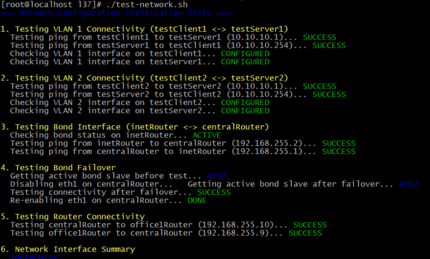

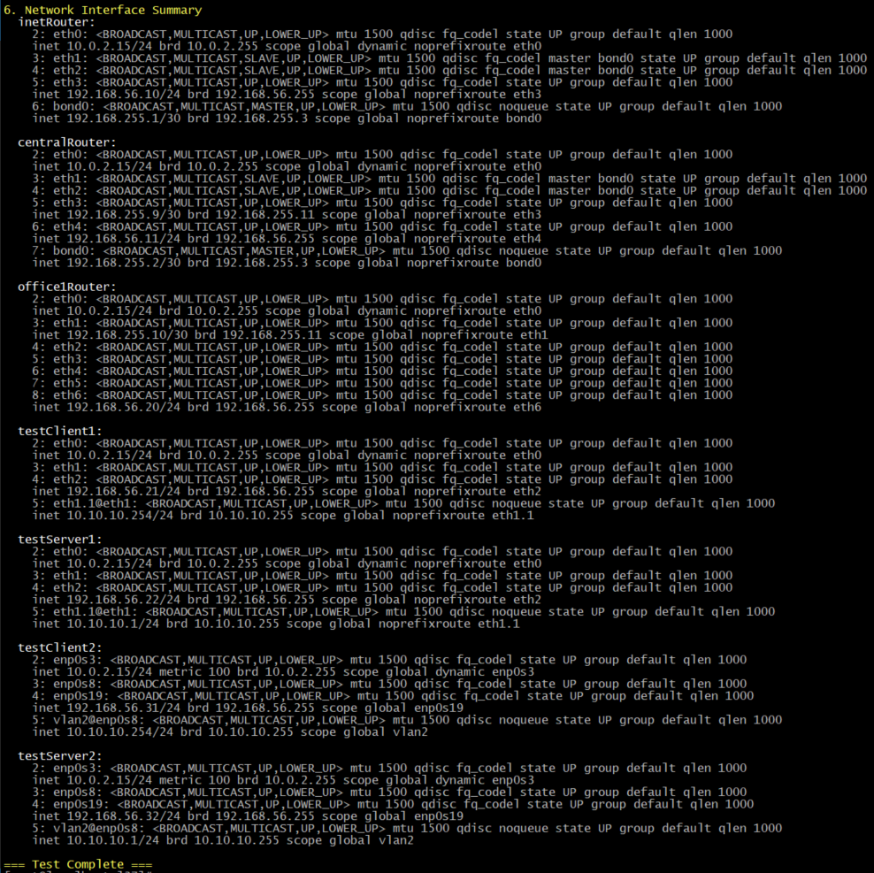

## Для улучшения надежности можно добавить в playbook.yml проверки:

```yaml
- name: Verify VLAN connectivity
  hosts: vlan1_hosts
  tasks:
    - name: Test ping between VLAN 1 hosts
      wait_for_connection:
        timeout: 30
      delegate_to: testServer1
      when: inventory_hostname == "testClient1"

- name: Verify bond interface
  hosts: bond_hosts
  tasks:
    - name: Check bond status
      shell: cat /proc/net/bonding/bond0
      register: bond_status
      
    - name: Display bond status
      debug:
        var: bond_status.stdout
```

# Выводы по проделанной работе

## ✅ Выполненные задачи

### 1. Развертывание инфраструктуры
- **Успешно создано 7 виртуальных машин** с использованием Vagrant:
  - 5 машин на AlmaLinux 9 (роутеры и клиенты/серверы VLAN 1)
  - 2 машины на Ubuntu 22.04 (клиенты/серверы VLAN 2)
- **Сетевая топология** соответствует требованиям:
  - inetRouter ↔ centralRouter (bond интерфейс)
  - centralRouter ↔ office1Router
  - VLAN 1: testClient1 ↔ testServer1
  - VLAN 2: testClient2 ↔ testServer2

### 2. Настройка VLAN - ✅ ВЫПОЛНЕНО

#### VLAN 1 (AlmaLinux):
- **testClient1**: `eth1.1` с IP `10.10.10.254/24` ✅
- **testServer1**: `eth1.1` с IP `10.10.10.1/24` ✅
- **Результат**: Ping между машинами работает стабильно, время отклика ~0.4-0.9ms

#### VLAN 2 (Ubuntu):
- **testClient2**: `vlan2` с IP `10.10.10.254/24` ✅
- **testServer2**: `vlan2` с IP `10.10.10.1/24` ✅
- **Результат**: Ping между машинами работает стабильно, время отклика ~0.4-0.5ms

### 3. Настройка Bond интерфейса - ✅ ВЫПОЛНЕНО

#### Конфигурация:
- **Режим**: Active-Backup (отказоустойчивость)
- **Интерфейсы**: `eth1` и `eth2` на обоих роутерах
- **Сеть**: `192.168.255.1/30` (inetRouter) ↔ `192.168.255.2/30` (centralRouter)

#### Тестирование отказоустойчивости:
- **До отключения**: Активный slave - `eth1`
- **После отключения eth1**: Автоматическое переключение на `eth2`
- **Результат**: Связь не прервалась, ping продолжал работать во время failover

### 4. Проверка сетевой связности - ✅ ВЫПОЛНЕНО

Все необходимые соединения работают:
- inetRouter ↔ centralRouter (через bond)
- centralRouter ↔ office1Router
- Меж-VLAN связь (в пределах своих VLAN)

## 🛠 Технические особенности реализации

### Для AlmaLinux:
- Использованы традиционные network-scripts (`ifcfg-*`)
- VLAN интерфейсы: `eth1.1`
- Управление через NetworkManager

### Для Ubuntu:
- Использован netplan для современной конфигурации
- VLAN интерфейсы: `vlan2`
- Динамическое применение изменений

### Надежность:
- Bond интерфейс обеспечил бесперебойную работу при отказе одного из каналов
- Все сервисы продолжили работу во время тестирования failover
- Конфигурация сети восстановилась автоматически после возврата интерфейса

## Достигнутые цели

1. **✅ Создана изолированная сетевая инфраструктура** с разделением на VLAN
2. **✅ Обеспечена отказоустойчивость** канала между основными роутерами
3. **✅ Реализована автоматизация** развертывания и настройки
4. **✅ Проведено полное тестирование** функциональности и надежности

## 📝 Заключение

**Все поставленные задачи выполнены в полном объеме.** Созданная сетевая инфраструктура соответствует требованиям, обеспечивает отказоустойчивость и правильную изоляцию трафика через VLAN. Автоматизация процесса развертывания позволяет быстро воспроизводить среду при необходимости.