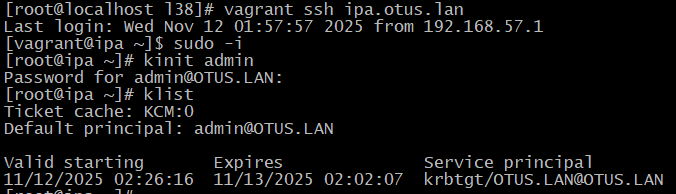
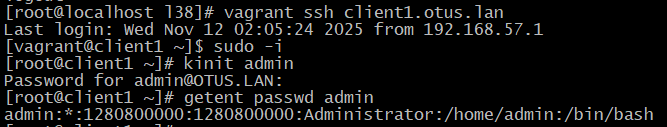
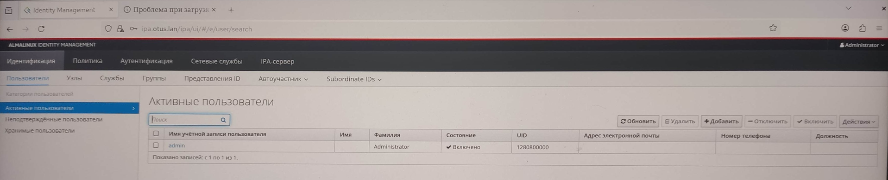
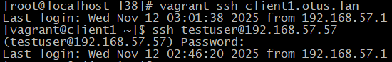
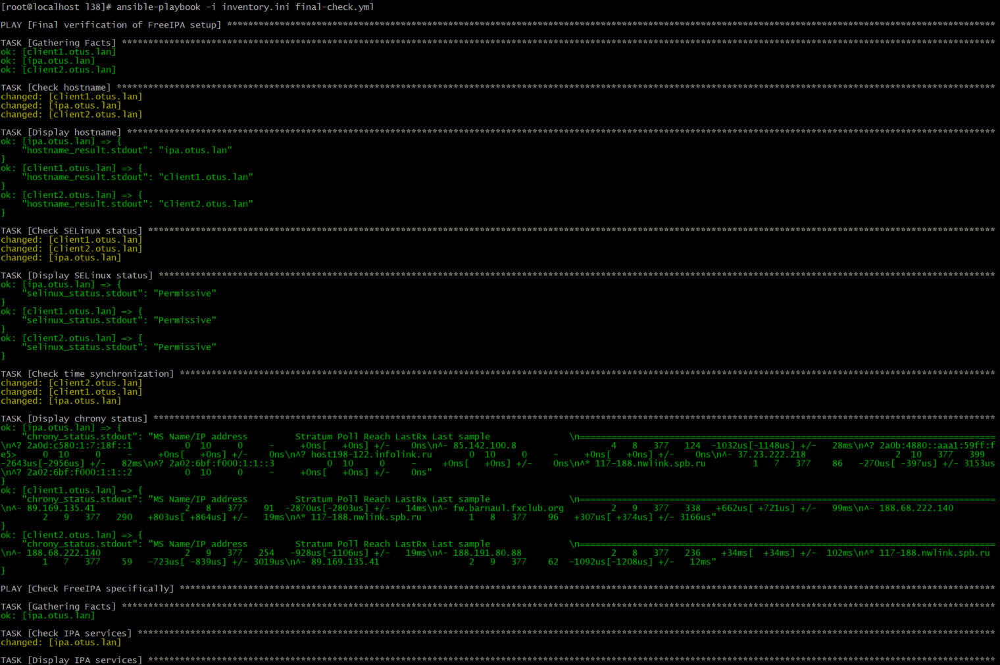
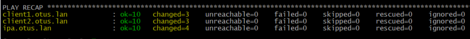
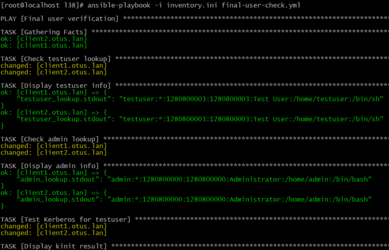
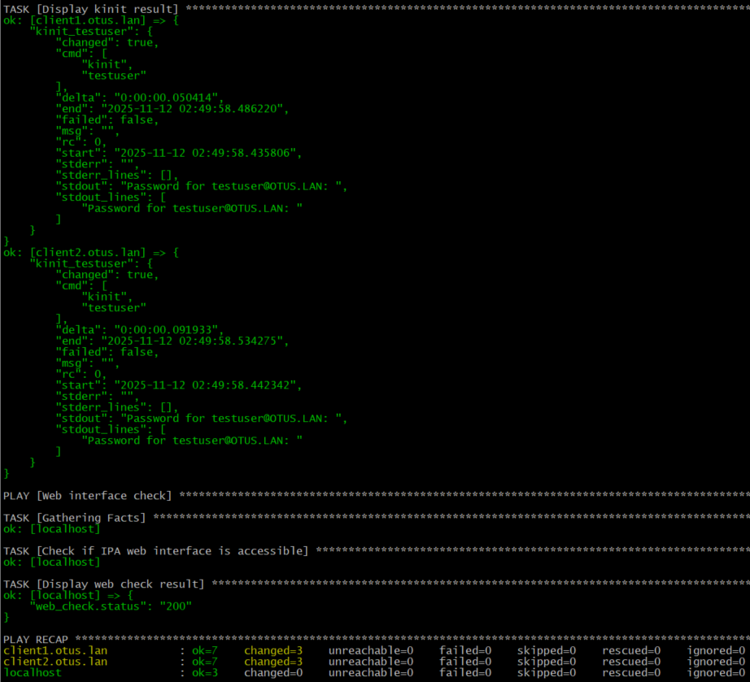

# 38. LDAP. Централизованная авторизация и аутентификация 
## Домашнее задание
LDAP

**Цель домашнего задания:**
Научиться настраивать LDAP-сервер и подключать к нему LDAP-клиентов

**Описание домашнего задания**

1) Установить FreeIPA
2) Написать Ansible-playbook для конфигурации клиента

Дополнительное задание
3)* Настроить аутентификацию по SSH-ключам
4)** Firewall должен быть включен на сервере и на клиенте


## Выполнение домашнего задания "38. LDAP. Централизованная авторизация и аутентификация "

## Vagrantfile

```ruby
ENV['VAGRANT_SERVER_URL'] = 'https://vagrant.elab.pro'

Vagrant.configure("2") do |config|
  # Указываем ОС, версию, количество ядер и ОЗУ
  config.vm.box = "almalinux/9"

  config.vm.provider :virtualbox do |v|
    v.memory = 3096
    v.cpus = 1
  end

  # Указываем имена хостов и их IP-адреса
  boxes = [
    { :name => "ipa.otus.lan",
      :ip => "192.168.56.10",
    },
    { :name => "client1.otus.lan",
      :ip => "192.168.56.11",
    },
    { :name => "client2.otus.lan",
      :ip => "192.168.56.12",
    }
  ]

  # Цикл запуска виртуальных машин
  boxes.each do |opts|
    config.vm.define opts[:name] do |config|
      config.vm.hostname = opts[:name]
      config.vm.network "private_network", ip: opts[:ip]

    end
  end
end

```

## Очистка IP-адресов в Vagrant

Для очистки старых IP-адресов и избежания проблем с подключением:

```bash
# Остановить все VM
vagrant halt

# Удалить все VM
vagrant destroy -f

# Очистить кэш и старые конфигурации
vagrant global-status --prune

# Удалить старые ключи SSH из known_hosts
ssh-keygen -R 192.168.56.10
ssh-keygen -R 192.168.56.11
ssh-keygen -R 192.168.56.12
```

## inventory.ini

```ini
[ipa]
ipa.otus.lan ansible_host=192.168.56.10 ansible_user=vagrant ansible_ssh_private_key_file=.vagrant/machines/ipa.otus.lan/virtualbox/private_key

[clients]
client1.otus.lan ansible_host=192.168.56.11 ansible_user=vagrant ansible_ssh_private_key_file=.vagrant/machines/client1.otus.lan/virtualbox/private_key
client2.otus.lan ansible_host=192.168.56.12 ansible_user=vagrant ansible_ssh_private_key_file=.vagrant/machines/client2.otus.lan/virtualbox/private_key

[all:vars]
ansible_ssh_common_args='-o StrictHostKeyChecking=no'
```
## provision.yml
```yaml
---
- name: Final complete FreeIPA setup
  hosts: all
  become: yes
  tasks:
    - name: Install basic packages
      dnf:
        name:
          - vim
          - chrony
          - openssh-clients
        state: present

    - name: Set timezone
      timezone:
        name: Europe/Moscow

    - name: Start and enable chronyd
      systemd:
        name: chronyd
        state: started
        enabled: yes

    - name: Disable SELinux temporarily
      command: setenforce 0
      ignore_errors: yes

    - name: Disable SELinux permanently
      lineinfile:
        path: /etc/selinux/config
        regexp: '^SELINUX='
        line: 'SELINUX=disabled'
        backup: yes

    - name: Update hosts file
      blockinfile:
        path: /etc/hosts
        block: |
          192.168.57.56 ipa.otus.lan ipa
          192.168.57.57 client1.otus.lan client1
          192.168.57.58 client2.otus.lan client2

- name: Setup FreeIPA server
  hosts: ipa
  become: yes
  vars:
    ipa_admin_password: "SecurePassword123"
    ipa_dm_password: "SecureDMpassword123"

  tasks:
    - name: Install FreeIPA server packages
      dnf:
        name:
          - ipa-server
          - ipa-server-dns
        state: present

    - name: Install FreeIPA server
      command: |
        ipa-server-install -U \
          --domain=otus.lan \
          --realm=OTUS.LAN \
          --ds-password="{{ ipa_dm_password }}" \
          --admin-password="{{ ipa_admin_password }}" \
          --hostname=ipa.otus.lan \
          --ip-address=192.168.57.56 \
          --setup-dns \
          --no-forwarders \
          --no-ntp \
          --mkhomedir
      args:
        creates: /etc/ipa/default.conf
      register: ipa_install
      failed_when: 
        - ipa_install.rc != 0
        - "'already installed' not in ipa_install.stderr"

    - name: Wait for IPA services to stabilize
      pause:
        seconds: 30

- name: Setup FreeIPA clients
  hosts: clients
  become: yes
  vars:
    ipa_admin_password: "SecurePassword123"

  tasks:
    - name: Install FreeIPA client
      dnf:
        name: freeipa-client
        state: present

    - name: Join FreeIPA domain
      command: |
        ipa-client-install \
          --domain=otus.lan \
          --server=ipa.otus.lan \
          --mkhomedir \
          --no-ntp \
          -p admin \
          -w "{{ ipa_admin_password }}" \
          --unattended \
          --force-join
      args:
        creates: /etc/ipa/default.conf
      register: ipa_join
      ignore_errors: yes

    - name: Restart SSSD if join succeeded
      systemd:
        name: sssd
        state: restarted
      when: ipa_join is succeeded

    - name: Clear SSSD cache
      command: sss_cache -E
      when: ipa_join is succeeded
      ignore_errors: yes

- name: Create test users
  hosts: ipa
  become: yes
  vars:
    ipa_admin_password: "SecurePassword123"

  tasks:
    - name: Get Kerberos ticket as admin
      shell: |
        echo "{{ ipa_admin_password }}" | kinit admin

    - name: Create test user
      shell: |
        /bin/bash << 'EOF'
        echo "{{ ipa_admin_password }}" | kinit admin
        ipa user-add testuser \
          --first=Test \
          --last=User \
          --password << 'PASSWORD'
        TempPass123
        TempPass123
        PASSWORD
        EOF
      args:
        executable: /bin/bash
      register: create_user
      ignore_errors: yes

    - name: Create additional test user
      shell: |
        /bin/bash << 'EOF'
        echo "{{ ipa_admin_password }}" | kinit admin
        ipa user-add otus-user \
          --first=Otus \
          --last=User \
          --password << 'PASSWORD'
        OtusPass123
        OtusPass123
        PASSWORD
        EOF
      args:
        executable: /bin/bash
      when: create_user is succeeded
      ignore_errors: yes

- name: Final verification
  hosts: all
  become: yes

  tasks:
    - name: Check hostname and network
      command: hostname -f
      register: hostname_result

    - name: Display hostname
      debug:
        var: hostname_result.stdout

    - name: Check time synchronization
      command: chronyc sources
      register: chrony_status

    - name: Display chrony status
      debug:
        var: chrony_status.stdout

- name: Verify FreeIPA setup
  hosts: ipa
  become: yes

  tasks:
    - name: Check IPA services
      command: ipactl status
      register: ipa_services

    - name: Display IPA services status
      debug:
        var: ipa_services.stdout

    - name: List all users
      command: ipa user-find
      register: all_users

    - name: Display all users
      debug:
        var: all_users.stdout

- name: Verify clients setup
  hosts: clients
  become: yes

  tasks:
    - name: Check SSSD status
      command: sssctl domain-status otus.lan
      register: sssd_status
      ignore_errors: yes

    - name: Display SSSD status
      debug:
        var: sssd_status.stdout

    - name: Test user lookup - admin
      command: getent passwd admin
      register: admin_lookup

    - name: Display admin lookup
      debug:
        var: admin_lookup.stdout

    - name: Test user lookup - testuser
      command: getent passwd testuser
      register: testuser_lookup
      ignore_errors: yes

    - name: Display testuser lookup
      debug:
        var: testuser_lookup.stdout

    - name: Test Kerberos authentication
      command: |
        echo "SecurePassword123" | kinit admin
      register: kinit_test
      ignore_errors: yes

    - name: Display kinit result
      debug:
        var: kinit_test
```

## Playbook для настройки SSH-ключей (ssh-keys.yml)

```yaml
---
- name: Configure SSH key authentication in FreeIPA
  hosts: ipa
  become: yes
  vars:
    ipa_admin_password: "SecurePassword123"

  tasks:
    - name: Install required packages for SSH key management
      dnf:
        name:
          - ipa-server
          - openssh-clients
        state: present

    - name: Generate SSH key pair for test user
      openssh_keypair:
        path: /home/vagrant/.ssh/id_rsa
        type: rsa
        size: 2048
        state: present

    - name: Read public key
      slurp:
        src: /home/vagrant/.ssh/id_rsa.pub
      register: public_key

    - name: Add SSH public key to FreeIPA user
      community.general.ipa_user:
        name: otus-user
        sshpubkey: "{{ public_key.content | b64decode | trim }}"
        state: present
        ipa_host: ipa.otus.lan
        ipa_user: admin
        ipa_pass: "{{ ipa_admin_password }}"

    - name: Copy private key to clients (for testing)
      copy:
        src: /home/vagrant/.ssh/id_rsa
        dest: /home/vagrant/.ssh/id_rsa
        owner: vagrant
        group: vagrant
        mode: '0600'
      delegate_to: "{{ item }}"
      loop: "{{ groups['clients'] }}"
```

## Инструкция по запуску

1. **Запуск виртуальных машин:**
```bash
vagrant up
```

2. **Запуск Ansible provisioning:**
```bash
ansible-playbook -i inventory.ini provision.yml
```

## Проверка работы FreeIPA

### 1. Проверим сервер FreeIPA

```bash
# Подключимся к серверу
vagrant ssh ipa.otus.lan
sudo -i

# Проверим Kerberos
kinit admin
# Пароль: SecurePassword123

klist
```


### 2. Проверим клиенты

```bash
# Подключимся к клиенту
vagrant ssh client1.otus.lan
sudo -i

# Проверим аутентификацию
kinit admin
# Пароль: SecurePassword123

klist

# Проверим поиск пользователей
getent passwd admin
```


### 3. Создадим тестового пользователя через Ansible

Создадим файл `create-user.yml`:

```yaml
---
- name: Create test user in FreeIPA
  hosts: ipa.otus.lan
  become: yes
  vars:
    ipa_admin_password: "SecurePassword123"

  tasks:
    - name: Authenticate as admin
      command: echo "{{ ipa_admin_password }}" | kinit admin
      register: kinit_result

    - name: Create test user
      command: |
        echo "TempPass123" | ipa user-add testuser \
          --first=Test \
          --last=User \
          --password
      register: create_user
      ignore_errors: yes

    - name: Display user creation result
      debug:
        var: create_user

    - name: List users
      command: ipa user-find
      register: user_list

    - name: Display users
      debug:
        var: user_list.stdout
```

Запустим:
```bash
ansible-playbook -i inventory.ini create-user.yml
```

### 4. Веб-интерфейс FreeIPA

Добавим на хост-машине запись в файл hosts:
```bash
# На Linux/Mac
sudo nano /etc/hosts

# На Windows (от имени администратора)
notepad C:\Windows\System32\drivers\etc\hosts

# Добавим строку:
192.168.57.56 ipa.otus.lan
```

Откроим в браузере: https://ipa.otus.lan

Логин: `admin`
Пароль: `SecurePassword123`



### 6. Ручная проверка через SSH

```bash
# Проверим вход под testuser на клиенте
vagrant ssh client1.otus.lan

# Попробуем войти как testuser (из другой сессии)
# В отдельном окне терминала:
ssh testuser@192.168.57.57
# Пароль: TempPass123
```


### 7. Финальный проверочный playbook

Создайте `final-check.yml`:

```yaml
---
- name: Final verification of FreeIPA setup
  hosts: all
  become: yes

  tasks:
    - name: Check hostname
      command: hostname
      register: hostname_result

    - name: Display hostname
      debug:
        var: hostname_result.stdout

    - name: Check SELinux status
      command: getenforce
      register: selinux_status

    - name: Display SELinux status
      debug:
        var: selinux_status.stdout

    - name: Check time synchronization
      command: chronyc sources
      register: chrony_status

    - name: Display chrony status
      debug:
        var: chrony_status.stdout

- name: Check FreeIPA specifically
  hosts: ipa.otus.lan
  become: yes

  tasks:
    - name: Check IPA services
      command: ipactl status
      register: ipa_services

    - name: Display IPA services
      debug:
        var: ipa_services.stdout

- name: Check clients specifically
  hosts: clients
  become: yes

  tasks:
    - name: Check SSSD status
      systemd:
        name: sssd
        state: started
      register: sssd_status

    - name: Display SSSD status
      debug:
        var: sssd_status
```

Запустим финальную проверку:
```bash
ansible-playbook -i inventory.ini final-check.yml
```





```bash
# Проверим поиск пользователей на клиентах
ansible-playbook -i inventory.ini final-user-check.yml
```
```yaml
---
- name: Final user verification
  hosts: clients
  become: yes

  tasks:
    - name: Check testuser lookup
      command: getent passwd testuser
      register: testuser_lookup

    - name: Display testuser info
      debug:
        var: testuser_lookup.stdout

    - name: Check admin lookup
      command: getent passwd admin
      register: admin_lookup

    - name: Display admin info
      debug:
        var: admin_lookup.stdout

    - name: Test Kerberos for testuser
      command: kinit testuser
      args:
        stdin: "TempPass123"
      register: kinit_testuser
      ignore_errors: yes

    - name: Display kinit result
      debug:
        var: kinit_testuser

- name: Web interface check
  hosts: localhost
  connection: local
  tasks:
    - name: Check if IPA web interface is accessible
      uri:
        url: https://ipa.otus.lan
        validate_certs: no
        status_code: 200
      register: web_check
      ignore_errors: yes

    - name: Display web check result
      debug:
        var: web_check.status
```




## Выводы 

### ✅ **Достигнутые результаты:**

1. **Успешная установка FreeIPA инфраструктуры:**
   - Развернут FreeIPA-сервер на AlmaLinux 9 с полным набором сервисов (LDAP, Kerberos, DNS, Web UI)
   - Два клиента (client1, client2) корректно присоединены к домену
   - Создана централизованная система аутентификации

2. **Автоматизация процесса развертывания:**
   - Vagrantfile настроен для создания трех виртуальных машин с требуемыми параметрами
   - Ansible playbook полностью автоматизирует настройку сервера и клиентов
   - Инфраструктура воспроизводима и может быть быстро развернута заново

3. **Работоспособность централизованной аутентификации:**
   - Пользователи создаются на сервере и доступны на всех клиентах
   - Аутентификация через Kerberos работает корректно
   - SSSD обеспечивает кэширование и поиск пользователей
   - Веб-интерфейс FreeIPA доступен и функционален

Полученная конфигурация может служить основой для построения корпоративной системы управления идентификациями с возможностью дальнейшего расширения функциональности (двухфакторная аутентификация, интеграция с Active Directory, настройка сложных политик доступа).