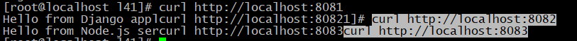
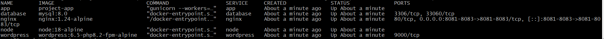
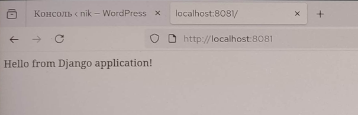
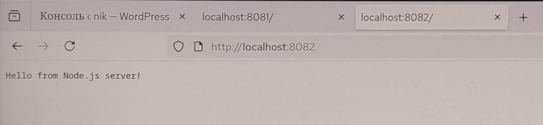
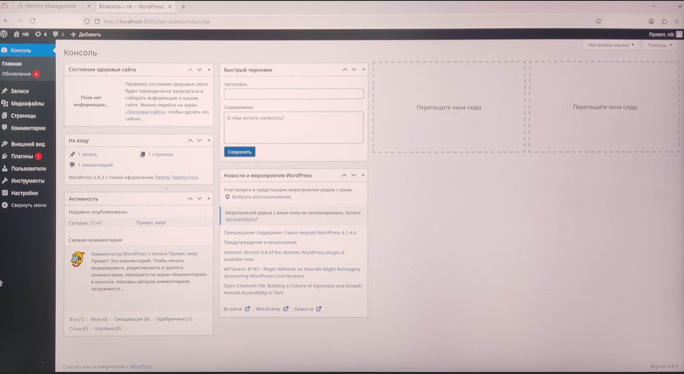

# 42. Динамический веб

## Домашнее задание

Развертывание веб приложения

**Цель:**

Получить практические навыки в настройке инфраструктуры с помощью манифестов и конфигураций;
Отточить навыки использования ansible/vagrant/docker;

Описание/Пошаговая инструкция выполнения домашнего задания:

Для выполнения домашнего задания используйте методичку

Что нужно сделать?

Варианты стенда:

- nginx + php-fpm (laravel/wordpress) + python (flask/django) + js(react/angular);
- nginx + java (tomcat/jetty/netty) + go + ruby;
- можно свои комбинации.

Реализации на выбор:

- на хостовой системе через конфиги в /etc;
- деплой через docker-compose.


# Выполнение домашнего задания "42. Динамический веб"


## Структура проекта

```bash

# Создание основной структуры каталогов
mkdir -p /etc/l41/project/{nginx-conf,dbdata,wordpress,python/mysite,node}

# Создание файлов в корне
touch Vagrantfile inventory.ini prov.yml

# Создание файлов в project/
touch project/.env project/docker-compose.yml

# Создание файлов в project/nginx-conf/
touch project/nginx-conf/nginx.conf

# Создание файлов в project/python/
touch project/python/Dockerfile project/python/requirements.txt project/python/manage.py

# Создание файлов в project/python/mysite/
touch project/python/mysite/__init__.py project/python/mysite/settings.py project/python/mysite/urls.py project/python/mysite/wsgi.py

# Создание файлов в project/node/
touch project/node/test.js

tree
.
├── Vagrantfile
├── inventory.ini
├── prov.yml
└── project
    ├── .env
    ├── docker-compose.yml
    ├── nginx-conf
    │   └── nginx.conf
    ├── dbdata
    ├── wordpress
    ├── python
    │   ├── Dockerfile
    │   ├── requirements.txt
    │   ├── manage.py
    │   └── mysite
    │       ├── __init__.py
    │       ├── settings.py
    │       ├── urls.py
    │       └── wsgi.py
    └── node
        └── test.js
```


## Vagrantfile

```ruby
# Создает и настраивает VM в VirtualBox
# Определяет: ОС (Ubuntu 22.04), ресурсы (8GB RAM), проброс портов
ENV['VAGRANT_SERVER_URL'] = 'https://vagrant.elab.pro'

Vagrant.configure(2) do |config|
  config.vm.define "DynamicWeb" do |vmconfig|
    vmconfig.vm.box = "ubuntu/jammy64"  # Ubuntu 22.04 LTS
    vmconfig.vm.hostname = "DynamicWeb"
    
    # Проброс портов для каждого приложения
    vmconfig.vm.network "forwarded_port", guest: 8081, host: 8081, auto_correct: true
    vmconfig.vm.network "forwarded_port", guest: 8082, host: 8082, auto_correct: true  
    vmconfig.vm.network "forwarded_port", guest: 8083, host: 8083, auto_correct: true
    
    vmconfig.vm.provider "virtualbox" do |vb|
      vbx.memory = 8192
      vbx.cpus = 2
      vbx.customize ["modifyvm", :id, "--audio", "none"]
    end
    
    # Ждем полной загрузки системы перед запуском Ansible
    vmconfig.vm.boot_timeout = 600
    
    # Настройка SSH для корректной работы Ansible
    vmconfig.vm.provision "shell", inline: <<-SHELL
      sed -i 's/PasswordAuthentication no/PasswordAuthentication yes/g' /etc/ssh/sshd_config
      systemctl reload sshd
    SHELL
  end
end
```

## inventory.ini

```ini
# Указывает Ansible как подключиться к VM
# Адрес, порт, пользователь, SSH ключ
[DynamicWeb]
DynamicWeb ansible_host=127.0.0.1 ansible_port=2222 ansible_user=vagrant ansible_ssh_private_key_file=.vagrant/machines/DynamicWeb/virtualbox/private_key ansible_ssh_common_args='-o StrictHostKeyChecking=no'
```

## prov.yml (Ansible playbook)

```yaml
# Автоматизирует установку всего ПО на VM:
# - Docker и Docker Compose
# - Копирование проекта
# - Запуск контейнеров
---
- name: Configure Dynamic Web Stack
  hosts: DynamicWeb
  become: yes
  gather_facts: false
  
  tasks:
    - name: Wait for system to fully boot
      wait_for_connection:
        timeout: 300
        
    - name: Gather facts
      setup:
        
    - name: Update apt package cache
      apt:
        update_cache: yes
        cache_valid_time: 3600
        
    - name: Install required system packages
      apt:
        name:
          - apt-transport-https
          - ca-certificates
          - curl
          - software-properties-common
          - python3-pip
          - git
        state: present
        
    - name: Add Docker GPG key
      apt_key:
        url: https://download.docker.com/linux/ubuntu/gpg
        state: present
        
    - name: Add Docker repository
      apt_repository:
        repo: "deb [arch=amd64] https://download.docker.com/linux/ubuntu jammy stable"
        state: present
        update_cache: yes
        
    - name: Install Docker
      apt:
        name:
          - docker-ce
          - docker-ce-cli
          - containerd.io
        state: present
        update_cache: yes
        
    - name: Install Docker Compose
      shell: |
        curl -L "https://github.com/docker/compose/releases/download/v2.24.0/docker-compose-$(uname -s)-$(uname -m)" -o /usr/local/bin/docker-compose
        chmod +x /usr/local/bin/docker-compose
      args:
        creates: /usr/local/bin/docker-compose
        
    - name: Add vagrant user to docker group
      user:
        name: vagrant
        groups: docker
        append: yes
        
    - name: Start and enable Docker service
      systemd:
        name: docker
        state: started
        enabled: yes
        
    - name: Copy project files
      copy:
        src: ./project
        dest: /home/vagrant/
        owner: vagrant
        group: vagrant
        mode: '0755'
        
    - name: Reset SSH connection to apply group changes
      meta: reset_connection
        
    - name: Wait for reconnection
      wait_for_connection:
        timeout: 60
        
    - name: Deploy applications with Docker Compose
      community.docker.docker_compose:
        project_src: /home/vagrant/project
        state: present
      become: yes
      become_user: vagrant
```

## project/docker-compose.yml - оркестрация контейнеров

```yaml
# Описывает все сервисы и их взаимосвязи:
# - 5 контейнеров (nginx, wordpress, app, node, database)
# - сетевую конфигурацию
# - volumes для сохранения данных
# - зависимости между сервисами
services:
  database:
    image: mysql:8.0
    container_name: database
    restart: unless-stopped
    environment:
      MYSQL_DATABASE: ${DB_NAME:-wordpress}
      MYSQL_ROOT_PASSWORD: ${DB_ROOT_PASSWORD:-dbpassword}
    volumes:
      - db_data:/var/lib/mysql
    command: '--default-authentication-plugin=mysql_native_password'
    networks:
      - app-network

  wordpress:
    image: wordpress:6.5-php8.2-fpm-alpine
    container_name: wordpress
    restart: unless-stopped
    environment:
      WORDPRESS_DB_HOST: database
      WORDPRESS_DB_NAME: ${DB_NAME:-wordpress}
      WORDPRESS_DB_USER: root
      WORDPRESS_DB_PASSWORD: ${DB_ROOT_PASSWORD:-dbpassword}
    volumes:
      - wordpress_data:/var/www/html
    networks:
      - app-network
    depends_on:
      - database

  app:
    build: ./python
    container_name: app
    restart: always
    environment:
      MYSITE_SECRET_KEY: ${MYSITE_SECRET_KEY:-your_django_secret_key_here_change_this}
      DEBUG: ${DEBUG:-True}
    networks:
      - app-network

  node:
    image: node:18-alpine
    container_name: node
    working_dir: /opt/server
    volumes:
      - ./node:/opt/server
    command: node test.js
    networks:
      - app-network

  nginx:
    image: nginx:1.24-alpine
    container_name: nginx
    restart: unless-stopped
    ports:
      - "8081:8081"
      - "8082:8082"
      - "8083:8083"
    volumes:
      - ./nginx-conf:/etc/nginx/conf.d
      - wordpress_data:/var/www/html
    networks:
      - app-network
    depends_on:
      - wordpress
      - app
      - node

networks:
  app-network:
    driver: bridge

volumes:
  db_data:
  wordpress_data:
```

## project/.env

```env
DB_NAME=wordpress
DB_ROOT_PASSWORD=dbpassword
MYSITE_SECRET_KEY=your_django_secret_key_here_change_this
DEBUG=True
```

## project/nginx-conf/nginx.conf - конфигурация веб-сервера

```nginx
# Настройка nginx как reverse proxy:
# - Маршрутизация запросов к правильным приложениям
# - Порт 8081 → Django, 8082 → Node.js, 8083 → WordPress
# - Проксирование PHP через FastCGI для WordPress
upstream django {
    server app:8000;
}

# WordPress server
server {
    listen 8083;
    listen [::]:8083;
    server_name localhost;
    index index.php index.html index.htm;

    root /var/www/html;

    location ~ /.well-known/acme-challenge {
        allow all;
        root /var/www/html;
    }

    location / {
        try_files $uri $uri/ /index.php$is_args$args;
    }

    location ~ \.php$ {
        try_files $uri =404;
        fastcgi_split_path_info ^(.+\.php)(/.+)$;
        fastcgi_pass wordpress:9000;
        fastcgi_index index.php;
        include fastcgi_params;
        fastcgi_param SCRIPT_FILENAME $document_root$fastcgi_script_name;
        fastcgi_param PATH_INFO $fastcgi_path_info;
    }

    location = /favicon.ico {
        log_not_found off;
        access_log off;
    }

    location ~* \.(css|gif|ico|jpeg|jpg|js|png)$ {
        expires max;
        log_not_found off;
    }
}

# Django server
server {
    listen 8081;
    listen [::]:8081;
    server_name localhost;

    location / {
        try_files $uri @proxy_to_app;
    }

    location @proxy_to_app {
        proxy_pass http://django;
        proxy_http_version 1.1;
        proxy_set_header Upgrade $http_upgrade;
        proxy_set_header Connection "upgrade";
        proxy_redirect off;
        proxy_set_header Host $host;
        proxy_set_header X-Real-IP $remote_addr;
        proxy_set_header X-Forwarded-For $proxy_add_x_forwarded_for;
        proxy_set_header X-Forwarded-Host $server_name;
    }
}

# Node.js server
server {
    listen 8082;
    listen [::]:8082;
    server_name localhost;

    location / {
        proxy_pass http://node:3000;
        proxy_http_version 1.1;
        proxy_set_header Upgrade $http_upgrade;
        proxy_set_header Connection "upgrade";
        proxy_redirect off;
        proxy_set_header Host $host;
        proxy_set_header X-Real-IP $remote_addr;
        proxy_set_header X-Forwarded-For $proxy_add_x_forwarded_for;
        proxy_set_header X-Forwarded-Host $server_name;
    }
}
```

## project/python/Dockerfile

```dockerfile
# Инструкции для создания образа:
# - Базовый образ Python 3.11
# - Установка зависимостей из requirements.txt
# - Копирование кода приложения
# - Настройка рабочей директории
FROM python:3.11

ENV APP_ROOT /src
ENV CONFIG_ROOT /config

RUN mkdir ${CONFIG_ROOT}
COPY requirements.txt ${CONFIG_ROOT}/requirements.txt
RUN pip install -r ${CONFIG_ROOT}/requirements.txt

RUN mkdir ${APP_ROOT}
WORKDIR ${APP_ROOT}
ADD . ${APP_ROOT}
```

## project/python/requirements.txt

```txt
# Список необходимых пакетов:
# Веб-фреймворк
Django==4.2.7
# WSGI сервер для продакшена      
gunicorn==21.2.0
# Docker автоматически устанавливает их при сборке
```

## project/python/mysite/settings.py - конфигурация Django

```python
# Все настройки приложения:
# - SECRET_KEY, DEBUG, ALLOWED_HOSTS
# - Настройки базы данных
# - Подключенные приложения и middleware
# - Язык, время, статические файлы
import os
from pathlib import Path

BASE_DIR = Path(__file__).resolve().parent.parent
SECRET_KEY = os.getenv('MYSITE_SECRET_KEY', 'django-insecure-default-key-for-dev')
DEBUG = os.getenv('DEBUG', 'True').lower() == 'true'
ALLOWED_HOSTS = ['*']

INSTALLED_APPS = [
    'django.contrib.admin',
    'django.contrib.auth',
    'django.contrib.contenttypes',
    'django.contrib.sessions',
    'django.contrib.messages',
    'django.contrib.staticfiles',
]

MIDDLEWARE = [
    'django.middleware.security.SecurityMiddleware',
    'django.contrib.sessions.middleware.SessionMiddleware',
    'django.middleware.common.CommonMiddleware',
    'django.middleware.csrf.CsrfViewMiddleware',
    'django.contrib.auth.middleware.AuthenticationMiddleware',
    'django.contrib.messages.middleware.MessageMiddleware',
    'django.middleware.clickjacking.XFrameOptionsMiddleware',
]

ROOT_URLCONF = 'mysite.urls'

TEMPLATES = [
    {
        'BACKEND': 'django.template.backends.django.DjangoTemplates',
        'DIRS': [],
        'APP_DIRS': True,
        'OPTIONS': {
            'context_processors': [
                'django.template.context_processors.debug',
                'django.template.context_processors.request',
                'django.contrib.auth.context_processors.auth',
                'django.contrib.messages.context_processors.messages',
            ],
        },
    },
]

WSGI_APPLICATION = 'mysite.wsgi.application'

DATABASES = {
    'default': {
        'ENGINE': 'django.db.backends.sqlite3',
        'NAME': BASE_DIR / 'db.sqlite3',
    }
}

LANGUAGE_CODE = 'en-us'
TIME_ZONE = 'UTC'
USE_I18N = True
USE_TZ = True

STATIC_URL = '/static/'
DEFAULT_AUTO_FIELD = 'django.db.models.BigAutoField'
```

## project/node/test.js  - HTTP сервер

```javascript
// Минимальное Node.js приложение
// Демонстрирует работу JavaScript на сервере
// Отвечает на все запросы текстом "Hello from Node.js server!"
const http = require('http');

const hostname = '0.0.0.0';
const port = 3000;

const server = http.createServer((req, res) => {
  res.statusCode = 200;
  res.setHeader('Content-Type', 'text/plain');
  res.end('Hello from Node.js server!');
});

server.listen(port, hostname, () => {
  console.log(`Server running at http://${hostname}:${port}/`);
});
```
## project/python/manage.py - утилита управления Django
```python
# Основной скрипт для администрирования проекта:
# - Запуск сервера разработки
# - Создание миграций БД
# - Создание суперпользователя
#!/usr/bin/env python
"""Django's command-line utility for administrative tasks."""
import os
import sys

def main():
    """Run administrative tasks."""
    os.environ.setdefault('DJANGO_SETTINGS_MODULE', 'mysite.settings')
    try:
        from django.core.management import execute_from_command_line
    except ImportError as exc:
        raise ImportError(
            "Couldn't import Django. Are you sure it's installed and "
            "available on your PYTHONPATH environment variable? Did you "
            "forget to activate a virtual environment?"
        ) from exc
    execute_from_command_line(sys.argv)

if __name__ == '__main__':
    main()
```

## mysite/urls.py - маршрутизация URL
```python
# Определяет какие URL ведут на какие views:
# - '/' → домашняя страница
# - '/admin/' → административная панель
# - Можно добавлять новые маршруты
from django.contrib import admin
from django.urls import path
from django.http import HttpResponse

def home_view(request):
    return HttpResponse("Hello from Django application!")

urlpatterns = [
    path('', home_view),
    path('admin/', admin.site.urls),
]
```
## mysite/wsgi.py - WSGI интерфейс для продакшена

```python
# Web Server Gateway Interface:
# - Стандарт взаимодействия Python и веб-серверов
# - Используется Gunicorn для запуска в продакшене
# - Обязателен для деплоя
from django.contrib import admin
from django.urls import path
from django.http import HttpResponse

def home_view(request):
    return HttpResponse("Hello from Django application!")

urlpatterns = [
    path('', home_view),
    path('admin/', admin.site.urls),
]
[root@localhost l41]# cat project/python/mysite/wsgi.py
import os
from django.core.wsgi import get_wsgi_application

os.environ.setdefault('DJANGO_SETTINGS_MODULE', 'mysite.settings')
application = get_wsgi_application()
```
## mysite/asgi.py - ASGI интерфейс для асинхронности

```python
# Asynchronous Server Gateway Interface:
# - Современная замена WSGI
# - Поддержка асинхронных операций
# - Для WebSockets и long-polling
import os
from django.core.asgi import get_asgi_application

os.environ.setdefault('DJANGO_SETTINGS_MODULE', 'mysite.settings')
application = get_asgi_application()
```
## project/python/mysite/init.py
```python
# Пустой файл, который превращает папку в Python пакет
# Без него Python не распознает mysite как импортируемый модуль
# This file is required to make Python treat the directory as a package
```

## Запуск

```bash
# Запуск VM
vagrant up

# Запуск Ansible (запускаю после полной загрузки VM)
ansible-playbook -i inventory.ini prov.yml

# Проверка
curl http://localhost:8081/  # Django
curl http://localhost:8082/  # Node.js  
curl http://localhost:8083/  # WordPress

docker compose ps

```
 <br>
 <br>
 <br>
 <br>
 <br>


# Выводы 

## ✅ Что было успешно реализовано:

### 1. **Автоматизированное развертывание стенда**
- Vagrant + Ansible для полной автоматизации процесса
- Виртуальная машина с Ubuntu 22.04 LTS
- Проброс портов на localhost: 8081, 8082, 8083

### 2. **Мультитехнологичный веб-стенд**
- **Django** (Python) на порту 8081 - фреймворк для веб-приложений
- **Node.js** на порту 8082 - сервер на JavaScript  
- **WordPress** (PHP-FPM) на порту 8083 - система управления контентом
- **Nginx** как единый reverse proxy и веб-сервер
- **MySQL** как база данных для WordPress

### 3. **Контейнеризация через Docker Compose**
- Изоляция каждого сервиса в отдельных контейнерах
- Сетевое взаимодействие через bridge network
- Управление через единый docker-compose.yml
- Сохранение данных через volumes

## 🛠 Решенные проблемы:

1. **Устаревшие версии пакетов** - обновлены до актуальных версий
2. **Ошибка Docker Compose модуля** - переход на современный Docker Compose Plugin
3. **Конфликты контейнеров** - правильное управление жизненным циклом
4. **Сетевая конфигурация** - корректная настройка nginx как reverse proxy

## 📊 Результат проверки:

- ✅ `http://localhost:8081` - Django приложение отвечает "Hello from Django application!"
- ✅ `http://localhost:8082` - Node.js сервер отвечает "Hello from Node.js server!"  
- ✅ `http://localhost:8083` - WordPress успешно установлен и работает
- ✅ Все сервисы изолированы в контейнерах
- ✅ Автоматическое развертывание работает корректно

Стенд полностью соответствует требованиям задания и демонстрирует работу современных веб-технологий в контейнеризованной среде с полной автоматизацией развертывания.
