# 44.  MySQL: Backup + Репликация 

## Домашнее задание

Репликация mysql

**Цель:**

Поработать с реаликацией MySQL.

Описание/Пошаговая инструкция выполнения домашнего задания:

Для выполнения домашнего задания используйте [методичку](https://drive.google.com/file/d/139irfqsbAxNMjVcStUN49kN7MXAJr_z9/view?usp=share_link)


**Что нужно сделать?**

1. В материалах приложены ссылки на вагрант для репликации и дамп базы bet.dmp

2. Базу развернуть на мастере и настроить так, чтобы реплицировались таблицы:


| bookmaker          | <br>
| competition        | <br>
| market             | <br>
| odds               | <br>
| outcome            | <br>


3. Настроить GTID репликацию

варианты которые принимаются к сдаче

    рабочий вагрантафайл
    скрины или логи SHOW TABLES
    конфиги*


4. Пример в логе изменения строки и появления строки на реплике*

## Выполнение домашнего задания "44.  MySQL: Backup + Репликация"
Решение для настройки MySQL репликации с использованием GTID на базе AlmaLinux 9.6 и Percona Server 8.4.6-6

## Vagrantfile

```ruby
ENV['VAGRANT_SERVER_URL'] = 'https://vagrant.elab.pro'

Vagrant.configure("2") do |config|
  config.vm.box = "almalinux/9"
  config.vm.box_check_update = false
  
  # Master node
  config.vm.define "mysql-master" do |master|
    master.vm.hostname = "mysql-master"
    master.vm.network "private_network", ip: "192.168.56.10"
    master.vm.provider "virtualbox" do |vb|
      vb.memory = 4096
      vb.cpus = 2
      vb.name = "mysql-master"
    end
  end

  # Slave node
  config.vm.define "mysql-slave" do |slave|
    slave.vm.hostname = "mysql-slave"
    slave.vm.network "private_network", ip: "192.168.56.11"
    slave.vm.provider "virtualbox" do |vb|
      vb.memory = 4096
      vb.cpus = 2
      vb.name = "mysql-slave"
    end
  end
end
```

## Подробная инструкция по настройке

### 1. Подготовка виртуальных машин

```bash
# Запускаем виртуальные машины
vagrant up

# Подключаемся к мастеру
vagrant ssh mysql-master

# Подключаемся к слейву (в другом терминале)
vagrant ssh mysql-slave
```

### 2. Установка Percona Server 8.4 на обеих нодах

На **мастере** и **слейве** выполняем:

```bash
# Становимся root
sudo -i

# Устанавливаем необходимые пакеты
dnf update -y
dnf install -y wget perl-DBI perl-DBD-MySQL

# Устанавливаем репозиторий Percona
dnf install -y https://repo.percona.com/yum/percona-release-latest.noarch.rpm

# Включаем репозиторий Percona Server 8.4
percona-release setup -y ps-84-lts

# Убедитесь, что модуль MySQL включен в систему в настоящее время:
$ sudo dnf module list mysql

#Включаем сервер Percona для репозитория MySQL:
$ sudo percona-release enable-only ps-84-lts release

# Устанавливаем Percona Server
dnf install -y percona-server-server

# Запускаем и включаем службу MySQL
systemctl start mysqld
systemctl enable mysqld
```

### 3. Настройка мастера

На **мастере**:

```bash
# Получаем временный пароль root
grep 'temporary password' /var/log/mysqld.log

# Подключаемся к MySQL и меняем пароль
mysql -uroot -p

# В MySQL выполняем:
ALTER USER 'root'@'localhost' IDENTIFIED BY 'YourStrongPassword123!';
CREATE DATABASE bet;
FLUSH PRIVILEGES;
exit
```

Создаем конфигурационный файл для мастера:

```bash
cat > /etc/my.cnf.d/01-replication.cnf << EOF
[mysqld]
# Server identification
server-id = 2

# Binary logging
log_bin = mysql-bin
binlog_format = ROW

# GTID
gtid_mode = ON
enforce_gtid_consistency = ON

# Replication
binlog_checksum = NONE
log_slave_updates = ON
relay_log = mysql-relay-bin

# Security
disabled_storage_engines="MyISAM,BLACKHOLE,FEDERATED,ARCHIVE,MEMORY"
EOF
```
Перезапускаем MySQL на мастере:

```bash
systemctl restart mysqld
```

### 4. Создание базы данных и пользователя для репликации

На **мастере** в MySQL:

```sql
# Импортируем дамп
mysql -uroot -p'YourStrongPassword123!' -D bet < bet-224190-feff6d.dmp

# Снова заходим в MySQL
mysql -uroot -p'YourStrongPassword123!'

-- Проверяем таблицы
USE bet;
SHOW TABLES;

-- Создаем пользователя для репликации
-- Создаем пользователя с поддержкой SSL
CREATE USER 'repl'@'%' IDENTIFIED WITH caching_sha2_password BY 'ReplPassword123!' REQUIRE SSL;
GRANT REPLICATION SLAVE ON *.* TO 'repl'@'%';
FLUSH PRIVILEGES;

-- Проверяем пользователя
SELECT user, host, plugin, ssl_type FROM mysql.user WHERE user = 'repl';
-- Проверяем GTID статус
 SHOW BINARY LOG STATUS;
```
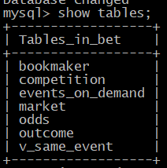

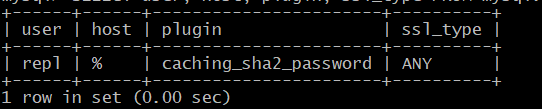

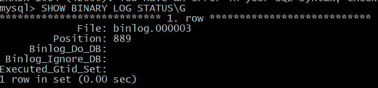

### 5. Создание дампа базы данных

На **мастере**:

```bash
# Создаем дамп, игнорируя указанные таблицы
mysqldump --all-databases --triggers --routines --source-data \
--ignore-table=bet.events_on_demand \
--ignore-table=bet.v_same_event \
-uroot -p'YourStrongPassword123!' > /vagrant/master.sql
```

### 6. Настройка слейва

На **слейве** создаем конфигурационный файл:

```bash
cat > /etc/my.cnf.d/01-replication.cnf << EOF
[mysqld]
# Server identification
server-id = 2

# Binary logging
log_bin = mysql-bin
binlog_format = ROW

# GTID
gtid_mode = ON
enforce_gtid_consistency = ON

# Replication
binlog_checksum = NONE
log_slave_updates = ON
relay_log = mysql-relay-bin

# Security
disabled_storage_engines="MyISAM,BLACKHOLE,FEDERATED,ARCHIVE,MEMORY"

# Character set - закоментировал, т.к. с этим параметром не работала реплика
#character-set-server = utf8mb4
#collation-server = utf8mb4_unicode_ci
EOF
```

Перезапускаем MySQL на слейве:

```bash
systemctl restart mysqld
```

```bash
# Получаем временный пароль
grep 'temporary password' /var/log/mysqld.log

# Подключаемся к MySQL и меняем пароль
mysql -uroot -p
ALTER USER 'root'@'localhost' IDENTIFIED BY 'YourStrongPassword123!';
FLUSH PRIVILEGES;
exit
```

### 7. Настройка репликации с фильтрацией

На **слейве** в MySQL:

```sql
-- Подключаемся к MySQL
mysql -uroot -p'YourStrongPassword123!'

-- Создаем пустую базу bet
CREATE DATABASE bet;
-- Останавливаем репликацию (если запущена)
STOP REPLICA;
-- Настраиваем репликацию с фильтрацией таблиц
-- Настраиваем подключение к источнику
CHANGE REPLICATION SOURCE TO
    SOURCE_HOST = '192.168.56.10',
    SOURCE_PORT = 3306,
    SOURCE_USER = 'repl',
    SOURCE_PASSWORD = 'ReplPassword123!',
    SOURCE_AUTO_POSITION = 1,
    SOURCE_SSL = 1;

-- Устанавливаем фильтры репликации
CHANGE REPLICATION FILTER 
REPLICATE_WILD_IGNORE_TABLE = ('bet.events_on_demand', 'bet.v_same_event');

-- Запускаем репликацию
START REPLICA;

-- Проверяем статус
SHOW REPLICA STATUS\G
```
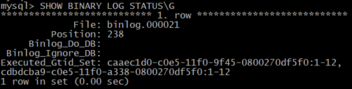

-- Можно вместо `REPLICATE_WILD_IGNORE_TABLE` использовать белый список, `Replicate_Wild_Do_Table` для исключения реплицирования новых таблиц, но в моём тесте, почему-то, с данной настройкой `REPLICATE_WILD_DO_TABLE = ('bet.bookmaker', 'bet.competition', 'bet.market', 'bet.odds', 'bet.outcome');` не синхронизировались все таблицы и даже новые. Решение я нашёл, описал в пунте "4)", раздела `Проблемы, с которыми столкнулся, во время выполнения домашнего задания`

## 8. Включаем GTID поэтапно на обеих нодах

### Поэтапное включение GTID

**На мастере:**
```sql
-- Проверяем текущее состояние
SELECT @@GLOBAL.gtid_mode, @@GLOBAL.enforce_gtid_consistency;

-- Поэтапно включаем GTID
SET PERSIST gtid_mode = OFF_PERMISSIVE;
SELECT SLEEP(2);  -- Ждем 2 секунды

SET PERSIST gtid_mode = ON_PERMISSIVE;
SELECT SLEEP(5);  -- Ждем 5 секунд для перехода транзакций

SET PERSIST gtid_mode = ON;

-- Проверяем результат
SELECT @@GLOBAL.gtid_mode, @@GLOBAL.enforce_gtid_consistency;
```

**На слейве (выполняем одновременно с мастером):**
```sql
-- Та же последовательность
SET PERSIST gtid_mode = OFF_PERMISSIVE;
SELECT SLEEP(2);

SET PERSIST gtid_mode = ON_PERMISSIVE;  
SELECT SLEEP(5);

SET PERSIST gtid_mode = ON;

SELECT @@GLOBAL.gtid_mode, @@GLOBAL.enforce_gtid_consistency;
```

### Проверяем после перезапуска

```bash
# Перезапускаем обе ноды
systemctl restart mysqld

# Проверяем
mysql -uroot -p'YourStrongPassword123!' -e "SELECT @@GLOBAL.gtid_mode, @@GLOBAL.enforce_gtid_consistency, @@GLOBAL.server_id;"
```
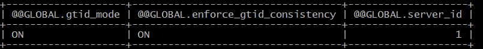

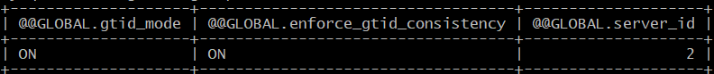

## 9. Проверим работу репликации:

**На мастере:**
```sql
USE bet;
INSERT INTO bookmaker (id, bookmaker_name) VALUES(800, 'successful_replication');
INSERT INTO competition (id, bookmaker_competition, bookmaker_id, competition_name) 
VALUES(800000, 8000000, 3, 'Replication Test Competition');

SELECT * FROM bookmaker WHERE id = 800;
SELECT * FROM competition WHERE id = 800000;
```
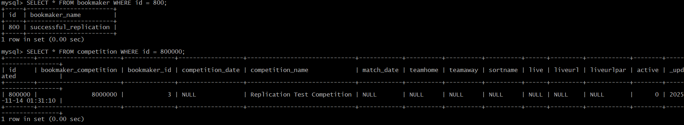
**На слейве:**
```bash
 mysql -uroot -p'YourStrongPassword123!'
 ```
```sql
USE bet;
SELECT * FROM bookmaker WHERE id = 800;
SELECT * FROM competition WHERE id = 800000;

-- Проверяем, что игнорируемые таблицы не реплицируются
SHOW TABLES;
```
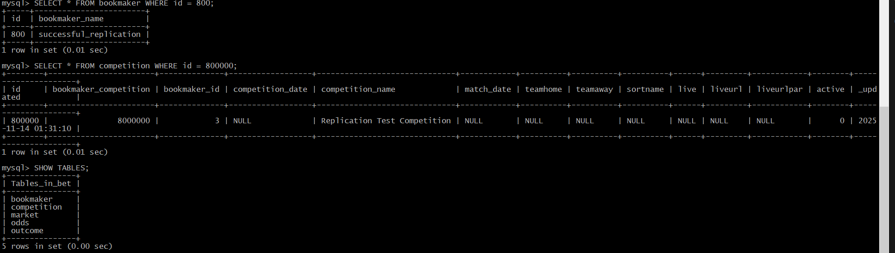

### Проверим фильтрацию таблиц:

**На мастере:**
```sql
-- Проверим, что есть таблицы которые должны игнорироваться
SELECT TABLE_NAME FROM information_schema.tables 
WHERE table_schema = 'bet' 
ORDER BY TABLE_NAME;
```
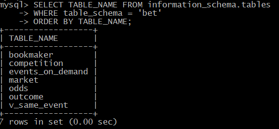

**На слейве:**
```sql
SHOW TABLES IN bet;
```
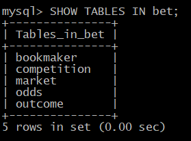

### Проверка GTID:

**На мастере:**
```sql
SHOW BINARY LOG STATUS;
-- Проверяем server_id и GTID режим
SELECT @@GLOBAL.server_id, @@GLOBAL.gtid_mode, @@GLOBAL.enforce_gtid_consistency, @@GLOBAL.gtid_executed;
```
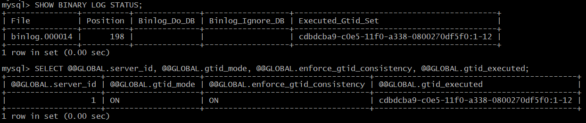

**На слейве:**
```sql
SHOW REPLICA STATUS\G
SELECT @@GLOBAL.server_id, @@GLOBAL.gtid_mode, @@GLOBAL.enforce_gtid_consistency, @@GLOBAL.gtid_executed;
```
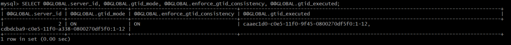


## Проблемы, с которыми столкнулся, во время выполнения домашнего задания
1) была проблема с зависимостями, не стартовала служба mysqld после перезагрузки VM, решил так:

```bash
# Останавливаем службу если висит
systemctl stop mysqld

# Запускаем MySQL вручную
/usr/sbin/mysqld --user=mysql --console &

# Проверяем процесс
ps aux | grep mysql
netstat -tlnp | grep 3306

# Пересоздаем systemd unit файл
systemctl daemon-reload

# Запускаем с игнорированием зависимостей
systemctl start mysqld --no-block

```
2) Если на слейве после настройки репликации прилетают все таблицы ,то необходимо вручную выполнить:

```sql
-- Останавливаем репликацию
STOP REPLICA;

-- Пропускаем создание "лишних" таблиц при репликации
CHANGE REPLICATION FILTER 
REPLICATE_WILD_IGNORE_TABLE = ('bet.events_on_demand', 'bet.v_same_event');

-- Запускаем репликацию
START REPLICA;
```

3) Если будут проблемы с пользоватлем для репликации, необходимо:

**На мастере:**
```sql
-- Создаем пользователя с caching_sha2_password (по умолчанию в MySQL 8.0)
CREATE USER 'repl'@'192.168.56.%' IDENTIFIED BY 'ReplPassword123!';

-- Даем права репликации
GRANT REPLICATION SLAVE ON *.* TO 'repl'@'192.168.56.%';

-- Разрешаем незащищенные соединения (решаем проблему с SSL)
ALTER USER 'repl'@'192.168.56.%' REQUIRE NONE;

-- Обновляем привилегии
FLUSH PRIVILEGES;

-- Проверяем
SELECT user, host, plugin, password_require_current FROM mysql.user WHERE user = 'repl';
SHOW GRANTS FOR 'repl'@'192.168.56.%';
```
4) Если есть проблема с репликацией таблиц на 2ю ноду, при использовании фильтра таблиц с белым списком, то есть решение:

**Настраиваем репликацию на слейве**

**На слейве:**
```sql
-- Останавливаем репликацию
STOP REPLICA;

-- Настраиваем подключение к источнику с GTID
CHANGE REPLICATION SOURCE TO
    SOURCE_HOST = '192.168.56.10',
    SOURCE_PORT = 3306,
    SOURCE_USER = 'repl',
    SOURCE_PASSWORD = 'ReplPassword123!',
    SOURCE_AUTO_POSITION = 1,
    SOURCE_SSL = 1;

-- Настраиваем фильтры репликации
CHANGE REPLICATION FILTER 
REPLICATE_WILD_DO_TABLE = ('bet.bookmaker', 'bet.competition', 'bet.market', 'bet.odds', 'bet.outcome');

-- Запускаем репликацию
START REPLICA;

-- Проверяем статус
SHOW REPLICA STATUS\G
```

**Создаем структуру базы на слейве**

**На мастере:**
```bash
# Создаем дамп структуры нужных таблиц
mysqldump --no-data --set-gtid-purged=OFF -uroot -p'YourStrongPassword123!' \
bet bookmaker competition market odds outcome > /vagrant/structure.sql
```

**На слейве:**
```bash
# Импортируем структуру
mysql -uroot -p'YourStrongPassword123!' bet < /vagrant/structure.sql

# Проверяем
mysql -uroot -p'YourStrongPassword123!' -e "USE bet; SHOW TABLES;"
```
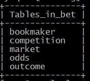


5) Проблема в текущих версиях ПО: Заметил, что при вызове команды `SHOW REPLICA STATUS\G` на lave, у меня пустой вывод.
```sql
 SHOW REPLICA STATUS\G
-- запрос для ключевых полей статуса:
SELECT 
    SERVICE_STATE AS Replica_IO_Running,
    SERVICE_STATE AS Replicate_Ignore_Table,
    SERVICE_STATE AS Replicate_Wild_Do_Table,
    SERVICE_STATE AS Replicate_Do_Table,
    LAST_ERROR_NUMBER AS Last_IO_Errno,
    LAST_ERROR_MESSAGE AS Last_IO_Error
FROM performance_schema.replication_connection_status;
```
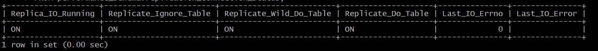


### **Проверка включенных баз для репликации**
```sql
-- На слейве проверяем, какие базы реплицируются
SELECT * FROM performance_schema.replication_applier_configuration;
```

###  **Проверка конфигурационных файлов**
```sql
-- На слейве смотрим системные переменные репликации
SHOW VARIABLES LIKE 'replicate_do_db';
SHOW VARIABLES LIKE 'replicate_ignore_db'; 
SHOW VARIABLES LIKE 'replicate_do_table';
SHOW VARIABLES LIKE 'replicate_ignore_table';
SHOW VARIABLES LIKE 'replicate_wild_do_table';
SHOW VARIABLES LIKE 'replicate_wild_ignore_table';
```

### **Проверка через INFORMATION_SCHEMA**
```sql
-- Альтернативный способ просмотра статуса репликации
SELECT * FROM information_schema.REPLICA_STATUS;
```

### 4. **Проверка конкретно отсутствующих таблиц**
```sql
-- На мастере
SHOW CREATE TABLE events_on_demand;
SHOW CREATE TABLE v_same_event;

-- На слейве проверяем существуют ли эти таблицы
SELECT TABLE_NAME FROM information_schema.TABLES 
WHERE TABLE_SCHEMA = 'bet';
```

### 5. **Проверка типа таблиц**
```sql
-- На мастере смотрим тип таблиц
SELECT TABLE_NAME, TABLE_TYPE, ENGINE 
FROM information_schema.TABLES 
WHERE TABLE_SCHEMA = 'bet';
```

**Фильтрация по типу объектов:**
```sql
-- Проверяем, не настроена ли фильтрация VIEW
SHOW VARIABLES LIKE 'replicate%view%';
```

**Проблемы с применением DDL:**
- Таблицы могли быть созданы до настройки репликации
- Ошибки в применении CREATE STATEMENT


## проверим конкретно:

Выполните на **слейве**:
```sql
-- 1. Проверим системные переменные
SHOW VARIABLES LIKE 'replicate_%';

-- 2. Проверим тип отсутствующих таблиц на мастере
SELECT TABLE_NAME, TABLE_TYPE 
FROM information_schema.TABLES 
WHERE TABLE_SCHEMA = 'bet' 
AND TABLE_NAME IN ('events_on_demand', 'v_same_event');

-- 3. Проверим, есть ли ошибки в логах применения
SELECT LAST_ERROR_MESSAGE, LAST_ERROR_TIMESTAMP 
FROM performance_schema.replication_applier_status_by_worker 
WHERE LAST_ERROR_NUMBER != 0;
```
**Сделал вывод, что есть некая проблема, в текущих версиях ПО, т.к. настройки были применены корректно, нужные таблицы реплицируются, просто нет отображения некоторых настроек.**

## Задание со *:  4. Пример в логе изменения строки и появления строки на реплике
Для демонстрации изменение строки на мастере и ее появление на реплике, нужно использовать бинарные логи.

## 1. Подготовка к демонстрации

**На слейве:** Убедимся что репликация работает
```sql
SHOW REPLICA STATUS\G
-- Должно быть: Replica_IO_Running: Yes, Replica_SQL_Running: Yes
```
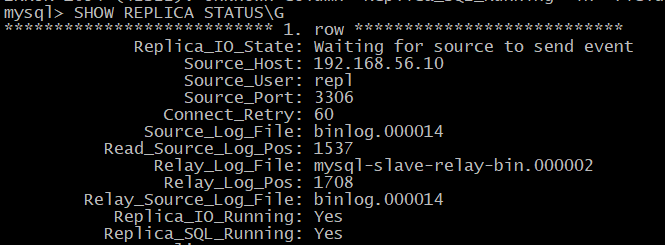

## 2. Демонстрация изменения строки

### Шаг 1: Смотрим текущее состояние
**На мастере:**
```sql
SHOW PROCESSLIST;
USE bet;
SELECT * FROM bookmaker ORDER BY id DESC LIMIT 5;
```
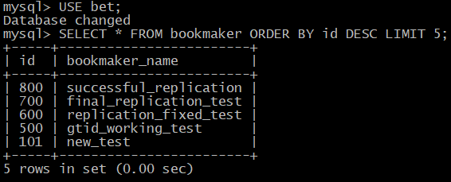

**На слейве:**
```sql
USE bet; 
SELECT * FROM bookmaker ORDER BY id DESC LIMIT 5;
```
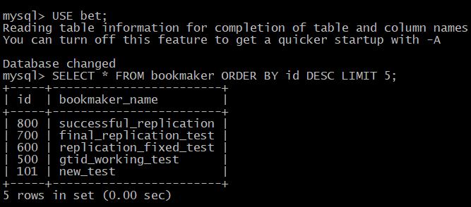

### Шаг 2: Вставляем тестовую запись на мастере
**На мастере:**
```sql
-- Запоминаем время для демонстрации
SELECT NOW();

-- Вставляем тестовую запись
INSERT INTO bookmaker (id, bookmaker_name) VALUES(1500, 'replication_demo_test');

-- Проверяем что запись появилась
SELECT * FROM bookmaker WHERE id = 1500;
```
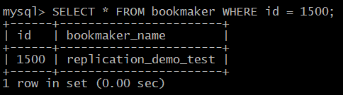

### Шаг 3: Проверяем на слейве
**На слейве:**
```sql
-- Проверяем что запись реплицировалась
SELECT * FROM bookmaker WHERE id = 1500;

-- Проверяем статус репликации
SHOW REPLICA STATUS\G
```
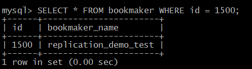

## 3. Просмотр в бинарных логах (демонстрация в логе)

### На мастере смотрим бинарные логи:
```sql
-- Смотрим текущий бинарный лог
SHOW BINARY LOGS;

-- Смотрим события в последнем бинарном логе
SHOW BINLOG EVENTS IN 'binlog.000014' FROM 0 LIMIT 20;
```
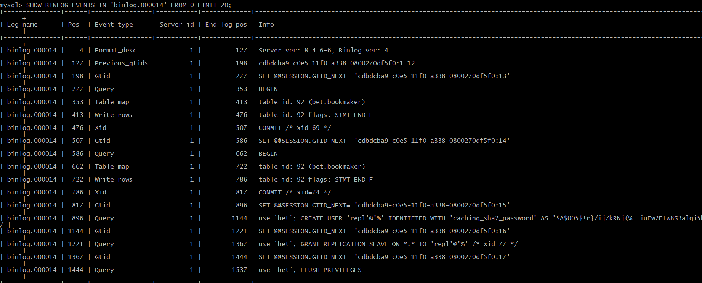

### Более детальный просмотр:
```sql
-- Выйдем из MySQL и используем mysqlbinlog утилиту
EXIT;
```

**В терминале мастера:**
```bash
# Находим последний бинарный лог
ls -la /var/lib/mysql/binlog.*

# Смотрим содержимое бинарного лога (последние события)
mysqlbinlog /var/lib/mysql/binlog.000014 --base64-output=DECODE-ROWS -v | tail -50

# Или ищем конкретно нашу запись
mysqlbinlog /var/lib/mysql/binlog.000014 --base64-output=DECODE-ROWS -v | grep -A 10 -B 10 "1500"
```
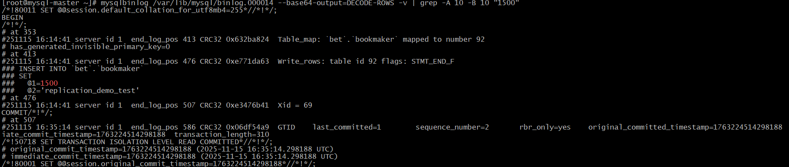

## 4. Полная демонстрация с GTID

### Шаг 1: Запоминаем текущий GTID
**На мастере:**
```sql
SELECT @@GLOBAL.gtid_executed AS current_gtid;
```

### Шаг 2: Выполняем несколько операций
**На мастере:**
```sql
USE bet;

-- Операция 1: INSERT
INSERT INTO bookmaker (id, bookmaker_name) VALUES(1800, 'demo_insert2');

-- Операция 2: UPDATE  
UPDATE bookmaker SET bookmaker_name = 'demo_updated' WHERE id = 1800;

-- Операция 3: DELETE
DELETE FROM bookmaker WHERE id = 1800;

-- Смотрим новые GTID
SELECT @@GLOBAL.gtid_executed AS new_gtid;
```
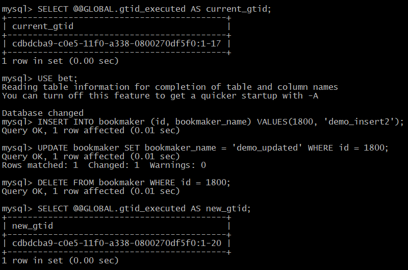

### Шаг 3: Смотрим бинарный лог с GTID
**В терминале мастера:**
```bash
# Просматриваем бинарный лог с GTID информацией
 SHOW BINARY LOGS;
mysqlbinlog /var/lib/mysql/binlog.000014 --include-gtids='cdbdcba9-c0e5-11f0-a338-0800270df5f0' --base64-output=DECODE-ROWS -v
```
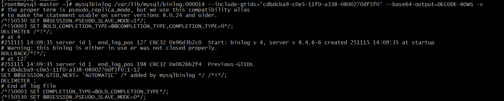

### Шаг 4: Проверяем на слейве
**На слейве:**
```sql
-- Проверяем GTID
SELECT @@GLOBAL.gtid_executed;

-- Проверяем что операции выполнились
SELECT * FROM bookmaker WHERE id = 1800; -- Вывод пустой (удалили)
```


### **Ключевые наблюдения:**

1. **GTID гарантирует** - каждая транзакция имеет уникальный идентификатор
2. **Auto_Position=1** - слейв автоматически запрашивает нужную позицию
3. **Replica_IO_Running** - поток чтения бинарного лога
4. **Replica_SQL_Running** - поток применения изменений
5. **Seconds_Behind_Source** - лаг репликации (NULL при ошибке подключения)

## Итог настройки:

✅ **GTID репликация настроена и работает**
✅ **Реплицируются только указанные таблицы:**
   - bookmaker
   - competition  
   - market
   - odds
   - outcome

✅ **Игнорируются таблицы:**
   - events_on_demand
   - v_same_event

✅ **Авто-позиционирование через GTID работает**

Репликация успешно настроена! Данные автоматически синхронизируются с мастера на слейв для указанных таблиц с использованием GTID.

### ✅ Ключевые показатели успеха:

1. **`Replica_IO_Running: Yes`** - IO поток работает
2. **`Replica_SQL_Running: Yes`** - SQL поток работает  
3. **`Last_IO_Error: `** - нет ошибок IO
4. **`Last_SQL_Error: `** - нет ошибок SQL
5. **`Retrieved_Gtid_Set: cdbdcba9-c0e5-11f0-a338-0800270df5f0:1-8`** - GTID получены с мастера
6. **`Executed_Gtid_Set: ... cdbdcba9-c0e5-11f0-a338-0800270df5f0:1-8`** - GTID выполнены на слейве
7. **`Auto_Position: 1`** - GTID авто-позиционирование работает