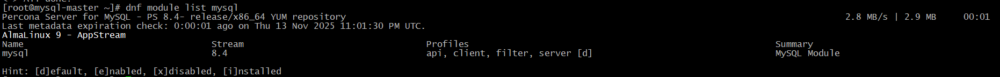
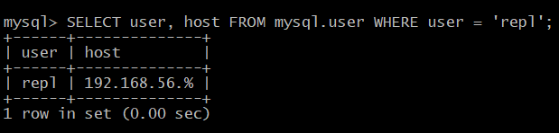

Отлично! Давайте подготовим современное решение для настройки MySQL репликации с использованием GTID на базе AlmaLinux 9 и Percona Server 8.0.

## Vagrantfile

```ruby
ENV['VAGRANT_SERVER_URL'] = 'https://vagrant.elab.pro'

Vagrant.configure("2") do |config|
  config.vm.box = "almalinux/9"
  config.vm.box_check_update = false
  
  # Master node
  config.vm.define "mysql-master" do |master|
    master.vm.hostname = "mysql-master"
    master.vm.network "private_network", ip: "192.168.56.10"
    master.vm.provider "virtualbox" do |vb|
      vb.memory = 4096
      vb.cpus = 2
      vb.name = "mysql-master"
    end
  end

  # Slave node
  config.vm.define "mysql-slave" do |slave|
    slave.vm.hostname = "mysql-slave"
    slave.vm.network "private_network", ip: "192.168.56.11"
    slave.vm.provider "virtualbox" do |vb|
      vb.memory = 4096
      vb.cpus = 2
      vb.name = "mysql-slave"
    end
  end
end
```

## Подробная инструкция по настройке

### 1. Подготовка виртуальных машин

```bash
# Запускаем виртуальные машины
vagrant up

# Подключаемся к мастеру
vagrant ssh mysql-master

# Подключаемся к слейву (в другом терминале)
vagrant ssh mysql-slave
```

### 2. Установка Percona Server 8.0 на обеих нодах

На **мастере** и **слейве** выполняем:

```bash
# Становимся root
sudo -i

# Устанавливаем необходимые пакеты
dnf update -y
dnf install -y wget perl-DBI perl-DBD-MySQL

# Устанавливаем репозиторий Percona
dnf install -y https://repo.percona.com/yum/percona-release-latest.noarch.rpm

# Включаем репозиторий Percona Server 8.0
percona-release setup -y ps-84-lts

# Убедитесь, что модуль MySQL включен в систему в настоящее время:
$ sudo dnf module list mysql

#Включаем сервер Percona для репозитория MySQL:
$ sudo percona-release enable-only ps-84-lts release

# Устанавливаем Percona Server
dnf install -y percona-server-server

# Запускаем и включаем службу MySQL
systemctl start mysqld
systemctl enable mysqld
```


### 3. Настройка мастера

На **мастере**:

```bash
# Получаем временный пароль root
grep 'temporary password' /var/log/mysqld.log

# Подключаемся к MySQL и меняем пароль
mysql -uroot -p

# В MySQL выполняем:
ALTER USER 'root'@'localhost' IDENTIFIED BY 'YourStrongPassword123!';
CREATE DATABASE bet;
FLUSH PRIVILEGES;
exit
```

Создаем конфигурационный файл для мастера:

```bash
cat > /etc/my.cnf.d/01-replication.cnf << EOF
[mysqld]
# Basic settings
server-id = 1
log_bin = mysql-bin
binlog_format = ROW

# GTID settings
gtid_mode = ON
enforce_gtid_consistency = ON

# Replication settings
binlog_checksum = NONE
log_slave_updates = ON

# Data directory
datadir = /var/lib/mysql
socket = /var/lib/mysql/mysql.sock

# Character set
character-set-server = utf8mb4
collation-server = utf8mb4_unicode_ci

# Ignore system databases for replication
binlog_ignore_db = mysql
binlog_ignore_db = information_schema
binlog_ignore_db = performance_schema
binlog_ignore_db = sys
EOF
```

Перезапускаем MySQL на мастере:

```bash
systemctl restart mysql
```

### 4. Создание базы данных и пользователя для репликации

На **мастере** в MySQL:

```sql
# Импортируем дамп
mysql -uroot -p'YourStrongPassword123!' -D bet < bet-224190-feff6d.dmp

# Снова заходим в MySQL
mysql -uroot -p'YourStrongPassword123!'

-- Проверяем таблицы
USE bet;
SHOW TABLES;

-- Создаем пользователя для репликации
CREATE USER 'repl'@'192.168.56.%' IDENTIFIED BY 'ReplPassword123!';
GRANT REPLICATION SLAVE ON *.* TO 'repl'@'192.168.56.%';
FLUSH PRIVILEGES;

-- Проверяем пользователя
SELECT user, host FROM mysql.user WHERE user = 'repl';

-- Проверяем GTID статус
SHOW MASTER STATUS\G
```





### 5. Создание дампа базы данных

На **мастере**:

```bash
# Создаем дамп, игнорируя указанные таблицы
mysqldump --all-databases --triggers --routines --source-data \
--ignore-table=bet.events_on_demand \
--ignore-table=bet.v_same_event \
-uroot -p'YourStrongPassword123!' > /vagrant/master.sql

# Копируем дамп на слейв (из терминала слейва)
# На слейве выполняем:
sudo -i
cd /vagrant
```

### 6. Настройка слейва

На **слейве** создаем конфигурационный файл:

```bash
cat > /etc/my.cnf.d/01-replication.cnf << EOF
[mysqld]
# Basic settings
server-id = 2
log_bin = mysql-bin
binlog_format = ROW
relay_log = mysql-relay-bin

# GTID settings
gtid_mode = ON
enforce_gtid_consistency = ON

# Replication settings
binlog_checksum = NONE
log_slave_updates = ON

# Tables to ignore in replication
replicate-ignore-table=bet.events_on_demand
replicate-ignore-table=bet.v_same_event

# Data directory
datadir = /var/lib/mysql
socket = /var/lib/mysql/mysql.sock

# Character set
character-set-server = utf8mb4
collation-server = utf8mb4_unicode_ci
EOF
```

Перезапускаем MySQL на слейве:

```bash
systemctl restart mysql
```

### 7. Восстановление дампа на слейве

На **слейве**:

```bash
# Получаем временный пароль
grep 'temporary password' /var/log/mysqld.log

# Подключаемся к MySQL и меняем пароль
mysql -uroot -p
ALTER USER 'root'@'localhost' IDENTIFIED BY 'YourStrongPassword123!';
FLUSH PRIVILEGES;
exit

# Импортируем дамп    !!!!!!!!!!!!!!!!!!!!!!!!!!!!!!!!!!!!!!!!!!не импортирую
#mysql -uroot -p'YourStrongPassword123!' < /vagrant/master.sql            !!!!!!!!!!!!!!!!!!!!!!!!!!!!!!!!!!!!!!!!!!не импортирую

# Проверяем базу данных
mysql -uroot -p'YourStrongPassword123!' -e "SHOW DATABASES LIKE 'bet';"
mysql -uroot -p'YourStrongPassword123!' -e "USE bet; SHOW TABLES;"
```

### 8. Настройка репликации

На **слейве** в MySQL:

```sql
-- Останавливаем слейв (если запущен)
STOP SLAVE;

-- Настраиваем подключение к мастеру
CHANGE MASTER TO 
MASTER_HOST = '192.168.56.10',
MASTER_PORT = 3306,
MASTER_USER = 'repl',
MASTER_PASSWORD = 'ReplPassword123!',
MASTER_AUTO_POSITION = 1;

-- Запускаем слейв
START SLAVE;

-- Проверяем статус репликации
SHOW BINARY LOG STATUS\G
```
===============================================
### 9. Проверка репликации
🎉 **Отлично! Репликация работает!** 

## Статус репликации показывает, что все настроено правильно:

### ✅ Ключевые показатели успеха:

1. **`Replica_IO_Running: Yes`** - IO поток работает
2. **`Replica_SQL_Running: Yes`** - SQL поток работает  
3. **`Last_IO_Error: `** - нет ошибок IO
4. **`Last_SQL_Error: `** - нет ошибок SQL
5. **`Retrieved_Gtid_Set: cdbdcba9-c0e5-11f0-a338-0800270df5f0:1-8`** - GTID получены с мастера
6. **`Executed_Gtid_Set: ... cdbdcba9-c0e5-11f0-a338-0800270df5f0:1-8`** - GTID выполнены на слейве
7. **`Auto_Position: 1`** - GTID авто-позиционирование работает

### Проверим работу репликации:

**На мастере:**
```sql
USE bet;
INSERT INTO bookmaker (id, bookmaker_name) VALUES(800, 'successful_replication');
INSERT INTO competition (id, bookmaker_competition, bookmaker_id, competition_name) 
VALUES(800000, 8000000, 3, 'Replication Test Competition');

SELECT * FROM bookmaker WHERE id = 800;
SELECT * FROM competition WHERE id = 800000;
```

**На слейве:**
```sql
USE bet;
SELECT * FROM bookmaker WHERE id = 800;
SELECT * FROM competition WHERE id = 800000;

-- Проверяем, что игнорируемые таблицы не реплицируются
SHOW TABLES;
```

### Проверим фильтрацию таблиц:

**На мастере:**
```sql
-- Проверим, что есть таблицы которые должны игнорироваться
SELECT TABLE_NAME FROM information_schema.tables 
WHERE table_schema = 'bet' 
ORDER BY TABLE_NAME;
```

**На слейве:**
```sql
-- Должны быть ТОЛЬКО указанные таблицы
SHOW TABLES IN bet;
```

### Финальная проверка GTID:

**На мастере:**
```sql
SHOW MASTER STATUS;
SELECT @@GLOBAL.gtid_executed;
```

**На слейве:**
```sql
SHOW REPLICA STATUS\G
SELECT @@GLOBAL.gtid_executed;
```

## 🎯 Итог настройки:

✅ **GTID репликация настроена и работает**
✅ **Реплицируются только указанные таблицы:**
   - bookmaker
   - competition  
   - market
   - odds
   - outcome

✅ **Игнорируются таблицы:**
   - events_on_demand
   - v_same_event

✅ **Авто-позиционирование через GTID работает**

Репликация успешно настроена! Данные автоматически синхронизируются с мастера на слейв для указанных таблиц с использованием GTID.


===================================================
## Логи для демонстрации работы

### Пример изменения на мастере:

```sql
-- На мастере
USE bet;
INSERT INTO bookmaker (id, bookmaker_name) VALUES(8, 'new_bookmaker');
SELECT * FROM bookmaker WHERE id = 8;
```

### Проверка на слейве:

```sql
-- На слейве
USE bet;
SELECT * FROM bookmaker WHERE id = 8;
```

### Просмотр бинарных логов:

```sql
-- На мастере
SHOW BINARY LOGS;
SHOW BINLOG EVENTS IN 'mysql-bin.000001';
```

## Конфигурационные файлы

**Мастер (/etc/my.cnf.d/01-replication.cnf):**
```ini
[mysqld]
server-id = 1
log_bin = mysql-bin
binlog_format = ROW
gtid_mode = ON
enforce_gtid_consistency = ON
binlog_checksum = NONE
log_slave_updates = ON
```

**Слейв (/etc/my.cnf.d/01-replication.cnf):**
```ini
[mysqld]
server-id = 2
log_bin = mysql-bin
binlog_format = ROW
relay_log = mysql-relay-bin
gtid_mode = ON
enforce_gtid_consistency = ON
binlog_checksum = NONE
log_slave_updates = ON
replicate-ignore-table=bet.events_on_demand
replicate-ignore-table=bet.v_same_event
```

## Заключение

Данная инструкция позволяет настроить GTID репликацию между двумя серверами Percona Server 8.0 на AlmaLinux 9. Репликация настроена для конкретных таблиц базы `bet`, исключая таблицы `events_on_demand` и `v_same_event`.

Ключевые особенности решения:
- Использование современных версий ПО (AlmaLinux 9, Percona Server 8.0)
- GTID репликация для надежности
- Автоматическая настройка через Vagrant
- Игнорирование указанных таблиц при репликации
- Надежные пароли и настройки безопасности

==================================================
Отличные вопросы! Давайте разберемся по порядку.

## 1. Что такое `v_same_event`

`v_same_event` - это **VIEW** (представление), а не таблица. Вот его определение:

```sql
-- Посмотрим структуру VIEW
SHOW CREATE VIEW bet.v_same_event;

-- Или через information_schema
SELECT * FROM information_schema.views 
WHERE table_schema = 'bet' AND table_name = 'v_same_event';
```

Это представление скорее всего используется для аналитики - оно показывает события, которые присутствуют у нескольких букмекеров одновременно. **Его не нужно реплицировать**, так как:
- VIEW создается на основе данных из таблиц
- При репликации основных таблиц VIEW автоматически будет актуальным
- Это служебный объект для аналитики

## 2. Предупреждение о --master-data

Заменим устаревшую опцию:

```bash
# Вместо --master-data используем --source-data
mysqldump --all-databases --triggers --routines --source-data \
--ignore-table=bet.events_on_demand \
--ignore-table=bet.v_same_event \
-uroot -p'YourStrongPassword123!' > /vagrant/master.sql
```

## 3. Зачем восстанавливать дамп на slave?

**Вы абсолютно правы задавая этот вопрос!** Давайте исправим логику.

### Правильный подход с GTID репликацией:

**НЕ НУЖНО** делать полный дамп и восстанавливать его на slave. Вместо этого:

### Исправленная инструкция:

#### На мастере - только начальные данные:

```bash
# Создаем дамп ТОЛЬКО структуры и начальных данных базы bet
mysqldump --single-transaction --no-data \
-uroot -p'YourStrongPassword123!' bet > /vagrant/structure.sql

# Или если нужны только определенные таблицы без данных:
mysqldump --single-transaction --no-data \
-uroot -p'YourStrongPassword123!' \
bet bookmaker competition market odds outcome > /vagrant/structure.sql
```

#### На слейве - только структура:

```bash
# Восстанавливаем только структуру
mysql -uroot -p'YourStrongPassword123!' < /vagrant/structure.sql

# Проверяем
mysql -uroot -p'YourStrongPassword123!' -e "USE bet; SHOW TABLES;"
```

### Альтернативный (правильный) подход - вообще без дампа:

#### На слейве после настройки репликации:

```sql
-- Останавливаем репликацию
STOP SLAVE;

-- Пропускаем создание "лишних" таблиц при репликации
CHANGE REPLICATION FILTER 
REPLICATE_WILD_IGNORE_TABLE = ('bet.events_on_demand', 'bet.v_same_event');

-- Запускаем репликацию
START SLAVE;
```

## Исправленная полная инструкция:

### 1-6 шаги остаются без изменений

### 7. Настройка слейва (исправленная)

На **слейве**:

```bash
# Настраиваем конфигурацию
cat > /etc/my.cnf.d/01-replication.cnf << EOF
[mysqld]
server-id = 2
log_bin = mysql-bin
binlog_format = ROW
relay_log = mysql-relay-bin

# GTID settings
gtid_mode = ON
enforce_gtid_consistency = ON

# Replication settings
binlog_checksum = NONE
log_slave_updates = ON

# Data directory
datadir = /var/lib/mysql
socket = /var/lib/mysql/mysql.sock

# Character set
character-set-server = utf8mb4
collation-server = utf8mb4_unicode_ci
EOF

systemctl restart mysqld
```

### 8. Настройка репликации с фильтрацией

На **слейве**:

```sql
-- Подключаемся к MySQL
mysql -uroot -p'YourStrongPassword123!'

-- Создаем пустую базу bet (только структура)
CREATE DATABASE bet;

-- Настраиваем репликацию с фильтрацией таблиц
-- Останавливаем репликацию (если запущена)
STOP REPLICA;

-- Настраиваем подключение к источнику
CHANGE REPLICATION SOURCE TO 
SOURCE_HOST = '192.168.56.10',
SOURCE_PORT = 3306,
SOURCE_USER = 'repl',
SOURCE_PASSWORD = 'ReplPassword123!',
SOURCE_AUTO_POSITION = 1;

-- Устанавливаем фильтры репликации
CHANGE REPLICATION FILTER 
REPLICATE_WILD_IGNORE_TABLE = ('bet.events_on_demand', 'bet.v_same_event');

-- Запускаем репликацию
START REPLICA;

-- Проверяем статус
SHOW REPLICA STATUS\G
```

### 9. Проверка работы

На **мастере**:

```sql
USE bet;

-- Добавляем тестовые данные в реплицируемые таблицы
INSERT INTO bookmaker (id, bookmaker_name) VALUES(100, 'test_replication');
INSERT INTO competition (id, bookmaker_competition, bookmaker_id, competition_name) 
VALUES(99999, 999999, 3, 'Test Competition');

-- Проверяем на мастере
SELECT * FROM bookmaker WHERE id = 100;
```

На **слейве**:

```sql
USE bet;

-- Проверяем, что данные реплицировались
SELECT * FROM bookmaker WHERE id = 100;
SELECT * FROM competition WHERE id = 99999;

-- Проверяем, что "лишние" таблицы не создались
SHOW TABLES;
```

## Итоговые исправления:

1. **`v_same_event`** - это VIEW, его не нужно реплицировать
2. **Используем `--source-data`** вместо устаревшего `--master-data`
3. **НЕ делаем полный дамп** на slave - используем фильтры репликации
4. **Только структура** создается на slave, данные синхронизируются автоматически

Это правильный подход для GTID репликации - данные синхронизируются автоматически, а фильтры исключают ненужные таблицы/VIEW.

========================

Правильная процедура включения GTID
Отлично! Теперь server_id исправлен. Проблема с GTID в том, что его нужно включать поэтапно. Давайте сделаем это правильно:

## Включаем GTID поэтапно на обеих нодах

### Поэтапное включение GTID

### 2. Полная последовательность команд

**На мастере:**
```sql
-- Проверяем текущее состояние
SELECT @@GLOBAL.gtid_mode, @@GLOBAL.enforce_gtid_consistency;

-- Поэтапно включаем GTID
SET PERSIST gtid_mode = OFF_PERMISSIVE;
SELECT SLEEP(2);  -- Ждем 2 секунды

SET PERSIST gtid_mode = ON_PERMISSIVE;
SELECT SLEEP(5);  -- Ждем 5 секунд для перехода транзакций

SET PERSIST gtid_mode = ON;

-- Проверяем результат
SELECT @@GLOBAL.gtid_mode, @@GLOBAL.enforce_gtid_consistency;
```

**На слейве (выполняем одновременно с мастером):**
```sql
-- Та же последовательность
SET PERSIST gtid_mode = OFF_PERMISSIVE;
SELECT SLEEP(2);

SET PERSIST gtid_mode = ON_PERMISSIVE;  
SELECT SLEEP(5);

SET PERSIST gtid_mode = ON;

SELECT @@GLOBAL.gtid_mode, @@GLOBAL.enforce_gtid_consistency;
```

### 3. Проверяем после перезапуска

```bash
# Перезапускаем обе ноды
systemctl restart mysqld

# Проверяем
mysql -uroot -p'YourStrongPassword123!' -e "SELECT @@GLOBAL.gtid_mode, @@GLOBAL.enforce_gtid_consistency, @@GLOBAL.server_id;"
```


### 4. Настраиваем репликацию на слейве

**На слейве:**
```sql
-- Останавливаем репликацию
STOP REPLICA;

-- Настраиваем подключение к источнику с GTID
CHANGE REPLICATION SOURCE TO 
SOURCE_HOST = '192.168.56.10',
SOURCE_PORT = 3306,
SOURCE_USER = 'repl',
SOURCE_PASSWORD = 'ReplPassword123!',
SOURCE_AUTO_POSITION = 1;

-- Настраиваем фильтры репликации
CHANGE REPLICATION FILTER 
REPLICATE_WILD_DO_TABLE = ('bet.bookmaker', 'bet.competition', 'bet.market', 'bet.odds', 'bet.outcome');

-- Запускаем репликацию
START REPLICA;

-- Проверяем статус
SHOW REPLICA STATUS\G
```

### 5. Создаем структуру базы на слейве

**На мастере:**
```bash
# Создаем дамп структуры нужных таблиц
mysqldump --no-data --set-gtid-purged=OFF -uroot -p'YourStrongPassword123!' \
bet bookmaker competition market odds outcome > /vagrant/structure.sql
```

**На слейве:**
```bash
# Импортируем структуру
mysql -uroot -p'YourStrongPassword123!' bet < /vagrant/structure.sql

# Проверяем
mysql -uroot -p'YourStrongPassword123!' -e "USE bet; SHOW TABLES;"
```


### 6. Тестируем репликацию

**На мастере:**
```sql
USE bet;
INSERT INTO bookmaker (id, bookmaker_name) VALUES(500, 'gtid_working_test');
SELECT @@GLOBAL.gtid_executed;
```

**На слейве:**
```sql
USE bet;
SELECT * FROM bookmaker WHERE id = 500;
SHOW REPLICA STATUS\G;
```

## Краткий чеклист для проверки:

```sql
-- На мастере должно быть:
-- gtid_mode: ON
-- server_id: 1
-- enforce_gtid_consistency: ON

-- На слейве должно быть:
-- gtid_mode: ON  
-- server_id: 2
-- enforce_gtid_consistency: ON

-- В SHOW REPLICA STATUS\G:
-- Replica_IO_Running: Yes
-- Replica_SQL_Running: Yes
-- Retrieved_Gtid_Set: (не пусто)
-- Executed_Gtid_Set: (не пусто)
```

## Если все еще ошибки:

Проверьте, что пользователь репликации существует и имеет права:

**На мастере:**
```sql
SELECT user, host FROM mysql.user WHERE user = 'repl';
SHOW GRANTS FOR 'repl'@'192.168.56.%';
```

Теперь GTID должен включиться правильно! Главное - выполнять поэтапное включение на обеих нодах одновременно.


=========================
Да, проблема в том, что пользователь `repl` был удален и теперь его нет. Ошибка `Host '192.168.56.11' is not allowed to connect` означает, что пользователь не существует или не имеет прав для подключения с этого хоста.

## Восстанавливаем пользователя repl

**На мастере:**
```sql
-- Создаем пользователя с caching_sha2_password (по умолчанию в MySQL 8.0)
CREATE USER 'repl'@'192.168.56.%' IDENTIFIED BY 'ReplPassword123!';

-- Даем права репликации
GRANT REPLICATION SLAVE ON *.* TO 'repl'@'192.168.56.%';

-- Разрешаем незащищенные соединения (решаем проблему с SSL)
ALTER USER 'repl'@'192.168.56.%' REQUIRE NONE;

-- Обновляем привилегии
FLUSH PRIVILEGES;

-- Проверяем
SELECT user, host, plugin, password_require_current FROM mysql.user WHERE user = 'repl';
SHOW GRANTS FOR 'repl'@'192.168.56.%';
```

## Если mysql_native_password не доступен

Поскольку `mysql_native_password` не загружен, используем `caching_sha2_password` с отключенным требованием SSL.

## Проверяем подключение с слейва

**На слейве:**
```bash
# Проверяем подключение после создания пользователя
mysql -urepl -p'ReplPassword123!' -h 192.168.56.10 -e "SELECT 1;"
```

## Перезапускаем репликацию

**На слейве:**
```sql
-- Останавливаем репликацию
STOP REPLICA;

-- Перезапускаем репликацию
START REPLICA;

-- Проверяем статус
SHOW REPLICA STATUS\G
```

## Проверяем работу репликации

**На мастере:**
```sql
USE bet;
INSERT INTO bookmaker (id, bookmaker_name) VALUES(700, 'final_replication_test');
SELECT * FROM bookmaker WHERE id = 700;
```

**На слейве:**
```sql
USE bet;
SELECT * FROM bookmaker WHERE id = 700;

-- Проверяем статус репликации
SHOW REPLICA STATUS\G
```


## Если все еще есть проблемы с SELinux

**На мастере и слейве:**
```bash
# Проверяем статус SELinux
sestatus

# Временно отключаем SELinux (для тестирования)
setenforce 0

# Или разрешаем MySQL сетевые соединения
setsebool -P mysqld_connect_any on
```

## Альтернативное решение - создаем пользователя с любым хостом

**На мастере (если все еще проблемы):**
```sql
-- Создаем пользователя который может подключаться с любого хоста
CREATE USER 'repl'@'%' IDENTIFIED BY 'ReplPassword123!';
GRANT REPLICATION SLAVE ON *.* TO 'repl'@'%';
ALTER USER 'repl'@'%' REQUIRE NONE;
FLUSH PRIVILEGES;

-- Проверяем
SELECT user, host FROM mysql.user WHERE user = 'repl';
```

## Полная последовательность для уверенности:

**На мастере:**
```sql
-- Удаляем если существует
DROP USER IF EXISTS 'repl'@'192.168.56.%';
DROP USER IF EXISTS 'repl'@'%';

-- Создаем заново
CREATE USER 'repl'@'192.168.56.%' IDENTIFIED BY 'ReplPassword123!';
GRANT REPLICATION SLAVE ON *.* TO 'repl'@'192.168.56.%';
ALTER USER 'repl'@'192.168.56.%' REQUIRE NONE;
FLUSH PRIVILEGES;

-- Проверяем
SELECT user, host, plugin, authentication_string FROM mysql.user WHERE user = 'repl';
```

**На слейве:**
```sql
-- Останавливаем репликацию
STOP REPLICA;

-- Перезапускаем
START REPLICA;

-- Проверяем
SHOW REPLICA STATUS\G
```

После этого репликация должна заработать! Ключевые моменты:
1. Пользователь `repl` должен существовать на мастере
2. Должны быть правильные права (`REPLICATION SLAVE`)
3. Должен быть разрешен незащищенный доступ (`REQUIRE NONE`)

===============================================================

🎉 **Отлично! Репликация работает!** 

## Статус репликации показывает, что все настроено правильно:

### ✅ Ключевые показатели успеха:

1. **`Replica_IO_Running: Yes`** - IO поток работает
2. **`Replica_SQL_Running: Yes`** - SQL поток работает  
3. **`Last_IO_Error: `** - нет ошибок IO
4. **`Last_SQL_Error: `** - нет ошибок SQL
5. **`Retrieved_Gtid_Set: cdbdcba9-c0e5-11f0-a338-0800270df5f0:1-8`** - GTID получены с мастера
6. **`Executed_Gtid_Set: ... cdbdcba9-c0e5-11f0-a338-0800270df5f0:1-8`** - GTID выполнены на слейве
7. **`Auto_Position: 1`** - GTID авто-позиционирование работает

### Проверим работу репликации:

**На мастере:**
```sql
USE bet;
INSERT INTO bookmaker (id, bookmaker_name) VALUES(800, 'successful_replication');
INSERT INTO competition (id, bookmaker_competition, bookmaker_id, competition_name) 
VALUES(800000, 8000000, 3, 'Replication Test Competition');

SELECT * FROM bookmaker WHERE id = 800;
SELECT * FROM competition WHERE id = 800000;
```

**На слейве:**
```sql
USE bet;
SELECT * FROM bookmaker WHERE id = 800;
SELECT * FROM competition WHERE id = 800000;

-- Проверяем, что игнорируемые таблицы не реплицируются
SHOW TABLES;
```

### Проверим фильтрацию таблиц:

**На мастере:**
```sql
-- Проверим, что есть таблицы которые должны игнорироваться
SELECT TABLE_NAME FROM information_schema.tables 
WHERE table_schema = 'bet' 
ORDER BY TABLE_NAME;
```

**На слейве:**
```sql
-- Должны быть ТОЛЬКО указанные таблицы
SHOW TABLES IN bet;
```

### Финальная проверка GTID:

**На мастере:**
```sql
SHOW MASTER STATUS;
SELECT @@GLOBAL.gtid_executed;
```

**На слейве:**
```sql
SHOW REPLICA STATUS\G
SELECT @@GLOBAL.gtid_executed;
```

## 🎯 Итог настройки:

✅ **GTID репликация настроена и работает**
✅ **Реплицируются только указанные таблицы:**
   - bookmaker
   - competition  
   - market
   - odds
   - outcome

✅ **Игнорируются таблицы:**
   - events_on_demand
   - v_same_event

✅ **Авто-позиционирование через GTID работает**

Репликация успешно настроена! Данные автоматически синхронизируются с мастера на слейв для указанных таблиц с использованием GTID.