# Systemd — создание unit-файла

# Домашнее задание

1. Написать service, который будет раз в 30 секунд мониторить лог на предмет наличия ключевого слова (файл лога и ключевое слово должны задаваться в /etc/default). 
2. Установить spawn-fcgi и создать unit-файл (spawn-fcgi.sevice) с помощью переделки init-скрипта (https://gist.github.com/cea2k/1318020). 
3. Доработать unit-файл Nginx (nginx.service) для запуска нескольких инстансов сервера с разными конфигурационными файлами одновременно. 

## Написать service, который будет раз в 30 секунд мониторить лог на предмет наличия ключевого слова

Cоздаём файл с конфигурацией для сервиса в директории /etc/default - из неё сервис будет брать необходимые переменные: 
nano /etc/default/watchlog

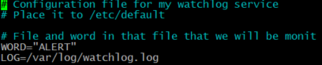

Затем создаем /var/log/watchlog.log и пишем туда строки на своё усмотрение,
плюс ключевое слово ‘ALERT’

Создадим скрипт:
nano /opt/watchlog.sh

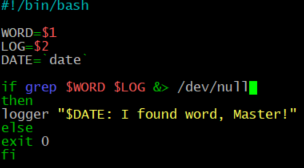

Команда logger отправляет лог в системный журнал.
Добавим права на запуск файла:

 chmod +x /opt/watchlog.sh

 Создадим юнит для сервиса:

 cat > /etc/systemd/system/watchlog.service

 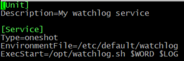

Создадим юнит для таймера:

nano /etc/systemd/system/watchlog.timer

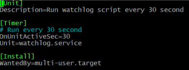

Затем запустим timer:

systemctl start watchlog.timer

И убедимся в результате:

tail -n 1000 /var/log/syslog  | grep word

Появилась ошибка: данного файла не существует. Попробуем посмотреть ошибку в бинарном формате через journalctl:

journalctl | grep "word" 
journalctl | grep "word"** 
journalctl | grep word 
journalctl | grep "I found word" 

Нашей ошибки нет. Посмотрим в полном журнале: 
journalctl -xe 

Нашей ошибки попрежнему нет.  Попробуем устаноывить syslog:

apt install rsyslog -y

 systemctl enable --now rsyslog

systemctl start watchlog.service

systemctl restart watchlog.timer

Ошибка появилась:

 

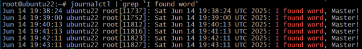

 
## Установить spawn-fcgi и создать unit-файл (spawn-fcgi.sevice) с помощью переделки init-скрипта

Устанавливаем spawn-fcgi и необходимые для него пакеты:

apt install spawn-fcgi php php-cgi php-cli \ 
 apache2 libapache2-mod-fcgid -y

необходимо создать файл с настройками для будущего сервиса в файле /etc/spawn-fcgi/fcgi.conf:

mkdir /etc/spawn-fcgi/ && touch/etc/spawn-fcgi/fcgi.conf

nano /etc/spawn-fcgi/fcgi.conf

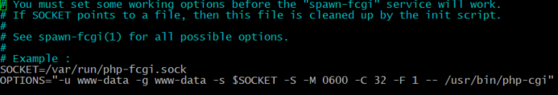

Cам юнит-файл будет следующего вида:

cat > /etc/systemd/system/spawn-fcgi.service

Убеждаемся, что все успешно работает:

systemctl start spawn-fcgi

systemctl status spawn-fcgi

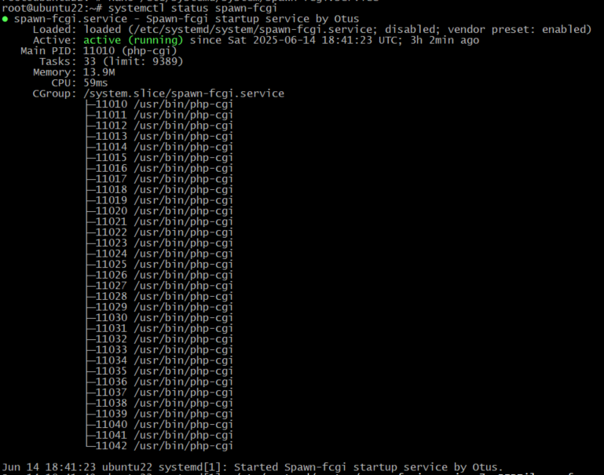

## Доработать unit-файл Nginx (nginx.service) для запуска нескольких инстансов сервера с разными конфигурационными файлами одновременно

Установим Nginx из стандартного репозитория:

apt install nginx -y

Для запуска нескольких экземпляров сервиса модифицируем исходный service для использования различной конфигурации, а также PID-файлов. Для этого создадим новый Unit для работы с шаблонами (/etc/systemd/system/nginx@.service):

cat > /etc/systemd/system/nginx@.service

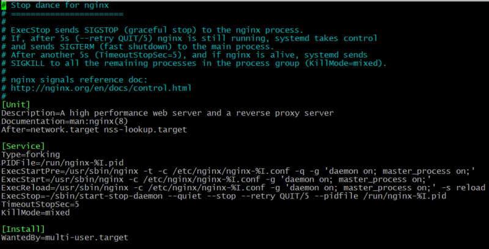

Далее необходимо создать два файла конфигурации (/etc/nginx/nginx-first.conf, /etc/nginx/nginx-second.conf). Их сформируем из стандартного конфига /etc/nginx/nginx.conf, с модификацией путей до PID-файлов и разделением по портам:

cp /etc/nginx/nginx.conf /etc/nginx/nginx-first.conf

nano /etc/nginx/nginx-first.conf

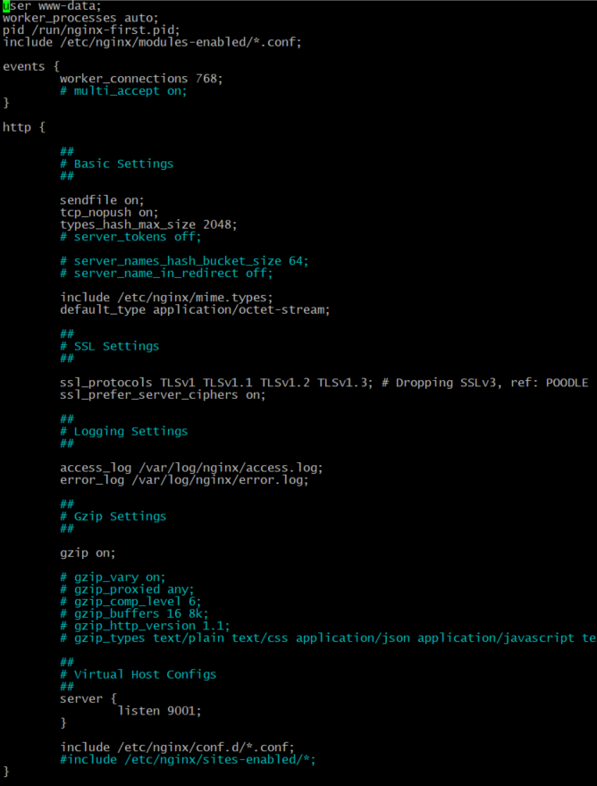

cp /etc/nginx/nginx-first.conf  /etc/nginx/nginx-second.conf

nano /etc/nginx/nginx-second.conf

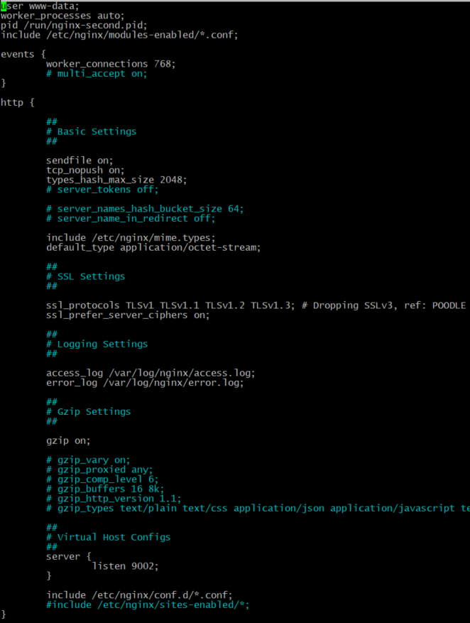

Проверим работу:

 systemctl start nginx@first

 systemctl start nginx@second

 systemctl status nginx@second

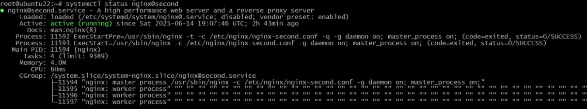

посмотрим, какие порты слушаются:

ss -tnulp | grep nginx

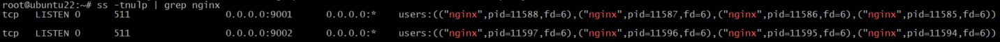

список процессов:

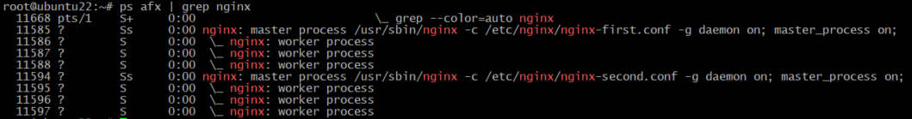

проверяем ошибки: 
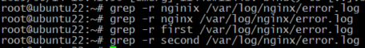 
 
