# Домашнее задание
Практические навыки работы с ZFS

**Цель:**

научится самостоятельно устанавливать ZFS, настраивать пулы, изучить основные возможности ZFS;

## Что нужно сделать? 

 1.   Определить алгоритм с наилучшим сжатием:

  +  Определить какие алгоритмы сжатия поддерживает zfs (gzip, zle, lzjb, lz4);
  + создать 4 файловых системы на каждой применить свой алгоритм сжатия;
  + для сжатия использовать либо текстовый файл, либо группу файлов.

 2. Определить настройки пула.
 + С помощью команды zfs import собрать pool ZFS.
 + Командами zfs определить настройки:
    \- размер хранилища;        
    \- тип pool;        
    \- значение recordsize;       
    \- какое сжатие используется;       
    \- какая контрольная сумма используется.
   
 3. Работа со снапшотами:

 + скопировать файл из удаленной директории;
 + восстановить файл локально. zfs receive;
 + найти зашифрованное сообщение в файле secret_message.

## 1. Определение алгоритма с наилучшим сжатием

Смотрю список всех дисков, которые есть в виртуальной машине: lsblk

root@zfs:~# lsblk

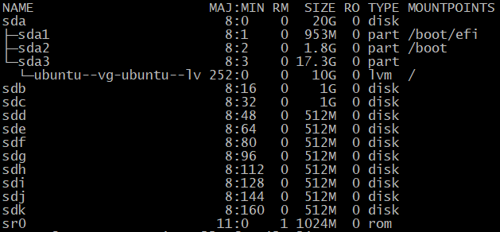

Устанавливаю пакет утилит для ZFS:

root@zfs:~# apt-get install zfsutils-linux -y

Создаю пул из двух дисков в режиме RAID 1:

root@zfs:~# zpool create otus1 mirror /dev/sdd /dev/sde

Создаю ещё 3 пула:

root@zfs:~# zpool create otus2 mirror /dev/sdf /dev/sdg && zpool create otus3 mirror /dev/sdh /dev/sdi &&
 zpool create otus4 mirror /dev/sdj /dev/sdk

 Смотрю информацию о пулах:

 root@zfs:~# zpool list

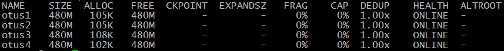

Смотрю информацию о каждом диске:

root@zfs:~# zpool status

Добавлю разные алгоритмы сжатия в каждую файловую систему:
- Алгоритм lzjb:
 root@zfs:~# zfs set compression=lzjb otus1
- Алгоритм lz4: root@zfs:~# zfs set compression=lz4 otus2
- Алгоритм gzip: root@zfs:~# zfs set compression=gzip-9 otus3
- Алгоритм zle: root@zfs:~# zfs set compression=zle otus4

Проверим, что все файловые системы имеют разные методы сжатия:

root@zfs:~# zfs get all | grep compression  
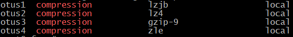

Сжатие файлов будет работать только с файлами, которые были добавлены после включение настройки сжатия.

Скачаю один и тот же текстовый файл во все пулы:

root@zfs:~# for i in {1..4}; do wget -P /otus$i https://gutenberg.org/cache/epub/2600/pg2600.converter.log; done

Проверим, что файл был скачан во все пулы: 
root@zfs:~# ls -l /otus* 
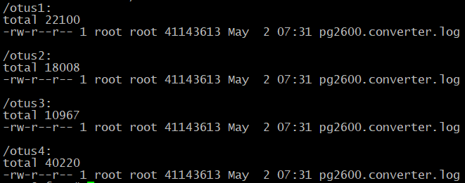

Уже на этом этапе видно, что самый оптимальный метод сжатия у нас используется в пуле otus3.
Проверю, сколько места занимает один и тот же файл в разных пулах : 
root@zfs:~# zfs list 
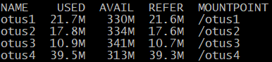

Проверю степень сжатия файлов: 
root@zfs:~# zfs get all | grep compressratio | grep -v ref 
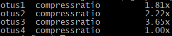

Итог: алгоритм gzip-9 получился самым эффективным по сжатию.

##  2. Определение настроек пула
Скачиваю архив в домашний каталог: 
root@zfs:~# wget -O archive.tar.gz --no-check-certificate 'https://drive.usercontent.google.com/download?id=1MvrcEp-WgAQe57aDEzxSRalPAwbNN1Bb&export=download' 

root@zfs:~# ls 
archive.tar.gz 

Разархивирую его: 
root@zfs:~#tar -xzvf archive.tar.gz

root@zfs:~#ls 
archive.tar.gz zpoolexport

Проверяю, возможно ли импортировать данный каталог в пул: 
root@zfs:~# zpool import -d zpoolexport/ 
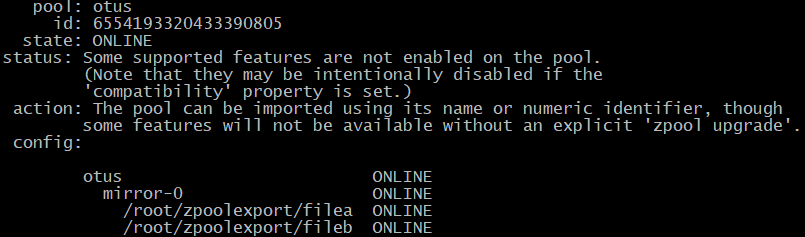

Данный вывод показал имя пула, тип raid и его состав. 
Сделаю импорт данного пула в ОС:  
root@zfs:~# zpool import -d zpoolexport/ otus  

root@zfs:~# zpool status 

Команда zpool status выдал информацию о составе импортированного пула.

Далее определяю настройки: 
root@zfs:~# zpool get all otus

Запрос сразу всех параметром файловой системы: 
root@zfs:~# zfs get all otus 
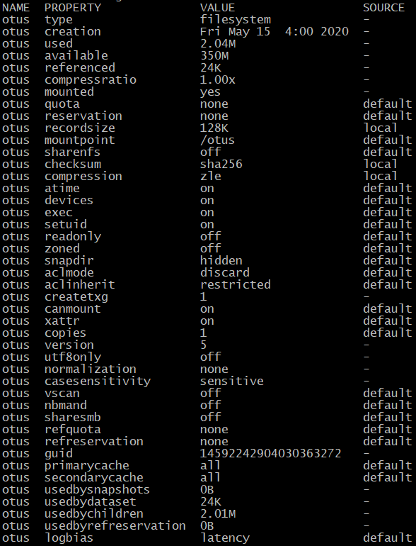 
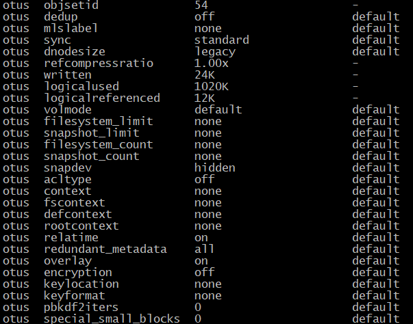

C помощью команды grep уточню конкретный параметр, например:
- размер: 
root@zfs:~# zfs get available otus 
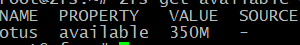

- тип: 
root@zfs:~# zfs get readonly otus 
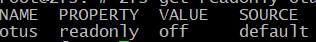 
По типу FS мы можем понять, что позволяет выполнять чтение и запись.
- Значение recordsize: 
root@zfs:~# zfs get recordsize otus 
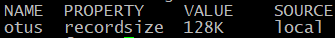

- Тип сжатия (или параметр отключения): 
root@zfs:~# zfs get compression otus 
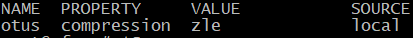

- Тип контрольной суммы: 
root@zfs:~# zfs get checksum otus 
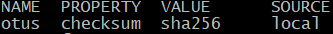

## 3. Работа со снапшотом, поиск сообщения от преподавателя

Скачиваю файл, указанный в задании: 
root@zfs:~# wget -O otus_task2.file --no-check-certificate https://drive.usercontent.google.com/download?id=1wgxjih8YZ-cqLqaZVa0lA3h3Y029c3oI&export=download

Восстановлю файловую систему из снапшота: 
root@zfs:~# zfs receive otus/test@today < otus_task2.file

Далее, ищу в каталоге /otus/test файл с именем “secret_message”:
root@zfs:~# find /otus/test -name "secret_message" 
/otus/test/task1/file_mess/secret_message

Смотрю содержимое найденного файла: 
root@zfs:~# cat /otus/test/task1/file_mess/secret_message 
https://otus.ru/lessons/linux-hl/

Нашёл ссылку на курс OTUS.