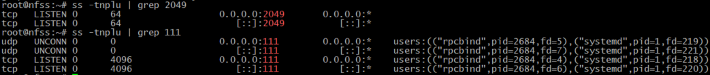
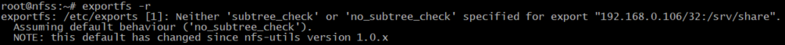
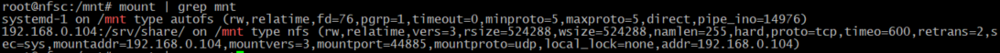
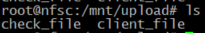
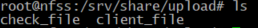
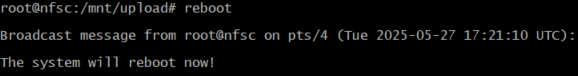
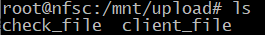
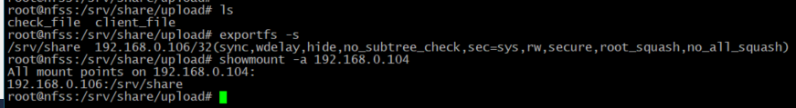
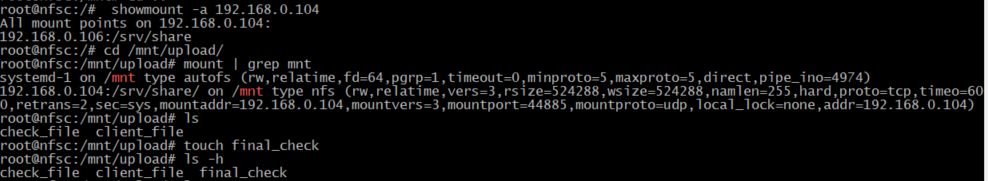
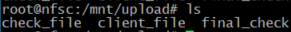

# Домашнее задание

## Работа с NFS  
**Цель:**

научиться самостоятельно разворачивать сервис NFS и подключать к нему клиентов.

**Описание домашнего задания ** 
Основная часть:  
- запустить 2 виртуальных машины (сервер NFS и клиента); 
- на сервере NFS должна быть подготовлена и экспортирована директория;  
- в экспортированной директории должна быть поддиректория с именем upload с правами на запись в неё;   
- экспортированная директория должна автоматически монтироваться на клиенте при старте виртуальной машины (systemd, autofs или fstab — любым способом); 
- монтирование и работа NFS на клиенте должна быть организована с использованием NFSv3. 

Для самостоятельной реализации:  
- настроить аутентификацию через KERBEROS с использованием NFSv4.

**Создаю тестовые виртуальные машины** 
Создаю 2 виртуальные машины с сетевыми интерфейсами, которые позволяют связь между ними.  
  ВМ с NFS сервером nfss (IP 192.168.0.104), а ВМ с клиентом nfsc (IP 192.168.0.106).

  **Настраиваю сервер NFS**  
На сервере nfss установлю сервер NFS: 
root@nfss:~#  apt install nfs-kernel-server -y

Проверяю наличие слушающих портов 2049/udp, 2049/tcp,111/udp, 111/tcp (их наличие сигнализирует о том, что необходимые сервисы готовы принимать внешние подключения): 

Создаём и настраиваем директорию, которая будет экспортирована в будущем:  
root@nfss:~# mkdir -p /srv/share/upload

Делаю каталог /srv/share  владельцем пользователя nobody («никто») и группы nogroup («никакая»).Необходимо в настройке анонимного разделяемого каталога для сервиса NFS. Команда позволяет предоставить полный доступ (чтение и запись) ко всем файловым объектам каталога без аутентификации. Параметр -R указывает на рекурсивное изменение владельца, то есть команда применяется ко всем подкаталогам и файлам в каталоге /srv/share владельцем пользователя nobody («никто») и группы nogroup («никакая»): 
root@nfss:~# chown -R nobody:nogroup /srv/share

Делаю каталог доступным для всех пользователей (любой пользователь сможет читать, изменять, удалять, переименовывать или запускать файлы\папки без ограничений):
root@nfss:~# chmod 0777 /srv/share/upload/

Cоздаю в файле /etc/exports структуру, которая позволит экспортировать ранее созданную директорию: 
root@nfss:~# cat << EOF > /etc/exports
/srv/share 192.168.0.106/32(rw,sync,root_squash)
EOF

Экспортируем ранее созданную директорию:  
root@nfss:~# exportfs -r  

root@nfss:~# exportfs -s  
/srv/share 192.168.0.106/32(sync,wdelay,hide,no_subtree_check,sec=sys,rw,secure,root_squash,no_all_squash) 

Настраиваю клиент NFS на VM nfsc. Установим пакет с NFS-клиентом
: 
root@nfsc:~# sudo apt install nfs-common -y

Добавляю в /etc/fstab строку: 
echo "192.168.0.104:/srv/share/ /mnt nfs vers=3,noauto,x-systemd.automount 0 0" >> /etc/fstab

и выполняю команды: 
root@nfsc:~# systemctl daemon-reload && systemctl restart remote-fs.target

В данном случае происходит автоматическая генерация systemd units в каталоге /run/systemd/generator/, которые производят монтирование при первом обращении к каталогу /mnt/. 
П.э. захожу в директорию /mnt/ : 
root@nfsc:~# cd /mnt/

Проверяю успешность монтирования: 
root@nfsc:~# mount | grep mnt 

**Проверка работоспособности**

- Захожу на сервере nfss  в каталог /srv/share/upload.
- Создаю тестовый файл touch check_file.
- Захожу на клиенте nfsc в каталог /mnt/upload. 
- Проверяю наличие ранее созданного файла. 
- Создаю тестовый файл touch client_file. 
- Проверяю, что файл успешно создан.
 

Проверки прошли успешно, проблем с правами нет. 

Предварительно проверяю клиент: 
1. перезагружаю клиент;
2. захожу на клиент;
3. захожу в каталог /mnt/upload;
4. проверяю наличие ранее созданных файлов.

root@nfsc:/mnt/upload# reboot
 
 

Проверка прошла успешна, файлы на месте.

Проверяю сервер: 
1. захожу на сервер в отдельном окне терминала;
2. перезагружаю сервер;
3. захожу на сервер;
4. проверяю наличие файлов в каталоге /srv/share/upload/;
5. проверяю экспорты exportfs -s;
6. проверяю работу RPC showmount -a 192.168.0.104.

 

Проверяю клиент: 
1. возвращаемся на клиент;
2. перезагружаем клиент;
3. заходим на клиент;
4. проверяем работу RPC showmount -a 192.168.0.104;
5. заходим в каталог /mnt/upload;
6. проверяем статус монтирования mount | grep mnt;
7. проверяем наличие ранее созданных файлов;
8. создаём тестовый файл touch final_check;
9. проверяем, что файл успешно создан.

 

Файл final_check доступен как на сервере NFS, так и на клиенте.