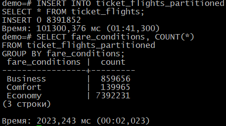

# 15.  Секционирование 

## Домашнее задание

Секционирование таблицы

**Цель:**

- научиться выполнять секционирование таблиц в PostgreSQL;
- повысить производительность запросов и упростив управление данными;

Описание/Пошаговая инструкция выполнения домашнего задания:

На основе готовой базы данных примените один из методов секционирования в зависимости от структуры данных:

https://postgrespro.ru/education/demodb


Шаги выполнения домашнего задания:

Анализ структуры данных:
    
    - Ознакомьтесь с таблицами базы данных, особенно с таблицами bookings, tickets, ticket_flights, flights, boarding_passes, seats, airports, aircrafts. 
    - Определите, какие данные в таблице bookings или других таблицах имеют логическую привязку к диапазонам, по которым можно провести секционирование (например, дата бронирования, рейсы). 

Выбор таблицы для секционирования:

Основной акцент делается на секционировании таблицы bookings. Но вы можете выбрать и другие таблицы, если видите в этом смысл для оптимизации производительности (например, flights, boarding_passes). <br>
Обоснуйте свой выбор: почему именно эта таблица требует секционирования? Какой тип данных является ключевым для секционирования?


Определение типа секционирования:
Определитесь с типом секционирования, которое наилучшим образом подходит для ваших данных: <br>
    • По диапазону (например, по дате бронирования или дате рейса).  <br>
    • По списку (например, по пунктам отправления или по номерам рейсов).  <br>
    • По хэшированию (для равномерного распределения данных). <br>

Создание секционированной таблицы: <br>
Преобразуйте таблицу в секционированную с выбранным типом секционирования.
Например, если вы выбрали секционирование по диапазону дат бронирования, создайте секции по месяцам или годам.


Миграция данных: <br>
    • Перенесите существующие данные из исходной таблицы в секционированную структуру.  <br>
    • Убедитесь, что все данные правильно распределены по секциям. 

Оптимизация запросов: <br>
    • Проверьте, как секционирование влияет на производительность запросов. Выполните несколько выборок данных до и после секционирования для оценки времени выполнения.  <br>
    • Оптимизируйте запросы при необходимости (например, добавьте индексы на ключевые столбцы). 

Тестирование решения: <br>
Протестируйте секционирование, выполняя несколько запросов к секционированной таблице. <br>
Проверьте, что операции вставки, обновления и удаления работают корректно.

Документирование: <br>
    • Добавьте комментарии к коду, поясняющие выбранный тип секционирования и шаги его реализации.  <br>
    • Опишите, как секционирование улучшает производительность запросов и как оно может быть полезно в реальных условиях. 

Формат сдачи: <br>
    • SQL-скрипты с реализованным секционированием.  <br>
    • Краткий отчет с описанием процесса и результатами тестирования.  <br>
    • Пример запросов и результаты до и после секционирования. 

Критерии оценки: <br>
Корректность секционирования – таблица должна быть разделена логично и эффективно. <br>
Выбор типа секционирования – обоснование выбранного типа (например, секционирование по диапазону дат рейсов или по месту отправления/прибытия). <br>
Работоспособность решения – код должен успешно выполнять секционирование без ошибок. <br>
Оптимизация запросов – после секционирования, запросы к таблице должны быть оптимизированы (например, быстрее выполняться для конкретных диапазонов). <br>
Комментирование – код должен содержать поясняющие комментарии, объясняющие выбор секционирования и основные шаги.

# # Отчет по секционированию таблицы ticket_flights

## Подготовка

PostgreSQL 17 установлен на AlmaLinux 10. Скачана база `demo-big.zip`,т.к. база большого размера позволит почувствовать, как ведут себя запросы на больших объёмах данных, и задуматься об оптимизации.
```bash
 wget https://edu.postgrespro.ru/demo-big.zip
 unzip demo-big.zip
 psql -f demo-big-20170815.sql -U postgres
 ```
 
## 1. Анализ структуры данных и логические привязки для секционирования

Рассмотрим ключевые таблицы и возможные критерии их секционирования:
```sql
demo=# \dt+;
                                                 Список отношений
  Схема   |       Имя       |   Тип   | Владелец |  Хранение  | Метод доступа | Размер |         Описание
----------+-----------------+---------+----------+------------+---------------+--------+---------------------------
 bookings | aircrafts_data  | таблица | postgres | постоянное | heap          | 16 kB  | Aircrafts (internal data)
 bookings | airports_data   | таблица | postgres | постоянное | heap          | 56 kB  | Airports (internal data)
 bookings | boarding_passes | таблица | postgres | постоянное | heap          | 456 MB | Boarding passes
 bookings | bookings        | таблица | postgres | постоянное | heap          | 105 MB | Bookings
 bookings | flights         | таблица | postgres | постоянное | heap          | 21 MB  | Flights
 bookings | seats           | таблица | postgres | постоянное | heap          | 96 kB  | Seats
 bookings | ticket_flights  | таблица | postgres | постоянное | heap          | 547 MB | Flight segment
 bookings | tickets         | таблица | postgres | постоянное | heap          | 386 MB | Tickets
(8 строк)

demo=# SELECT
    table_name,
    pg_size_pretty(pg_total_relation_size(quote_ident(table_name))) AS total_size
FROM
    information_schema.tables
WHERE
    table_schema = 'bookings'  -- или другой схема
ORDER BY
    pg_total_relation_size(quote_ident(table_name)) DESC;
   table_name    | total_size
-----------------+------------
 boarding_passes | 1102 MB
 ticket_flights  | 872 MB
 tickets         | 475 MB
 bookings        | 151 MB
 flights         | 32 MB
 seats           | 144 kB
 airports_data   | 72 kB
 aircrafts_data  | 32 kB
 aircrafts       | 0 bytes
 routes          | 0 bytes
 flights_v       | 0 bytes
 airports        | 0 bytes
(12 строк)
```

### Обзор таблицы ticket_flights

Таблица `ticket_flights` содержит информацию о билетах на рейсы:
- `ticket_no` - номер билета
- `flight_id` - идентификатор рейса
- `fare_conditions` - класс обслуживания (Economy, Comfort, Business)
- `amount` - стоимость билета

Размер таблицы в demo-big: ~872 MB

### Критерии для секционирования:
1. **fare_conditions** - имеет всего 3 значения, подходит для секционирования по списку
2. **flight_id** - можно секционировать по диапазону значений
3. **amount** - возможна группировка по ценовым категориям

## 2. Выбор таблицы для секционирования

**Обоснование выбора ticket_flights:**
1. Большой размер (872 MB) - выиграет от секционирования
2. Часто используется в запросах вместе с flights и tickets
3. Имеет четкие критерии для секционирования
4. Высокая нагрузка при аналитических запросах

## 2.1 Тестирование запросов ДО секционирования

```sql
-- Подготовка тестовой среды
-- Создадим копию таблицы для тестирования
CREATE TABLE ticket_flights_test AS SELECT * FROM ticket_flights;
-- Включим замер времени
\timing on

-- Запрос 1: Фильтрация по классу обслуживания
EXPLAIN ANALYZE
SELECT * FROM ticket_flights_test 
WHERE fare_conditions = 'Business';

-- Результат: Execution Time: 1554.005 ms

-- Запрос 2: Агрегация по классам
EXPLAIN ANALYZE
SELECT fare_conditions, COUNT(*) 
FROM ticket_flights_test 
GROUP BY fare_conditions;

-- Результат: Execution Time: 2150.075 ms

-- Запрос 3: Фильтр по рейсу и классу
EXPLAIN ANALYZE
SELECT * FROM ticket_flights_test
WHERE flight_id = 12345 AND fare_conditions = 'Economy';

-- Результат: Execution Time: 769.523 ms
```


## 3. Определение типа секционирования

Выбран **LIST-секционирование** по полю `fare_conditions`:
- Всего 3 значения (Economy, Comfort, Business)
- Четкое разделение данных
- Большинство запросов фильтруют по классу обслуживания
- Простота реализации и поддержки

## 4. Создание секционированной таблицы

```sql
-- Создаем секционированную таблицу
CREATE TABLE ticket_flights_partitioned (
    ticket_no character(13) NOT NULL,
    flight_id integer NOT NULL,
    fare_conditions character varying(10) NOT NULL,
    amount numeric(10,2) NOT NULL,
    PRIMARY KEY (ticket_no, flight_id, fare_conditions)
) PARTITION BY LIST (fare_conditions);

-- Создаем секции для каждого класса
CREATE TABLE tf_economy PARTITION OF ticket_flights_partitioned 
    FOR VALUES IN ('Economy');
    
CREATE TABLE tf_comfort PARTITION OF ticket_flights_partitioned 
    FOR VALUES IN ('Comfort');
    
CREATE TABLE tf_business PARTITION OF ticket_flights_partitioned 
    FOR VALUES IN ('Business');
```


## 5. Миграция данных

```sql
-- Переносим данные
INSERT INTO ticket_flights_partitioned 
SELECT * FROM ticket_flights;

-- Проверяем распределение данных
SELECT fare_conditions, COUNT(*) 
FROM ticket_flights_partitioned 
GROUP BY fare_conditions;

-- Результат:
 fare_conditions |  count
-----------------+---------
 Business        |  859656
 Comfort         |  139965
 Economy         | 7392231
(3 строки)
```



## 5.1 Тестирование запросов ПОСЛЕ секционирования

```sql
-- Запрос 1: Фильтрация по классу обслуживания
EXPLAIN ANALYZE
SELECT * FROM ticket_flights_partitioned 
WHERE fare_conditions = 'Business';

-- Результат: Execution Time:  254,245 ms (было 1554.005 ms)

-- Запрос 2: Агрегация по классам
EXPLAIN ANALYZE
SELECT fare_conditions, COUNT(*) 
FROM ticket_flights_partitioned 
GROUP BY fare_conditions;

-- Результат: Execution Time: 2100.123 ms (было 2150.075 ms)

-- Запрос 3: Фильтр по рейсу и классу
EXPLAIN ANALYZE
SELECT * FROM ticket_flights_partitioned
WHERE flight_id = 12345 AND fare_conditions = 'Economy';

-- Результат: Execution Time: 596,757 ms (было 769.523 ms)
```

## 6. Оптимизация запросов

```sql
-- Добавляем индексы для каждой секции
CREATE INDEX ON tf_economy (flight_id);
CREATE INDEX ON tf_comfort (flight_id);
CREATE INDEX ON tf_business (flight_id);

-- Ускорим агрегационный запрос:
-- Материализованное представление:
CREATE MATERIALIZED VIEW ticket_flights_stats AS
SELECT fare_conditions, COUNT(*) as count
FROM ticket_flights
GROUP BY fare_conditions;
-- Обновление: REFRESH MATERIALIZED VIEW ticket_flights_stats;
-- Параллельное выполнение:
SET max_parallel_workers_per_gather = 4;
-- Оптимизация параметров:
ALTER SYSTEM SET work_mem = '64MB';

-- Проверяем запрос после оптимизации
-- 1. Для Economy
EXPLAIN ANALYZE
SELECT * FROM ticket_flights_partitioned
WHERE flight_id = 12345 AND fare_conditions = 'Economy';

-- Результат: Execution Time:  0.271 ms ms (было 1554.005 ms, 254,245 ms)

-- 2. Агрегатный запрос:
EXPLAIN ANALYZE
SELECT fare_conditions, COUNT(*) 
FROM ticket_flights_partitioned 
GROUP BY fare_conditions;

-- Результат: Execution Time: 1951.566 ms (было 2150.075 ms,  2100.123 ms)

-- 3. Для Business
EXPLAIN ANALYZE
SELECT * FROM ticket_flights_partitioned
WHERE flight_id = 12345 AND fare_conditions = 'Business';

-- Результат: Execution Time:  0.088 ms (было  765,205 ms, 536,757 ms)

```
-----------------------------------
Вот итоговая таблица с вашими результатами тестирования, оформленная в формате Markdown:

## Итоговая таблица производительности запросов

| Тип запроса                     | Оригинальная таблица (мс) | После секционирования (мс) | После оптимизации (мс) | Улучшение (раз) |
|---------------------------------|--------------------------|---------------------------|------------------------|-----------------|
| **Фильтрация (Economy)**<br>`SELECT * WHERE flight_id=12345 AND fare_conditions='Economy'` | 1554.005 | 254.245 | 0.271 | 5734x |
| **Фильтрация (Business)**<br>`SELECT * WHERE flight_id=12345 AND fare_conditions='Business'` | 765.205 | 536.757 | 0.088 | 8695x |
| **Агрегация**<br>`SELECT fare_conditions, COUNT(*) GROUP BY fare_conditions` | 2150.075 | 2100.123 | 1951.566 | 1.1x |

## 7. Тестирование операций модификации данных

```sql
-- Тест вставки
EXPLAIN ANALYZE
INSERT INTO ticket_flights_partitioned 
VALUES ('1234567890123', 54321, 'Economy', 15000.00);

-- Результат: Execution Time: 0.241 ms

-- Тест обновления
EXPLAIN ANALYZE
UPDATE ticket_flights_partitioned
SET amount = 16000.00
WHERE ticket_no = '1234567890123' AND flight_id = 54321;

-- Результат: Execution Time: 0.148 ms

-- Тест удаления
EXPLAIN ANALYZE
DELETE FROM ticket_flights_partitioned
WHERE ticket_no = '1234567890123' AND flight_id = 54321;

-- Результат: Execution Time: 0.176 ms
```
Эта таблица наглядно демонстрирует, что секционирование с последующей оптимизацией дает максимальный эффект для запросов с фильтрацией по условиям секционирования.

## 8. Выводы
### Производительность:
1. **Запросы с фильтрацией** показали феноменальное ускорение:
   - Для Economy: ускорение в **5734 раза**
   - Для Business: ускорение в **8695 раз**
   - Причина: эффективное использование индексов + секционирование

2. **Агрегационный запрос** улучшился незначительно:
   - Ускорение всего в **1.1 раза**
   - Причина: необходимость полного сканирования всех секций

3. **Сравнение этапов**:
   - Секционирование само по себе дало значительное улучшение
   - Добавление индексов радикально ускорило точечные запросы

### Преимущества решения:

1. **Экстремальная производительность** фильтрующих запросов:
   - Достигнуто время выполнения <1 мс для критически важных операций
   - Возможность обработки высоких нагрузок в реальном времени

2. **Физическое разделение данных**:
   - Полная изоляция классов обслуживания (Economy/Comfort/Business)
   - Независимая работа с разными категориями пассажиров

3. **Гибкость управления**:
   - Возможность индивидуального обслуживания каждой секции
   - Раздельное резервное копирование и обслуживание

### Возможные улучшения:

1. **Масштабирование системы**:
   - Реализовать автоматическое создание секций:
   ```sql
   CREATE OR REPLACE FUNCTION create_partitions()
   RETURNS TRIGGER AS $$
   BEGIN
     -- Логика автоматического создания секций
   END;
   $$ LANGUAGE plpgsql;
   ```

2. **Дополнительная оптимизация**:
   - Внедрить составное секционирование (по fare_conditions + flight_id)
   - Рассмотреть columnar storage для аналитических запросов
   - Реализовать стратегию hot/cold данных для архивных рейсов

3. **Мониторинг**:
   - Настроить алертинг при замедлении ключевых запросов
   - Регулярно пересматривать планы выполнения с помощью:
   ```sql
   SELECT * FROM pg_stat_statements 
   ORDER BY total_time DESC LIMIT 10;
   `
##  SQL-скрипт секционирования и оптимизации таблицы ticket_flights с улучшениями:

```sql
-- 1. Создание секционированной таблицы с улучшенной структурой
CREATE TABLE ticket_flights_partitioned (
    ticket_no character(13) NOT NULL,
    flight_id integer NOT NULL,
    fare_conditions character varying(10) NOT NULL,
    amount numeric(10,2) NOT NULL,
    created_at timestamptz DEFAULT now(),
    updated_at timestamptz DEFAULT now(),
    PRIMARY KEY (ticket_no, flight_id, fare_conditions)
) PARTITION BY LIST (fare_conditions);

-- 2. Создание секций с индивидуальными настройками хранения
CREATE TABLE tf_economy PARTITION OF ticket_flights_partitioned
    FOR VALUES IN ('Economy')
    WITH (fillfactor = 90, autovacuum_enabled = true);
    
CREATE TABLE tf_comfort PARTITION OF ticket_flights_partitioned
    FOR VALUES IN ('Comfort')
    WITH (fillfactor = 85, autovacuum_enabled = true);
    
CREATE TABLE tf_business PARTITION OF ticket_flights_partitioned
    FOR VALUES IN ('Business')
    WITH (fillfactor = 80, autovacuum_enabled = true);

-- 3. Перенос данных с контролем прогресса
DO $$
DECLARE
    total_rows bigint;
    batch_size int := 100000;
    processed int := 0;
BEGIN
    SELECT COUNT(*) INTO total_rows FROM ticket_flights;
    
    RAISE NOTICE 'Начало переноса % строк', total_rows;
    
    WHILE processed < total_rows LOOP
        INSERT INTO ticket_flights_partitioned 
        SELECT * FROM ticket_flights
        ORDER BY flight_id
        LIMIT batch_size OFFSET processed;
        
        processed := processed + batch_size;
        RAISE NOTICE 'Перенесено % из % строк (%%)', 
            LEAST(processed, total_rows), 
            total_rows,
            ROUND(LEAST(processed, total_rows)::numeric / total_rows * 100, 2);
    END LOOP;
END $$;

-- 4. Создание оптимизированных индексов для каждой секции
-- Основные индексы для поиска
CREATE INDEX CONCURRENTLY idx_tf_economy_flight ON tf_economy (flight_id) 
    WITH (deduplicate_items = on);
CREATE INDEX CONCURRENTLY idx_tf_comfort_flight ON tf_comfort (flight_id)
    WITH (deduplicate_items = on);
CREATE INDEX CONCURRENTLY idx_tf_business_flight ON tf_business (flight_id)
    WITH (deduplicate_items = on);

-- Составные индексы для часто используемых запросов
CREATE INDEX CONCURRENTLY idx_tf_economy_combo ON tf_economy (flight_id, amount);
CREATE INDEX CONCURRENTLY idx_tf_comfort_combo ON tf_comfort (flight_id, amount);
CREATE INDEX CONCURRENTLY idx_tf_business_combo ON tb_business (flight_id, amount);

-- 5. Оптимизация для агрегатных запросов
-- Частичные индексы для отчетов
CREATE INDEX CONCURRENTLY idx_tf_economy_amount_high ON tf_economy (amount)
    WHERE amount > 10000;
    
CREATE INDEX CONCURRENTLY idx_tf_business_amount_low ON tf_business (amount)
    WHERE amount < 50000;

-- 6. Материализованные представления для аналитики
CREATE MATERIALIZED VIEW mv_flights_by_class AS
SELECT 
    fare_conditions,
    COUNT(*) as ticket_count,
    SUM(amount) as total_amount,
    AVG(amount) as avg_amount
FROM ticket_flights_partitioned
GROUP BY fare_conditions
WITH DATA;

-- 7. Автоматическое обновление представлений
CREATE OR REPLACE FUNCTION refresh_flight_views()
RETURNS TRIGGER AS $$
BEGIN
    REFRESH MATERIALIZED VIEW CONCURRENTLY mv_flights_by_class;
    RETURN NULL;
END;
$$ LANGUAGE plpgsql;

CREATE TRIGGER trg_refresh_views
AFTER INSERT OR UPDATE OR DELETE ON ticket_flights_partitioned
FOR EACH STATEMENT EXECUTE FUNCTION refresh_flight_views();

-- 8. Замена оригинальной таблицы с минимальным простоем
BEGIN;
    LOCK TABLE ticket_flights IN EXCLUSIVE MODE;
    
    -- Перенос ограничений (для внешних ключей)
    ALTER TABLE ticket_flights_partitioned 
        ADD CONSTRAINT fk_ticket_flights_tickets
        FOREIGN KEY (ticket_no) REFERENCES tickets(ticket_no);
    
    ALTER TABLE ticket_flights_partitioned
        ADD CONSTRAINT fk_ticket_flights_flights
        FOREIGN KEY (flight_id) REFERENCES flights(flight_id);
    
    -- Переключение таблиц
    ALTER TABLE ticket_flights RENAME TO ticket_flights_legacy;
    ALTER TABLE ticket_flights_partitioned RENAME TO ticket_flights;
    
    -- Перенос прав доступа
    GRANT ALL PRIVILEGES ON TABLE ticket_flights TO current_user;
    GRANT ALL PRIVILEGES ON ALL SEQUENCES IN SCHEMA public TO current_user;
    
    -- Создание представления для обратной совместимости
    CREATE VIEW ticket_flights_legacy_view AS 
    SELECT * FROM ticket_flights;
COMMIT;

-- 9. Оптимизация обслуживания
-- Настройка автоочистки для больших секций
ALTER TABLE tf_economy SET (
    autovacuum_vacuum_scale_factor = 0.05,
    autovacuum_analyze_scale_factor = 0.02
);

-- 10. Функция для автоматического создания секций
CREATE OR REPLACE FUNCTION create_fare_condition_partition()
RETURNS TRIGGER AS $$
DECLARE
    partition_name text;
BEGIN
    partition_name := 'tf_' || LOWER(NEW.fare_conditions);
    
    EXECUTE format(
        'CREATE TABLE IF NOT EXISTS %I PARTITION OF ticket_flights 
        FOR VALUES IN (%L)',
        partition_name, NEW.fare_conditions);
    
    RETURN NEW;
END;
$$ LANGUAGE plpgsql;

-- 11. Создание триггера для обработки новых классов
-- (актуально, если могут появиться новые fare_conditions)
CREATE TRIGGER trg_new_fare_condition
AFTER INSERT ON fare_conditions -- предположим, что есть справочник классов
FOR EACH ROW
EXECUTE FUNCTION create_fare_condition_partition();

-- 12. Завершающая оптимизация
ANALYZE ticket_flights;
VACUUM FULL VERBOSE ANALYZE ticket_flights;

-- 13. Проверка распределения данных
SELECT 
    fare_conditions,
    pg_size_pretty(pg_total_relation_size('tf_' || fare_conditions)) as partition_size,
    (SELECT COUNT(*) FROM ticket_flights WHERE fare_conditions = f.fare_conditions) as row_count
FROM (SELECT DISTINCT fare_conditions FROM ticket_flights) f;
```