# 2. SQL и реляционные СУБД. Введение в PostgreSQL

# Домашнее задание

Работа с уровнями изоляции транзакции в PostgreSQL

**Цель:**

- научиться работать в Яндекс Облаке;
- научиться управлять уровнем изолции транзации в PostgreSQL и понимать особенность работы уровней read commited и repeatable read;

**Описание выполнения домашнего задания:**

   - создать новый проект в Яндекс облако или на любых ВМ, докере
   - далее создать инстанс виртуальной машины с дефолтными параметрами
   - добавить свой ssh ключ в metadata ВМ
   - зайти удаленным ssh (первая сессия), не забывайте про ssh-add
   - поставить PostgreSQL
   - зайти вторым ssh (вторая сессия)
   - запустить везде psql из под пользователя postgres
   - выключить auto commit
   - сделать в первой сессии новую таблицу и наполнить ее данными create table persons(id serial, first_name text, second_name text); insert into persons(first_name, second_name) values('ivan', 'ivanov'); insert into persons(first_name, second_name) values('petr', 'petrov'); commit;
   - посмотреть текущий уровень изоляции: show transaction isolation level
   - начать новую транзакцию в обоих сессиях с дефолтным (не меняя) уровнем изоляции
   - в первой сессии добавить новую запись insert into persons(first_name, second_name) values('sergey', 'sergeev');
   - сделать select from persons во второй сессии
   - видите ли вы новую запись и если да то почему?
   - завершить первую транзакцию - commit;
   - сделать select from persons во второй сессии
   - видите ли вы новую запись и если да то почему?
   - завершите транзакцию во второй сессии
   - начать новые но уже repeatable read транзации - set transaction isolation level repeatable read;
   - в первой сессии добавить новую запись insert into persons(first_name, second_name) values('sveta', 'svetova');
   - сделать select* from persons во второй сессии*
   - видите ли вы новую запись и если да то почему?
   - завершить первую транзакцию - commit;
   - сделать select from persons во второй сессии
   - видите ли вы новую запись и если да то почему?
   - завершить вторую транзакцию
   - сделать select * from persons во второй сессии
   - видите ли вы новую запись и если да то почему?

## создать ВМ с Ubuntu

Для выполнения ДЗ была выбрана более новая версия Ubuntu 24.04.2 LTS, установлена минимальная система на VM VirtualBox 7.1.8. SSH-ключ был сформирован при установке ОС.

Обновляем пакеты: 
sudo apt update && sudo apt upgrade -y

## Установите PostgreSQL 17

Добавьте репозиторий PostgreSQL и установим: 
sudo sh -c 'echo "deb http://apt.postgresql.org/pub/repos/apt $(lsb_release -cs)-pgdg main" > /etc/apt/sources.list.d/pgdg.list' 
wget -qO- https://www.postgresql.org/media/keys/ACCC4CF8.asc | sudo tee /etc/apt/trusted.gpg.d/pgdg.asc 
sudo apt update 
sudo apt -y install postgresql-17

Проверим версию PostgreSQL: 
psql --version 
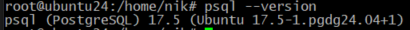

## Подготовка к эксперименту

Запустим psql в обоих сессиях: 
sudo -u postgres psql   
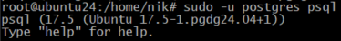

# Уровень изоляции Read Committed (по умолчанию)

Отключим автокоммит (автоматическое сохранение изменений (autocommit) для текущей 1й сессии): 
\set AUTOCOMMIT off

## Сделать в первой сессии новую таблицу и наполнить ее данными

В первой сессии создаём таблицу и данные:

  CREATE TABLE persons(id serial, first_name text, second_name text);  
  INSERT INTO persons(first_name, second_name) VALUES('ivan', 'ivanov');  
  INSERT INTO persons(first_name, second_name) VALUES('petr', 'petrov');  
  COMMIT;  
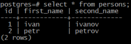

## посмотреть текущий уровень изоляции: 

проверим уровень изоляции в обеих сессиях:  
postgres=!#  SHOW TRANSACTION ISOLATION LEVEL;  
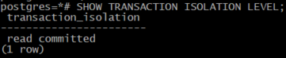  
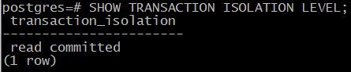

## Начать новую транзакцию в обоих сессиях с дефолтным (не меняя) уровнем изоляции

Дефолтный уровень: 
BEGIN;  

## В первой сессии добавить новую запись

В 1ю сессию добавляем:  
insert into persons(first_name, second_name) values('sergey', 'sergeev');  

## сделать select from persons во второй сессии. Видите ли вы новую запись и если да то почему?  
postgres=#  SELECT * FROM persons;  
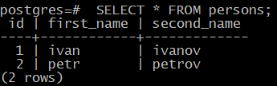  
Результат: видны только данные ivan и petr.  
Причина: незакоммиченные изменения не видны в read committed, п.э. новые записи не появились.

   ## Завершить первую транзакцию

   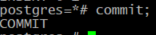
   
   ## Cделать select from persons во второй сессии. Видите ли вы новую запись и если да то почему?

postgres=*# select * from persons;  
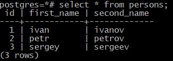

Результат: sergey появился.
Причина: после коммита изменения видны в read committed.

## завершите транзакцию во второй сессии

postgres=*# commit;  
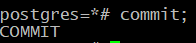

# Уровень изоляции Repeatable Read

## Начнём новые транзакции с уровнем `repeatable read`.

Начнём новые, но уже repeatable read транзации - set transaction isolation level repeatable read:  
postgres=# BEGIN;  
  SET TRANSACTION ISOLATION LEVEL REPEATABLE READ;  
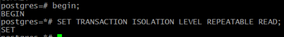  
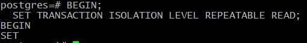

  ## В первой сессии добавить новую запись
  postgres=*# insert into persons(first_name, second_name) values('sveta', 'svetova');  
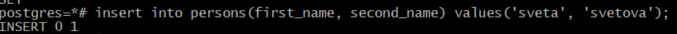

 ## Cделать select* from persons во второй сессии. Видите ли вы новую запись, и если да то почему?

postgres=*# select * from persons; 
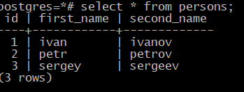  
Результат: новую запись не видно.  
Причина: незакоммиченные изменения не видны , п.э. новые записи не появились.

## завершить первую транзакцию. Cделать select from persons во второй сессии. Видите ли вы новую запись и если да то почему?

postgres=*# commit;  
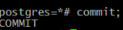

postgres=*# select * from persons;  
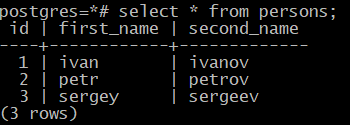

Результат:  новая запись sveta не видна.  
Причина: repeatable read использует снимок данных на момент начала транзакции.

# Завершить вторую транзакцию. Cделать select * from persons во второй сессии. Видите ли вы новую запись и если да то почему?

postgres=*# commit;  
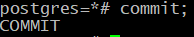  
postgres=# select * from persons;  
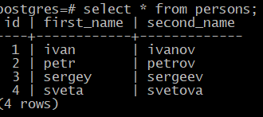  
Результат: sveta теперь видна.  
Причина: транзакция завершена, запрос видит актуальные данные.

**Итог:**
| Действие                                         | Read Committed             | Repeatable Read             |
|--------------------------------------------------|----------------------------|-----------------------------|
| Видны незакоммиченные изменения?                 | ❌                         | ❌                          |
| Видны изменения после коммита в другой сессии?   | ✅ (сразу после коммита)   | ❌ (только после завершения текущей транзакции) |
| "Неповторяемое чтение" (non-repeatable read)     | Возможно                   | Невозможно                 |
| "Фантомное чтение" (phantom read)                | Возможно                   | Невозможно (в PostgreSQL)  |

- **Read Committed**: Изменения видны сразу после коммита в другой сессии.
- **Repeatable Read**: Гарантирует, что данные в течение транзакции остаются неизменными (снимок на момент `BEGIN`), новые строки от других транзакций не видны до завершения текущей транзакции.