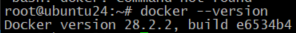
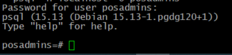
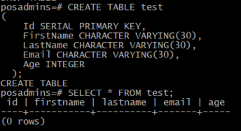
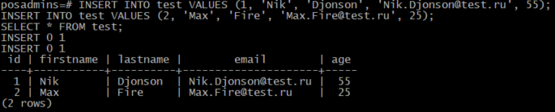
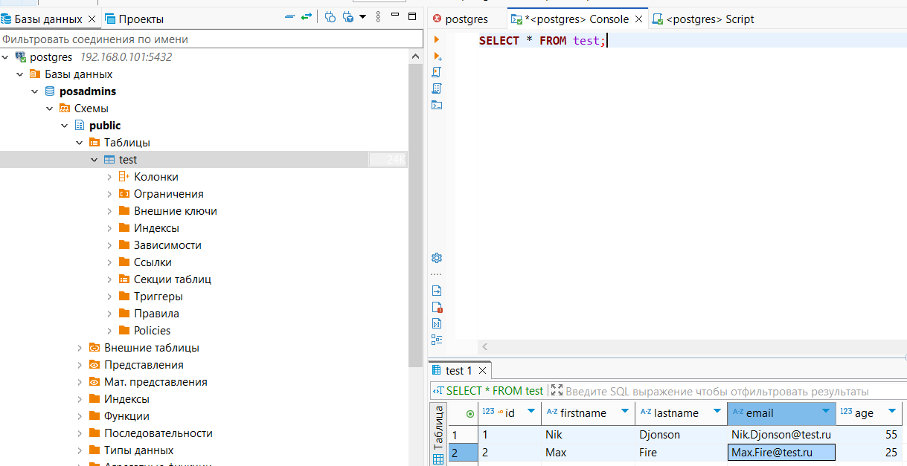
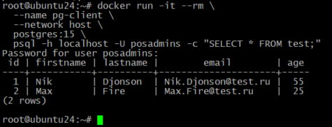
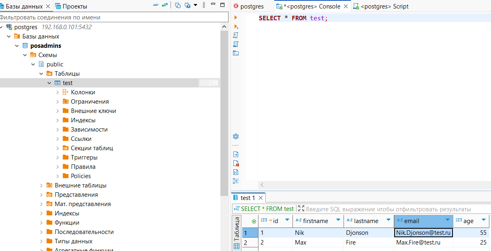

# 3. Установка PostgreSQL
# Домашнее задание
Установка и настройка PostgteSQL в контейнере Docker

__Цель:__ 
- установить PostgreSQL в Docker контейнере; 
- настроить контейнер для внешнего подключения.

**Описание выполнения домашнего задания:**

    - создать ВМ с Ubuntu 20.04/22.04 или развернуть докер любым удобным способом;  
    - поставить на нем Docker Engine;
    - сделать каталог /var/lib/postgres;
    - развернуть контейнер с PostgreSQL 15 смонтировав в него /var/lib/postgresql;
    - развернуть контейнер с клиентом postgres;
    - подключится из контейнера с клиентом к контейнеру с сервером и сделать таблицу с парой строк;
    - подключится к контейнеру с сервером с ноутбука/компьютера извне инстансов ЯО/места установки докера;
    - удалить контейнер с сервером;
    - создать его заново;
    - подключится снова из контейнера с клиентом к контейнеру с сервером
    проверить, что данные остались на месте;
    -  оставляйте в ЛК ДЗ комментарии что и как вы делали и как боролись с проблемами.

## создать ВМ с Ubuntu 20.04/22.04 или развернуть докер любым удобным способом

Для выполнения ДЗ была выбрана более новая версия Ubuntu 24.04.2 LTS, установлена минимальная система на VM VirtualBox 7.1.8.

Обновляем пакеты: 
sudo apt update && sudo apt upgrade -y

## Установка Docker Engine

Устанавливаем зависимости: 
sudo apt install -y ca-certificates curl gnupg

Добавляем ключ Docker: 
sudo install -m 0755 -d /etc/apt/keyrings 
curl -fsSL https://download.docker.com/linux/ubuntu/gpg | sudo gpg --dearmor -o /etc/apt/keyrings/docker.gpg 
sudo chmod a+r /etc/apt/keyrings/docker.gpg

Добавляем репозиторий: 
echo "deb [arch=$(dpkg --print-architecture) signed-by=/etc/apt/keyrings/docker.gpg] https://download.docker.com/linux/ubuntu $(. /etc/os-release && echo "$VERSION_CODENAME") stable" | sudo tee /etc/apt/sources.list.d/docker.list > /dev/null

Устанавливаем Docker: 
sudo apt update 
sudo apt install -y docker-ce docker-ce-cli containerd.io docker-buildx-plugin docker-compose-plugin

Проверяем установку: 
sudo docker --version 

 ## Создание каталога для данных PostgreSQL: /var/lib/postgres

Cоздадим сам каталог: 
mkdir -p /var/lib/postgres

Предоставлю права для записи: 
chmod 775 /var/lib/postgres

## Рзвернуть контейнер с PostgreSQL 15 смонтировав в него /var/lib/postgresql

Запускаю с параметрами:
- `-d`: Запуск в фоновом режиме.
  - `-v`: Монтирование каталога `/var/lib/postgres` в контейнер.
  - `-p`: Проброс порта `5432`.
  - `-e`: Переменные окружения (пользователь:posadmins пароль:PSpass1498e)

sudo docker run -d \  
  --name postgres-server \  
  -e POSTGRES_PASSWORD=PSpass1498e \  
  -e POSTGRES_USER=posadmins \  
  -v /var/lib/postgres:/var/lib/postgresql/data \  
  -p 5432:5432 \  
  postgres:15

  ## Развернуть контейнер с клиентом PostgreSQL

sudo docker run -it --rm \  
  --name pg-client \  
  --network host \  
  postgres:15 \  
  psql -h localhost -U posadmins 

## Подключится из контейнера с клиентом к контейнеру с сервером и сделать таблицу с парой строк

Подключаюсь из контейнера с клиентом к контейнеру с сервером PostgreSQL: 
sudo docker run -it --rm \  
  --name pg-client \  
  --network host \  
  postgres:15 \  
  psql -h localhost -U posadmins 

  Создаю таблицу test со следующими столбцами: 
  sql 
CREATE TABLE test  
(  
    Id SERIAL PRIMARY KEY,  
    FirstName CHARACTER VARYING(30),  
    LastName CHARACTER VARYING(30),  
    Email CHARACTER VARYING(30),  
    Age INTEGER  
  );  

posadmins=# SELECT * FROM test; 

Заполняю таблицу данными: 
INSERT INTO test VALUES (1, 'Nik', 'Djonson', 'Nik.Djonson@test.ru', 55); 
INSERT INTO test VALUES (2, 'Max', 'Fire', 'Max.Fire@test.ru', 25); 
SELECT * FROM test; 

## Подключится к контейнеру с сервером с ноутбука/компьютера извне инстансов ЯО/места установки докера

Попробую подключиться к базе c другого ноутбука при помощи ПО DBeaver и проверить доступ к таблице test: 

Доступ есть, данные таблицы достцпны.

## Удаление и повторное создание контейнера c сервером PostgreSQL

Останавливаем и удаляем контейнер: 
sudo docker stop postgres-server 
sudo docker rm postgres-server 

Запускаем новый контейнер с темже каталогом данных: 
sudo docker run -d \  
  --name postgres-server \  
  -e POSTGRES_PASSWORD=PSpass1498e \  
  -e POSTGRES_USER=posadmins \  
  -v /var/lib/postgres:/var/lib/postgresql/data \  
  -p 5432:5432 \  
  postgres:15

  ## Проверка сохранности данных

  Подключаюсь через клиентский контейнер: 
  docker run -it --rm \  
  --name pg-client \  
  --network host \  
  postgres:15 \  
  psql -h localhost -U posadmins -c "SELECT * FROM test;"  
  

C другого ноутбука при помощи ПО DBeaver:  

**Итог:**
- Данные сохраняются благодаря монтированию тома `/var/lib/postgres` на хосте. 
- При пересоздании контейнера PostgreSQL использует существующие данные из этого каталога.