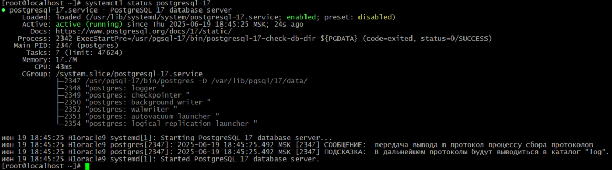
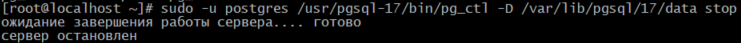
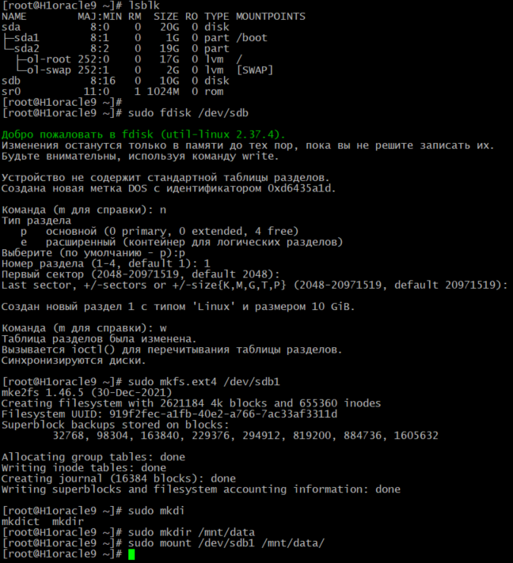
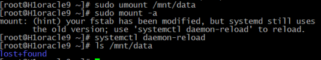
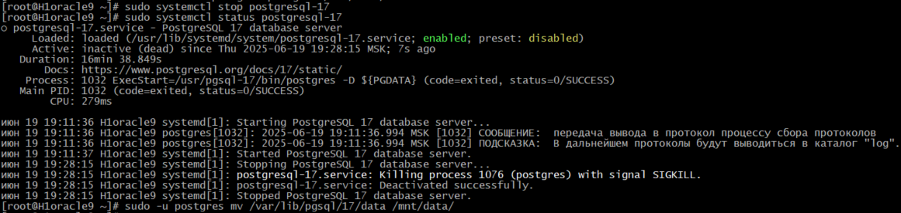
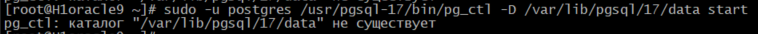
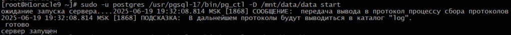
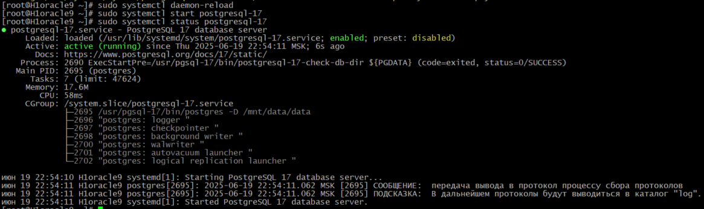
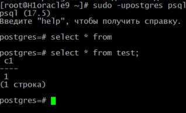
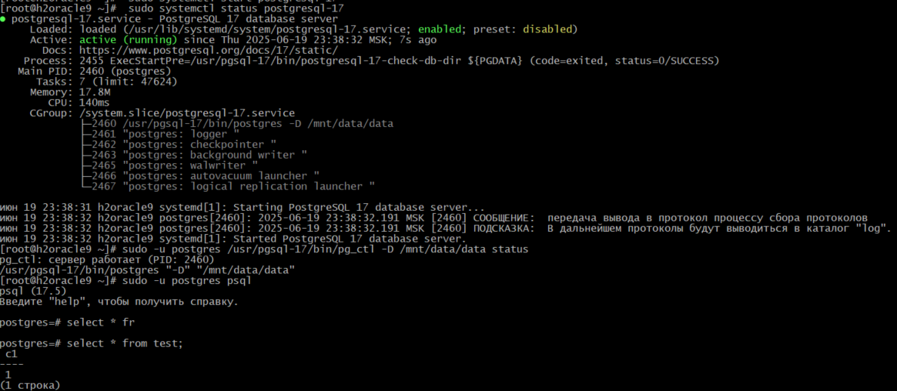

# 4. Физический уровень PostgreSQL

# Домашнее задание

Установка и настройка PostgreSQL

**Цель:**

   - создавать дополнительный диск для уже существующей виртуальной машины, размечать его и делать на нем файловую систему
   - переносить содержимое базы данных PostgreSQL на дополнительный диск
   - переносить содержимое БД PostgreSQL между виртуальными машинами


Описание/Пошаговая инструкция выполнения домашнего задания:

   - создайте виртуальную машину c Ubuntu 20.04/22.04 LTS в ЯО/Virtual Box/докере
   - поставьте на нее PostgreSQL 15 через sudo apt
   - проверьте что кластер запущен через sudo -u postgres pg_lsclusters
   - зайдите из под пользователя postgres в psql и сделайте произвольную таблицу с произвольным содержимым
    postgres=# create table test(c1 text);
    postgres=# insert into test values('1');
    \q
   - остановите postgres например через sudo -u postgres pg_ctlcluster 15 main stop
   - создайте новый диск к ВМ размером 10GB
   - добавьте свеже-созданный диск к виртуальной машине - надо зайти в режим ее редактирования и дальше выбрать пункт attach existing disk
   - проинициализируйте диск согласно инструкции и подмонтировать файловую систему, только не забывайте менять имя диска на актуальное, в вашем случае это скорее всего будет /dev/sdb - https://www.digitalocean.com/community/tutorials/how-to-partition-and-format-storage-devices-in-linux
   - перезагрузите инстанс и убедитесь, что диск остается примонтированным (если не так смотрим в сторону fstab)
   - сделайте пользователя postgres владельцем /mnt/data - chown -R postgres:postgres /mnt/data/
   - перенесите содержимое /var/lib/postgres/15 в /mnt/data - mv /var/lib/postgresql/15/mnt/data
   - попытайтесь запустить кластер - sudo -u postgres pg_ctlcluster 15 main start
   - напишите получилось или нет и почему
   - задание: найти конфигурационный параметр в файлах раположенных в /etc/postgresql/15/main который надо поменять и поменяйте его
   - напишите что и почему поменяли
   - попытайтесь запустить кластер - sudo -u postgres pg_ctlcluster 15 main start
   - напишите получилось или нет и почему
   - зайдите через через psql и проверьте содержимое ранее созданной таблицы
   - задание со звездочкой *: не удаляя существующий инстанс ВМ сделайте новый, поставьте на его PostgreSQL, удалите файлы с данными из /var/lib/postgres, перемонтируйте внешний диск который сделали ранее от первой виртуальной машины ко второй и запустите PostgreSQL на второй машине так чтобы он работал с данными на внешнем диске, расскажите как вы это сделали и что в итоге получилось.

# 1. Установка и настройка PostgreSQL 17 на Oracle Linux 9

## Добавление репозитория PostgreSQL
sudo dnf install -y https://download.postgresql.org/pub/repos/yum/reporpms/EL-9-x86_64/pgdg-redhat-repo-latest.noarch.rpm

## Отключить встроенный модуль PostgreSQL:
```bash
sudo dnf -qy module disable postgresql
```

## Установка PostgreSQL 17:
```bash
sudo dnf install -y postgresql17-server
```

## Инициализация базы данных и включение автозапуска:
```bash
sudo /usr/pgsql-17/bin/postgresql-17-setup initdb
sudo systemctl enable postgresql-17
sudo systemctl start postgresql-17
```


# 2. Проверка, что кластер запущен

pg_lsclusters - данной команды нет в rpm-ОС, п.э. используем systemctl: 

```bash
sudo systemctl start postgresql-17
sudo systemctl status postgresql-17
```


# 3. Создание тестовой таблицы
```bash
 sudo -u postgres psql

CREATE TABLE test(c1 text);
INSERT INTO test VALUES('1');
\q
```
# 4. Остановка PostgreSQL
```bash
sudo -u postgres /usr/pgsql-17/bin/pg_ctl -D /var/lib/pgsql/17/data stop
```



 # 5. Создание и добавление нового диска 10GB в VirtualBox

```bash
 ## Просмотр доступных дисков
 lsblk

# Создание раздела
sudo fdisk /dev/sdb
# В fdisk: n -> p -> 1 -> Enter -> Enter -> w

# Создание файловой системы
sudo mkfs.ext4 /dev/sdb1

# Создание точки монтирования
sudo mkdir /mnt/data

# Монтирование диска
sudo mount /dev/sdb1 /mnt/data
 ```

 

 Настройка автоматического монтирования при загрузке:

```bash
# Получение UUID диска
sudo blkid /dev/sdb1

# Добавление в /etc/fstab
echo "UUID=919f2fec-a1fb-40e2-a766-7ac33af3311d /mnt/data ext4 defaults 0 0" | sudo tee -a /etc/fstab

# Проверка
sudo umount /mnt/data
sudo mount -a
sudo systemctl daemon-reload
ls /mnt/data  # Должен быть пустым
 ```
 

 # 6. Назначение прав пользователю postgres
```bash
 sudo chown -R postgres:postgres /mnt/data/
 ```

 # 7. Перенос данных PostgreSQL
```bash

# Остановка PostgreSQL
sudo systemctl stop postgresql-17

# Проверяем статус службы
 sudo systemctl status postgresql-17

# Перенос данных
sudo -u postgres mv /var/lib/pgsql/17/data /mnt/data/
```


# 8. Попытка запуска кластера
```bash
sudo -u postgres /usr/pgsql-17/bin/pg_ctl -D /var/lib/pgsql/17/data start
```
Результат: не получилось, так как PostgreSQL ищет данные по старому пути (/var/lib/pgsql/17/data).


Но, если мы укажем новый путь:
```bash
sudo -u postgres /usr/pgsql-17/bin/pg_ctl -D /mnt/data/data start
```
Результат: кластер запустился.


# 9. Изменение конфигурационного параметра

Т.к. мы запустили кластер через mnt, нам необходимо его и сам сервер остановить:
```bash
sudo -u postgres /usr/pgsql-17/bin/pg_ctl -D /mnt/data/data stop
sudo systemctl stop postgresql-17
```
Меняем параметр PGDATA в файле сервиса  "/etc/systemd/system/postgresql-17.service.d/override.conf":

```bash
sudo systemctl edit postgresql-17.service

[Service]
Environment=PGDATA=/mnt/data/data
```
или можно изменить в основном файле сервиса:
```bash
sudo sed -i 's|Environment=PGDATA=.*|Environment=PGDATA=/mnt/data/data|' /usr/lib/systemd/system/postgresql-17.service
sudo systemctl daemon-reload
```

# 10. Повторная попытка запуска кластера
```bash
udo systemctl start postgresql-17
sudo systemctl status postgresql-17
```


Результат: кластер запустился, так как мы указали правильный путь к данным.

# 11. Проверка содержимого таблицы
```bash
sudo -upostgres psql
psql -c "SELECT * FROM test;"
```


Результат: данные доступны.

# 12. Задание со звездочкой: Перенос диска на другую VM

- Создаем новую VM с Oracle Linux 9;

- Устанавливаем PostgreSQL 17 (# 1. Установка и настройка PostgreSQL 17 на Oracle Linux 9);

- выключаю обе VM;

- В VirtualBox: Отключаем диск от первой VM и подключаем ко второй;

Включаю 2ю VM, выполняю:

```bash
# Создаем точку монтирования
sudo mkdir /mnt/data

# Добавляем в fstab (используем тот же UUID)
echo "UUID=919f2fec-a1fb-40e2-a766-7ac33af3311d /mnt/data ext4 defaults 0 0" | sudo tee -a /etc/fstab

# Монтируем диск
sudo mount -a

systemctl daemon-reload

# Назначаем права
sudo chown -R postgres:postgres /mnt/data

# останавливаем серверЖ
sudo systemctl stop postgresql-17

# Удаляем старые данные (если они есть)
sudo rm -rf /var/lib/pgsql/17/data

# Меняем PGDATA как в шаге 12
sudo sed -i 's|Environment=PGDATA=.*|Environment=PGDATA=/mnt/data/data|' /usr/lib/systemd/system/postgresql-17.service

sudo systemctl daemon-reload

# Запускаем PostgreSQL
sudo systemctl start postgresql-17
sudo systemctl status postgresql-17
```

Проверяем данные:
```bash
sudo -u postgres psql

postgres=# select * from test;
 c1
----
 1
(1 строка)
```


Итог: вторая VM работает с теми же данными, что и первая, так как они хранятся на внешнем диске. Это демонстрирует возможность переноса содержимого БД PostgreSQL между серверами путем перемещения диска с данными.