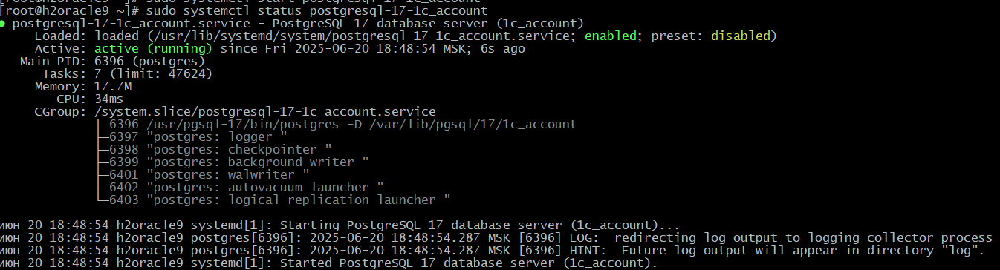
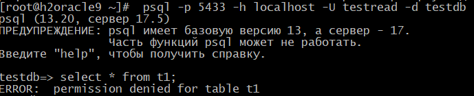
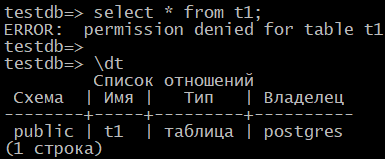
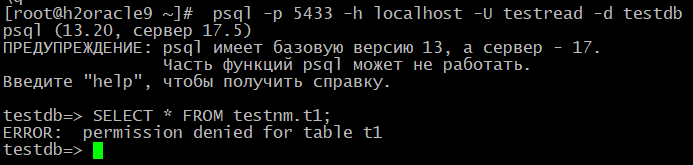
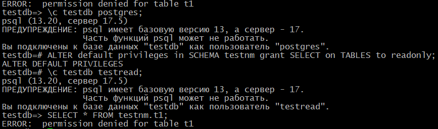
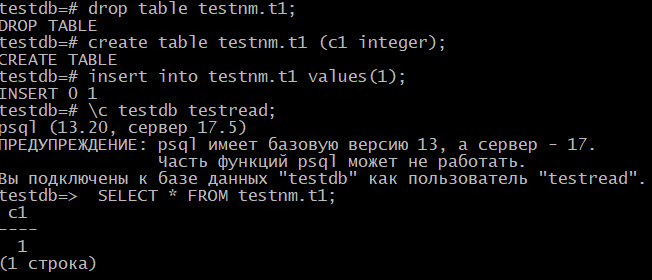
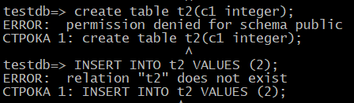

# 5. Логический уровень PostgreSQL

# Домашнее задание

Работа с базами данных, пользователями и правами.

**Цель:**

    создание новой базы данных, схемы и таблицы
    создание роли для чтения данных из созданной схемы созданной базы данных
    создание роли для чтения и записи из созданной схемы созданной базы данных

**Описание/Пошаговая инструкция выполнения домашнего задания:**

    1. создайте новый кластер PostgresSQL 17
    2. зайдите в созданный кластер под пользователем postgres
    3. создайте новую базу данных testdb
    4. зайдите в созданную базу данных под пользователем postgres
    5. создайте новую схему testnm
    6. создайте новую таблицу t1 с одной колонкой c1 типа integer
    7. вставьте строку со значением c1=1
    8. создайте новую роль readonly
    9. дайте новой роли право на подключение к базе данных testdb
    10. дайте новой роли право на использование схемы testnm
    11. дайте новой роли право на select для всех таблиц схемы testnm
    12. создайте пользователя testread с паролем test123
    13. дайте роль readonly пользователю testread
    14. зайдите под пользователем testread в базу данных testdb
    15. сделайте select * from t1;
    16. получилось? (могло если вы делали сами не по шпаргалке и не упустили один существенный момент про который позже)
    17. напишите что именно произошло в тексте домашнего задания
    18. у вас есть идеи почему? ведь права то дали?
    19. посмотрите на список таблиц
    20. подсказка в шпаргалке под пунктом 20
    21. а почему так получилось с таблицей (если делали сами и без шпаргалки то может у вас все нормально)
    22. вернитесь в базу данных testdb под пользователем postgres
    23. удалите таблицу t1
    24. создайте ее заново но уже с явным указанием имени схемы testnm
    25. вставьте строку со значением c1=1
    26. зайдите под пользователем testread в базу данных testdb
    27. сделайте select * from testnm.t1;
    28. получилось?
    29. есть идеи почему? если нет - смотрите шпаргалку
    30. как сделать так чтобы такое больше не повторялось? если нет идей - смотрите шпаргалку
    31. сделайте select * from testnm.t1;
    32. получилось?
    33. есть идеи почему? если нет - смотрите шпаргалку
    34. сделайте select * from testnm.t1;
    35. получилось?
    36. ура!
    37. теперь попробуйте выполнить команду create table t2(c1 integer); insert into t2 values (2);
    38. а как так? нам же никто прав на создание таблиц и insert в них под ролью readonly?
    39. есть идеи как убрать эти права? если нет - смотрите шпаргалку
    40. если вы справились сами то расскажите что сделали и почему, если смотрели шпаргалку - объясните что сделали и почему выполнив указанные в ней команды
    41. теперь попробуйте выполнить команду create table t3(c1 integer); insert into t2 values (2);
    42. расскажите что получилось и почему

# Решение задания по PostgreSQL

  ## Создание кластера, базы данных, таблицы и пользователя

1. Создадим новый кластер для PostgreSQL 17 на Oracle Linux 9 2-мя способами:

 Способ 1: Использование systemd (рекомендуемый для RHEL/Oracle Linux)

```bash
# Создаём каталог для нового кластера
sudo mkdir -p /var/lib/pgsql/17/1c_account
sudo chown postgres:postgres /var/lib/pgsql/17/1c_account

# Инициализируем новый кластер
sudo -u postgres /usr/pgsql-17/bin/initdb -D /var/lib/pgsql/17/1c_account --locale=en_US.UTF-8 -E UTF8

# Создаём systemd unit для управления кластером
cat <<EOF | sudo tee /usr/lib/systemd/system/postgresql-17-1c_account.service
[Unit]
Description=PostgreSQL 17 database server (1c_account)
After=syslog.target
After=network.target

[Service]
Type=notify
User=postgres
Group=postgres
Environment=PGDATA=/var/lib/pgsql/17/1c_account
OOMScoreAdjust=-1000
ExecStart=/usr/pgsql-17/bin/postgres -D \${PGDATA}
ExecReload=/bin/kill -HUP \$MAINPID
KillMode=mixed
KillSignal=SIGINT
TimeoutSec=0

[Install]
WantedBy=multi-user.target
EOF

# Включаем и запускаем новый кластер
sudo systemctl daemon-reload
sudo systemctl enable postgresql-17-1c_account
sudo systemctl start postgresql-17-1c_account

# Проверяем статус
sudo systemctl status postgresql-17-1c_account
```
Способ 2: Использование разных портов (если нужно запускать одновременно).

Воспользуемся 2м способом:
```bash
# Копируем конфиг из стандартного кластера
sudo cp -a /var/lib/pgsql/17/data /var/lib/pgsql/17/1c_account

# Меняем порт в новом кластере
echo "port = 5433" | sudo tee -a /var/lib/pgsql/17/1c_account/postgresql.conf

# Меняем права
sudo chown -R postgres:postgres /var/lib/pgsql/17/1c_account

# Включаем и запускаем новый кластер
sudo systemctl daemon-reload
sudo systemctl enable postgresql-17-1c_account
sudo systemctl start postgresql-17-1c_account

# Проверяем статус
sudo systemctl status postgresql-17-1c_account
```

Проверка работы:

```bash
# Подключение к новому кластеру
psql -p 5433 -h localhost -U postgres
```

 2. Вошел под пользователем postgres: 
```bash
psql -p 5433 -h localhost -U postgres
```
 3. Создал базу данных testdb:
 
  CREATE DATABASE testdb;

 4. Подключился к testdb:

 \c testdb

 5. Создал схему testnm:

 CREATE SCHEMA testnm;

 6. Создал таблицу t1

 CREATE TABLE t1 (c1 integer);

7. Вставил строку

 INSERT INTO t1 VALUES (1);

 8. Создал роль readonly

 CREATE ROLE readonly;

 9. Дал право на подключение:

 GRANT CONNECT ON DATABASE testdb TO readonly;

 10. Дал право на использование схемы

GRANT USAGE ON SCHEMA testnm TO readonly;

 11. Дал право на SELECT:

 GRANT SELECT ON ALL TABLES IN SCHEMA testnm TO readonly;

 12. Создал пользователя testread:

 CREATE USER testread WITH PASSWORD 'test123';

 13. Назначил роль:

 GRANT readonly TO testread;

 14. Вошел под testread:

  psql -p 5433 -h localhost -U testread -d testdb

 15. Выполнил команду

 SELECT * FROM t1;

 

 ## Анализ проблемы

16. Не получилось - ошибка "permission denied for table t1".

17. PostgreSQL сообщил, что доступ к таблице t1 запрещен.

18. Таблица была создана без указания схемы и попала в схему public, а права мы давали только на схему testnm.

## Проверка таблиц

19. Посмотрел список таблиц:

\dt - таблица t1 в схеме public

20-21. Таблица создалась в public, так как не указали явно схему testnm, а search_path по умолчанию включает public



## Пересоздание таблицы

22. Вернулся под postgres:

 \c testdb postgres

23. Удалил таблицу: DROP TABLE t1;

24. Создал с явным указанием схемы: CREATE TABLE testnm.t1 (c1 integer);

25. Вставил строку: INSERT INTO testnm.t1 VALUES (1);

26. Вошел под testread:

\c testdb testread;

27. Выполнил SELECT * FROM testnm.t1;

28. Снова ошибка - нет прав



## Настройка прав

29. Проблема в том, что GRANT SELECT ON ALL TABLES не действует на будущие таблицы, а табилца t1 пересоздавалась.

30. Нужно изменить права по умолчанию для схемы:
```sql
\c testdb postgres

ALTER DEFAULT PRIVILEGES IN SCHEMA testnm GRANT SELECT ON TABLES TO readonly;

\c testdb testread;
```


Снова ошибка, нет прав, пересоздадим таблицу и попробуем еще раз:



31. После этого SELECT * FROM testnm.t1; работает.

32. Да, получилось.

33. Потому что теперь права даны и для будущих таблиц.

34. Да, работает.

## Проблема с созданием таблиц

37. При попытке создать новую таблицу, команды не выполняются, недостаточно прав:
```sql
CREATE TABLE t2(c1 integer);
INSERT INTO t2 VALUES (2);
  ```
  


38. Это происходит потому что по умолчанию роль не имеет права на создание объектов в public схеме.

39. Но при установке PstgreSQL на deb системы, эти права есть по умолчанию.
 Чтобы убрать эти права необходимо:
 
```sql
\c testdb postgres;
REVOKE CREATE ON SCHEMA public FROM PUBLIC;
REVOKE ALL ON DATABASE testdb FROM PUBLIC;
\c testdb testread;
CREATE TABLE t2(c1 integer);
INSERT INTO t2 VALUES (2);
```
40. Эти команды отзывают права по умолчанию у всех пользователей на создание объектов в public и на все права в БД.

## Финальная проверка

41. При попытке CREATE TABLE t3(c1 integer); теперь должно получать ошибку - нет прав.

**В PostgreSQL 17.5, установленной на Oracle Linux 9, данных прав не было изначально.**

42. Команда не выполняется, так как мы отозвали права CREATE у всех пользователей, что соответствует требованиям безопасности.

Выводы:

Основные проблемы возникли из-за:

   - Неявного создания таблицы в схеме public вместо testnm;

   - Прав по умолчанию в PostgreSQL, которые разрешают создание объектов в public;

   - Того, что GRANT ON ALL TABLES не распространяется на будущие объекты.

Решения:

   - Всегда явно указывать схему при создании объектов;

   - Настраивать DEFAULT PRIVILEGES для новых объектов;

   - Ограничивать права PUBLIC на создание объектов в public схеме.