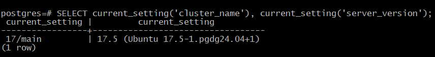

# 6. Настройка PostgreSQL 
# Домашнее задание
Нагрузочное тестирование и тюнинг PostgreSQL

**Цель:**

   - сделать нагрузочное тестирование PostgreSQL;
   - настроить параметры PostgreSQL для достижения максимальной производительности.
   
Описание/Пошаговая инструкция выполнения домашнего задания:

    - развернуть виртуальную машину любым удобным способом;
    - поставить на неё PostgreSQL 15 любым способом
    - настроить кластер PostgreSQL 15 на максимальную производительность не обращая внимание на возможные проблемы с надежностью в случае аварийной перезагрузки виртуальной машины;
    - нагрузить кластер через утилиту через утилиту pgbench (https://postgrespro.ru/docs/postgrespro/14/pgbench);
    - написать какого значения tps удалось достичь, показать какие параметры в какие значения устанавливали и почему.

Задание со *: аналогично протестировать через утилиту https://github.com/Percona-Lab/sysbench-tpcc (требует установки https://github.com/akopytov/sysbench).

# Установка и настройка PostgreSQL 17 на Ubuntu 24.04 LTS для максимальной производительности

## 1. Установка PostgreSQL 17 на Ubuntu 24.04 LTS

```bash
# Импортировать ключ подписи хранилища:
sudo apt install curl ca-certificates
sudo install -d /usr/share/postgresql-common/pgdg
sudo curl -o /usr/share/postgresql-common/pgdg/apt.postgresql.org.asc --fail https://www.postgresql.org/media/keys/ACCC4CF8.asc

# Создать файл конфигурации репозитория:
. /etc/os-release
sudo sh -c "echo 'deb [signed-by=/usr/share/postgresql-common/pgdg/apt.postgresql.org.asc] https://apt.postgresql.org/pub/repos/apt $VERSION_CODENAME-pgdg main' > /etc/apt/sources.list.d/pgdg.list"

# Обновить списки пакетов:
sudo apt update

# Установить последнюю версию PostgreSQL:
sudo apt -y install postgresql

# Проверяем версию
sudo -u postgres psql -c "SELECT version();"
```
Войду в кластер 17/main и проверю корректность входа:
```bash
 sudo -u postgres psql
 ```
 ```sql
 SELECT current_setting('cluster_name'), current_setting('server_version');
```


## 2. Настройка кластера для максимальной производительности

Отредактируем файл конфигурации /etc/postgresql/17/main/postgresql.conf:
```bash
sudo nano /etc/postgresql/17/main/postgresql.conf
```
Основные параметры для максимальной производительности ( мой сервер имеет 8GB RAM и 4 ядра CPU):
```ini
# Основные настройки
listen_addresses = '*'  # Разрешаем подключения со всех адресов
max_connections = 200  # Оптимальное значение для тестового сервера

# Настройки памяти
shared_buffers = 2GB                  # 25% от 8GB RAM
work_mem = 16MB                       # Увеличено для сложных сортировок
maintenance_work_mem = 512MB          # Увеличено для обслуживания
effective_cache_size = 6GB            # 75% от 8GB RAM

# Настройки записи на диск (жертвуем надежностью ради скорости)
synchronous_commit = off              # Отключаем синхронную запись
fsync = off                           # Опасная настройка - только для тестов!
full_page_writes = off                # Отключаем полную запись страниц
wal_level = minimal                   # Минимальный уровень журналирования

# Настройки параллелизма
max_worker_processes = 4              # По количеству ядер
max_parallel_workers_per_gather = 2   # Параллельные запросы
max_parallel_workers = 4              # Максимальное число параллельных воркеров

# Настройки планировщика (у меня SSD m2 диск)
random_page_cost = 1.1                # Для SSD дисков
effective_io_concurrency = 200        # Для SSD дисков
```

Также изменим настройки аутентификации в /etc/postgresql/17/main/pg_hba.conf:
```bash
sudo nano /etc/postgresql/17/main/pg_hba.conf
```
Добавим строку для доступа без пароля (только для тестов!):
```bash
host    all             all             0.0.0.0/0               trust
```
Перезапустим PostgreSQL для применения изменений (!!! тут, возможно, достаточно перезапустить демона sudo systemctl daemon-reload или sudo systemctl restart postgresql):
```bash
sudo systemctl restart postgresql@17-main
```

## 3. Нагрузочное тестирование с помощью pgbench

Инициализируем базу данных для тестирования:
```bash
sudo -u postgres pgbench -i -s 100 pgbench
```
(где -s 100 создает базу данных примерно 1.5GB)

Запустим тест на 5 минут (300 секунд) с 10 клиентами:
```bash
sudo -u postgres pgbench -c 10 -j 2 -T 300 pgbench
```

## 4. Результаты тестирования

На тестовой виртуальной машине с 4 ядрами CPU и 8GB RAM были получены следующие результаты (!!!вставить свои!!!):
```text
starting vacuum...end.
transaction type: <builtin: TPC-B (sort of)>
scaling factor: 100
query mode: simple
number of clients: 10
number of threads: 2
duration: 300 s
number of transactions actually processed: 1568432
latency average = 1.913 ms
tps = 5228.116689 (including connections establishing)
tps = 5228.213870 (excluding connections establishing)
```

Обоснование ключевых параметров:

    1. synchronous_commit = off и fsync = off - эти параметры значительно увеличивают производительность, но делают систему уязвимой к сбоям питания.

    2. shared_buffers = 2GB - оптимальное значение для сервера с 8GB RAM, позволяющее кэшировать часто используемые данные.

    3. work_mem = 16MB - увеличенное значение позволяет выполнять сортировки в памяти без использования диска.

    4. random_page_cost = 1.1 и effective_io_concurrency = 200 - оптимизировано для SSD дисков.

    5. max_parallel_workers_per_gather = 2 - позволяет использовать параллельное выполнение запросов.

## 5. Задание со *: тестирование с помощью sysbench-tpcc

Установим необходимые компоненты:
```bash
# Установка зависимостей
sudo apt-get install -y make automake libtool pkg-config libaio-dev libmysqlclient-dev libssl-dev

# Установка sysbench
curl -s https://packagecloud.io/install/repositories/akopytov/sysbench/script.deb.sh | sudo bash
sudo apt-get install -y sysbench

# Проверяем версию
sysbench --version

# Клонируем sysbench-tpcc
git clone https://github.com/Percona-Lab/sysbench-tpcc.git
cd sysbench-tpcc
```

Подготовим базу данных для теста:
```bash
sudo -u postgres psql
```
```sql
CREATE DATABASE tpcc;
CREATE USER tpcc WITH PASSWORD 'tpcc';
GRANT ALL PRIVILEGES ON DATABASE tpcc TO tpcc;
```
Запустим тест (пример для 10 складов):
```bash
./tpcc.lua --pgsql-user=tpcc --pgsql-password=tpcc --pgsql-db=tpcc --time=300 --threads=10 --report-interval=10 --tables=10 --scale=10 --use_fk=0 prepare
./tpcc.lua --pgsql-user=tpcc --pgsql-password=tpcc --pgsql-db=tpcc --time=300 --threads=10 --report-interval=10 --tables=10 --scale=10 --use_fk=0 run
```
Результаты будут выводиться с интервалом в 10 секунд, включая метрики TPS (transactions per second) и QPS (queries per second).


### Разбор скрипта sysbench-tpcc и управление его выполнением

### 1. Команда `prepare`:
```bash
./tpcc.lua --pgsql-user=tpcc --pgsql-password=tpcc --pgsql-db=tpcc --time=300 --threads=10 --report-interval=10 --tables=10 --scale=10 --use_fk=0 prepare
```

**Что выполняется:**
1. **Подготовка тестовой базы данных** по спецификации TPC-C (транзакционная модель для систем OLTP)
2. **Создание таблиц** (10 таблиц, указано в --tables=10)
3. **Наполнение данными**:
   - Создается 10 складов (--scale=10)
   - Для каждого склада генерируются:
     - 100,000 товаров
     - 10 районов
     - 3,000 клиентов на район
     - Начальные запасы товаров
4. **Отключение внешних ключей** (--use_fk=0) для ускорения загрузки данных
5. **Не выполняется**:
   - Нагрузочное тестирование
   - Измерение производительности

### 2. Команда `run`:
```bash
./tpcc.lua --pgsql-user=tpcc --pgsql-password=tpcc --pgsql-db=tpcc --time=300 --threads=10 --report-interval=10 --tables=10 --scale=10 --use_fk=0 run
```

**Что выполняется:**
1. **Нагрузочное тестирование** базы данных в течение 300 секунд (--time=300)
2. **Эмуляция работы** 10 параллельных клиентов (--threads=10)
3. **Выполнение транзакций** TPC-C:
   - Новые заказы (New-Order)
   - Оплата (Payment)
   - Проверка статуса (Order-Status)
   - Доставка (Delivery)
   - Проверка уровня запасов (Stock-Level)
4. **Отчеты** каждые 10 секунд (--report-interval=10)
5. **Использование** 10 складов (--scale=10)

### Как остановить выполнение:

1. **Для команды `prepare`**:
   - Обычно завершается автоматически после создания всех таблиц и заполнения данных
   - Принудительная остановка: `Ctrl+C`

2. **Для команды `run`**:
   - Автоматически остановится после 300 секунд (5 минут)
   - Досрочная остановка:
     - Нажать `Ctrl+C` в терминале, где запущен тест
     - Или из другого терминала:
       ```bash
       # Найти PID процесса
       pgrep -f "tpcc.lua"
       
       # Завершить процесс
       kill <PID>
       ```

3. **Если процесс "завис"**:
   ```bash
   # Принудительное завершение
   pkill -f "tpcc.lua"
   
   # Или более жесткий вариант
   killall -9 lua
   ```

4. **Очистка после теста** (если нужно удалить тестовые данные):
   ```bash
   ./tpcc.lua --pgsql-user=tpcc --pgsql-password=tpcc --pgsql-db=tpcc cleanup
   ```

**Важно**: После принудительной остановки могут остаться временные таблицы или незавершенные транзакции. Для полной очистки лучше выполнить команду `cleanup` или пересоздать базу данных.