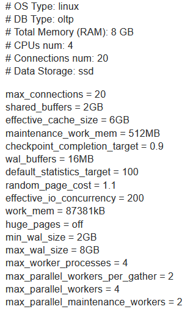
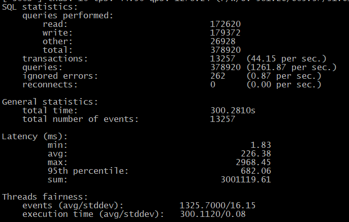

# 6. Настройка PostgreSQL 
# Домашнее задание
Нагрузочное тестирование и тюнинг PostgreSQL

**Цель:**

   - сделать нагрузочное тестирование PostgreSQL;
   - настроить параметры PostgreSQL для достижения максимальной производительности.
   
Описание/Пошаговая инструкция выполнения домашнего задания:

    - развернуть виртуальную машину любым удобным способом;
    - поставить на неё PostgreSQL 15 любым способом
    - настроить кластер PostgreSQL 15 на максимальную производительность не обращая внимание на возможные проблемы с надежностью в случае аварийной перезагрузки виртуальной машины;
    - нагрузить кластер через утилиту через утилиту pgbench (https://postgrespro.ru/docs/postgrespro/14/pgbench);
    - написать какого значения tps удалось достичь, показать какие параметры в какие значения устанавливали и почему.

Задание со *: аналогично протестировать через утилиту https://github.com/Percona-Lab/sysbench-tpcc (требует установки https://github.com/akopytov/sysbench).

# Установка и настройка PostgreSQL 17 на Ubuntu 24.04 LTS для максимальной производительности

## 1. Установка PostgreSQL 17 на Ubuntu 24.04 LTS

```bash
# Импортировать ключ подписи хранилища:
sudo apt install curl ca-certificates
sudo install -d /usr/share/postgresql-common/pgdg
sudo curl -o /usr/share/postgresql-common/pgdg/apt.postgresql.org.asc --fail https://www.postgresql.org/media/keys/ACCC4CF8.asc

# Создать файл конфигурации репозитория:
. /etc/os-release
sudo sh -c "echo 'deb [signed-by=/usr/share/postgresql-common/pgdg/apt.postgresql.org.asc] https://apt.postgresql.org/pub/repos/apt $VERSION_CODENAME-pgdg main' > /etc/apt/sources.list.d/pgdg.list"

# Обновить списки пакетов:
sudo apt update

# Установить последнюю версию PostgreSQL:
sudo apt -y install postgresql

# Проверяем версию
sudo -u postgres psql -c "SELECT version();"
```
Войду в кластер 17/main и проверю корректность входа:
```bash
 sudo -u postgres psql
 ```
 ```sql
 SELECT current_setting('cluster_name'), current_setting('server_version');
```


Для надежности, перенесем кластера PostgreSQL 17 в Ubuntu 24 из /var/lib/postgresql/17/ в /var/lib/postgres/17/ :

### 1.1 Перенос кластеров PostgreSQL 17 в Ubuntu 24

Чтобы перенести все кластеры PostgreSQL 17 из `/var/lib/postgresql/17/` в `/var/lib/postgres/17/`, выполним следующие шаги:

Остановим сервер PostgreSQL:
```bash
sudo systemctl stop postgresql
```

Создадим новый каталог:
```bash
sudo mkdir -p /var/lib/postgres/17
sudo chown postgres:postgres /var/lib/postgres/17
```

Перенесём данные кластера:
```bash
 sudo -u postgres mv /var/lib/postgresql/17/ /var/lib/postgres/
```

Обновим конфигурацию:

Отредактируем файл конфигурации (для каждого кластера) :
```bash
sudo nano /etc/postgresql/17/main/postgresql.conf
sudo nano /etc/postgresql/17/main2/postgresql.conf
sudo nano /etc/postgresql/17/1c_account/postgresql.conf
```

Изменим параметр `data_directory`:
```
data_directory = '/var/lib/postgres/17/main'
```
 <br>
 <br>


Обновим systemd unit (если необходимо, для каждого кластера):

Для Ubuntu 24 необходимо обновить unit-файл:
```bash
sudo systemctl edit postgresql@17-main
```
Добавим:
```
[Service]
Environment=PGDATA=/var/lib/postgres/17/main
```
Повторим для каждого кластера данную процедуру, иначе, кластеры не запустятся:
```bash
sudo systemctl edit postgresql@17-main2
```
Добавим:
```
[Service]
Environment=PGDATA=/var/lib/postgres/17/main2
```
```bash
sudo systemctl edit postgresql@17-1c_account
```
Добавим:
```
[Service]
Environment=PGDATA=/var/lib/postgres/17/1c_account
```

```bash
systemctl daemon-reload
```

Запустим PostgreSQL:
```bash
sudo systemctl start postgresql
```

Проверяем: `pg_lsclusters`


Проверим работу:
```bash
sudo -u postgres psql -c "SELECT version();"
```


## 2. Настройка кластера для максимальной производительности

Создадим новый кластер для тестирования с именем **fast** в новом каталоге /var/lib/postgres/17/:

Создаём новый кластер:
```bash
sudo pg_createcluster 17 fast -D /var/lib/postgres/17/fast
```
Где:
- `17` - версия PostgreSQL;
- `fast` - имя нового кластера;
- `-D` - указываем новый путь для данных.

```bash
sudo systemctl edit postgresql@17-fast
```
Добавим:
```
[Service]
Environment=PGDATA=/var/lib/postgres/17/fast
```

Запустим новый кластер:
```bash
sudo pg_ctlcluster 17 fast start
```
Проверим статус:
```bash
sudo pg_lsclusters
sudo systemctl status postgresql@17-fast
```


Установим пароль для пользователя postgres:
```bash
sudo -u postgres psql -p 5435
alter user postgres password '12345678!';
```


останаливаем кластер `fast`:
```bash
sudo pg_ctlcluster 17 fast stop
```

Отредактируем файл конфигурации /etc/postgresql/17/fast/postgresql.conf:
```bash
sudo  nano /etc/postgresql/17/fast/postgresql.conf
```
Основные параметры для максимальной производительности ( мой сервер имеет 8GB RAM и 4 ядра CPU)
`Тест 1`:
```ini
# Основные настройки
listen_addresses = '*'  # Разрешаем подключения со всех адресов
max_connections = 200  # Оптимальное значение для тестового сервера

# Настройки памяти
shared_buffers = 2GB                  # 25% от 8GB RAM
work_mem = 16MB                       # Увеличено для сложных сортировок
maintenance_work_mem = 512MB          # Увеличено для обслуживания
effective_cache_size = 6GB            # 75% от 8GB RAM

# Настройки записи на диск (жертвуем надежностью ради скорости)
synchronous_commit = off              # Отключаем синхронную запись
fsync = off                           # Опасная настройка - только для тестов!
full_page_writes = off                # Отключаем полную запись страниц

# Настройки параллелизма
max_worker_processes = 4              # По количеству ядер
max_parallel_workers_per_gather = 2   # Параллельные запросы
max_parallel_workers = 4              # Максимальное число параллельных воркеров

# Настройки планировщика (у меня SSD m2 диск)
random_page_cost = 1.1                # Для SSD дисков
effective_io_concurrency = 200        # Для SSD дисков
```
pgtune предложил для нашего сервера следующие настройки,`Тест 2`: <br>


```bash
systemctl daemon-reload
#Запускаем кластер:
 pg_ctlcluster 17 fast start
```

## 3. Нагрузочное тестирование с помощью pgbench

Создаём базу данных с именем pgbench:
```bash
sudo -u postgres createdb pgbench -p 5435
```


Инициализируем базу данных для тестирования:
```bash
 sudo -u postgres pgbench -i -s 100 pgbench -p5435
 ```
 

(где -s 100 создает базу данных примерно 1.5GB)


Запустим тест на 5 минут (300 секунд) с 10 клиентами:
```bash
 sudo -u postgres pgbench -c 10 -j 2 -T 300 pgbench -p 5435
```

## 4. Результаты тестирования

На тестовой виртуальной машине с 4 ядрами CPU и 8GB RAM были получены следующие результаты:
Тест 0, с настройками по умолчанию:
```text
pgbench (17.5 (Ubuntu 17.5-1.pgdg24.04+1))
starting vacuum...end.
transaction type: <builtin: TPC-B (sort of)>
scaling factor: 100
query mode: simple
number of clients: 10
number of threads: 2
maximum number of tries: 1
duration: 300 s
number of transactions actually processed: 196500
number of failed transactions: 0 (0.000%)
latency average = 15.268 ms
initial connection time = 20.195 ms
tps = 654.974129 (without initial connection time)
```
Тест 1, с нашими настройками:
```text
dropping old tables...
NOTICE:  table "pgbench_accounts" does not exist, skipping
NOTICE:  table "pgbench_branches" does not exist, skipping
NOTICE:  table "pgbench_history" does not exist, skipping
NOTICE:  table "pgbench_tellers" does not exist, skipping
creating tables...
generating data (client-side)...
vacuuming...
creating primary keys...
done in 12.68 s (drop tables 0.00 s, create tables 0.00 s, client-side generate 8.51 s, vacuum 0.30 s, primary keys 3.87 s).
root@ubuntu24:~# sudo -u postgres pgbench -c 10 -j 2 -T 300 pgbench -p 5435
pgbench (17.5 (Ubuntu 17.5-1.pgdg24.04+1))
starting vacuum...end.
transaction type: <builtin: TPC-B (sort of)>
scaling factor: 100
query mode: simple
number of clients: 10
number of threads: 2
maximum number of tries: 1
duration: 300 s
number of transactions actually processed: 382215
number of failed transactions: 0 (0.000%)
latency average = 7.850 ms
initial connection time = 19.336 ms
tps = 1273.843034 (without initial connection time)
```
Тест 2.1, с настройками, рекомендованными pgtune для Type: "Online transaction...", для баз 1С и не только, 200 подключений:

 <br>


Тест 2.2, с настройками, рекомендованными pgtune для Type: "Online transaction...", для баз 1С и не только, 20 подключений (чем меньше подключений, тем выше значение work_mem):

 <br>


Тест 2.3, с настройками, рекомендованными pgtune для Type: "Mix...", 20 подключений: <br>
 <br>


Тест 2.4, с настройками, рекомендованными pgtune для Type: "Mix...", 20 подключений, также изменю значение effective_io_concurrency = 20 (в тесте 2,3 = 200): <br>


Тест 2.5, с настройками, рекомендованными pgtune для Type: "Mix...", 20 подключений, оставлю значение effective_io_concurrency = 20 и изменю work_mem = 10280kB (2.4 = 87381kB): <br>


Обоснование ключевых параметров:

    1. synchronous_commit = off и fsync = off - эти параметры значительно увеличивают производительность, но делают систему уязвимой к сбоям питания.

    2. shared_buffers = 2GB - оптимальное значение для сервера с 8GB RAM, позволяющее кэшировать часто используемые данные.

    3. work_mem = 16MB - увеличенное значение позволяет выполнять сортировки в памяти без использования диска. Но, как показали тесты "2" данное значение сильно не влияет на результат нашего теста.

    4. random_page_cost = 1.1 и effective_io_concurrency = 200 - оптимизировано для SSD дисков.

    5. max_parallel_workers_per_gather = 2 - позволяет использовать параллельное выполнение запросов.

## 5. Задание со *: тестирование с помощью sysbench-tpcc

Установим необходимые компоненты:
```bash
# Установка зависимостей
sudo apt-get install -y make automake libtool pkg-config libaio-dev libmysqlclient-dev libssl-dev

# Установка sysbench
curl -s https://packagecloud.io/install/repositories/akopytov/sysbench/script.deb.sh | sudo bash
sudo apt-get install -y sysbench

# Проверяем версию
sysbench --version
```

```bash
sudo apt install git -y
# Клонируем sysbench-tpcc
git clone https://github.com/Percona-Lab/sysbench-tpcc.git
cd sysbench-tpcc
```

Подготовим базу данных для теста:
```bash
sudo -u postgres psql
```
```sql
CREATE DATABASE tpcc;
CREATE USER tpcc WITH PASSWORD 'tpcc';
GRANT ALL PRIVILEGES ON DATABASE tpcc TO tpcc;
```
Чтобы скрипт сработал, учетной записи tpcc понадобятся права к схеме public, иначе нас ждёт ошибка:  "permission denied for schema public".

Проверка текущих прав:
```bash
sudo -u postgres psql -c "\dn+ public"

#Предоставление прав пользователю tpcc:
sudo -u postgres psql -c "GRANT ALL PRIVILEGES ON SCHEMA public TO tpcc;"
sudo -u postgres psql -c "GRANT ALL PRIVILEGES ON ALL TABLES IN SCHEMA public TO tpcc;"

#Если не получится, то добавим:
sudo -u postgres psql -c "GRANT ALL PRIVILEGES ON ALL SEQUENCES IN SCHEMA public TO tpcc;"

#Для новых таблиц (если тест будет создавать их):
sudo -u postgres psql -c "ALTER DEFAULT PRIVILEGES IN SCHEMA public GRANT ALL ON TABLES TO tpcc;"
sudo -u postgres psql -c "ALTER DEFAULT PRIVILEGES IN SCHEMA public GRANT ALL ON SEQUENCES TO tpcc;"

#Проверка подключения:
psql -U tpcc -d tpcc -c "\dn+ public"

Также, чтобы не возникала ошибка `psql: error: connection to server on socket "/var/run/postgresql/.s.PGSQL.5432" failed: FATAL:  Peer authentication failed for user "tpcc""`, cоздаём соответствующего системного пользователя:
sudo adduser tpcc
```


Т.к. у нас диск sda всего 25ГБ, нам может не хватить места (что и случилось), п.э. необходимо расширить логический том /dev/mapper/ubuntu--vg-ubuntu--lv диском /dev/sdb:
```bash
Создать физический том для диска /dev/sdb:
pvcreate /dev/sdb

Добавить диск в группу томов (ubuntu-vg):
vgextend ubuntu-vg /dev/sdb

Расширить логический том за счёт всего доступного пространства:
lvextend -l +100%FREE /dev/mapper/ubuntu--vg-ubuntu--lv

Применить изменения в файловой системе логического тома:
resize2fs /dev/mapper/ubuntu--vg-ubuntu--lv
```

Указываем скрипту, что мы работаем в PostgreSQL, подготовка:
```bash
./tpcc.lua \
  --db-driver=pgsql \
  --pgsql-user=tpcc \
  --pgsql-password=tpcc \
  --pgsql-db=tpcc \
  --time=300 \
  --threads=10 \
  --report-interval=10 \
  --tables=10 \
  --scale=10 \
  --use_fk=0 \
  prepare
  ```

  Ожидаем выполнения и запустим тест (пример для 10 складов):
 ```bash
./tpcc.lua \
  --db-driver=pgsql \
  --pgsql-user=tpcc \
  --pgsql-password=tpcc \
  --pgsql-db=tpcc \
  --time=300 \
  --threads=10 \
  --report-interval=10 \
  --tables=10 \
  --scale=10 \
  --use_fk=0 \
  run
```
Результат:


### Разбор скрипта sysbench-tpcc и управление его выполнением

### 1. Команда `prepare`:
```bash
./tpcc.lua \
  --db-driver=pgsql \
  --pgsql-user=tpcc \
  --pgsql-password=tpcc \
  --pgsql-db=tpcc \
  --time=300 \
  --threads=10 \
  --report-interval=10 \
  --tables=10 \
  --scale=10 \
  --use_fk=0 \
  prepare
```

**Что выполняется:**
1. **Подготовка тестовой базы данных** по спецификации TPC-C (транзакционная модель для систем OLTP)
2. **Создание таблиц** (10 таблиц, указано в --tables=10)
3. **Наполнение данными**:
   - Создается 10 складов (--scale=10)
   - Для каждого склада генерируются:
     - 100,000 товаров
     - 10 районов
     - 3,000 клиентов на район
     - Начальные запасы товаров
4. **Отключение внешних ключей** (--use_fk=0) для ускорения загрузки данных
5. **Не выполняется**:
   - Нагрузочное тестирование
   - Измерение производительности

### 2. Команда `run`:
```bash
./tpcc.lua \
  --db-driver=pgsql \
  --pgsql-user=tpcc \
  --pgsql-password=tpcc \
  --pgsql-db=tpcc \
  --time=300 \
  --threads=10 \
  --report-interval=10 \
  --tables=10 \
  --scale=10 \
  --use_fk=0 \
  run
```

**Что выполняется:**
1. **Нагрузочное тестирование** базы данных в течение 300 секунд (--time=300)
2. **Эмуляция работы** 10 параллельных клиентов (--threads=10)
3. **Выполнение транзакций** TPC-C:
   - Новые заказы (New-Order)
   - Оплата (Payment)
   - Проверка статуса (Order-Status)
   - Доставка (Delivery)
   - Проверка уровня запасов (Stock-Level)
4. **Отчеты** каждые 10 секунд (--report-interval=10)
5. **Использование** 10 складов (--scale=10)

### Как остановить выполнение:

1. **Для команды `prepare`**:
   - Обычно завершается автоматически после создания всех таблиц и заполнения данных
   - Принудительная остановка: `Ctrl+C`

2. **Для команды `run`**:
   - Автоматически остановится после 300 секунд (5 минут)
   - Досрочная остановка:
     - Нажать `Ctrl+C` в терминале, где запущен тест
     - Или из другого терминала:
       ```bash
       # Найти PID процесса
       pgrep -f "tpcc.lua"
       
       # Завершить процесс
       kill <PID>
       ```

3. **Если процесс "завис"**:
   ```bash
   # Принудительное завершение
   pkill -f "tpcc.lua"
   
   # Или более жесткий вариант
   killall -9 lua
   ```

4. **Очистка после теста** (если нужно удалить тестовые данные):
   ```bash
   ./tpcc.lua --pgsql-user=tpcc --pgsql-password=tpcc --pgsql-db=tpcc cleanup
   ```

**Важно**: После принудительной остановки могут остаться временные таблицы или незавершенные транзакции. Для полной очистки лучше выполнить команду `cleanup` или пересоздать базу данных.

### Расшифровка результатов выполнения теста sysbench-tpcc

**SQL Statistics (Статистика SQL-запросов)**
1. **Queries performed** (Выполненные запросы):
   - **read**: 151,035 — операции чтения
   - **write**: 156,634 — операции записи
   - **other**: 23,564 — служебные запросы (BEGIN, COMMIT и т. д.)
   - **total**: 331,233 — общее количество запросов

2. **Transactions**: 11,631 (38.74 TPS)  
   - Количество успешных транзакций (TPS = Transactions Per Second)  
   - **38.74 TPS** — средняя пропускная способность (чем выше, тем лучше)

3. **Queries**: 331,233 (1,103.16 QPS)  
   - Общее количество запросов (QPS = Queries Per Second)

4. **Ignored errors**: 180 (0.60/sec)  
   - Количество ошибок (например, deadlocks, таймауты)

5. **Reconnects**: 0  
   - Количество переподключений к БД (0 — хорошо)

**General Statistics (Общая статистика)**
1. **Total time**: 300.2578s (5 минут)  
   - Общее время теста

2. **Total number of events**: 11,631  
   - Количество выполненных транзакций (events = transactions)

**Latency (Задержки, в миллисекундах)**
1. **min**: 3.18 мс — минимальное время выполнения транзакции
2. **avg**: 258.02 мс — средняя задержка
3. **max**: 3496.58 мс (≈3.5 сек) — максимальная задержка
4. **95th percentile**: 787.74 мс (≈0.8 сек)  
   - 95% транзакций выполнялись быстрее этого значения
5. **sum**: 3,000,996.36 мс (≈50 минут)  
   - Общее время, затраченное на все транзакции

**Threads Fairness (Распределение нагрузки по потокам)**
1. **events (avg/stddev)**: 1,163.1 ± 27.61  
   - Среднее количество транзакций на поток ± отклонение
2. **execution time (avg/stddev)**: 300.1 ± 0.07  
   - Среднее время выполнения ± отклонение

**Выводы по нашему тесту:**
1. **Производительность (TPS)**: **38.74 транзакций/сек**  
   - Для TPC-C-теста на PostgreSQL это средний результат (зависит от железа и настроек БД).  
   - Оптимальные значения для OLTP-систем обычно **от 100+ TPS**.

2. **Задержки (Latency)**:  
   - Средняя **258 мс** — приемлемо для сложных транзакций TPC-C.  
   - **95-й персентиль 787 мс** — означает, что 5% транзакций работали медленнее 0.8 сек (можно улучшить).

3. **Ошибки**: 180 игнорированных ошибок — стоит проверить логи PostgreSQL на предмет конфликтов (deadlocks).

---

**Как улучшить результат?**
1. **Увеличьте `shared_buffers`** (если RAM > 8 ГБ):
   ```ini
   shared_buffers = 4GB
   ```
2. . **Увеличьте количество потоков** (если CPU не загружен на 100%):
   ```bash
   --threads=16
   ```
3. Добавить ОЗУ.
4. Добавить CPU.
5. Перейти на более быстрые диски.
6. Изменить текущие настройки PostgreSQL (`postgresql.conf`).

### Оптимизация PostgreSQL 17 для TPC-C теста (4 ядра, 8GB RAM, SSD M.2)

Попробуем повысить производительность в TPC-C тесте. Скорректируем настройки  `nano /etc/postgresql/17/fast/postgresql.conf`:

 1. Настройки памяти (адаптировано под 8GB RAM)
```ini
shared_buffers = 3GB                   # 37.5% от RAM (было 2GB)
work_mem = 32MB                        # Увеличено для сложных JOIN в TPC-C
maintenance_work_mem = 1GB             # Для более быстрой загрузки данных
effective_cache_size = 6GB             # Оставляем (75% RAM)
```

 2. Настройки WAL и записи (экстремальная производительность)
```ini
wal_level = minimal                    # Минимальная журнализация
max_wal_senders = 0                    # Отключаем репликацию
hot_standby = off                      # Отключаем standby-серверы
archive_mode = off
max_replication_slots = 0
synchronous_commit = off               
fsync = off                            
full_page_writes = off                 
wal_buffers = 16MB                     # Фиксированное значение для SSD
commit_delay = 100000                  # Группировка коммитов
commit_siblings = 5                    # Минимум активных транзакций для группировки
```

 3. Параллелизм (для 4 ядер)
```ini
max_worker_processes = 4               # Оставляем
max_parallel_workers_per_gather = 4    # Увеличиваем с 2 до 4
max_parallel_workers = 4               # Оставляем
max_parallel_maintenance_workers = 2   # Для параллельной загрузки данных
```

 4. Оптимизация TPC-C специфичных параметров
```ini
checkpoint_timeout = 1h                # Реже checkpoint
max_wal_size = 8GB                     # Больший размер WAL
min_wal_size = 2GB                     # Минимальный размер WAL
bgwriter_delay = 100ms                 # Чаще запись фоновым writer'ом
bgwriter_lru_maxpages = 1000           # Больше страниц за запись
```

 5. Планировщик (для SSD M.2)
```ini
random_page_cost = 1.0                 # Еще ниже для NVMe (было 1.1)
effective_io_concurrency = 256         # Максимум для NVMe (было 200)
seq_page_cost = 1.0                    # Для SSD одинаково с random
```

 6. Настройки соединений
```ini
max_connections = 100                  # Уменьшаем со 200 для меньшего оверхеда
```

После всех изменений перезапустим кластер:
```bash
sudo systemctl restart postgresql@17-main
```



Вывод: оптимизация настроек помогает увеличить производительность сервера. Производительность (TPS) выросла с 38.74  до 44.15 транзакций/сек при том же железе.