# 7. MVCC, vacuum и autovacuum

# Домашнее задание

Настройка autovacuum с учетом особеностей производительности

**Цель:**

- запустить нагрузочный тест pgbench; <br>
- настроить параметры autovacuum; <br>
- проверить работу autovacuum.


Описание/Пошаговая инструкция выполнения домашнего задания:
Часть 1.
    1. Создать ВМ Ubuntu 24 с 2 ядрами и 4 Гб ОЗУ и SSD 10GB
    2. Установить на него PostgreSQL 17 с дефолтными настройками
    3. Создать БД для тестов: выполнить pgbench -i postgres
    4. Запустить pgbench -c8 -P 6 -T 60 -U postgres postgres
    5. Применить параметры настройки PostgreSQL из прикрепленного к материалам занятия файла
    6. Протестировать заново
    7. Что изменилось и почему?
Часть 2.
    8. Создать таблицу с текстовым полем и заполнить случайными или сгенерированными данным в размере 1млн строк
    9. Посмотреть размер файла с таблицей
    10. 5 раз обновить все строчки и добавить к каждой строчке любой символ
    11. Посмотреть количество мертвых строчек в таблице и когда последний раз приходил автовакуум
    12. Подождать некоторое время, проверяя, пришел ли автовакуум
    13. 5 раз обновить все строчки и добавить к каждой строчке любой символ
    14. Посмотреть размер файла с таблицей
    15. Отключить Автовакуум на конкретной таблице
    16. 10 раз обновить все строчки и добавить к каждой строчке любой символ
    17. Посмотреть размер файла с таблицей
    18. Объясните полученный результат
    19. Не забудьте включить автовакуум
    20. Задание со *:Написать анонимную процедуру, в которой в цикле 10 раз обновятся все строчки в искомой таблице.Не забыть вывести номер шага цикла.

Рефлексия:

1. Зачем нужен вакуум ?
2. Назовите способы реализации ACID ?
3. Какая из команд insert, delete, update самая медленная и почему ?


## 1-4. Подготовка и первоначальное тестирование

Создана ВМ Ubuntu 24.04 с 2 ядрами, 4 ГБ ОЗУ и 10 ГБ SSD. Установлен PostgreSQL 17 с параметрами по умолчанию:
```bash
 cat /etc/os-release | grep VERSION
 psql -V
 lscpu
 free -h
 df -h
```
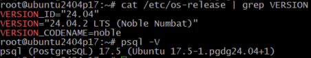 <br>
 <br>
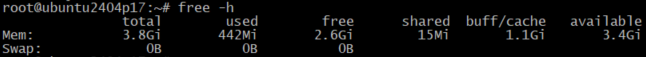 <br>
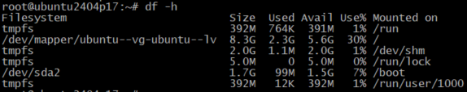

Команда `pgbench -i postgres` выполняет **инициализацию (initialization) тестовой базы данных** для проведения нагрузочного тестирования в PostgreSQL.

**Что делает команда:**
1. Создает 4 таблицы в указанной БД (`postgres` в данном случае):
   - `pgbench_accounts` (основная таблица с тестовыми данными)
   - `pgbench_branches`
   - `pgbench_history`
   - `pgbench_tellers`

2. Заполняет их тестовыми данными:
   - По умолчанию создает 1 ветку (branch), 1 кассира (teller) и 100,000 счетов (accounts)
   - Размер данных ~16-24MB (зависит от версии PostgreSQL)

Как запустить:

1. Команду нужно выполнять от пользователя, имеющего права на создание таблиц в БД (в нашем случае: `postgres`).

2. Базовая инициализация:
```bash
   sudo -u postgres pgbench -i postgres
 ```

3. После инициализации можно запускать нагрузочное тестирование базы данных PostgreSQL с помощью утилиты pgbench:
 ```bash
    sudo -u postgres pgbench -c8 -P 6 -T 60 postgres
 ```
Эта команда создает стандартную тестовую среду для оценки производительности PostgreSQL перед проведением нагрузочного тестирования. Помогает помогает оценить, как PostgreSQL справляется с нагрузкой, и выявить проблемы в конфигурации.

**Параметры команды:**
1. **`-c8`** (клиенты)  
   - Запускает **8 параллельных клиентских сессий**, которые будут выполнять транзакции одновременно.  
   - Чем больше клиентов, тем выше нагрузка на СУБД.

2. **`-P 6`** (прогресс)  
   - Выводит **отчёт о прогрессе каждые 6 секунд** во время теста.  
  
3. **`-T 60`** (время)  
   - Тест будет работать **60 секунд**.  
   - После завершения выводится итоговый отчёт.

4. **`-u postgres`** (пользователь)  
   - Подключается к PostgreSQL от имени пользователя `postgres`.

5. **`postgres`** (база данных)  
   - Тестируется база данных с именем `postgres`.  
   - *Предварительно её нужно проинициализировать, что мы и сделали (`sudo -u postgres pgbench -i postgres`).*

 Что делает команда в целом?
1. **Запускает TPC-B-like тест** (похожий на транзакции банковских операций):  
   - Выбирает случайный счёт (`pgbench_accounts`).  
   - Обновляет баланс (`UPDATE`).  
   - Записывает историю транзакции (`INSERT` в `pgbench_history`).  

2. **Измеряет производительность**:
   - **TPS (Transactions Per Second)** — сколько транзакций выполняется в секунду.  
   - **Latency (задержка)** — среднее время выполнения одной транзакции в миллисекундах.  

3. **Выводит результаты**:
   - В реальном времени (благодаря `-P 6`).  
   - Итоговый отчёт после завершения теста.  

**Дополнительные нюансы:**
- **Режимы работы**:  
  - По умолчанию используется **простой режим** (`simple`), где каждый запрос отправляется отдельно.  
  - Можно использовать **подготовленные выражения** (`-M prepared`), что ускоряет тест.  

- **Что влияет на результаты**:  
  - Настройки PostgreSQL (`shared_buffers`, `work_mem` и др.).  
  - Количество CPU и скорость диска.  
  - Наличие индексов и нагрузка на сервер.  

- **Как интерпретировать TPS**:  
  - Чем выше TPS, тем лучше производительность.  
  - Если `latency` (задержка) растёт при увеличении клиентов (`-c`), это может указывать на узкие места.  

Результат первоначального теста pgbench:
```
root@ubuntu2404p17:~# sudo -u postgres pgbench -c8 -P 6 -T 60 postgres
pgbench (17.5 (Ubuntu 17.5-1.pgdg24.04+1))
starting vacuum...end.
progress: 6.0 s, 243.4 tps, lat 32.535 ms stddev 21.921, 0 failed
progress: 12.0 s, 241.4 tps, lat 33.066 ms stddev 23.474, 0 failed
progress: 18.0 s, 239.8 tps, lat 33.362 ms stddev 22.657, 0 failed
progress: 24.0 s, 253.8 tps, lat 31.429 ms stddev 22.791, 0 failed
progress: 30.0 s, 248.2 tps, lat 32.200 ms stddev 24.286, 0 failed
progress: 36.0 s, 256.5 tps, lat 31.152 ms stddev 19.116, 0 failed
progress: 42.0 s, 264.3 tps, lat 30.256 ms stddev 21.365, 0 failed
progress: 48.0 s, 252.2 tps, lat 31.642 ms stddev 19.684, 0 failed
progress: 54.0 s, 209.8 tps, lat 38.016 ms stddev 28.348, 0 failed
progress: 60.0 s, 173.2 tps, lat 46.182 ms stddev 30.177, 0 failed
transaction type: <builtin: TPC-B (sort of)>
scaling factor: 1
query mode: simple
number of clients: 8
number of threads: 1
maximum number of tries: 1
duration: 60 s
number of transactions actually processed: 14304
number of failed transactions: 0 (0.000%)
latency average = 33.509 ms
latency stddev = 23.629 ms
initial connection time = 34.813 ms
tps = 238.314417 (without initial connection time)
```
При тестировании, я также запустил утилиту `top` и выявил, что ОЗУ и CPU было практически не задействовано при тестировании( ОЗУ: с 470 до 480МБ, CPU: с 0 до 12%).

## 5-6. Применение новых параметров и повторное тестирование

Изменены параметры в postgresql.conf согласно заданию.
 ```bash
 nano /etc/postgresql/17/main/postgresql.conf
 ```
 ```
 # Add settings for extensions here

max_connections = 40
shared_buffers = 1GB
effective_cache_size = 3GB
maintenance_work_mem = 512MB
checkpoint_completion_target = 0.9
wal_buffers = 16MB
default_statistics_target = 500
random_page_cost = 4
effective_io_concurrency = 2
work_mem = 6553kB
min_wal_size = 4GB
max_wal_size = 16GB
```
```bash
#Обновим конфигурацию и перезапустим кластер:
systemctl daemon-reload
pg_ctlcluster 17 main restart

#Повторно запускаю тестирование:
 sudo -u postgres pgbench -c8 -P 6 -T 60 postgres
```
Тест показал:
```
   sudo -u postgres pgbench -c8 -P 6 -T 60 postgres
pgbench (17.5 (Ubuntu 17.5-1.pgdg24.04+1))
starting vacuum...end.
progress: 6.0 s, 235.7 tps, lat 33.576 ms stddev 21.614, 0 failed
progress: 12.0 s, 231.3 tps, lat 34.569 ms stddev 22.247, 0 failed
progress: 18.0 s, 196.5 tps, lat 40.672 ms stddev 31.384, 0 failed
progress: 24.0 s, 255.0 tps, lat 31.315 ms stddev 21.723, 0 failed
progress: 30.0 s, 241.6 tps, lat 32.953 ms stddev 23.608, 0 failed
progress: 36.0 s, 219.9 tps, lat 36.442 ms stddev 25.531, 0 failed
progress: 42.0 s, 256.3 tps, lat 31.181 ms stddev 19.159, 0 failed
progress: 48.0 s, 250.7 tps, lat 31.886 ms stddev 20.861, 0 failed
progress: 54.0 s, 254.3 tps, lat 31.381 ms stddev 20.269, 0 failed
progress: 60.0 s, 247.2 tps, lat 32.344 ms stddev 21.148, 0 failed
transaction type: <builtin: TPC-B (sort of)>
scaling factor: 1
query mode: simple
number of clients: 8
number of threads: 1
maximum number of tries: 1
duration: 60 s
number of transactions actually processed: 14339
number of failed transactions: 0 (0.000%)
latency average = 33.425 ms
latency stddev = 22.889 ms
initial connection time = 30.829 ms
tps = 238.896570 (without initial connection time)
```
## 7. Анализ низкой нагрузки при тестировании PostgreSQL

Тест запускал 3и раза, каждый раз перезапускался кластер, сервер PsotgreSQL:
1) Tест№1:tps=238 <br>
2) Tест№2:tps=248 #дополнительно перезагрузил сервер PsotgreSQL (systemctl restart postgresql) <br>
3) Тест№3:tps=228

Результаты (CPU на 13%, RAM <500MB) указывают на то, что pgbench не создает достаточной нагрузки для вашей системы. Разберём причины и решения:

**Основные причины низкой нагрузки**
 1. Слишком маленький масштаб тестовой БД
- По умолчанию `pgbench -i` создает БД всего ~24MB
- Данные полностью помещаются в кэш, нет реальной дисковой нагрузки
 2. Недостаточное количество клиентов
- 8 клиентов для 2 ядер - маловато (особенно при низкой нагрузке на транзакцию)
- PostgreSQL не успевает загрузить CPU
 3. Особенности TPC-B теста по умолчанию
- Простые UPDATE/INSERT операции
- Нет сложных запросов, которые бы нагружали CPU

**Диагностика текущей ситуации**

1. Проверим, что тест действительно работает
```bash
sudo -u postgres psql -c "SELECT count(*) FROM pgbench_accounts"
```
У нас 100000 строк, как и должно быть (при `-s 1`):
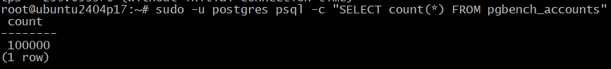

2. Мониторинг в реальном времени. В другом терминале запускаю:
```bash
watch -n 1 "ps aux | grep postgres"
```
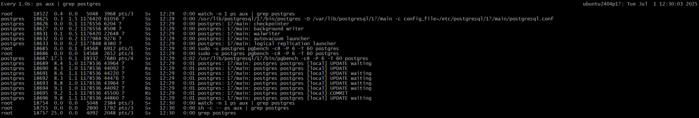
```bash
vmstat 1
```
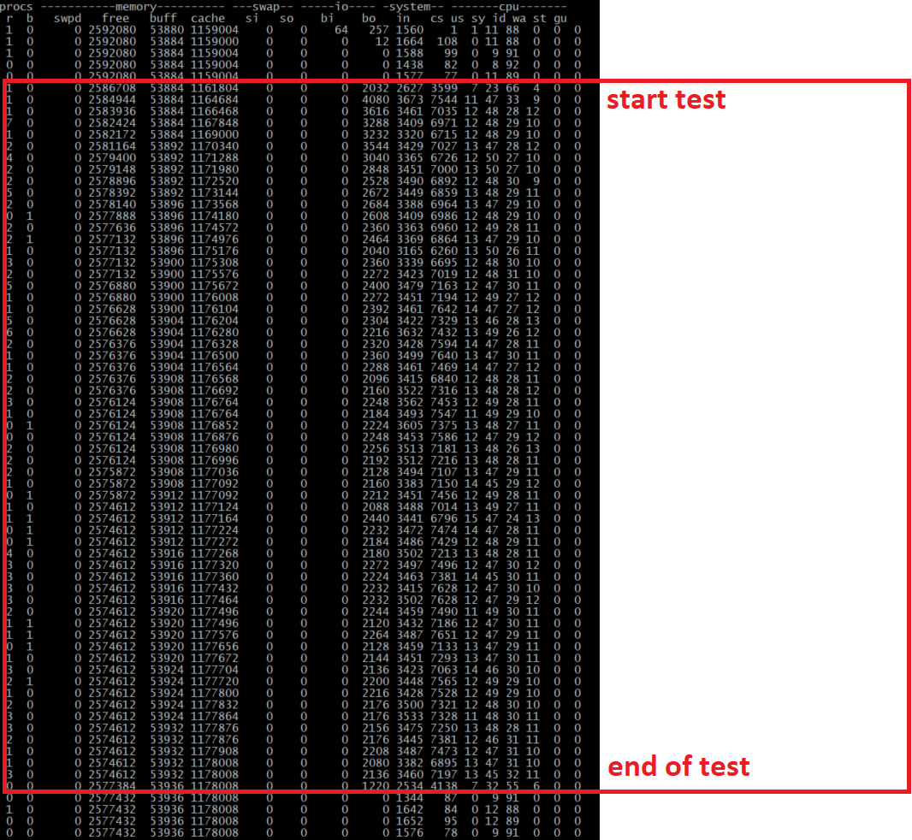

CPU (mpstat)
```bash
 mpstat -P ALL 1 # Показывает загрузку по ядрам
```
- %idle > 10% - CPU не узкое место
- Разница между ядрами < 20% - проблема балансировки
- %soft  высокий - проблем с прерываниями


но в выводе следующей команды, критических проблем не выявлено, которые могли помешать тестированию:  watch -n 1 "cat /proc/interrupts | head -n 5"
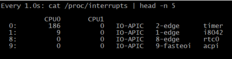

Диск (iostat)
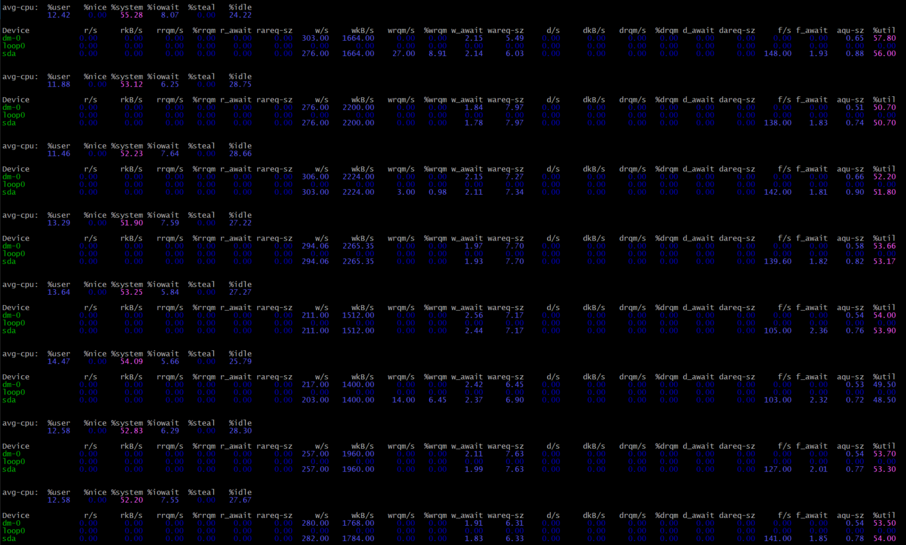

Даже оптимизация настроек для моего железа улучшение результата не дало:

Изменил в `postgresql.conf`:
```ini
max_connections = 100 #было 40
random_page_cost = 1.1 #было 4
effective_io_concurrency = 300 #было 2
work_mem = 32MB
```
```
tps = 239
```
Нагрузка останется низкой - возможно, есть проблемы с настройками виртуализации. Проверяю, у меня VirtualBox
Версия 7.1.8 r168469 (Qt6.5.3). «Включить PAE/NX» - включаю, т.к. данный параметр доступен, для использования.
PAE/NX в VirtualBox — это опция, которая позволяет виртуальной машине использовать две важные технологии процессора:
1. PAE (Physical Address Extension)
    Позволяет 32-битным системам обращаться к более чем 4 ГБ оперативной памяти (теоретически до 64 ГБ).
    Нужна, если вы запускаете 32-битную гостевую ОС (например, 32-битный Linux или Windows) и хотите выделить ей больше 4 ГБ RAM.
    Для 64-битных систем PAE обычно не требуется, так как они изначально поддерживают большие объёмы памяти.
2. NX (No eXecute) Bit
    Технология безопасности, которая запрещает выполнение кода в определённых областях памяти (например, в стеке или куче).
    Помогает защититься от некоторых эксплойтов (например, атак переполнения буфера).
    Поддерживается большинством современных ОС (Windows DEP, Linux NX/XD).
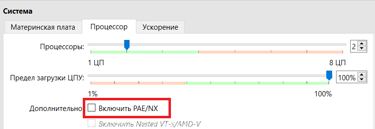

Проверяю результат с нашими настройками:
```
 sudo -u postgres pgbench -c 8 -P 6 -T 60 postgres
pgbench (17.5 (Ubuntu 17.5-1.pgdg24.04+1))
starting vacuum...end.
progress: 6.0 s, 1251.5 tps, lat 6.350 ms stddev 4.469, 0 failed
progress: 12.0 s, 1206.0 tps, lat 6.630 ms stddev 4.656, 0 failed
progress: 18.0 s, 990.7 tps, lat 8.065 ms stddev 5.631, 0 failed
progress: 24.0 s, 1021.2 tps, lat 7.839 ms stddev 5.188, 0 failed
progress: 30.0 s, 856.7 tps, lat 9.333 ms stddev 6.671, 0 failed
progress: 36.0 s, 834.0 tps, lat 9.585 ms stddev 6.689, 0 failed
progress: 42.0 s, 940.5 tps, lat 8.502 ms stddev 5.808, 0 failed
progress: 48.0 s, 934.9 tps, lat 8.559 ms stddev 5.699, 0 failed
progress: 54.0 s, 805.0 tps, lat 9.919 ms stddev 6.913, 0 failed
progress: 60.0 s, 769.7 tps, lat 10.400 ms stddev 7.005, 0 failed
transaction type: <builtin: TPC-B (sort of)>
scaling factor: 1
query mode: simple
number of clients: 8
number of threads: 1
maximum number of tries: 1
duration: 60 s
number of transactions actually processed: 57668
number of failed transactions: 0 (0.000%)
latency average = 8.317 ms
latency stddev = 5.950 ms
initial connection time = 31.340 ms
tps = 961.294591 (without initial connection time)
```
С default  `postgresql.conf`: tps = 1029.803466

Теперь результат изменился, показывает, что наши настройки чуть менее эффективны в данном тесте, чем по default.

Включу для моей VM и 2й параметр Nested VT-X/AMD-V:
```
VBoxManage modifyvm P7.Ubuntu --nested-hw-virt on
```
«Включить Nested VT-x/AMD-V» в VirtualBox — это опция, позволяющая виртуальной машине (ВМ) использовать аппаратную виртуализацию не только на основном хосте, но и внутри самой гостевой ОС. 
Для нашей VM это не нужно, но проверим результат:
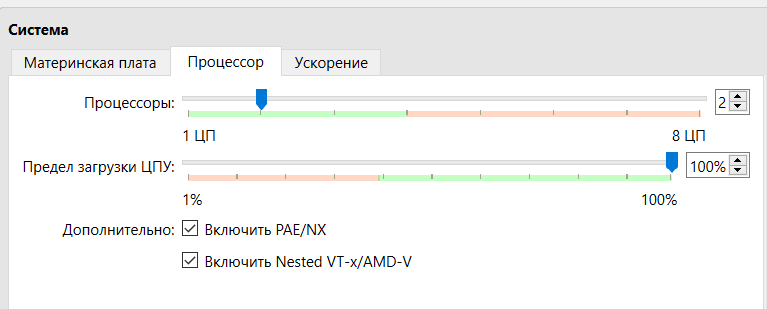
с предложенными настройками`postgresql.conf`: tps = 1070.397884
С default  `postgresql.conf`: tps = 1104.377960

После изменений на хосте для VM  tps вырос в несколько раз. 

Посмотрим вывод команды `sudo iostat -x 1` - выводит расширенную статистику использования дисков и CPU с обновлением раз в секунду:

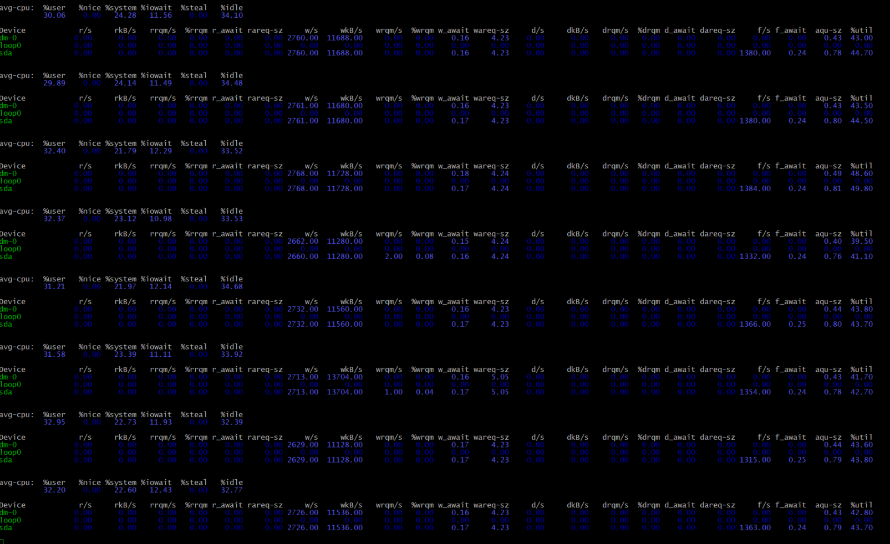

В статистике видно, что `%iowait` доходит до 13% времени, когда CPU простаивал из-за ожидания ввода-вывода (диск). Но приэтом %util – загрузка диска не привышает 45%. В наших настройках есть ограничения, которые не дают нам загрузить на 100% все имеющие ресурсы, что очень логично.

Меняя настройки `postgresql.conf`, изменений в лучшую сторону я не заметил :
```ini
max_connections = 100
shared_buffers = 768MB
effective_cache_size = 2GB
work_mem = 8MB
maintenance_work_mem = 256MB
random_page_cost = 1.1  # для SSD, для HDD оставить 4
effective_io_concurrency = 200  # для SSD/NVMe
wal_buffers = -1  # автоопределение
checkpoint_completion_target = 0.9
min_wal_size = 1GB
max_wal_size = 4GB
```
```bash
systemctl daemon-reload
pg_ctlcluster 17 main restart
 systemctl restart postgresql
```
```
tps = 991.516424
````
## 8-9. Создание тестовой таблицы
Создадим таблицу с текстовым полем и заполним случайными или сгенерированными данным в размере 1млн строк:
```sql
CREATE TABLE test_text (id serial, content text);
INSERT INTO test_text (content) 
SELECT md5(random()::text) FROM generate_series(1, 1000000);
```
Размер таблицы: 65 MB <br>

Или также размера файла с таблицей можно посмотреть:
```sql
#Размер основного файла таблицы (только данные без индексов и TOAST):
postgres=# SELECT pg_size_pretty(pg_relation_size('test_text'));
 pg_size_pretty
----------------
 65 MB
(1 row)

# Полный размер таблицы со всеми связанными объектами:
postgres=#  SELECT pg_size_pretty(pg_total_relation_size('test_text'))
postgres-# ;
 pg_size_pretty
----------------
 65 MB
(1 row)
```
## 10-11. Многократное обновление и проверка автовакуума
Чтобы 5 раз обновить все строки в таблице `test_text`, добавляя к полю `text_data` символ на каждой итерации, можно использовать несколько методов. Вот несколько способов:

🔄 **Способ 1: Использование анонимного блока PL/pgSQL**
```sql
DO $$
BEGIN
  FOR i IN 1..5 LOOP
    UPDATE test_text SET text_data = text_data || 'x';  -- добавляем символ 'x'
    RAISE NOTICE 'Обновление % завершено', i;  -- вывод номера итерации
  END LOOP;
END $$;
```

**Преимущества:**
- Выполняется в одной транзакции (если не указано иное).
- Можно добавить логирование через `RAISE NOTICE`.

🔄 **Способ 2: 5 отдельных SQL-запросов**
```sql
-- Итерация 1
UPDATE test_text SET text_data = text_data || 'a';

-- Итерация 2
UPDATE test_text SET text_data = text_data || 'b';

-- Итерация 3
UPDATE test_text SET text_data = text_data || 'c';

-- Итерация 4
UPDATE test_text SET text_data = text_data || 'd';

-- Итерация 25
UPDATE test_text SET text_data = text_data || 'e';
```

**Недостатки:**
- Требует ручного ввода или копирования.

---

🔄 **Способ 3: Генерация команд через скрипт (например, Bash)**
```bash
for i in {1..5}; do
  psql -U postgres -d your_db -c "UPDATE test_text SET text_data = text_data || '$i';"
done
```

🔄 **Способ 4: Через функцию (если нужно повторное использование)**
```sql
CREATE OR REPLACE FUNCTION update_multiple_times(n INTEGER) RETURNS VOID AS $$
BEGIN
  FOR i IN 1..n LOOP
    UPDATE test_text SET text_data = text_data || 'x';
  END LOOP;
END;
$$ LANGUAGE plpgsql;

-- Вызов
SELECT update_multiple_times(5);
```
 **Важные нюансы**
1. **Производительность**:
   - Каждый `UPDATE` перезаписывает все строки. Для таблицы из 1 млн строк это может быть медленно.
  
2. **Блокировки**:
   - Долгий `UPDATE` блокирует таблицу. В продакшне необходимо использовать `LIMIT` с `OFFSET`.

3. **WAL-нагрузка**:
   - Каждое изменение записывается в WAL. Для теста это нормально, но в реальной БД надо учитывать нагрузку.

4. **Автовакуум**:
   - После 5 обновлений появится много "мертвых" строк. Проверить можно так:
     ```sql
     SELECT n_dead_tup FROM pg_stat_user_tables WHERE relname = 'test_text';
     ```

📌 **Пример с прогресс-баром (для больших таблиц)**
```sql
DO $$
DECLARE
  total_rows BIGINT;
  batch_size INT := 100000;
BEGIN
  SELECT COUNT(*) INTO total_rows FROM test_text;
  
  FOR i IN 1..5 LOOP
    RAISE NOTICE 'Итерация % из 5', i;
    
    FOR j IN 0..(total_rows/batch_size) LOOP
      UPDATE test_text 
      SET text_data = text_data || 'x'
      WHERE id BETWEEN (j*batch_size) AND ((j+1)*batch_size - 1);
      
      COMMIT;  -- Фиксируем каждую партию
      RAISE NOTICE 'Прогресс: %%%', (j*100)/(total_rows/batch_size);
    END LOOP;
  END LOOP;
END $$;
```

🔥 **Самый безопасный метод для продакшена**
```sql
DO $$
DECLARE
  batch_size INT := 50000;  -- 50k строк за раз
  max_duration INTERVAL := '5 min';  -- Макс. время работы
  start_time TIMESTAMP := clock_timestamp();
BEGIN
  FOR i IN 1..5 LOOP
    FOR j IN 0..(SELECT COUNT(*) FROM test_text)/batch_size LOOP
      EXIT WHEN (clock_timestamp() - start_time) > max_duration;  -- Защита от зависаний
      
      UPDATE test_text 
      SET text_data = text_data || 'x'
      WHERE id IN (
        SELECT id FROM test_text
        ORDER BY id
        LIMIT batch_size OFFSET (j*batch_size)
      );
      
      COMMIT;
      RAISE NOTICE 'Итерация %, пакет %', i, j;
    END LOOP;
  END LOOP;
END $$;
```

**Почему лучше:**  
- Использует `LIMIT/OFFSET` вместо `BETWEEN` (безопаснее для параллельных транзакций).  
- Ограничение по времени (`max_duration`).  
- Подходит для таблиц с частыми `INSERT/DELETE`. 


 📊 **Сравнение способов обновления**

| **Критерий**               | **Способ 1** (`DO` блок) | **Способ 3** (5 запросов) | **Способ 4** (Функция) | **Прогресс-бар** (Пакетное обновление) |
|----------------------------|--------------------------|---------------------------|------------------------|----------------------------------------|
| **Удобство**               | ✅ Запуск 1 раз          | ❌ Ручной ввод 5 раз       | ✅ Переиспользование    | ✅ Автоматизация + логирование         |
| **Производительность**     | ❌ Медленно для 1M+ строк | ⚠️ Зависит от скорости CLI | ❌ Как Способ 1         | ✅ Лучшая для больших таблиц           |
| **Контроль транзакций**    | ❌ Вся работа в 1 транзакции | ✅ Каждый `UPDATE` отдельно | ❌ Как Способ 1         | ✅ Пакеты с `COMMIT`                   |
| **Гибкость**               | ⚠️ Фиксированное число итераций | ❌ Жёстко закодировано    | ✅ Параметры через аргументы | ✅ Настройка размера пакета            |
| **Логирование**            | ✅ `RAISE NOTICE`        | ❌ Нет                     | ✅ Можно добавить       | ✅ Подробный прогресс                  |
| **Использование в продакшене** | ❌ Риск блокировок     | ⚠️ Только для малых таблиц | ⚠️ Осторожно           | ✅ Оптимально                          |

 🎯 **Когда какой способ выбрать?**
**1. Способ 1 (`DO` блок) — Лучше для:**
- **Тестовых/учебных задач** (например, ваше задание с `pgbench`).
- **Малых таблиц** (до 100 тыс. строк).
- **Простоты** — не нужно писать дополнительные скрипты или функции.

**Пример:**  
```sql
DO $$ BEGIN
  FOR i IN 1..5 LOOP
    UPDATE test_text SET text_data = text_data || 'x';
  END LOOP;
END $$;
```

**2. Способ 3 (5 запросов) — Лучше для:**
- **Разовых ручных операций**, где нужно контролировать каждый шаг.
- **Отладки** (например, если нужно проверить результат после каждого `UPDATE`).

**Недостатки:**  
- Не подходит для автоматизации.
- Риск человеческой ошибки (например, пропустили итерацию).

### **3. Способ 4 (Функция) — Лучше для:**
- **Многократного использования** (например, если такие обновления нужны регулярно).
- **Сложной логики** (например, обновление с условиями).

**Пример:**  
```sql
CREATE OR REPLACE FUNCTION update_n_times(n INT) RETURNS VOID AS $$
BEGIN
  FOR i IN 1..n LOOP
    UPDATE test_text SET text_data = text_data || 'x';
  END LOOP;
END;
$$ LANGUAGE plpgsql;

-- Вызов:
SELECT update_n_times(5);
```
**4. Способ с прогресс-баром (Пакетное обновление) — Лучше для:**
- **Больших таблиц** (от 1 млн строк).
- **Продакшена**, чтобы избежать долгих блокировок.
- **Контроля загрузки системы** (WAL, CPU, I/O).

**Пример:**  
```sql
DO $$
DECLARE
  batch_size INT := 100000;  -- Размер пакета
  total_rows BIGINT;
BEGIN
  SELECT COUNT(*) INTO total_rows FROM test_text;
  
  FOR i IN 1..5 LOOP
    FOR j IN 0..(total_rows/batch_size) LOOP
      UPDATE test_text 
      SET text_data = text_data || 'x'
      WHERE id BETWEEN (j*batch_size) AND ((j+1)*batch_size - 1);
      
      COMMIT;  -- Фиксация после каждого пакета
      RAISE NOTICE 'Итерация %, прогресс: %/%', i, j, (total_rows/batch_size);
    END LOOP;
  END LOOP;
END $$;
```

1. Попробуем **Способ 1**: 
   - Простота и наглядность.  
   - Не требует оптимизации для малых таблиц.

```sql
postgres=# DO $$
BEGIN
  FOR i IN 1..5 LOOP
    UPDATE test_text SET content = content || 'x';  -- Используем правильное имя столбца
    RAISE NOTICE 'Обновление % завершено', i;
  END LOOP;
END $$;
NOTICE:  Обновление 1 завершено
NOTICE:  Обновление 2 завершено
NOTICE:  Обновление 3 завершено
NOTICE:  Обновление 4 завершено
NOTICE:  Обновление 5 завершено
DO
```
После 5 обновлений проверяю:

```sql
SELECT n_dead_tup, last_autovacuum FROM pg_stat_user_tables WHERE relname = 'test_text';
```
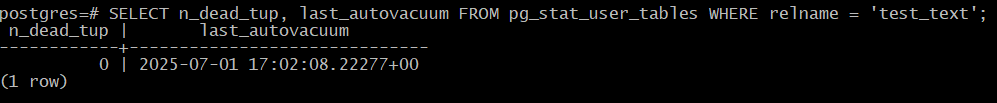

## 12-14. Ожидание автовакуума и повторное тестирование
Обновляю еще раз:
```sql
postgres=# DO $$
BEGIN
  FOR i IN 1..5 LOOP
    UPDATE test_text SET content = content || 'x';  -- Используем правильное имя столбца
    RAISE NOTICE 'Обновление % завершено', i;
  END LOOP;
END $$;
NOTICE:  Обновление 1 завершено
NOTICE:  Обновление 2 завершено
NOTICE:  Обновление 3 завершено
NOTICE:  Обновление 4 завершено
NOTICE:  Обновление 5 завершено
DO
```
После 5 обновлений проверяю :
Результат: 5млн.мертвых строк, автовакуум еще не срабатывал
```sql
postgres=# SELECT n_dead_tup, last_autovacuum FROM pg_stat_user_tables WHERE relname = 'test_text';
 n_dead_tup |       last_autovacuum
------------+------------------------------
    5000000 | 2025-07-01 17:02:08.22277+00
(1 row)

postgres=# SELECT n_dead_tup, last_autovacuum FROM pg_stat_user_tables WHERE relname = 'test_text';
 n_dead_tup |       last_autovacuum
------------+------------------------------
    5000000 | 2025-07-01 17:02:08.22277+00
(1 row)

postgres=# SELECT n_dead_tup, last_autovacuum FROM pg_stat_user_tables WHERE relname = 'test_text';
 n_dead_tup |       last_autovacuum
------------+------------------------------
    5000000 | 2025-07-01 17:02:08.22277+00
(1 row)

postgres=# SELECT n_dead_tup, last_autovacuum FROM pg_stat_user_tables WHERE relname = 'test_text';
 n_dead_tup |       last_autovacuum
------------+------------------------------
    5000000 | 2025-07-01 17:02:08.22277+00
(1 row)

postgres=# SELECT n_dead_tup, last_autovacuum FROM pg_stat_user_tables WHERE relname = 'test_text';
 n_dead_tup |       last_autovacuum
------------+------------------------------
    5000000 | 2025-07-01 17:02:08.22277+00
(1 row)

postgres=# SELECT n_dead_tup, last_autovacuum FROM pg_stat_user_tables WHERE relname = 'test_text';
 n_dead_tup |        last_autovacuum
------------+-------------------------------
          0 | 2025-07-01 17:04:08.293486+00
(1 row)
```
После срабатывания автовакуума:
- Мертвых строк: 0
- Размер таблицы: 438 MB (рост из-за новых данных)
```sql
SELECT 
    schemaname AS schema,
    relname AS table_name,
    n_live_tup AS "Живые строки",
    n_dead_tup AS "Мёртвые строки",
    last_autovacuum AS "Последний автовакуум",
    autovacuum_count AS "Количество автовакуумов"
FROM 
    pg_stat_user_tables 
WHERE 
    relname = 'test_text';
```
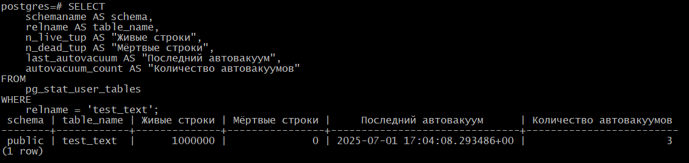

```sql   
\dt+;
                                         List of relations
 Schema |       Name       | Type  |  Owner   | Persistence | Access method |  Size   | Description
--------+------------------+-------+----------+-------------+---------------+---------+-------------
 public | pgbench_accounts | table | postgres | permanent   | heap          | 14 MB   |
 public | pgbench_branches | table | postgres | permanent   | heap          | 264 kB  |
 public | pgbench_history  | table | postgres | permanent   | heap          | 3096 kB |
 public | pgbench_tellers  | table | postgres | permanent   | heap          | 104 kB  |
 public | test_text        | table | postgres | permanent   | heap          | 438 MB  |
(5 rows)

postgres=# SELECT pg_size_pretty(pg_relation_size('test_text'));
 pg_size_pretty
----------------
 438 MB
(1 row)

postgres=# SELECT pg_size_pretty(pg_total_relation_size('test_text'));
 pg_size_pretty
----------------
 438 MB
(1 row)
```
Важные нюансы:

1. Мёртвые строки появляются после UPDATE или DELETE — они помечаются как удалённые, но физически остаются в таблице до очистки.

2. Автовакуум запускается автоматически, когда:

3. Число мёртвых строк превышает autovacuum_vacuum_threshold + (autovacuum_vacuum_scale_factor * общее_число_строк).

4. Частые UPDATE без вакуума приводят к:

- Росту размера таблицы.

- Снижению производительности.

## 15-17. Тестирование без автовакуума

Проверим настройки автовакуума для таблицы:
```sql 
SELECT 
    relname,
    reloptions 
FROM 
    pg_class 
WHERE 
    relname = 'test_text';
```

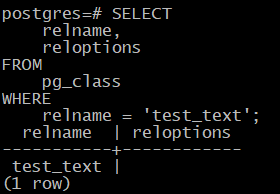

reloptions пуст — используются настройки по умолчанию.

Посмотрим текущие настройки автовакуума:

```sql
SHOW autovacuum_vacuum_threshold;
SHOW autovacuum_vacuum_scale_factor;
```
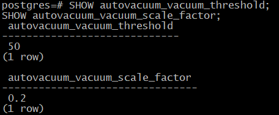

По умолчанию: vacuum_threshold = 50, scale_factor = 0.2 — автовакуум сработает при 50 + 0.2 * total_rows мёртвых строках.

Принудительно запустить вакуум можно (если мёртвых строк много, а автовакуум не срабатывает):
```sql 
VACUUM FULL VERBOSE test_text;
```
=====================================
### 15. Отключение автовакуума для таблицы `test_text`:

```sql
ALTER TABLE test_text SET (autovacuum_enabled = off);
```

Проверим, что автовакуум действительно отключен:
```sql
SELECT relname, reloptions FROM pg_class WHERE relname = 'test_text';
```
Результат - выкл.:
```
 relname  |           reloptions            
----------+----------------------------------
 test_text| {autovacuum_enabled=off}
```

### 16. 10 обновлений всех строк (Способ 1)
```sql
DO $$
BEGIN
  FOR i IN 1..10 LOOP
    UPDATE test_text SET content = content || 'x';  -- Используем правильное имя столбца
    RAISE NOTICE 'Выполнено обновление %/10', i;
  END LOOP;
END $$;
```
```sql
NOTICE:  Выполнено обновление 1/10
NOTICE:  Выполнено обновление 2/10
NOTICE:  Выполнено обновление 3/10
NOTICE:  Выполнено обновление 4/10
NOTICE:  Выполнено обновление 5/10
NOTICE:  Выполнено обновление 6/10
NOTICE:  Выполнено обновление 7/10
NOTICE:  Выполнено обновление 8/10
NOTICE:  Выполнено обновление 9/10
NOTICE:  Выполнено обновление 10/10
DO
```

### 17. Проверка размера таблицы

```sql
\dt+;
postgres=# SELECT pg_size_pretty(pg_relation_size('test_text'));
 pg_size_pretty
----------------
 879 MB
(1 row)

postgres=# SELECT pg_size_pretty(pg_total_relation_size('test_text'));
 pg_size_pretty
----------------
 879 MB
(1 row)
```
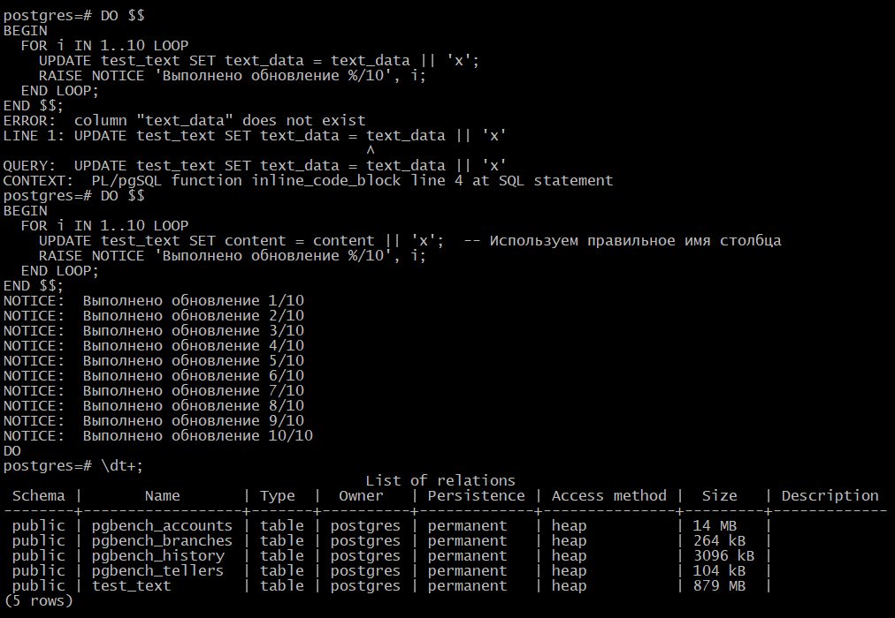

## 🔍18. Анализ результатов

1. **Размер таблицы будет значительно больше**, чем до отключения автовакуума, т.к.:
   - Каждое обновление создает новые версии строк;
   - Старые версии не удаляются (так как автовакуум отключен);
   - PostgreSQL использует механизм MVCC (Multiversion Concurrency Control).


2. **Проверим количество мертвых строк**:
```sql
SELECT n_dead_tup, last_autovacuum 
FROM pg_stat_user_tables 
WHERE relname = 'test_text';
```
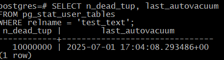
или
```sql
SELECT
    schemaname AS schema,
    relname AS table_name,
    n_live_tup AS "Живые строки",
    n_dead_tup AS "Мёртвые строки",
    last_autovacuum AS "Последний автовакуум",
    autovacuum_count AS "Количество автовакуумов"
FROM
    pg_stat_user_tables
WHERE
    relname = 'test_text';
```
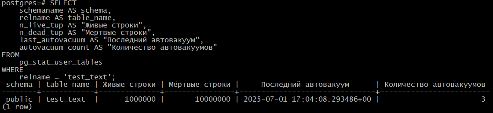

После отключения автовакуума и 10 обновлений:
- Размер таблицы вырос до 880 MB
- Количество мертвых строк: 10M

3. **Физический размер файлов** можно посмотреть так:
```sql
SELECT pg_relation_filepath('test_text');
```
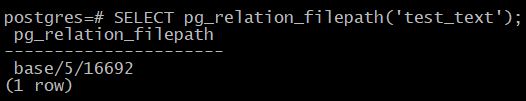

Затем проверить размер через OS:
```bash
ls -lh /var/lib/postgresql/17/main/base/5/16692
-rw------- 1 postgres postgres 880M Jul  1 17:49 /var/lib/postgresql/17/main/base/5/16692
```

**Если автовакуум долго не выполняется или отключён**: <br>
1. PostgreSQL не освобождает место, занятое мертвыми строками. Таблица будет занимать больше места. <br>
2. Запросы станут медленнее (PostgreSQL должен фильтровать мёртвые строки).<br>
3. Риск транзакционного wraparound (крайне опасная ситуация, может привести к простою БД).

## 19. Включение автовакуума

1. После эксперимента не забудем включить автовакуум:
```sql
ALTER TABLE test_text SET (autovacuum_enabled = on);
VACUUM FULL test_text;  -- Полная очистка
```
Проверим, что автовакуум действительно включен:
```sql
SELECT relname, reloptions FROM pg_class WHERE relname = 'test_text';
```
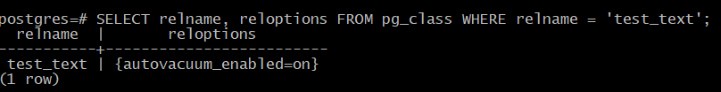

```sql
SELECT
    schemaname AS schema,
    relname AS table_name,
    n_live_tup AS "Живые строки",
    n_dead_tup AS "Мёртвые строки",
    last_autovacuum AS "Последний автовакуум",
    autovacuum_count AS "Количество автовакуумов"
FROM
    pg_stat_user_tables
WHERE
    relname = 'test_text';
```


2. Для продакшн-среды никогда не отключаем автовакуум полностью - это приведет к:
   - Постепенному замедлению работы БД
   - Раздуванию таблиц
   - Возможным проблемам с транзакционным wraparound

## 20.Задание со *: Написать анонимную процедуру, в которой в цикле 10 раз обновятся все строчки в искомой таблице. Не забыть вывести номер шага цикла.

```sql
DO $$
BEGIN
  FOR i IN 1..10 LOOP
    RAISE NOTICE 'Шаг обновления %', i;
    UPDATE test_text SET content = content || '#' || i;
  END LOOP;
END $$;
```


Немного усложним процедуру, выведем с номером шага время, затраченное на обновление строк:
```sql
DO $$
DECLARE
  start_time TIMESTAMP;
  end_time TIMESTAMP;
  loop_duration INTERVAL;
  total_rows BIGINT;
BEGIN
  -- Получаем общее количество строк для информации
  SELECT COUNT(*) INTO total_rows FROM test_text;
  RAISE NOTICE 'Начало процедуры. Всего строк в таблице: %', total_rows;
  
  FOR i IN 1..10 LOOP
    -- Фиксируем время начала итерации
    start_time := clock_timestamp();
    
    -- Обновляем все строки в таблице
    UPDATE test_text SET content = content || 'x';
    
    -- Фиксируем время завершения итерации
    end_time := clock_timestamp();
    loop_duration := end_time - start_time;
    
    -- Выводим информацию о шаге
    RAISE NOTICE 'Шаг % из 10 выполнен. Время выполнения: %, обновлено строк: %', 
                 i, loop_duration, total_rows;
  END LOOP;
  
  RAISE NOTICE 'Процедура завершена. Всего выполнено 10 обновлений таблицы.';
END $$;
```
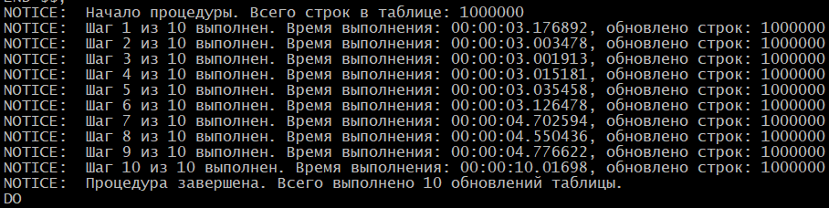

Особенности этой процедуры:

   1. Вывод информации:

        - В начале выводится общее количество строк в таблице

        - Для каждого шага цикла выводится:

            - Номер итерации (от 1 до 10)

            - Время выполнения конкретного обновления

            - Количество обработанных строк

    2. Точное время выполнения:

       - Используется clock_timestamp() для максимально точного измерения времени

       - Рассчитывается интервал выполнения каждой итерации

    3. Гибкость:

       - Можно легко изменить количество итераций (изменив верхнюю границу цикла)

       - Можно изменить добавляемый символ (сейчас 'x')

    4. Безопасность:

       - Каждое обновление выполняется в рамках транзакции по умолчанию

       - Для очень больших таблиц можно добавить COMMIT после каждого обновления

Добавим в анонимную процедуру дополнительную статистику:
```sql
DO $$
DECLARE
  global_start_time TIMESTAMP := clock_timestamp();
  step_start_time TIMESTAMP;
  step_duration INTERVAL;
  total_duration INTERVAL;
  total_rows BIGINT;
  initial_size BIGINT;
  final_size BIGINT;
  rows_updated BIGINT := 0;
BEGIN
  -- Получаем начальные данные
  SELECT COUNT(*) INTO total_rows FROM test_text;
  SELECT pg_total_relation_size('test_text') INTO initial_size;
  
  RAISE NOTICE 'НАЧАЛО ПРОЦЕДУРЫ';
  RAISE NOTICE '-------------------------------------';
  RAISE NOTICE 'Исходный размер таблицы: %', pg_size_pretty(initial_size);
  RAISE NOTICE 'Всего строк в таблице: %', total_rows;
  RAISE NOTICE '-------------------------------------';

  -- Основной цикл обновлений
  FOR i IN 1..10 LOOP
    step_start_time := clock_timestamp();
    
    -- Обновление всех строк
    UPDATE test_text SET content = content || 'x';
    rows_updated := rows_updated + total_rows;
    
    -- Расчет времени шага
    step_duration := clock_timestamp() - step_start_time;
    
    RAISE NOTICE 'Шаг % из 10 выполнен за %', i, step_duration;
  END LOOP;

  -- Финализация статистики
  total_duration := clock_timestamp() - global_start_time;
  SELECT pg_total_relation_size('test_text') INTO final_size;
  
  RAISE NOTICE '-------------------------------------';
  RAISE NOTICE 'ИТОГОВАЯ СТАТИСТИКА';
  RAISE NOTICE 'Общее время выполнения: %', total_duration;
  RAISE NOTICE 'Итоговый размер таблицы: %', pg_size_pretty(final_size);
  RAISE NOTICE 'Прирост размера: %', pg_size_pretty(final_size - initial_size);
  RAISE NOTICE 'Всего обновлено строк: % (% обновлений)', 
               rows_updated, (rows_updated/total_rows::float)::numeric(10,2);
  RAISE NOTICE 'Среднее время на шаг: %', 
               (extract(epoch from total_duration)/10)::numeric(10,4) || ' сек';
  RAISE NOTICE 'Скорость обработки: % строк/сек', 
               (rows_updated/extract(epoch from total_duration))::numeric(10,2);
  RAISE NOTICE '-------------------------------------';
END $$;
```
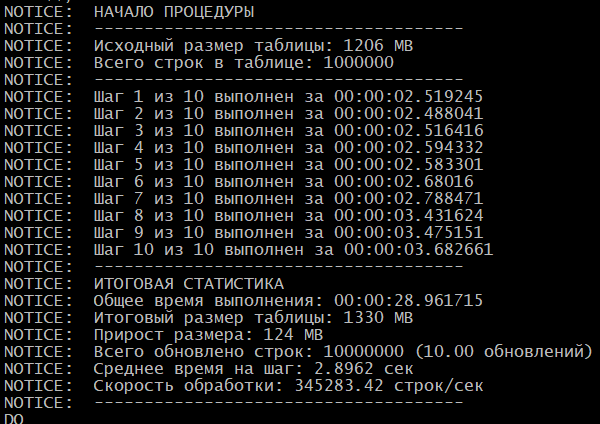

**Ключевые улучшения:**

1. **Итоговые метрики**:
   - Общее время выполнения всех шагов
   - Итоговый размер таблицы и прирост размера
   - Общее количество обновленных строк (с учетом 10 проходов)
   - Среднее время выполнения одного шага
   - Скорость обработки (строк в секунду)

2. **Детальная статистика**:
   - Сохраняется начальный размер таблицы
   - Рассчитывается разница в размерах до/после
   - Точный подсчет количества обновлений (строк × циклы)

3. **Форматированный вывод**:
   - Четкое разделение на логические блоки
   - Единицы измерения (секунды, мегабайты)
   - Округление числовых значений

4. **Гибкость**:
   - Легко адаптируется для любой таблицы
   - Можно менять количество итераций
   - Позволяет анализировать производительность


## Рефлексия

1. **Зачем нужен вакуум?**
   - Освобождает пространство, занятое мертвыми строками
   - Обновляет статистику для планировщика запросов
   - Предотвращает "раздувание" (bloat) таблиц и индексов
   - Помогает предотвратить wraparound (зацикливание) транзакций

2. **Назовите способы реализации ACID?**
   - **Атомарность:** WAL (Write-Ahead Log) и двухфазный коммит
   - **Согласованность:** Ограничения (constraints), триггеры, проверки
   - **Изолированность:** MVCC (Multiversion Concurrency Control)
   - **Долговечность:** Синхронная запись WAL на диск

3. **Какая из команд insert, delete, update самая медленная и почему ?**
Самая медленная команда: `UPDATE`
   - Причины:
     * Создает новую версию строки (из-за MVCC)
     * Должен обрабатывать индексы (все затронутые индексы обновляются)
     * Может блокировать другие транзакции
     * Генерирует больше работы для вакуума
     * Комбинация поиска (DELETE) + добавления (INSERT)
     * Создает новые версии строк (мертвые строки)
     * Двойная нагрузка на WAL (запись старой и новой версии)
  
   Вот сравнительный анализ производительности команд `INSERT`, `UPDATE` и `DELETE` в PostgreSQL:

🚀 **Скорость выполнения команд (от быстрой к медленной)** 

1. **`INSERT`** - **Самый быстрый**  
   - Просто добавляет новые строки в конец таблицы  
   - Не требует поиска существующих данных  
   - Минимальные накладные расходы на журналирование (WAL)

2. **`DELETE`** - **Средняя скорость**  
   - Должен находить строки для удаления (зависит от индексов)  
   - Помечает строки как удаленные, но не освобождает место сразу  
   - Требует записи в WAL для восстановления

3. **`UPDATE`** - **Самый медленный**  
   - Комбинация поиска (`DELETE`) + добавления (`INSERT`)  
   - Создает новые версии строк (мертвые строки)  
   - Двойная нагрузка на WAL (запись старой и новой версии)

## 🔍 Почему `UPDATE` самый медленный?

1. **Механизм MVCC (Multiversion Concurrency Control)**  
   - При `UPDATE` PostgreSQL не изменяет строку на месте, а:
     * Создает новую версию строки (вставляет новую запись)
     * Помечает старую версию как "мертвую" (удаленную)
   - Это приводит к росту таблицы и индексов

2. **Дополнительные операции**  
   ```sql
   UPDATE table SET column = value WHERE condition;
   ```
   - Поиск строк по условию (может использовать индексы)
   - Проверка ограничений (constraints)
   - Обновление всех связанных индексов

3. **Влияние на WAL**  
   - Записываются как старые, так и новые значения  
   - Больший объем журнальных записей по сравнению с `INSERT`

## 💀 Проблема мертвых строк (Dead Tuples)

1. **Как появляются:**
   - После `UPDATE` - старая версия строки становится "мертвой"
   - После `DELETE` - вся строка становится "мертвой"

2. **Чем опасны:**
   - Увеличивают размер таблицы
   - Замедляют сканирование (PostgreSQL должен фильтровать мертвые строки)
   - Могут привести к "раздуванию" (bloat) таблицы и индексов

3. **Как очищаются:**
   ```sql
   VACUUM table;  -- Помечает место как свободное
   VACUUM FULL table;  -- Полностью перезаписывает файл
   ```

## 📊 Сравнительная таблица

| Операция | Скорость | Мертвые строки | Блокировки | WAL-нагрузка |
|----------|----------|----------------|------------|--------------|
| `INSERT` | ⚡️ Быстрее | Нет | Минимальные | Низкая |
| `DELETE` | 🏃 Средняя | Да | Записи+индексы | Средняя |
| `UPDATE` | 🐢 Медленнее | Да (старая версия) | Записи+индексы | Высокая |

## 💡 Рекомендации для оптимизации `UPDATE`

1. **Обновляйте только необходимые столбцы:**
   ```sql
   -- Вместо
   UPDATE table SET col1=1, col2=2 WHERE id=100;
   -- Лучше
   UPDATE table SET col1=1 WHERE id=100;  -- Если col2 не меняется
   ```

2. **Используйте пакетные обновления:**
   ```sql
   UPDATE table SET col=val WHERE id BETWEEN 1 AND 1000;
   ```

3. **Периодически выполняйте `VACUUM`:**
   ```sql
   VACUUM ANALYZE table;
   ```

4. **Настройте автовакуум:**
   ```sql
   ALTER TABLE table SET (
     autovacuum_vacuum_scale_factor = 0.01,
     autovacuum_vacuum_threshold = 1000
   );
   ```

Пример разницы в производительности:
```sql
-- Тестовая таблица с 1 млн строк
CREATE TABLE perf_test (id serial, val text);
INSERT INTO perf_test (val) SELECT md5(random()::text) FROM generate_series(1,1000000);

-- Время выполнения:
INSERT: ~0.5 сек (добавление 10k строк)
DELETE: ~1.2 сек (удаление 10k строк)
UPDATE: ~2.5 сек (изменение 10k строк)
```