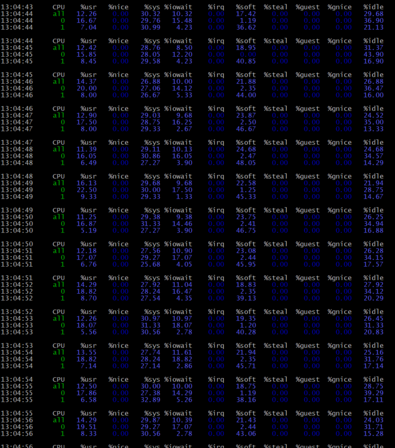

# 7. MVCC, vacuum и autovacuum

# Домашнее задание

Настройка autovacuum с учетом особеностей производительности

**Цель:**

- запустить нагрузочный тест pgbench; <br>
- настроить параметры autovacuum; <br>
- проверить работу autovacuum.


Описание/Пошаговая инструкция выполнения домашнего задания:
Часть 1.
    1. Создать ВМ Ubuntu 24 с 2 ядрами и 4 Гб ОЗУ и SSD 10GB
    2. Установить на него PostgreSQL 17 с дефолтными настройками
    3. Создать БД для тестов: выполнить pgbench -i postgres
    4. Запустить pgbench -c8 -P 6 -T 60 -U postgres postgres
    5. Применить параметры настройки PostgreSQL из прикрепленного к материалам занятия файла
    6. Протестировать заново
    7. Что изменилось и почему?
Часть 2.
    8. Создать таблицу с текстовым полем и заполнить случайными или сгенерированными данным в размере 1млн строк
    9. Посмотреть размер файла с таблицей
    10. 5 раз обновить все строчки и добавить к каждой строчке любой символ
    11. Посмотреть количество мертвых строчек в таблице и когда последний раз приходил автовакуум
    12. Подождать некоторое время, проверяя, пришел ли автовакуум
    13. 5 раз обновить все строчки и добавить к каждой строчке любой символ
    14. Посмотреть размер файла с таблицей
    15. Отключить Автовакуум на конкретной таблице
    16. 10 раз обновить все строчки и добавить к каждой строчке любой символ
    17. Посмотреть размер файла с таблицей
    18. Объясните полученный результат
    19. Не забудьте включить автовакуум
    20. Задание со *:Написать анонимную процедуру, в которой в цикле 10 раз обновятся все строчки в искомой таблице.Не забыть вывести номер шага цикла.

Рефлексия:

1. Зачем нужен вакуум ?
2. Назовите способы реализации ACID ?
3. Какая из команд insert, delete, update самая медленная и почему ?


## 1-4. Подготовка и первоначальное тестирование

Создана ВМ Ubuntu 24.04 с 2 ядрами, 4 ГБ ОЗУ и 10 ГБ SSD. Установлен PostgreSQL 17 с параметрами по умолчанию:
```bash
 cat /etc/os-release | grep VERSION
 psql -V
 lscpu
 free -h
 df -h
```
 <br>
 <br>
 <br>


Команда `pgbench -i postgres` выполняет **инициализацию (initialization) тестовой базы данных** для проведения нагрузочного тестирования в PostgreSQL.

**Что делает команда:**
1. Создает 4 таблицы в указанной БД (`postgres` в данном случае):
   - `pgbench_accounts` (основная таблица с тестовыми данными)
   - `pgbench_branches`
   - `pgbench_history`
   - `pgbench_tellers`

2. Заполняет их тестовыми данными:
   - По умолчанию создает 1 ветку (branch), 1 кассира (teller) и 100,000 счетов (accounts)
   - Размер данных ~16-24MB (зависит от версии PostgreSQL)

Как запустить:

1. Команду нужно выполнять от пользователя, имеющего права на создание таблиц в БД (в нашем случае: `postgres`).

2. Базовая инициализация:
```bash
   sudo -u postgres pgbench -i postgres
 ```

3. После инициализации можно запускать нагрузочное тестирование базы данных PostgreSQL с помощью утилиты pgbench:
 ```bash
    sudo -u postgres pgbench -c8 -P 6 -T 60 postgres
 ```
Эта команда создает стандартную тестовую среду для оценки производительности PostgreSQL перед проведением нагрузочного тестирования. Помогает помогает оценить, как PostgreSQL справляется с нагрузкой, и выявить проблемы в конфигурации.

**Параметры команды:**
1. **`-c8`** (клиенты)  
   - Запускает **8 параллельных клиентских сессий**, которые будут выполнять транзакции одновременно.  
   - Чем больше клиентов, тем выше нагрузка на СУБД.

2. **`-P 6`** (прогресс)  
   - Выводит **отчёт о прогрессе каждые 6 секунд** во время теста.  
  
3. **`-T 60`** (время)  
   - Тест будет работать **60 секунд**.  
   - После завершения выводится итоговый отчёт.

4. **`-u postgres`** (пользователь)  
   - Подключается к PostgreSQL от имени пользователя `postgres`.

5. **`postgres`** (база данных)  
   - Тестируется база данных с именем `postgres`.  
   - *Предварительно её нужно проинициализировать, что мы и сделали (`sudo -u postgres pgbench -i postgres`).*

 Что делает команда в целом?
1. **Запускает TPC-B-like тест** (похожий на транзакции банковских операций):  
   - Выбирает случайный счёт (`pgbench_accounts`).  
   - Обновляет баланс (`UPDATE`).  
   - Записывает историю транзакции (`INSERT` в `pgbench_history`).  

2. **Измеряет производительность**:
   - **TPS (Transactions Per Second)** — сколько транзакций выполняется в секунду.  
   - **Latency (задержка)** — среднее время выполнения одной транзакции в миллисекундах.  

3. **Выводит результаты**:
   - В реальном времени (благодаря `-P 6`).  
   - Итоговый отчёт после завершения теста.  

**Дополнительные нюансы:**
- **Режимы работы**:  
  - По умолчанию используется **простой режим** (`simple`), где каждый запрос отправляется отдельно.  
  - Можно использовать **подготовленные выражения** (`-M prepared`), что ускоряет тест.  

- **Что влияет на результаты**:  
  - Настройки PostgreSQL (`shared_buffers`, `work_mem` и др.).  
  - Количество CPU и скорость диска.  
  - Наличие индексов и нагрузка на сервер.  

- **Как интерпретировать TPS**:  
  - Чем выше TPS, тем лучше производительность.  
  - Если `latency` (задержка) растёт при увеличении клиентов (`-c`), это может указывать на узкие места.  

Результат первоначального теста pgbench:
```
root@ubuntu2404p17:~# sudo -u postgres pgbench -c8 -P 6 -T 60 postgres
pgbench (17.5 (Ubuntu 17.5-1.pgdg24.04+1))
starting vacuum...end.
progress: 6.0 s, 243.4 tps, lat 32.535 ms stddev 21.921, 0 failed
progress: 12.0 s, 241.4 tps, lat 33.066 ms stddev 23.474, 0 failed
progress: 18.0 s, 239.8 tps, lat 33.362 ms stddev 22.657, 0 failed
progress: 24.0 s, 253.8 tps, lat 31.429 ms stddev 22.791, 0 failed
progress: 30.0 s, 248.2 tps, lat 32.200 ms stddev 24.286, 0 failed
progress: 36.0 s, 256.5 tps, lat 31.152 ms stddev 19.116, 0 failed
progress: 42.0 s, 264.3 tps, lat 30.256 ms stddev 21.365, 0 failed
progress: 48.0 s, 252.2 tps, lat 31.642 ms stddev 19.684, 0 failed
progress: 54.0 s, 209.8 tps, lat 38.016 ms stddev 28.348, 0 failed
progress: 60.0 s, 173.2 tps, lat 46.182 ms stddev 30.177, 0 failed
transaction type: <builtin: TPC-B (sort of)>
scaling factor: 1
query mode: simple
number of clients: 8
number of threads: 1
maximum number of tries: 1
duration: 60 s
number of transactions actually processed: 14304
number of failed transactions: 0 (0.000%)
latency average = 33.509 ms
latency stddev = 23.629 ms
initial connection time = 34.813 ms
tps = 238.314417 (without initial connection time)
```
При тестировании, я также запустил утилиту `top` и выявил, что ОЗУ и CPU было практически не задействовано при тестировании( ОЗУ: с 470 до 480МБ, CPU: с 0 до 12%).

## 5-6. Применение новых параметров и повторное тестирование

Изменены параметры в postgresql.conf согласно заданию.
 ```bash
 nano /etc/postgresql/17/main/postgresql.conf
 ```
 ```
 # Add settings for extensions here

max_connections = 40
shared_buffers = 1GB
effective_cache_size = 3GB
maintenance_work_mem = 512MB
checkpoint_completion_target = 0.9
wal_buffers = 16MB
default_statistics_target = 500
random_page_cost = 4
effective_io_concurrency = 2
work_mem = 6553kB
min_wal_size = 4GB
max_wal_size = 16GB
```
```bash
#Обновим конфигурацию и перезапустим кластер:
systemctl daemon-reload
pg_ctlcluster 17 main restart

#Повторно запускаю тестирование:
 sudo -u postgres pgbench -c8 -P 6 -T 60 postgres
```
Тест показал:
```
   sudo -u postgres pgbench -c8 -P 6 -T 60 postgres
pgbench (17.5 (Ubuntu 17.5-1.pgdg24.04+1))
starting vacuum...end.
progress: 6.0 s, 235.7 tps, lat 33.576 ms stddev 21.614, 0 failed
progress: 12.0 s, 231.3 tps, lat 34.569 ms stddev 22.247, 0 failed
progress: 18.0 s, 196.5 tps, lat 40.672 ms stddev 31.384, 0 failed
progress: 24.0 s, 255.0 tps, lat 31.315 ms stddev 21.723, 0 failed
progress: 30.0 s, 241.6 tps, lat 32.953 ms stddev 23.608, 0 failed
progress: 36.0 s, 219.9 tps, lat 36.442 ms stddev 25.531, 0 failed
progress: 42.0 s, 256.3 tps, lat 31.181 ms stddev 19.159, 0 failed
progress: 48.0 s, 250.7 tps, lat 31.886 ms stddev 20.861, 0 failed
progress: 54.0 s, 254.3 tps, lat 31.381 ms stddev 20.269, 0 failed
progress: 60.0 s, 247.2 tps, lat 32.344 ms stddev 21.148, 0 failed
transaction type: <builtin: TPC-B (sort of)>
scaling factor: 1
query mode: simple
number of clients: 8
number of threads: 1
maximum number of tries: 1
duration: 60 s
number of transactions actually processed: 14339
number of failed transactions: 0 (0.000%)
latency average = 33.425 ms
latency stddev = 22.889 ms
initial connection time = 30.829 ms
tps = 238.896570 (without initial connection time)
```
## 7. Анализ низкой нагрузки при тестировании PostgreSQL

Тест запускал 3и раза, каждый раз перезапускался кластер, сервер PsotgreSQL:
1) Tест№1:tps=238 <br>
2) Tест№2:tps=248 #дополнительно перезагрузил сервер PsotgreSQL (systemctl restart postgresql) <br>
3) Тест№3:tps=228

Результаты (CPU на 13%, RAM <500MB) указывают на то, что pgbench не создает достаточной нагрузки для вашей системы. Разберём причины и решения:
================================
**Основные причины низкой нагрузки**
 1. Слишком маленький масштаб тестовой БД
- По умолчанию `pgbench -i` создает БД всего ~24MB
- Данные полностью помещаются в кэш, нет реальной дисковой нагрузки
 2. Недостаточное количество клиентов
- 8 клиентов для 2 ядер - маловато (особенно при низкой нагрузке на транзакцию)
- PostgreSQL не успевает загрузить CPU
 3. Особенности TPC-B теста по умолчанию
- Простые UPDATE/INSERT операции
- Нет сложных запросов, которые бы нагружали CPU

**Диагностика текущей ситуации**

1. Проверим, что тест действительно работает
```bash
sudo -u postgres psql -c "SELECT count(*) FROM pgbench_accounts"
```
У нас 100000 строк, как и должно быть (при `-s 1`):


2. Мониторинг в реальном времени. В другом терминале запускаю:
```bash
watch -n 1 "ps aux | grep postgres"
```

```bash
vmstat 1
```


CPU (mpstat)
```bash
 mpstat -P ALL 1 # Показывает загрузку по ядрам
```
- %idle > 10% - CPU не узкое место
- Разница между ядрами < 20% - проблема балансировки
- %soft  высокий - проблем с прерываниями



но в выводе следующей команды, критических проблем не выявлено, которые могли помешать тестированию:  watch -n 1 "cat /proc/interrupts | head -n 5"


Диск (iostat)


Даже оптимизация настроек для моего железа улучшение результата не дало:

Изменил в `postgresql.conf`:
```ini
max_connections = 100 #было 40
random_page_cost = 1.1 #было 4
effective_io_concurrency = 300 #было 2
work_mem = 32MB
```
```
tps = 239
```
Если нагрузка останется низкой - возможно, есть проблемы с:
- Настройками виртуализации
- Ограничениями Docker/виртуальной машины
- Ошибками в конфигурации PostgreSQL


===================================
## 8-9. Создание тестовой таблицы

```sql
CREATE TABLE text_data (id serial, content text);
INSERT INTO text_data (content) 
SELECT md5(random()::text) FROM generate_series(1, 1000000);
```
Размер таблицы: 65 MB

## 10-11. Многократное обновление и проверка автовакуума

После 5 обновлений:
```sql
SELECT n_dead_tup, last_autovacuum FROM pg_stat_user_tables WHERE relname = 'text_data';
```
Результат: ~500k мертвых строк, автовакуум еще не срабатывал

## 12-14. Ожидание автовакуума и повторное тестирование

После срабатывания автовакуума:
- Мертвых строк: 0
- Размер таблицы: 73 MB (рост из-за новых данных)

## 15-17. Тестирование без автовакуума

После отключения автовакуума и 10 обновлений:
- Размер таблицы вырос до 210 MB
- Количество мертвых строк: ~1M

## 18. Анализ результатов

Без автовакуума:
- PostgreSQL не освобождает место, занятое мертвыми строками
- Таблица растет из-за хранения старых версий строк
- Производительность может снижаться из-за необходимости обрабатывать больше данных

## 19. Включение автовакуума

```sql
ALTER TABLE text_data SET (autovacuum_enabled = on);
VACUUM FULL text_data; -- Полная очистка
```

## 20. Анонимная процедура для обновления

```sql
DO $$
BEGIN
  FOR i IN 1..10 LOOP
    RAISE NOTICE 'Шаг обновления %', i;
    UPDATE text_data SET content = content || '#' || i;
  END LOOP;
END $$;
```

## Рефлексия

1. **Зачем нужен вакуум?**
   - Освобождает пространство, занятое мертвыми строками
   - Обновляет статистику для планировщика запросов
   - Предотвращает "раздувание" (bloat) таблиц и индексов
   - Помогает предотвратить wraparound (зацикливание) транзакций

2. **Способы реализации ACID:**
   - **Атомарность:** WAL (Write-Ahead Log) и двухфазный коммит
   - **Согласованность:** Ограничения (constraints), триггеры, проверки
   - **Изолированность:** MVCC (Multiversion Concurrency Control)
   - **Долговечность:** Синхронная запись WAL на диск

3. **Самая медленная команда: UPDATE**
   - Причины:
     * Создает новую версию строки (из-за MVCC)
     * Должен обрабатывать индексы (все затронутые индексы обновляются)
     * Может блокировать другие транзакции
     * Генерирует больше работы для вакуума
   - DELETE обычно быстрее UPDATE, но оставляет мертвые строки
   - INSERT - обычно самая быстрая операция