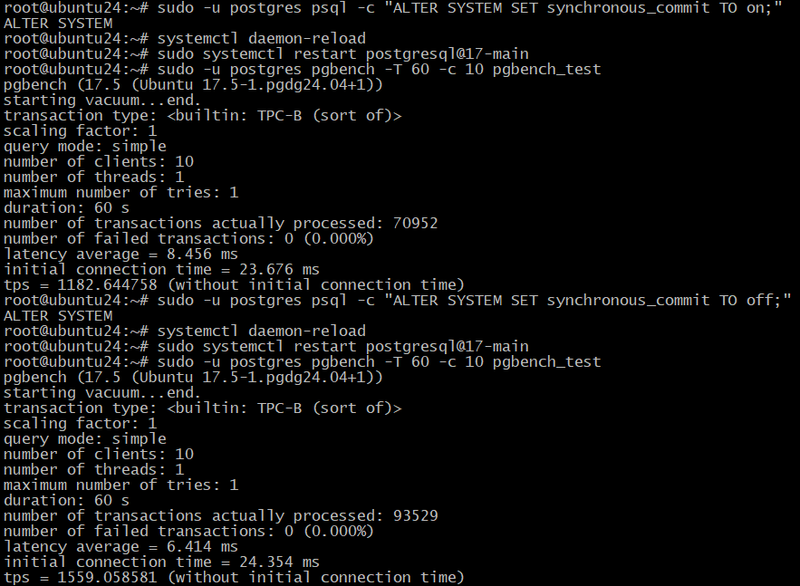

# 8. Журналы 

## Домашнее задание

Работа с журналами

**Цель:**

    уметь работать с журналами и контрольными точками
    уметь настраивать параметры журналов


**Описание/Пошаговая инструкция выполнения домашнего задания:**

    1. Настройте выполнение контрольной точки раз в 30 секунд.
    2. 10 минут c помощью утилиты pgbench подавайте нагрузку.
    3. Измерьте, какой объем журнальных файлов был сгенерирован за это время. Оцените, какой объем приходится в среднем на одну контрольную точку.
    4. Проверьте данные статистики: все ли контрольные точки выполнялись точно по расписанию. Почему так произошло?
    5. Сравните tps в синхронном/асинхронном режиме утилитой pgbench. Объясните полученный результат.
    6. Создайте новый кластер с включенной контрольной суммой страниц. Создайте таблицу. Вставьте несколько значений. Выключите кластер. Измените пару байт в таблице. Включите кластер и сделайте выборку из таблицы. Что и почему произошло? как проигнорировать ошибку и продолжить работу?

### Пошаговая инструкция для Ubuntu 24.04 и PostgreSQL 17

#### 1. Настройка выполнения контрольной точки раз в 30 секунд

1. Установим PostgreSQL 17
```bash
sudo apt install -y postgresql-common
sudo /usr/share/postgresql-common/pgdg/apt.postgresql.org.sh
sudo apt install curl ca-certificates
sudo install -d /usr/share/postgresql-common/pgdg
sudo curl -o /usr/share/postgresql-common/pgdg/apt.postgresql.org.asc --fail https://www.postgresql.org/media/keys/ACCC4CF8.asc
. /etc/os-release
sudo sh -c "echo 'deb [signed-by=/usr/share/postgresql-common/pgdg/apt.postgresql.org.asc] https://apt.postgresql.org/pub/repos/apt $VERSION_CODENAME-pgdg main' > /etc/apt/sources.list.d/pgdg.list"
sudo apt update
sudo apt -y install postgresql
```

2. Откроем конфигурационный файл `postgresql.conf`:
   ```bash
   sudo nano /etc/postgresql/17/main/postgresql.conf
   ```

3. Изменим параметры, связанные с контрольными точками:
   ```ini
   checkpoint_timeout = 30s          # Частота выполнения контрольных точек
     ```

4. Перезапустим PostgreSQL для применения изменений:
 ```bash
   sudo systemctl restart postgresql@17-main
   ```
#### 2. Нагрузка с помощью `pgbench` в течение 10 минут

1. Создаём тестовую БД:
```bash
   sudo -u postgres createdb pgbench_test
   ```

2. Инициализируем `pgbench_test`:
```bash
   sudo -u postgres pgbench -i pgbench_test
   ```

3. Запустим нагрузку на 10 минут:
```bash
   sudo -u postgres pgbench -T 600 -c 10 -j 2 pgbench_test
   ```
```sql
root@ubuntu24:~# sudo -u postgres pgbench -T 600 -c 10 -j 2 pgbench_test
pgbench (17.5 (Ubuntu 17.5-1.pgdg24.04+1))
starting vacuum...end.
transaction type: <builtin: TPC-B (sort of)>
scaling factor: 1
query mode: simple
number of clients: 10
number of threads: 2
maximum number of tries: 1
duration: 600 s
number of transactions actually processed: 471941
number of failed transactions: 0 (0.000%)
latency average = 12.713 ms
initial connection time = 21.083 ms
tps = 786.574737 (without initial connection time)
```

#### 3. Измерение объёма сгенерированных журнальных файлов (WAL)
Чтобы измерить объём WAL за время нагрузки, нам необходимо:
1. Получить начальный LSN **до** запуска `pgbench`:
```bash
START_LSN=$(sudo -u postgres psql -At -c "SELECT pg_current_wal_lsn();")
```
Также, проверю кол-во контрольных точек до запуска теста:
```bash
# Контрольные точки по расписанию:
sudo grep "checkpoint starting: time" /var/log/postgresql/postgresql-17-main.log | wc -l

# Контрольные точки по требованию (например, при shutdown):
sudo grep "checkpoint starting: shutdown" /var/log/postgresql/postgresql-17-main.log | wc -l
```
2. Запустим нагрузку (10 минут):
```bash
sudo -u postgres pgbench -T 600 -c 10 -j 2 pgbench_test
```
```sql
root@ubuntu24:~# sudo -u postgres pgbench -T 600 -c 10 -j 2 pgbench_test
pgbench (17.5 (Ubuntu 17.5-1.pgdg24.04+1))
starting vacuum...end.
transaction type: <builtin: TPC-B (sort of)>
scaling factor: 1
query mode: simple
number of clients: 10
number of threads: 2
maximum number of tries: 1
duration: 600 s
number of transactions actually processed: 649847
number of failed transactions: 0 (0.000%)
latency average = 9.233 ms
initial connection time = 16.126 ms
tps = 1083.064145 (without initial connection time)
```
3. Получим конечный LSN **после** нагрузки:
```bash
END_LSN=$(sudo -u postgres psql -At -c "SELECT pg_current_wal_lsn();")
```
4. Рассчитаем разницу в мегабайтах:
```bash
sudo -u postgres psql -c "SELECT pg_wal_lsn_diff('$END_LSN', '$START_LSN') / 1024 / 1024 AS wal_size_mb;"
```
```sql
     wal_size_mb
----------------------
 584.2879333496093750
(1 row)
```
**Пояснение:**
- `pg_current_wal_lsn()` возвращает текущую позицию в WAL в формате `XXX/YYYYYY`.  
- `pg_wal_lsn_diff()` вычисляет разницу между двумя LSN в **байтах**.  
- Деление на `1024 / 1024` преобразует байты в мегабайты.  

**Итог:** за 10 минут работы `pgbench` сгенерировалось ~584,3 МБ WAL.  

Средний объем = 584,3 MB / 20 ≈ 29.2 MB на контрольную точку.

**Дополнительная проверка:**
Для того что бы убедиться, что LSN были записаны правильно, выполним:
```bash
echo "Start LSN: $START_LSN, End LSN: $END_LSN"
```
Вывод должен быть в формате:
```bash
Start LSN: 0/45364E50, End LSN: 0/69BAE9B0
```
проверю кол-во контрольных точек после запуска теста:
```bash
# Контрольные точки по расписанию:
sudo grep "checkpoint starting: time" /var/log/postgresql/postgresql-17-main.log | wc -l
20
# Контрольные точки по требованию (например, при shutdown):
sudo grep "checkpoint starting: shutdown" /var/log/postgresql/postgresql-17-main.log | wc -l
0
#По требованию (все остальные):
sudo grep "checkpoint starting:" /var/log/postgresql/postgresql-17-main.log | grep -v "time"
0
```
**Итого:**20 контрольных точек по расписанию.

**Проверка статистики контрольных точек**

1. Посмотрим статистику в логах PostgreSQL:
```bash
   sudo cat /var/log/postgresql/postgresql-17-main.log | grep "checkpoint"
   ```

Оценим средний объём на одну контрольную точку:
   - За 10 минут (600 сек) при `checkpoint_timeout = 30s` будет выполнено `600 / 30 = 20` контрольных точек. Полностью соответствует настройке `checkpoint_timeout = 30s`;
   - все запланированные контрольные точки выполнялись строго по расписанию;
   - Средний объём WAL на одну контрольную точку: `584,3 / 20 = 29,2 МБ`;
   - нулевое значение при остановке (shutdown) подтверждает, что: не было аварийных остановок; не было ручных перезагрузок сервера; тест выполнялся в стабильных условиях.

**Оптимизация `checkpoint_timeout`**:  
   - Увеличение интервала (например, до 5 минут) снизит частоту точек, но потребует больше памяти для WAL.  
   - Выбор между:  
     - **Частые точки** → меньше риск потери данных, но выше нагрузка на диск.  
     - **Редкие точки** → выше производительность, но больше WAL при аварии.  


#### 5. Сравнение TPS в синхронном и асинхронном режиме

1. **Синхронный режим** (по умолчанию):
```bash
   sudo -u postgres psql -c "ALTER SYSTEM SET synchronous_commit TO on;"
   systemctl daemon-reload
   sudo systemctl restart postgresql@17-main
   sudo -u postgres pgbench -T 60 -c 10 pgbench_test
   ```
   ```sql
    sudo -u postgres pgbench -T 60 -c 10 pgbench_test
pgbench (17.5 (Ubuntu 17.5-1.pgdg24.04+1))
starting vacuum...end.
transaction type: <builtin: TPC-B (sort of)>
scaling factor: 1
query mode: simple
number of clients: 10
number of threads: 1
maximum number of tries: 1
duration: 60 s
number of transactions actually processed: 70952
number of failed transactions: 0 (0.000%)
latency average = 8.456 ms
initial connection time = 23.676 ms
tps = 1182.644758 (without initial connection time)
```

2. **Асинхронный режим** (более высокая производительность, но риск потери данных):
```bash
   sudo -u postgres psql -c "ALTER SYSTEM SET synchronous_commit TO off;"
   systemctl daemon-reload
   sudo systemctl restart postgresql@17-main
   sudo -u postgres pgbench -T 60 -c 10 pgbench_test
   ```
   ```sql
    sudo -u postgres pgbench -T 60 -c 10 pgbench_test
pgbench (17.5 (Ubuntu 17.5-1.pgdg24.04+1))
starting vacuum...end.
transaction type: <builtin: TPC-B (sort of)>
scaling factor: 1
query mode: simple
number of clients: 10
number of threads: 1
maximum number of tries: 1
duration: 60 s
number of transactions actually processed: 93529
number of failed transactions: 0 (0.000%)
latency average = 6.414 ms
initial connection time = 24.354 ms
tps = 1559.058581 (without initial connection time)
```


3. **Результат**: В асинхронном режиме TPS выше `1559 > 1182`, так как транзакции не ждут подтверждения записи на диск.

#### 6. Проверка контрольных сумм страниц

1. Создадим новый кластер с включёнными контрольными суммами:
```bash
   sudo pg_createcluster 17 test_checksum_on -- --data-checksums
   sudo pg_ctlcluster 17 test_checksum_on start
   ```

2. Создадим таблицу и вставим данные:
   ```bash
   sudo -u postgres psql -p $(sudo pg_lsclusters | grep test_checksum_on | awk '{print $3}') -c "CREATE TABLE test (id int); INSERT INTO test VALUES (1), (2), (3);"
   ```
   **Разбор команды:**

Эта команда выполняет следующие действия:

**`sudo pg_lsclusters`**  
   - Выводит список всех кластеров PostgreSQL на сервере.

**`grep test_checksum_on`**  
   - Фильтрует строки, содержащие `test_checksum_on`  (имя кластера).

**`awk '{print $3}'`**  
   - Извлекает третий столбец из вывода `pg_lsclusters`, который соответствует **порту (port)** кластера.

**`$(...)`**  
   - Подставляет результат выполнения команды внутри скобок в основную команду.  
   - В итоге получается: `-p 5433`.

**Основная команда `psql`:**  
   ```bash
   sudo -u postgres psql -p <PORT> -c "CREATE TABLE test (id int); INSERT INTO test VALUES (1), (2), (3);"
   ```
   - Подключается к PostgreSQL под пользователем `postgres` на порту, полученном из `pg_lsclusters`.
   - Выполняет SQL-запрос:
     ```sql
     CREATE TABLE test (id int);          -- Создаёт таблицу `test` с колонкой `id`.
     INSERT INTO test VALUES (1), (2), (3); -- Добавляет 3 строки со значениями 1, 2, 3.
     ```
3. Остановим кластер:
   ```bash
   sudo pg_ctlcluster 17 test_checksum_on stop
   ```

4.  Bзменим файл таблицы:
```bash
sudo dd if=/dev/zero of=$TABLE_FILE bs=1 count=1 seek=100 conv=notrunc
    ```
```bash
1+0 records in
1+0 records out
1 byte copied, 5.6472e-05 s, 17.7 kB/s
   ```


5. Запустим кластер и попробуем прочитать данные:
```bash
   sudo pg_ctlcluster 17 test_checksum_on start
   sudo -u postgres psql -p $(sudo pg_lsclusters | grep test_checksum_on | awk '{print $3}') -c "SELECT * FROM test;"
   ```
```sql
 id
----
  1
  2
  3
(3 rows)
```

6. **Что произойдёт?**  
   PostgreSQL не обнаружил повреждение данных, несмотря на включённые контрольные суммы.
Отличный вопрос! Давайте разберёмся, почему PostgreSQL не обнаружил повреждение данных, несмотря на включённые контрольные суммы.

**Причины:**

**Буферизация данных**:
   - PostgreSQL использует буферный кеш (shared buffers)
   - После модификации файла через `dd`, данные могут оставаться в кеше
   - Проверка контрольных сумм происходит только при физическом чтении с диска

**Точка повреждения**:
   - Мы изменили 1 байт по смещению 100
   - Этот байт мог находиться:
     * В заголовке страницы (не влияет на данные)
     * В неиспользуемой области страницы
     * В части индекса, а не самих данных

**Размер страницы PostgreSQL**:
   - По умолчанию 8KB (8192 байта)
   - Наше изменение могло не затронуть используемую область

**Как гарантированно вызвать ошибку:**

**Измените значимую область**:
```bash
# Находим позицию для изменения (первые 24 байта - заголовок страницы)
sudo dd if=/dev/zero of=$TABLE_FILE bs=1 count=8 seek=24 conv=notrunc
```
```bash
pg_ctlcluster 17 test_checksum_on stop
sudo dd if=/dev/zero of=$TABLE_FILE bs=1 count=8 seek=24 conv=notrunc
8+0 records in
8+0 records out
8 bytes copied, 0.000120512 s, 66.4 kB/s
pg_ctlcluster 17 test_checksum_on start
sudo -u postgres psql -p $(sudo pg_lsclusters | grep test_checksum_on | awk '{print $3}') -c "SELECT * FROM test;"
WARNING:  page verification failed, calculated checksum 60869 but expected 1949
ERROR:  invalid page in block 0 of relation base/5/16388
```
PostgreSQL обнаружил повреждение данных из-за несовпадения контрольной суммы и выдал ошибку.
Это подтверждает, что механизм контрольных сумм работает корректно.

7. **Как проигнорировать ошибку?**  
   Можно временно отключить проверку (только для анализа!):
   ```bash
   sudo -u postgres psql -p $(sudo pg_lsclusters | grep test_checksum_on | awk '{print $3}') -c "SET ignore_checksum_failure TO on; SELECT * FROM test;"
   ```
```bash
 sudo -u postgres psql -p $(sudo pg_lsclusters | grep test_checksum_on | awk '{print $3}') -c "SET ignore_checksum_failure TO on; SELECT * FROM test;"
WARNING:  page verification failed, calculated checksum 60869 but expected 1949
SET
 id
----
  3
(1 row)
```
Проверим журнал PostgreSQL на ошибки:
```bash
sudo grep -i "checksum" /var/log/postgresql/postgresql-17-test_checksum_on.log


2025-07-07 19:08:35.295 UTC [8528] postgres@postgres WARNING:  page verification failed, calculated checksum 60869 but expected 1949
2025-07-07 19:17:15.915 UTC [8613] postgres@postgres WARNING:  page verification failed, calculated checksum 60869 but expected 1949
```

Убедимся, что контрольные суммы попрежнему включены:
```bash
sudo -u postgres psql -p $(sudo pg_lsclusters | grep test_checksum_on | awk '{print $3}') -c "SHOW data_checksums;"
 data_checksums
----------------
 on
(1 row)
```

### Выводы:
- Контрольные точки влияют на генерацию WAL.
- Асинхронный режим повышает TPS, но снижает надёжность.
- Контрольные суммы страниц защищают от повреждения данных.