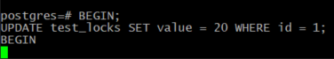
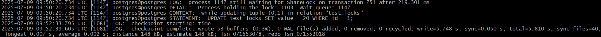
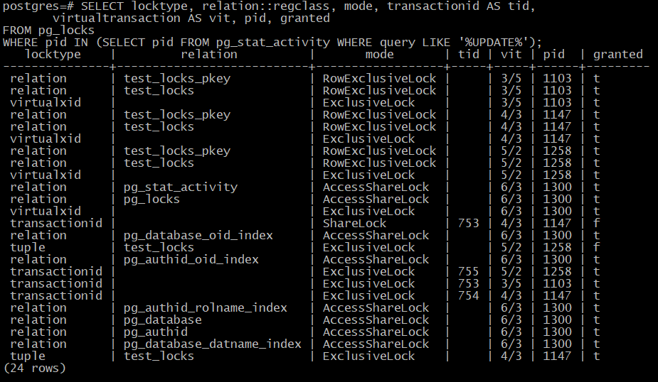
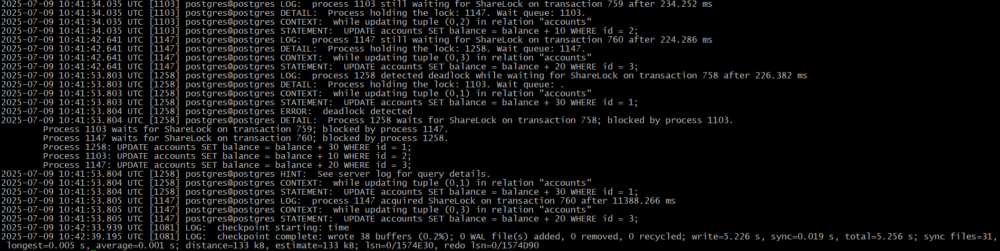
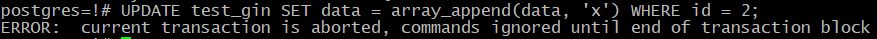
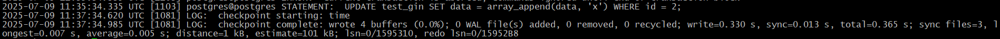

# 9. Блокировки 

## Домашнее задание

Механизм блокировок

**Цель:**

    понимать как работает механизм блокировок объектов и строк.


Описание/Пошаговая инструкция выполнения домашнего задания:

1. Настройте сервер так, чтобы в журнал сообщений сбрасывалась информация о блокировках, удерживаемых более 200 миллисекунд. Воспроизведите ситуацию, при которой в журнале появятся такие сообщения.
2. Смоделируйте ситуацию обновления одной и той же строки тремя командами UPDATE в разных сеансах. Изучите возникшие блокировки в представлении pg_locks и убедитесь, что все они понятны. Пришлите список блокировок и объясните, что значит каждая.
3. Воспроизведите взаимоблокировку трех транзакций. Можно ли разобраться в ситуации постфактум, изучая журнал сообщений?
4. Могут ли две транзакции, выполняющие единственную команду UPDATE одной и той же таблицы (без where), заблокировать друг друга?

5. Задание со звездочкой*
Попробуйте воспроизвести такую ситуацию.

# Понимание механизма блокировок в PostgreSQL

ДЗ выполнялось на Unbuntu 24.04 с PostgreSQL 17.

## 1. Настройте сервер так, чтобы в журнал сообщений сбрасывалась информация о блокировках, удерживаемых более 200 миллисекунд. Воспроизведите ситуацию, при которой в журнале появятся такие сообщения

1. Подключимся к PostgreSQL и изменим параметры:

```bash
sudo -u postgres psql
```
```sql
ALTER SYSTEM SET log_lock_waits = on;
ALTER SYSTEM SET deadlock_timeout = '200ms';
```

2. Перезапустим PostgreSQL для применения изменений:
```bash
sudo systemctl restart postgresql
```

3. Создадим тестовую таблицу:
```sql
CREATE TABLE test_locks (id SERIAL PRIMARY KEY, value INTEGER);
INSERT INTO test_locks (value) VALUES (1), (2), (3);
```
Разбор команд:
`CREATE TABLE test_locks (id SERIAL PRIMARY KEY, value INTEGER);`
   - Создается таблица `test_locks` с двумя колонками:
     - `id` - автоинкрементируемый первичный ключ
     - `value` - целочисленное значение

`INSERT INTO test_locks (value) VALUES (1), (2), (3);`
   - В таблицу добавляются три строки со значениями value: 1, 2 и 3

4. В первом сеансе выполним:
```sql
BEGIN;
UPDATE test_locks SET value = 10 WHERE id = 1;
```
Разбор команд:
   - Начинается транзакция
   - Обновляется строка с id=1, устанавливая value=10
   - Эта транзакция получает эксклюзивную блокировку на строку с id=1

5. Во втором сеансе выполним (это вызовет ожидание блокировки):
```sql
BEGIN;
UPDATE test_locks SET value = 20 WHERE id = 1;
```
Разбор команд:
   - Начинается другая транзакция
   - Пытается обновить ту же строку (id=1)
   - Эта команда будет ждать (заблокирована), пока первая транзакция не завершится (COMMIT или ROLLBACK), потому что первая транзакция уже удерживает эксклюзивную блокировку на этой строке.



6. Проверим журнал PostgreSQL:
```bash
sudo tail -n 50 /var/log/postgresql/postgresql-17-main.log
```
Появилось сообщение о блокировке:
```
LOG:  process 1147 still waiting for ShareLock on transaction 751 after 219.301 ms
```


**Итог**: Это классический пример конфликта блокировок в PostgreSQL, где вторая транзакция должна ждать, пока первая не освободит блокировку на строке.

## 2. Смоделируйте ситуацию обновления одной и той же строки тремя командами UPDATE в разных сеансах. Изучите возникшие блокировки в представлении pg_locks и убедитесь, что все они понятны. Пришлите список блокировок и объясните, что значит каждая

1. В трех разных сеансах выполним последовательно:
```sql
-- Сеанс 1
BEGIN;
UPDATE test_locks SET value = 100 WHERE id = 2;

-- Сеанс 2 (будет ждать)
BEGIN;
UPDATE test_locks SET value = 200 WHERE id = 2;

-- Сеанс 3 (будет ждать)
BEGIN;
UPDATE test_locks SET value = 300 WHERE id = 2;
```

2. Проанализируем результат блокировки:
```sql
SELECT locktype, relation::regclass, mode, transactionid AS tid, 
       virtualtransaction AS vit, pid, granted 
FROM pg_locks 
WHERE pid IN (SELECT pid FROM pg_stat_activity WHERE query LIKE '%UPDATE%');
```

Вывод:
```sql
postgres=# SELECT locktype, relation::regclass, mode, transactionid AS tid,
       virtualtransaction AS vit, pid, granted
FROM pg_locks
WHERE pid IN (SELECT pid FROM pg_stat_activity WHERE query LIKE '%UPDATE%');
   locktype    |         relation          |       mode       | tid | vit | pid  | granted
---------------+---------------------------+------------------+-----+-----+------+---------
 relation      | test_locks_pkey           | RowExclusiveLock |     | 3/5 | 1103 | t
 relation      | test_locks                | RowExclusiveLock |     | 3/5 | 1103 | t
 virtualxid    |                           | ExclusiveLock    |     | 3/5 | 1103 | t
 relation      | test_locks_pkey           | RowExclusiveLock |     | 4/3 | 1147 | t
 relation      | test_locks                | RowExclusiveLock |     | 4/3 | 1147 | t
 virtualxid    |                           | ExclusiveLock    |     | 4/3 | 1147 | t
 relation      | test_locks_pkey           | RowExclusiveLock |     | 5/2 | 1258 | t
 relation      | test_locks                | RowExclusiveLock |     | 5/2 | 1258 | t
 virtualxid    |                           | ExclusiveLock    |     | 5/2 | 1258 | t
 relation      | pg_stat_activity          | AccessShareLock  |     | 6/3 | 1300 | t
 relation      | pg_locks                  | AccessShareLock  |     | 6/3 | 1300 | t
 virtualxid    |                           | ExclusiveLock    |     | 6/3 | 1300 | t
 transactionid |                           | ShareLock        | 753 | 4/3 | 1147 | f
 relation      | pg_database_oid_index     | AccessShareLock  |     | 6/3 | 1300 | t
 tuple         | test_locks                | ExclusiveLock    |     | 5/2 | 1258 | f
 relation      | pg_authid_oid_index       | AccessShareLock  |     | 6/3 | 1300 | t
 transactionid |                           | ExclusiveLock    | 755 | 5/2 | 1258 | t
 transactionid |                           | ExclusiveLock    | 753 | 3/5 | 1103 | t
 transactionid |                           | ExclusiveLock    | 754 | 4/3 | 1147 | t
 relation      | pg_authid_rolname_index   | AccessShareLock  |     | 6/3 | 1300 | t
 relation      | pg_database               | AccessShareLock  |     | 6/3 | 1300 | t
 relation      | pg_authid                 | AccessShareLock  |     | 6/3 | 1300 | t
 relation      | pg_database_datname_index | AccessShareLock  |     | 6/3 | 1300 | t
 tuple         | test_locks                | ExclusiveLock    |     | 4/3 | 1147 | t
(24 rows)
```



3. Анализ блокировок в PostgreSQL

Этот вывод показывает состояние блокировок в системе, когда несколько транзакций пытаются изменить одни и те же данные.

**Основные блокировки транзакций UPDATE**

### Транзакция 1 (pid 1103, vit 3/5):
- **relation|test_locks_pkey|RowExclusiveLock** - блокировка индекса первичного ключа
- **relation|test_locks|RowExclusiveLock** - блокировка таблицы
- **virtualxid||ExclusiveLock** - блокировка виртуального ID транзакции
- **transactionid||ExclusiveLock|753** - блокировка ID транзакции (753)

### Транзакция 2 (pid 1147, vit 4/3):
- Те же блокировки таблицы и индекса (RowExclusiveLock)
- **transactionid||ExclusiveLock|754** - блокировка ID транзакции (754)
- **transactionid||ShareLock|753|f** - ожидание блокировки транзакции 753 (не получено)
- **tuple|test_locks|ExclusiveLock|t** - блокировка версии строки (получена)

### Транзакция 3 (pid 1258, vit 5/2):
- Те же блокировки таблицы и индекса
- **transactionid||ExclusiveLock|755** - блокировка ID транзакции (755)
- **tuple|test_locks|ExclusiveLock|f** - ожидание блокировки версии строки (не получено)

## Блокировки запроса мониторинга (pid 1300, vit 6/3):
Это наш запрос, который читает системные каталоги:
- Блокировки AccessShareLock на pg_stat_activity, pg_locks и другие системные таблицы

**Интерпретация ситуации**

1. **Транзакция 1 (753)** удерживает блокировку на строку в таблице test_locks.
2. **Транзакция 2 (754)** пытается изменить ту же строку:
   - Получила блокировку версии строки (tuple)
   - Ожидает завершения транзакции 753 (ShareLock на 753)
3. **Транзакция 3 (755)** также пытается изменить строку:
   - Ожидает блокировку версии строки (tuple), которую удерживает транзакция 2

**Типы блокировок и их значение**

1. **RowExclusiveLock**: Автоматически берется командой UPDATE на таблицу и ее индексы
2. **ExclusiveLock (transactionid)**: Каждая транзакция удерживает эксклюзивную блокировку своего ID
3. **ShareLock (transactionid)**: Ожидание завершения другой транзакции
4. **ExclusiveLock (tuple)**: Блокировка конкретной версии строки
5. **AccessShareLock**: Блокировка чтения системных таблиц

**Вывод о состоянии системы**

- Имеется цепочка ожидания: транзакция 3 ждет транзакцию 2, которая ждет транзакцию 1
- Если транзакция 1 завершится (COMMIT/ROLLBACK), транзакция 2 сможет продолжить работу
- Затем транзакция 3 сможет получить нужную ей блокировку
- Пока нет циклической зависимости (deadlock не возникнет в текущем состоянии)

Это типичная ситуация последовательной блокировки при конкурентном доступе к одной строке.

## 3. Воспроизведите взаимоблокировку трех транзакций. Можно ли разобраться в ситуации постфактум, изучая журнал сообщений?

1. Создадим тестовые данные:
```sql
CREATE TABLE accounts (id SERIAL PRIMARY KEY, balance INTEGER);
INSERT INTO accounts (balance) VALUES (100), (200), (300);
```
Эти команды создают таблицу `accounts` и заполняют её тестовыми данными. Разберём их по порядку:

`CREATE TABLE accounts (id SERIAL PRIMARY KEY, balance INTEGER);`
Эта команда создаёт новую таблицу с именем `accounts`, которая содержит два столбца:
- **`id SERIAL PRIMARY KEY`**  
  - `SERIAL` — это автоинкрементируемый целочисленный тип (аналог `INTEGER + AUTO_INCREMENT` в других СУБД).  
  - `PRIMARY KEY` означает, что `id` является первичным ключом (уникальным идентификатором строки).  
  - PostgreSQL автоматически создаёт последовательность (`sequence`) для генерации новых значений `id`.  

- **`balance INTEGER`**  
  - Обычное целочисленное поле, которое будет хранить баланс счёта.  

`INSERT INTO accounts (balance) VALUES (100), (200), (300);`
Эта команда добавляет три записи в таблицу `accounts`:
- Вставляются три строки с балансами **100**, **200** и **300** соответственно.  
- Поле `id` заполняется автоматически (1, 2, 3, ...) благодаря `SERIAL`.  

### Итоговая таблица `accounts`:
| id (PK) | balance |
|---------|---------|
| 1       | 100     |
| 2       | 200     |
| 3       | 300     |

**Для чего это может использоваться?**
Такая структура часто применяется в примерах, связанных с:
- **Транзакциями** (например, перевод денег между счетами).  
- **Блокировками** (как в предыдущем примере с `test_locks`).  
- **Обработкой конкурентного доступа** (например, если два пользователя одновременно пытаются изменить баланс).  

Если добавить команды:
```sql
BEGIN;
UPDATE accounts SET balance = balance - 10 WHERE id = 1;
UPDATE accounts SET balance = balance + 10 WHERE id = 2;
COMMIT;
```
— это будет простейшая транзакция перевода денег между счетами.

2. В трех сеансах выполним:
```sql
-- Сеанс 1
BEGIN;
UPDATE accounts SET balance = balance - 10 WHERE id = 1;

-- Сеанс 2
BEGIN;
UPDATE accounts SET balance = balance - 20 WHERE id = 2;

-- Сеанс 3
BEGIN;
UPDATE accounts SET balance = balance - 30 WHERE id = 3;

-- Затем:
-- Сеанс 1
UPDATE accounts SET balance = balance + 10 WHERE id = 2;

-- Сеанс 2
UPDATE accounts SET balance = balance + 20 WHERE id = 3;

-- Сеанс 3
UPDATE accounts SET balance = balance + 30 WHERE id = 1; -- Вызовет deadlock
```

3. Проверим журнал - PostgreSQL зарегистрирует deadlock с подробным объяснением:
```bash
sudo tail -n 50 /var/log/postgresql/postgresql-17-main.log
```
```log
 ERROR:  deadlock detected
2025-07-09 10:41:53.804 UTC [1258] postgres@postgres DETAIL:  Process 1258 waits for ShareLock on transaction 758; blocked by process 1103.
        Process 1103 waits for ShareLock on transaction 759; blocked by process 1147.
        Process 1147 waits for ShareLock on transaction 760; blocked by process 1258.
        Process 1258: UPDATE accounts SET balance = balance + 30 WHERE id = 1;
        Process 1103: UPDATE accounts SET balance = balance + 10 WHERE id = 2;
        Process 1147: UPDATE accounts SET balance = balance + 20 WHERE id = 3;
2025-07-09 10:41:53.804 UTC [1258] postgres@postgres HINT:  See server log for query details.
2025-07-09 10:41:53.804 UTC [1258] postgres@postgres CONTEXT:  while updating tuple (0,1) in relation "accounts"
2025-07-09 10:41:53.804 UTC [1258] postgres@postgres STATEMENT:  UPDATE accounts SET balance = balance + 30 WHERE id = 1;
2025-07-09 10:41:53.805 UTC [1147] postgres@postgres LOG:  process 1147 acquired ShareLock on transaction 760 after 11388.266 ms
2025-07-09 10:41:53.805 UTC [1147] postgres@postgres CONTEXT:  while updating tuple (0,3) in relation "accounts"
2025-07-09 10:41:53.805 UTC [1147] postgres@postgres STATEMENT:  UPDATE accounts SET balance = balance + 20 WHERE id = 3;
2025-07-09 10:42:33.939 UTC [1081] LOG:  checkpoint starting: time
2025-07-09 10:42:39.195 UTC [1081] LOG:  checkpoint complete: wrote 38 buffers (0.2%); 0 WAL file(s) added, 0 removed, 0 recycled; write=5.226 s, sync=0.019 s, total=5.256 s; sync files=31, longest=0.005 s, average=0.001 s; distance=133 kB, estimate=133 kB; lsn=0/1574E30, redo lsn=0/1574D90
```


Да, по журналу можно полностью восстановить последовательность событий и понять причину взаимоблокировки:
**Результат: Deadlock!**
- **Сеанс 1** ждёт **Сеанс 2**.  
- **Сеанс 2** ждёт **Сеанс 3**.  
- **Сеанс 3** ждёт **Сеанс 1**.

PostgreSQL обнаруживает цикл ожидания и аварийно завершает одну из транзакций (с сообщением: `ERROR: deadlock detected`). Остальные транзакции продолжают работу.

4. Анализ журнала PostgreSQL: обнаружение взаимоблокировки (deadlock)

Этот журнал показывает классический случай циклической блокировки (deadlock) между тремя транзакциями. 

**## **Хронология событий**:

### 1. Начало блокировок
**10:41:34.035** - Процесс 1103 ждет завершения транзакции 759:
- Заблокирован процессом 1147
- Ожидает более 234 мс
- Выполняет: `UPDATE accounts SET balance = balance + 10 WHERE id = 2;`

### 2. Развитие блокировки
**10:41:42.641** - Процесс 1147 ждет завершения транзакции 760:
- Заблокирован процессом 1258
- Ожидает более 224 мс
- Выполняет: `UPDATE accounts SET balance = balance + 20 WHERE id = 3;`

### 3. Обнаружение deadlock
**10:41:53.803** - Критический момент:
- Процесс 1258 обнаруживает deadlock при ожидании транзакции 758
- Заблокирован процессом 1103
- Выполняет: `UPDATE accounts SET balance = balance + 30 WHERE id = 1;`

## Циклическая зависимость (deadlock)

Система выявляет замкнутый цикл:
1. **Процесс 1258** ждет **процесс 1103** (транзакция 758)
2. **Процесс 1103** ждет **процесс 1147** (транзакция 759)
3. **Процесс 1147** ждет **процесс 1258** (транзакция 760)

```
1258 → 1103 → 1147 → 1258
```

## Действия PostgreSQL

1. Система выбирает **жертву** (process 1258) и прерывает его транзакцию с ошибкой:
   ```
   ERROR: deadlock detected
   ```

2. После этого:
   - **Процесс 1147** получает запрошенную блокировку (через 11388 мс ожидания)
   - Остальные транзакции могут продолжить работу

**Технические детали**

1. **ShareLock on transaction** - ожидание завершения транзакции
2. **tuple (0,X)** - идентификатор версии строки в таблице:
   - (0,1) - строка с id=1
   - (0,2) - строка с id=2
   - (0,3) - строка с id=3

3. Время ожидания:
   - Все процессы ждали около 200+ мс (deadlock_timeout)

## Восстановление сценария

1. Изначально каждый процесс обновил разные строки:
   - 1103: начало изменять id=2
   - 1147: начало изменять id=3
   - 1258: начало изменять id=1

2. Затем каждый попытался изменить другую строку:
   - 1103: id=2 → id=1
   - 1147: id=3 → id=2
   - 1258: id=1 → id=3

**Выводы:**

1. Журнал полностью отражает цепочку блокировок
2. PostgreSQL корректно идентифицировал deadlock
3. Система выбрала "жертву" (1258) для разрыва цикла
4. После этого остальные транзакции смогли продолжить работу

Это типичный пример взаимоблокировки, возникающей при неправильном порядке доступа к ресурсам в конкурентной среде.

**Как PostgreSQL обрабатывает deadlock?**
1. Через **интервал проверки** (настраивается параметром `deadlock_timeout`, по умолчанию `1s`).  
2. Если deadlock обнаружен, СУБД **выбирает жертву** (обычно транзакцию, которую проще откатить).  
3. Остальные транзакции завершаются успешно после разблокировки.

**Как избежать deadlock?**
1. **Упорядочивать операции** (например, всегда обновлять счета в порядке `id=1, id=2, id=3`).  
2. Использовать `SELECT ... FOR UPDATE` для явной блокировки строк перед изменением.  
3. Уменьшать время транзакций.  

Пример безопасного кода:
```sql
-- Все транзакции обновляют счета в одном порядке (id=1 -> id=2 -> id=3):
BEGIN;
UPDATE accounts SET balance = balance - 10 WHERE id = 1;
UPDATE accounts SET balance = balance + 10 WHERE id = 2;  -- Не будет deadlock!
COMMIT;
```
## 4. Могут ли две транзакции с UPDATE одной таблицы без WHERE заблокировать друг друга?

Да, такое возможно. Хотя обычно UPDATE без WHERE блокирует всю таблицу целиком, в определенных ситуациях может возникнуть взаимоблокировка:

1. При использовании определенных типов индексов (например, GIN)
2. При наличии BEFORE триггеров, которые сами выполняют запросы
3. В случае использования курсоров

## Пример воспроизведения (задание со звездочкой*):

1. Создадим таблицу с GIN индексом:
```sql
CREATE TABLE test_gin (id SERIAL, data TEXT[]);
CREATE INDEX gin_idx ON test_gin USING GIN (data);
INSERT INTO test_gin (data) VALUES ('{"a","b"}'), ('{"c","d"}');
```
**Разбор команд:**
- **`CREATE TABLE`**: Создает таблицу с:
  - `id SERIAL` - автоинкрементный целочисленный первичный ключ
  - `data TEXT[]` - массив текстовых значений
- **`CREATE INDEX`**: Создает GIN-индекс для массива `data` (оптимизирован для операций с массивами)
- **`INSERT`**: Добавляет две строки с массивами `["a","b"]` и `["c","d"]`

2. В двух сеансах выполним:
```sql
-- Сеанс 1
BEGIN;
UPDATE test_gin SET data = array_append(data, 'e'); -- Добавляет 'e' ко всем строкам

-- Сеанс 2
BEGIN;
UPDATE test_gin SET data = array_append(data, 'f'); -- Блокируется
```
Итог:

- Обе транзакции пытаются изменить одни и те же строки
- Первая транзакция блокирует таблицу, вторая ждет

3. Вернёмся в сеанс 1 и выполним:
```sql
UPDATE test_gin SET data = array_append(data, 'x') WHERE id = 2; -- Вызовет deadlock
```


```bash
 sudo tail -n 50 /var/log/postgresql/postgresql-17-main.log
 ```


Теперь возникает циклическая зависимость:
  1. Сеанс 1 ждет завершения сеанса 2 (который заблокирован сеансом 1)
  2. Сеанс 2 ждет завершения сеанса 1

PostgreSQL обнаружил взаимоблокировку и прервал одну из транзакций.

**Выводы по заданию со звездочкой**

1. **Возможность взаимоблокировки**: Да, две транзакции с `UPDATE` одной таблицы без `WHERE` могут заблокировать друг друга, если:
   - Используются GIN-индексы (или другие специальные индексы)
   - Транзакции дополнительно пытаются изменить разные подмножества строк

2. **Механизм deadlock**:
   - Первый `UPDATE` без `WHERE` блокирует все строки таблицы
   - Второй `UPDATE` без `WHERE` встает в очередь на блокировку
   - При попытке первого `UPDATE` конкретной строки (`WHERE id=2`) возникает циклическая зависимость

3. **Особенности GIN-индексов**:
   - GIN-индексы работают с составными значениями (массивами)
   - При обновлении требуют более сложных блокировок
   - Могут создавать неочевидные сценарии блокировок

4. **Рекомендации**:
   - Необходимо избегать `UPDATE` без `WHERE` в конкурентной среде
   - Для массовых обновлений использовать `LOCK TABLE`
   - Разбивать большие транзакции на меньшие
   - Устанавливайть разумный `deadlock_timeout`

PostgreSQL автоматически обнаруживает такие deadlock-и и прерывает одну из транзакций (жертву), что видно в логах сервера.