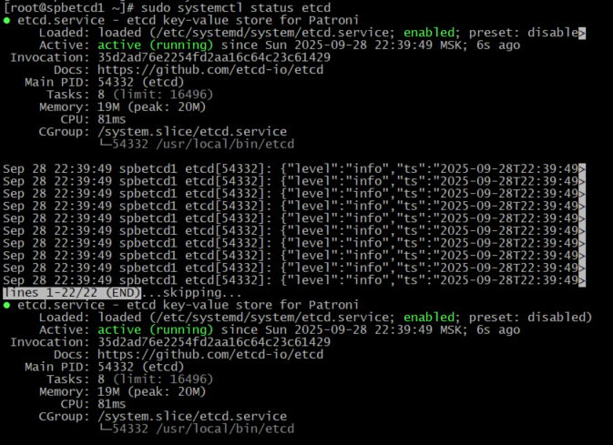
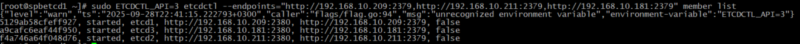
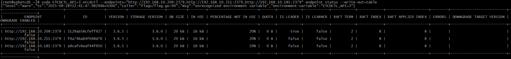
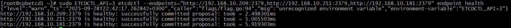
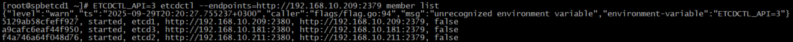
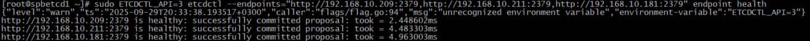
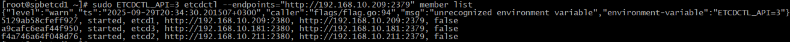

Отличная архитектура! 3 ноды etcd и 2 ноды PostgreSQL — это хорошая схема для отказоустойчивого кластера. Вот конфигурации для каждой ноды etcd.
=============================================================================================
### Часть 2: Установка и настройка etcd

Выполним на всех нодах кластера etcd:

#### 1. Установка из официального репозитория etcd
```bash
#!/bin/bash

# Определяем версию etcd
ETCD_VERSION="3.6.5"

# Скачиваем архив
echo "Скачиваем etcd v${ETCD_VERSION}..."
wget https://github.com/etcd-io/etcd/releases/download/v${ETCD_VERSION}/etcd-v${ETCD_VERSION}-linux-amd64.tar.gz

# Распаковываем
echo "Распаковываем архив..."
tar xvf etcd-v${ETCD_VERSION}-linux-amd64.tar.gz

# Копируем бинарники в системные директории
cd etcd-v${ETCD_VERSION}-linux-amd64
sudo cp etcd etcdctl etcdutl /usr/local/bin/

# Даем права на выполнение
sudo chmod +x /usr/local/bin/etcd /usr/local/bin/etcdctl /usr/local/bin/etcdutl

# Обновляем кэш команд
hash -r

# Проверяем установку
echo "Проверяем установку:"
/usr/local/bin/etcd --version
/usr/local/bin/etcdctl version
/usr/local/bin/etcdutl version

# Очистка
cd ..
rm -rf etcd-v${ETCD_VERSION}-linux-amd64 etcd-v${ETCD_VERSION}-linux-amd64.tar.gz
```

#### 2. Конфигурация etcd
Сначала создадим пользователя и каталоги на всех нодах etcd:

```bash
# Создаем пользователя petcdadms
sudo useradd -r -s /sbin/nologin -d /var/lib/etcd -c "Patroni etcd admin" petcdadms

# Создаем каталоги для данных и конфигураций
sudo mkdir -p /var/lib/etcd
sudo mkdir -p /etc/etcd
sudo mkdir -p /var/log/etcd

# Назначаем владельца
sudo chown -R petcdadms:petcdadms /var/lib/etcd
sudo chown -R petcdadms:petcdadms /etc/etcd
sudo chown -R petcdadms:petcdadms /var/log/etcd
```

## Конфигурационные файлы для каждой ноды etcd

### Для spbetcd1 (192.168.10.209)

Создаем файл `nano /etc/etcd/etcd.conf`:

```ini
# [Member]
ETCD_NAME="etcd1"
ETCD_DATA_DIR="/var/lib/etcd/default.etcd"
ETCD_LISTEN_PEER_URLS="http://192.168.10.209:2380"
ETCD_LISTEN_CLIENT_URLS="http://192.168.10.209:2379,http://127.0.0.1:2379"
ETCD_LOG_LEVEL="info"
ETCD_LOG_FILE="/var/log/etcd/etcd.log"

# [Clustering]
ETCD_INITIAL_ADVERTISE_PEER_URLS="http://192.168.10.209:2380"
ETCD_ADVERTISE_CLIENT_URLS="http://192.168.10.209:2379"
ETCD_INITIAL_CLUSTER="etcd1=http://192.168.10.209:2380,etcd2=http://192.168.10.211:2380,etcd3=http://192.168.10.181:2380"
ETCD_INITIAL_CLUSTER_TOKEN="etcd-cluster-patroni"
ETCD_INITIAL_CLUSTER_STATE="new"
ETCD_STRICT_RECONFIG_CHECK="true"
ETCD_ENABLE_V2="true"
```

### Для spbetcd2 (192.168.10.211)

Создаем файл `/etc/etcd/etcd.conf`:

```ini
# [Member]
ETCD_NAME="etcd2"
ETCD_DATA_DIR="/var/lib/etcd/default.etcd"
ETCD_LISTEN_PEER_URLS="http://192.168.10.211:2380"
ETCD_LISTEN_CLIENT_URLS="http://192.168.10.211:2379,http://127.0.0.1:2379"
ETCD_LOG_LEVEL="info"
ETCD_LOG_FILE="/var/log/etcd/etcd.log"

# [Clustering]
ETCD_INITIAL_ADVERTISE_PEER_URLS="http://192.168.10.211:2380"
ETCD_ADVERTISE_CLIENT_URLS="http://192.168.10.211:2379"
ETCD_INITIAL_CLUSTER="etcd1=http://192.168.10.209:2380,etcd2=http://192.168.10.211:2380,etcd3=http://192.168.10.181:2380"
ETCD_INITIAL_CLUSTER_TOKEN="etcd-cluster-patroni"
ETCD_INITIAL_CLUSTER_STATE="new"
ETCD_STRICT_RECONFIG_CHECK="true"
ETCD_ENABLE_V2="true"
```

### Для spbetcd3 (192.168.10.181)

Создаем файл `/etc/etcd/etcd.conf`:

```ini
# [Member]
ETCD_NAME="etcd3"
ETCD_DATA_DIR="/var/lib/etcd/default.etcd"
ETCD_LISTEN_PEER_URLS="http://192.168.10.181:2380"
ETCD_LISTEN_CLIENT_URLS="http://192.168.10.181:2379,http://127.0.0.1:2379"
ETCD_LOG_LEVEL="info"
ETCD_LOG_FILE="/var/log/etcd/etcd.log"

# [Clustering]
ETCD_INITIAL_ADVERTISE_PEER_URLS="http://192.168.10.181:2380"
ETCD_ADVERTISE_CLIENT_URLS="http://192.168.10.181:2379"
ETCD_INITIAL_CLUSTER="etcd1=http://192.168.10.209:2380,etcd2=http://192.168.10.211:2380,etcd3=http://192.168.10.181:2380"
ETCD_INITIAL_CLUSTER_TOKEN="etcd-cluster-patroni"
ETCD_INITIAL_CLUSTER_STATE="new"
ETCD_STRICT_RECONFIG_CHECK="true"
ETCD_ENABLE_V2="true"
```

## Systemd сервис для etcd

Создаем файл службы `nano /etc/systemd/system/etcd.service` на всех нодах:

```ini
[Unit]
Description=etcd key-value store for Patroni
Documentation=https://github.com/etcd-io/etcd
After=network.target

[Service]
Type=notify
User=petcdadms
Group=petcdadms
EnvironmentFile=-/etc/etcd/etcd.conf
ExecStart=/usr/local/bin/etcd
Restart=always
RestartSec=10s
LimitNOFILE=65536
TimeoutStartSec=120

# Security settings
NoNewPrivileges=yes
PrivateTmp=yes
ProtectHome=yes
ReadWritePaths=/var/lib/etcd /var/log/etcd

# Working directory
WorkingDirectory=/var/lib/etcd

[Install]
WantedBy=multi-user.target
```

## Настройка SELinux для etcd

```bash
# Установка утилит SELinux
sudo dnf install -y policycoreutils-python-utils

# Настройка контекстов для каталогов etcd
sudo semanage fcontext -a -t etcd_var_lib_t "/var/lib/etcd(/.*)?"
sudo semanage fcontext -a -t etcd_log_t "/var/log/etcd(/.*)?"
sudo restorecon -R -v /var/lib/etcd
sudo restorecon -R -v /var/log/etcd

# Разрешение портов для etcd
sudo semanage port -a -t etcd_port_t -p tcp 2379
sudo semanage port -a -t etcd_port_t -p tcp 2380
```

## Запуск и проверка кластера

### 1. Запускаем etcd на всех нодах (последовательно):

```bash
# На каждой ноде
sudo systemctl daemon-reload
sudo systemctl enable etcd
sudo systemctl start etcd

# Проверяем статус
sudo systemctl status etcd
```


### 2. Проверяем работу кластера:

```bash
# Проверяем список членов кластера
sudo ETCDCTL_API=3 etcdctl --endpoints="http://192.168.10.209:2379,http://192.168.10.211:2379,http://192.168.10.181:2379" member list



# Проверяем состояние кластера
sudo ETCDCTL_API=3 etcdctl --endpoints="http://192.168.10.209:2379,http://192.168.10.211:2379,http://192.168.10.181:2379" endpoint status --write-out=table



# Проверяем здоровье кластера
sudo ETCDCTL_API=3 etcdctl --endpoints="http://192.168.10.209:2379,http://192.168.10.211:2379,http://192.168.10.181:2379" endpoint health
```


### 3. Полезные команды для мониторинга:

```bash
# Просмотр логов
sudo journalctl -u etcd -f

# Проверка слушающих портов
sudo netstat -tlnp | grep etcd

# Проверка процессов
ps aux | grep etcd
```

## Конфигурация Patroni для работы с etcd кластером

В конфигурации Patroni на нодах spbsql1 и spbsql2 укажите:

```yaml
etcd:
  hosts: 192.168.10.209:2379,192.168.10.211:2379,192.168.10.181:2379
```

## Скрипт для автоматической настройки

Создайте скрипт `setup_etcd.sh` для каждой ноды (поменяйте IP и NAME соответственно):

```bash
#!/bin/bash

ETCD_NAME="etcd1"  # Поменять для каждой ноды: etcd2, etcd3
ETCD_IP="192.168.10.209"  # Поменять для каждой ноды

# Создаем пользователя
sudo useradd -r -s /sbin/nologin -d /var/lib/etcd -c "Patroni etcd admin" petcdadms

# Создаем каталоги
sudo mkdir -p /var/lib/etcd /etc/etcd /var/log/etcd
sudo chown -R petcdadms:petcdadms /var/lib/etcd /etc/etcd /var/log/etcd

# Создаем конфигурационный файл
sudo tee /etc/etcd/etcd.conf > /dev/null << EOF
# [Member]
ETCD_NAME="${ETCD_NAME}"
ETCD_DATA_DIR="/var/lib/etcd/default.etcd"
ETCD_LISTEN_PEER_URLS="http://${ETCD_IP}:2380"
ETCD_LISTEN_CLIENT_URLS="http://${ETCD_IP}:2379,http://127.0.0.1:2379"
ETCD_LOG_LEVEL="info"
ETCD_LOG_FILE="/var/log/etcd/etcd.log"

# [Clustering]
ETCD_INITIAL_ADVERTISE_PEER_URLS="http://${ETCD_IP}:2380"
ETCD_ADVERTISE_CLIENT_URLS="http://${ETCD_IP}:2379"
ETCD_INITIAL_CLUSTER="etcd1=http://192.168.10.209:2380,etcd2=http://192.168.10.211:2380,etcd3=http://192.168.10.176:2380"
ETCD_INITIAL_CLUSTER_TOKEN="etcd-cluster-patroni"
ETCD_INITIAL_CLUSTER_STATE="new"
ETCD_STRICT_RECONFIG_CHECK="true"
ETCD_ENABLE_V2="true"
EOF

# Создаем systemd service
sudo tee /etc/systemd/system/etcd.service > /dev/null << EOF
[Unit]
Description=etcd key-value store for Patroni
Documentation=https://github.com/etcd-io/etcd
After=network.target

[Service]
Type=notify
User=petcdadms
Group=petcdadms
EnvironmentFile=-/etc/etcd/etcd.conf
ExecStart=/usr/local/bin/etcd
Restart=always
RestartSec=10s
LimitNOFILE=65536
TimeoutStartSec=120
NoNewPrivileges=yes
PrivateTmp=yes
ProtectHome=yes
ReadWritePaths=/var/lib/etcd /var/log/etcd
WorkingDirectory=/var/lib/etcd

[Install]
WantedBy=multi-user.target
EOF

echo "Configuration for ${ETCD_NAME} with user petcdadms completed!"
```

После настройки всех трех нод у вас будет отказоустойчивый кластер etcd, готовый к работе с Patroni.
=============================================================================================
## Базовая структура каталогов и пользователь

Сначала создадим пользователя и каталоги на всех нодах etcd:

```bash
# Создаем пользователя petcdadms
sudo useradd -r -s /sbin/nologin -d /var/lib/etcd -c "Patroni etcd admin" petcdadms

# Создаем каталоги для данных и конфигураций
sudo mkdir -p /var/lib/etcd
sudo mkdir -p /etc/etcd
sudo mkdir -p /var/log/etcd

# Назначаем владельца
sudo chown -R petcdadms:petcdadms /var/lib/etcd
sudo chown -R petcdadms:petcdadms /etc/etcd
sudo chown -R petcdadms:petcdadms /var/log/etcd
```

## Конфигурационные файлы для каждой ноды etcd

### Для spbetcd1 (192.168.10.209)

Создаем файл `nano /etc/etcd/etcd.conf`:

```ini
# [Member]
ETCD_NAME="etcd1"
ETCD_DATA_DIR="/var/lib/etcd/default.etcd"
ETCD_LISTEN_PEER_URLS="http://192.168.10.209:2380"
ETCD_LISTEN_CLIENT_URLS="http://192.168.10.209:2379,http://127.0.0.1:2379"
ETCD_LOG_LEVEL="info"
ETCD_LOG_FILE="/var/log/etcd/etcd.log"

# [Clustering]
ETCD_INITIAL_ADVERTISE_PEER_URLS="http://192.168.10.209:2380"
ETCD_ADVERTISE_CLIENT_URLS="http://192.168.10.209:2379"
ETCD_INITIAL_CLUSTER="etcd1=http://192.168.10.209:2380,etcd2=http://192.168.10.211:2380,etcd3=http://192.168.10.181:2380"
ETCD_INITIAL_CLUSTER_TOKEN="etcd-cluster-patroni"
ETCD_INITIAL_CLUSTER_STATE="new"
ETCD_STRICT_RECONFIG_CHECK="true"
ETCD_ENABLE_V2="true"
```

### Для spbetcd2 (192.168.10.211)

Создаем файл `/etc/etcd/etcd.conf`:

```ini
# [Member]
ETCD_NAME="etcd2"
ETCD_DATA_DIR="/var/lib/etcd/default.etcd"
ETCD_LISTEN_PEER_URLS="http://192.168.10.211:2380"
ETCD_LISTEN_CLIENT_URLS="http://192.168.10.211:2379,http://127.0.0.1:2379"
ETCD_LOG_LEVEL="info"
ETCD_LOG_FILE="/var/log/etcd/etcd.log"

# [Clustering]
ETCD_INITIAL_ADVERTISE_PEER_URLS="http://192.168.10.211:2380"
ETCD_ADVERTISE_CLIENT_URLS="http://192.168.10.211:2379"
ETCD_INITIAL_CLUSTER="etcd1=http://192.168.10.209:2380,etcd2=http://192.168.10.211:2380,etcd3=http://192.168.10.181:2380"
ETCD_INITIAL_CLUSTER_TOKEN="etcd-cluster-patroni"
ETCD_INITIAL_CLUSTER_STATE="new"
ETCD_STRICT_RECONFIG_CHECK="true"
ETCD_ENABLE_V2="true"
```

### Для spbetcd3 (192.168.10.181)

Создаем файл `/etc/etcd/etcd.conf`:

```ini
# [Member]
ETCD_NAME="etcd3"
ETCD_DATA_DIR="/var/lib/etcd/default.etcd"
ETCD_LISTEN_PEER_URLS="http://192.168.10.181:2380"
ETCD_LISTEN_CLIENT_URLS="http://192.168.10.181:2379,http://127.0.0.1:2379"
ETCD_LOG_LEVEL="info"
ETCD_LOG_FILE="/var/log/etcd/etcd.log"

# [Clustering]
ETCD_INITIAL_ADVERTISE_PEER_URLS="http://192.168.10.181:2380"
ETCD_ADVERTISE_CLIENT_URLS="http://192.168.10.181:2379"
ETCD_INITIAL_CLUSTER="etcd1=http://192.168.10.209:2380,etcd2=http://192.168.10.211:2380,etcd3=http://192.168.10.181:2380"
ETCD_INITIAL_CLUSTER_TOKEN="etcd-cluster-patroni"
ETCD_INITIAL_CLUSTER_STATE="new"
ETCD_STRICT_RECONFIG_CHECK="true"
ETCD_ENABLE_V2="true"
```

## Systemd сервис для etcd

Создаем файл службы `nano /etc/systemd/system/etcd.service` на всех нодах:

```ini
[Unit]
Description=etcd key-value store for Patroni
Documentation=https://github.com/etcd-io/etcd
After=network.target

[Service]
Type=notify
User=petcdadms
Group=petcdadms
EnvironmentFile=-/etc/etcd/etcd.conf
ExecStart=/usr/local/bin/etcd
Restart=always
RestartSec=10s
LimitNOFILE=65536
TimeoutStartSec=120

# Security settings
NoNewPrivileges=yes
PrivateTmp=yes
ProtectHome=yes
ReadWritePaths=/var/lib/etcd /var/log/etcd

# Working directory
WorkingDirectory=/var/lib/etcd

[Install]
WantedBy=multi-user.target
```

## Настройка SELinux для etcd

```bash
# Установка утилит SELinux
sudo dnf install -y policycoreutils-python-utils

# Настройка контекстов для каталогов etcd
sudo semanage fcontext -a -t etcd_var_lib_t "/var/lib/etcd(/.*)?"
sudo semanage fcontext -a -t etcd_log_t "/var/log/etcd(/.*)?"
sudo restorecon -R -v /var/lib/etcd
sudo restorecon -R -v /var/log/etcd

# Разрешение портов для etcd
sudo semanage port -a -t etcd_port_t -p tcp 2379
sudo semanage port -a -t etcd_port_t -p tcp 2380
```

## Запуск и проверка кластера

### 1. Запускаем etcd на всех нодах (последовательно):

```bash
# На каждой ноде
sudo systemctl daemon-reload
sudo systemctl enable etcd
sudo systemctl start etcd

# Проверяем статус
sudo systemctl status etcd
```


### 2. Проверяем работу кластера:

```bash
# Проверяем список членов кластера
sudo ETCDCTL_API=3 etcdctl --endpoints="http://192.168.10.209:2379,http://192.168.10.211:2379,http://192.168.10.181:2379" member list


# Проверяем состояние кластера
sudo ETCDCTL_API=3 etcdctl --endpoints="http://192.168.10.209:2379,http://192.168.10.211:2379,http://192.168.10.181:2379" endpoint status --write-out=table


# Проверяем здоровье кластера
sudo ETCDCTL_API=3 etcdctl --endpoints="http://192.168.10.209:2379,http://192.168.10.211:2379,http://192.168.10.181:2379" endpoint health
```


### 3. Полезные команды для мониторинга:

```bash
# Просмотр логов
sudo journalctl -u etcd -f

# Проверка слушающих портов
sudo netstat -tlnp | grep etcd

# Проверка процессов
ps aux | grep etcd
```

## Скрипт для автоматической настройки

Создайте скрипт `setup_etcd.sh` для каждой ноды (необходимо изменить IP и NAME соответственно):

```bash
#!/bin/bash

ETCD_NAME="etcd1"  # Поменять для каждой ноды: etcd2, etcd3
ETCD_IP="192.168.10.209"  # Поменять для каждой ноды

# Создаем пользователя
sudo useradd -r -s /sbin/nologin -d /var/lib/etcd -c "Patroni etcd admin" petcdadms

# Создаем каталоги
sudo mkdir -p /var/lib/etcd /etc/etcd /var/log/etcd
sudo chown -R petcdadms:petcdadms /var/lib/etcd /etc/etcd /var/log/etcd

# Создаем конфигурационный файл
sudo tee /etc/etcd/etcd.conf > /dev/null << EOF
# [Member]
ETCD_NAME="${ETCD_NAME}"
ETCD_DATA_DIR="/var/lib/etcd/default.etcd"
ETCD_LISTEN_PEER_URLS="http://${ETCD_IP}:2380"
ETCD_LISTEN_CLIENT_URLS="http://${ETCD_IP}:2379,http://127.0.0.1:2379"
ETCD_LOG_LEVEL="info"
ETCD_LOG_FILE="/var/log/etcd/etcd.log"

# [Clustering]
ETCD_INITIAL_ADVERTISE_PEER_URLS="http://${ETCD_IP}:2380"
ETCD_ADVERTISE_CLIENT_URLS="http://${ETCD_IP}:2379"
ETCD_INITIAL_CLUSTER="etcd1=http://192.168.10.209:2380,etcd2=http://192.168.10.211:2380,etcd3=http://192.168.10.176:2380"
ETCD_INITIAL_CLUSTER_TOKEN="etcd-cluster-patroni"
ETCD_INITIAL_CLUSTER_STATE="new"
ETCD_STRICT_RECONFIG_CHECK="true"
ETCD_ENABLE_V2="true"
EOF

# Создаем systemd service
sudo tee /etc/systemd/system/etcd.service > /dev/null << EOF
[Unit]
Description=etcd key-value store for Patroni
Documentation=https://github.com/etcd-io/etcd
After=network.target

[Service]
Type=notify
User=petcdadms
Group=petcdadms
EnvironmentFile=-/etc/etcd/etcd.conf
ExecStart=/usr/local/bin/etcd
Restart=always
RestartSec=10s
LimitNOFILE=65536
TimeoutStartSec=120
NoNewPrivileges=yes
PrivateTmp=yes
ProtectHome=yes
ReadWritePaths=/var/lib/etcd /var/log/etcd
WorkingDirectory=/var/lib/etcd

[Install]
WantedBy=multi-user.target
EOF

echo "Configuration for ${ETCD_NAME} with user petcdadms completed!"
```

После настройки всех трех нод у вас будет отказоустойчивый кластер etcd, готовый к работе с Patroni.



Проверим доступность etcd кластера:

```bash
# Проверим здоровье etcd кластера
sudo ETCDCTL_API=3 etcdctl --endpoints="http://192.168.10.209:2379,http://192.168.10.211:2379,http://192.168.10.181:2379" endpoint health
```


```bash
# Проверим members
sudo ETCDCTL_API=3 etcdctl --endpoints="http://192.168.10.209:2379" member list
```

