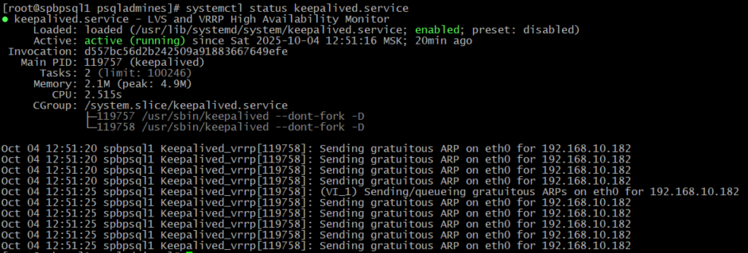

# Не рабочая инструкция

==================================================================

**1С не умеет автоматически переключаться между узлами Patroni.** 
П.э. для тестовой среды я выбрал простое решение: виртуальный IP - `keepalived`

**Настройка с keepalived:**

```bash
# Установил keepalived на оба узла spbpsql
sudo dnf install -y keepalived

# На spbpsql1 создал конфиг
sudo tee /etc/keepalived/keepalived.conf << 'EOF'
vrrp_script chk_patroni {
    script "/usr/bin/curl -s http://192.168.10.204:8008/patroni | grep -q '\"role\": \"primary\"'"
    interval 2
    weight 2
    fall 2
    rise 2
}

vrrp_instance VI_1 {
    state BACKUP
    interface eth0
    virtual_router_id 51
    priority 100
    advert_int 1
    authentication {
        auth_type PASS
        auth_pass Sdf5Fsd9
    }
    virtual_ipaddress {
        192.168.10.182/24
    }
    track_script {
        chk_patroni
    }
    nopreempt
}
EOF

# На spbpsql2 (приоритет ниже)
sudo tee /etc/keepalived/keepalived.conf << 'EOF'
vrrp_script chk_patroni {
    script "/usr/bin/curl -s http://192.168.10.207:8008/patroni | grep -q '\"role\": \"primary\"'"
    interval 2
    weight 2
    fall 2
    rise 2
}

vrrp_instance VI_1 {
    state BACKUP
    interface eth0
    virtual_router_id 51
    priority 90
    advert_int 1
    authentication {
        auth_type PASS
        auth_pass Sdf5Fsd9
    }
    virtual_ipaddress {
        192.168.10.182/24
    }
    track_script {
        chk_patroni
    }
    nopreempt
}
EOF

Установка правильных прав

sudo chmod 600 /etc/keepalived/keepalived.conf
sudo chown psqladmines:psqladmines /etc/keepalived/keepalived.conf

systemctl restart keepalived

# Запустим keepalived
sudo systemctl enable keepalived --now
systemctl status keepalived

# Проверка логов
sudo journalctl -u keepalived -f
```


### В 1С будем указывать виртуальный IP:
- **Сервер БД:** `192.168.10.182`
- **Порт:** `5432`

### Проверка работающих служб:!!!!!!!!!!!!!!!!!
```bash
# Посмотреть все службы
sudo systemctl list-unit-files --type=service | grep enabled

# Посмотреть потребление ресурсов
sudo systemd-cgtop
```

## Полная архитектура решения
```
1С -> VIP (192.168.10.182) -> текущий мастер (spbpsql1 или spbpsql2)
                ↗
   keepalived + Patroni
```

### Конфиг Patroni с поддержкой VIP

Необходимо будет добавить в `/etc/patroni.yml` на обоих узлах:

```yaml
postgresql:
  # ... существующие настройки ...
  
  # Настройки для виртуального IP
  parameters:
    listen_addresses: '192.168.10.204,192.168.10.182'  # на spbpsql1
    # или
    listen_addresses: '192.168.10.207,192.168.10.182'  # на spbpsql2
```

**VIP - это простое и надежное решение.** 1С будет подключаться к одному IP, а keepalived + Patroni обеспечат автоматическое переключение при отказах.