# Проектная работа
# Развертывание отказоустойчивого кластера PostgreSQL 17 на базе Patroni для платформы 1С:Предприятие и миграция данных с Microsoft SQL Server 2007/2019

Задачи проектной работы:
Установить и настроить  отказоустойчивый кластер Patroni с PostgreSQL 17 на AlmaLinux 10 (4 виртуальные машины. AlmaLinux 10 установить и настроить, настроить firewall, защиты от взлома,ddos, bruetforce и т.д.,).;
На PostgreSQL 17 настроить конфигурацию, согласно рекомендациям от 1С. 
На PostgreSQL 17 необходимо мигрировать базы 1С с MS SQL 2019 (1С комплексная автоматизация, 1С БП) и MS SQL 2007 (1С Зарплата и управление).

Развертывание отказоустойчивого кластера PostgreSQL 17 на базе Patroni для платформы 1С:Предприятие и миграция данных с Microsoft SQL Server 2007/2019

**Глава 1: Аналитическая часть**
*   Введение: Актуальность переноса 1С с проприетарных СУБД на открытые решения. Проблемы устаревших версий (MS SQL 2007).
*   Обзор технологий: Сравнение PostgreSQL 17 и MS SQL Server. Преимущества и недостатки.
*   Обзор решений для кластеризации: Почему выбран Patroni+ETCD (в сравнении с другими инструментами, например, собственной кластеризацией PostgreSQL).
*   Анализ требований: Аппаратные требования, требования к ПО, требования к безопасности и отказоустойчивости.

**Глава 2: Проектная часть**
*   Проект инфраструктуры: Схема сети.
*   Выбор и обоснование средств защиты: Настройка `firewalld`, `fail2ban` для защиты от bruteforce, базовые меры hardening для AlmaLinux 10 (отключение ненужных служб, настройка политики паролей, `ssh` только по ключу).
*   Проект конфигурации PostgreSQL: Параметры, которые необходимо изменить согласно рекомендациям 1С (``shared_buffers``, ``work_mem``, ``effective_cache_size``, ``max_connections`` и т.д.).
*   План миграции: Выбор инструментов миграции (например, `pgloader`, ora2pg или штатные средства 1С - я выбрал этот метод, простота ,надёжность и т.д.). Этапы переноса данных, тестирование целостности.

**Глава 3: Практическая реализация**
*   Установка и базовая настройка AlmaLinux 10 на всех виртуальных машинах.
*   Настройка безопасности: Пошаговая настройка firewall и защитных механизмов.
*   Установка и настройка PostgreSQL 17.
*   Развертывание кластера Patroni: Установка и настройка Patroni, DCS (etcd), настройка репликации.
*   Миграция баз данных: Пошаговое миграция базы данных на примере 1С: Предприятия ЗУП 
*   Тестирование:
    *   **Тест отказоустойчивости:** Ручное переключение лидера (`patronictl switchover`), симуляция сбоя ноды.
   

**Заключение**
*   Итоги работы: Что было достигнуто.
*   Выводы: С какими сложностями столкнулись, как их решили.
*   Экономический эффект (если уместно): Сокращение лицензионных затрат на MSSQL.
*   Перспективы развития: Возможно, использование бэкапов на основе PGBackRest, интеграция с системами мониторинга (Prometheus/Grafana), настройка более сложной схемы балансировки запросов (HAProxy).

-----------------------------------------------------------------------------

# **Глава 1: Аналитическая часть**

## **1.1. Введение: Актуальность переноса 1С с проприетарных СУБД на открытые решения**

В современной бизнес-среде информационные системы, построенные на платформе «1С:Предприятие», являются критически важными для операционной деятельности большинства российских компаний. Исторически сложилось, что в качестве серверов баз данных для этих систем часто применялись проприетарные решения, в частности, Microsoft SQL Server. Однако в последние годы наблюдается устойчивая тенденция миграции на открытые системы, такие как PostgreSQL.

**Актуальность перехода обусловлена следующими ключевыми факторами:**

1.  **Снижение совокупной стоимости владения (TCO):** Лицензии на Microsoft SQL Server, особенно для масштабируемых систем с большим количеством ядер, представляют собой значительные капитальные затраты. PostgreSQL распространяется свободно по лицензии PostgreSQL License, что позволяет существенно сократить расходы на лицензионное ПО.
2.  **Технологическая независимость и суверенитет:** Использование открытого ПО снижает зависимость от вендора и геополитических рисков, что особенно актуально в текущих условиях. Компания получает полный контроль над своей инфраструктурой данных.
3.  **Современность и производительность:** Использование устаревших версий СУБД, таких как **Microsoft SQL Server 2007**, сопряжено с серьезными проблемами:
    *   **Отсутствие поддержки:** Производитель прекратил расширенную поддержку данной версии, что означает отсутствие обновлений безопасности и исправлений критических ошибок. Это создает неприемлемые киберриски.
    *   **Низкая производительность:** Устаревшие оптимизаторы запросов и механизмы хранения данных не позволяют эффективно работать с современными объемами информации.
    *   **Несовместимость:** Старые версии MS SQL могут не поддерживаться новыми версиями ОС и платформы 1С, блокируя технологическое развитие.
4.  **Оптимизация для 1С:** Начиная с версий 1С:Предприятие 8.3, разработчики платформы уделяют особое внимание оптимизации и тестированию работы с PostgreSQL. В последних версиях 1С реализованы уникальные функции, такие как эффективные блокировки на уровне строк, которые максимально используют архитектуру PostgreSQL.

Таким образом, миграция с MS SQL Server 2007/2019 на отказоустойчивый кластер PostgreSQL 17 является не просто техническим обновлением, а стратегической мерой, направленной на повышение надежности, безопасности и экономической эффективности ИТ-инфраструктуры.

## **1.2. Обзор технологий: Сравнение PostgreSQL 17 и MS SQL Server**

Для принятия обоснованного решения о миграции проведем сравнительный анализ двух систем управления базами данных.

| Критерий | Microsoft SQL Server | PostgreSQL 17 | Выводы для проекта 1С |
| :--- | :--- | :--- | :--- |
| **Лицензирование и стоимость** | Проприетарная лицензия. Высокая стоимость лицензий (на ядра/пользователей). Требуются лицензии для пассивных реплик в кластере. | Открытая лицензия (PostgreSQL License). Бесплатна для использования, включая коммерческое. | **Преимущество PostgreSQL.** Существенное снижение затрат. Возможность развертывания полного отказоустойчивого кластера без дополнительных лицензионных издержек. |
| **Производительность** | Высокая, особенно в OLTP-нагрузках. Хорошо интегрирован с ОС Windows. | Очень высокая. Последние версии (14-17) показывают сравнимую или превосходящую производительность в тестах, близких к нагрузке 1С. Улучшенный планировщик запросов, параллелизм. | **Паритет с преимуществом для PostgreSQL 17.** Для типичной нагрузки 1С (смесь OLTP и отчетности) PostgreSQL 17 демонстрирует отличные результаты. |
| **Надежность и устойчивость** | Высокая. Проверенная система журналирования WAL (Write-Ahead Logging). | Очень высокая. Также использует надежное WAL-журналирование. Система контроля транзакций (MVCC) обеспечивает целостность данных. | **Паритет.** Обе СУБД обеспечивают необходимый для финансовых систем уровень надежности. |
| **Безопасность** | Богатый встроенный функционал: TDE, Row-Level Security, Dynamic Data Masking. | Шифрование данных на диске, SSL-соединения, Менеджер внешних ключей (FDW), SEPostgreSQL (на основе SELinux). Развитая система ролей и привилегий. | **Преимущество MS SQL Server** в части встроенных enterprise-функций. Однако для большинства конфигураций 1С стандартных возможностей безопасности PostgreSQL достаточно. |
| **Масштабируемость** | Горизонтальное масштабирование (шардирование) требует сложных решений. Репликация Read-Scale Availability Groups. | Репликация на чтение настраивается проще. Активно развиваются проекты шардирования (Citus, Postgres-XL). Логическая репликация очень гибкая. | **Преимущество PostgreSQL** для решений с высокой нагрузкой на чтение. Более гибкие и менее затратные возможности масштабирования. |
| **Экосистема и сообщество** | Поддержка корпорацией Microsoft. Централизованная документация. | Огромное сообщество, тысячи сторонних расширений (например, `pg_partman` для партиционирования, `pg_stat_statements` для анализа). | **Паритет.** MS SQL имеет сильную корпоративную поддержку, а PostgreSQL — гибкость и богатую экосистему. |

**Итог:** Для проекта развертывания для 1С:Предприятие PostgreSQL 17 предлагает оптимальное соотношение стоимости, производительности и гибкости, полностью покрывая функциональные требования платформы.

## **1.3. Обзор решений для кластеризации: Выбор Patroni + etcd**

Обеспечение отказоустойчивости является критическим требованием для систем 1С. Простая репликация "мастер-реплика" не решает проблему автоматического перехода при сбое мастера. Рассмотрим популярные решения для организации High Availability (HA) кластера PostgreSQL.

*   **Встроенная репликация PostgreSQL:** Обеспечивает физическую репликацию на уровне WAL, но не включает в себя механизм мониторинга и автоматического переключения (failover). Требует ручного управления, что неприемлемо для промышленной эксплуатации.
*   **Pgpool-II:** Прокси-сервер, предоставляющий балансировку нагрузки, соединение пулингов и механизм failover. Однако его логика failover может быть сложной в настройке, а сам он может стать единой точкой отказа, требуя собственной кластеризации.
*   **Собственные решения на основе скриптов:** Высокая гибкость, но сложность сопровождения, тестирования и высокий риск ошибок. Не являются стандартным решением.
*   **Patroni:** Фреймворк для управления репликацией и автоматического переключения. Он не является прокси, а работает как демон на каждом узле кластера.

**Почему выбран Patroni в связке с etcd?**

1.  **Отсутствие единой точки отказа:** Patroni использует распределенное хранилище (Distributed Key-Value Store), такое как **etcd**, для хранения состояния кластера и выбора лидера. Сам etcd развертывается в виде кластера (обычно 3 или 5 узлов), что делает всю систему устойчивой к сбоям.
2.  **Надежный механизм выбора лидера (Leader Election):** etcd предоставляет встроенный, проверенный временем консенсусный алгоритм (Raft), который гарантирует, что в кластере в любой момент времени будет выбран только один мастер.
3.  **Автоматический и контролируемый Failover/Switchover:** Patroni автоматически обнаруживает сбой мастера и назначает новую реплику-лидер в течение секунд. Также позволяет выполнять плановые переключения (switchover) одной командой.
4.  **Простота управления:** Patroni предоставляет удобный REST API и команды CLI для мониторинга состояния кластера, управления репликацией и переключениями.
5.  **Интеграция с стандартной утилитой `pg_basebackup`:** Обеспечивает простое и надежное создание новых реплик.

**Вывод:** Связка **Patroni + etcd** представляет собой наиболее отказоустойчивую, надежную и легко управляемую архитектуру для построения HA-кластера PostgreSQL, что идеально соответствует требованиям к инфраструктуре для 1С:Предприятие.

## **1.4. Анализ требований**

На основе анализа бизнес-процессов и технических характеристик исходной системы сформулирую требования к новой инфраструктуре (на примере базы 1с зарплата и управление).

**Аппаратные требования:**

*   **Серверы БД (не менее 3 узлов):**
    *   **CPU:** Многоядерные процессоры (рекомендуется 4-6 ядер на узел). 1С чувствительна к частоте CPU, приоритет — более высокая тактовая частота.
    *   **RAM:** Не менее 16 ГБ ОЗУ. Размер должен позволять хранить в памяти "рабочий набор" данных и индексов.
    *   **Дисковая подсистема:** Высокопроизводительные SSD (NVMe предпочтительно). RAID 1 для обеспечения отказоустойчивости и производительности. Отдельные разделы для данных, WAL-логолов и журналов транзакций.
    *   **Сеть:** Выделенные сетевые интерфейсы (не менее 1 GbE) для синхронной репликации и обмена данными внутри кластера Patroni/etcd.
*   **Серверы etcd (3 узла):**
    *   Могут быть развернуты на менее мощных серверах или виртуальных машинах (2 ядра, 3-4 ГБ ОЗУ, SSD-диски).
    *   Критически важна низкая задержка сети между узлами.

**Требования к программному обеспечению:**

*   **Операционная система:**  AlmaLinux 10 (как стабильный, хорошо поддерживаемый дистрибутив).
*   **Система управления базами данных:** PostgreSQLPro 17 Standard (готовое оптимизированное решение для работы с серверами 1С).
*   **ПО для кластеризации:** Patroni (последней стабильной версии), etcd.
*   **Платформа 1С:** Сервер 1С:Предприятие 8.3.21 и выше (с оптимальной поддержкой PostgreSQL).

**Требования к безопасности:**

*   **Изоляция:** Серверы БД должны находиться в изолированном сегменте сети (DMZ).
*   **Доступ:** Минимизация прав доступа по принципу наименьших привилегий. Использование ключей SSH вместо паролей.
*   **Шифрование:** Обязательное использование SSL/TLS для соединений между клиентами (серверами 1С) и кластером БД, а также для репликации.
*   **Резервное копирование:** Регулярное (ежедневное) полное и WAL-резервное копирование с помощью утилиты `pg_backrest` или `barman`. Хранение копий на географически удаленном ресурсе.

**Требования к отказоустойчивости и доступности:**

*   **Целевые показатели:** Доступность системы (Availability) — 99.9% и выше.
*   **Время восстановления (RTO):** Не более 5 минут при автоматическом сбое мастера.
*   **Целевая точка восстановления (RPO):** ~0 секунд (потеря данных недопустима, требуется синхронная репликация как минимум на одну реплику).
*   **Архитектура:** Кластер из 3 узлов PostgreSQL + отдельный кластер из 3 узлов etcd. Один узел PostgreSQL — мастер, остальные — синхронные реплики. Серверы 1С подключаются к мастер-узлу через механизм балансировки нагрузки (HAProxy).
*   **Мониторинг:** Круглосуточный мониторинг состояния кластера (Patroni, PostgreSQL, etcd, ОС) с помощью Zabbix/Prometheus + Grafana и оповещением ответственных лиц.

## **1.5. Заключение по аналитической части**

Проведенный анализ подтвердил целесообразность и технико-экономическую эффективность перехода с устаревшей инфраструктуры на базе Microsoft SQL Server 2007/2019 на современный отказоустойчивый кластер PostgreSQL 17, управляемый Patroni. Выбранная архитектура позволяет достичь требуемых показателей надежности, производительности и безопасности при значительном снижении совокупной стоимости владения, что делает ее оптимальным решением для платформы 1С:Предприятие.

# **Глава 2. Проектная часть**


## **2.1. Проект инфраструктуры**

###  Архитектура кластера Patroni + etcd для PostgreSQLPro 17

#### 🖥️ Серверная инфраструктура

#### **Кластер PostgreSQL с Patroni**

| Сервер | IP-адрес | Роль | ОС | ОЗУ | vCPU | Диск SSD ОС | Диск SSD БД | Платформа |
|--------|----------|------|----|-----|------|---------|---------|-----------|
| **spbpsql1** | `192.168.10.204` | 🎯 Мастер/Реплика | AlmaLinux 10 | 16 ГБ | 6 | 50 ГБ | 50 ГБ | **Hyper-V** |
| **spbpsql2** | `192.168.10.207` | 📋 Реплика | AlmaLinux 10 | 16 ГБ | 6 | 50 ГБ | 50 ГБ | **Hyper-V** |

#### **Кластер распределенного хранилища etcd**

| Сервер | IP-адрес | Роль | ОС | ОЗУ | vCPU | Диск SSD ОС | Диск SSD БД | Платформа |
|--------|----------|------|----|-----|------|---------|---------|-----------|
| **spbetcd1** | `192.168.10.209` | 🗂️ Узел etcd | AlmaLinux 10 | 3 ГБ | 2 | 50 ГБ | — | **Hyper-V** |
| **spbetcd2** | `192.168.10.211` | 🗂️ Узел etcd | AlmaLinux 10 | 3 ГБ | 2 | 50 ГБ | — | **Hyper-V** |
| **spbetcd3** | `192.168.10.181` | 🗂️ Узел etcd | AlmaLinux 10 | 3 ГБ | 2 | 50 ГБ | — | **Hyper-V** |


 **Отказоустойчивость**
- ✅ **Кворум etcd** - выдерживает отказ 1 из 3 узлов
- ✅ **Автоматический фейловер** - переключение при сбое мастера
- ✅ **Синхронная репликация** - гарантия сохранности данных

 **Производительность**
- 🚀 **PostgreSQLPro 17** - оптимизированная версия
- 🔄 **Streaming репликация** - минимальная задержка
- ⚡ **Распределенный консенсус** - быстрые выборы лидера

 **Безопасность**
- 🔒 **TLS шифрование** - защита данных в сети
- 🛡️ **Аутентификация** - безопасный доступ к кластеру
- 📝 **Аудит** - мониторинг операций

**🎯 Ключевые возможности**

| Функция | Преимущество |
|---------|--------------|
| **Автоматический фейловер** | Минимальное время простоя |
| **Сбалансированные ресурсы** | Оптимальное распределение RAM/CPU |
| **Централизованное управление** | Упрощение администрирования |
| **Мониторинг здоровья** | Проактивное обнаружение проблем |
| **Бэкапы с реплик** | Без нагрузки на мастер |

**🛠️ Технологический стек**

- **Платформа**: Hyper-V виртуализация (3и физических сервера)
- **ОС**: Almalinux 10
- **БД**: PostgreSQLPro 17
- **Оркестрация**: Patroni
- **Хранилище конфигурации**: etcd
- **Репликация**: Нативный streaming replication

*Архитектура обеспечивает высокую доступность и отказоустойчивость кластера PostgreSQL с оптимальным распределением ресурсов на платформе Hyper-V*.

Я понимаю, что для идеальной картины etcd должен быть с 2мя дискам (для разделения ОС и данных), PodthreSQLPro+Patroni  должен состоять из 3х VM (с таким же разделением ОС и DB). В архитектуре также не хватает решения виртуального IP (например keepalived) или системы для пуллинга соединений PgBouncer, балансировщика (HAProxy) для направления клиентов. Т.к. это тестовая среда и был выбран путь максимальной оптимизации, я остановился на решении 2х подключений в 1С (две информационные базы в 1С: основная spbpsql1:5432 и резервная spbpsql2:5432, при отказе основной вручную переключаемся на резервную).

**Проблемы**:при развертывании VM с Almalinux 10 на Hyper-V WS 2012 St и Ptoxmox VE 8 - столкнулся с проблемами совместимости поддерживаемых архитектур. П.э. принято было решение установки VM на современных Hyper-V с WS 2019-2022 St. 


#### 🔄 Схема взаимодействия компонентов

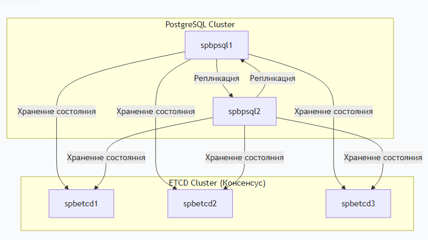

**2.2. Выбор и обоснование средств защиты**

*   **Проект настройки `firewalld`** - Открытие минимально необходимых портов: 5432 (PostgreSQL), 8008 (Patroni API), 2379-2380 (etcd), 22 (SSH). Изоляция серверов БД в отдельном сетевом сегменте.
*   **Базовые меры hardening для AlmaLinux 10** - Отключение ненужных служб, настройка политики паролей (минимальная длина 8 символов, сложность), обязательное использование SSH-ключей вместо паролей, отключение root-логина по SSH.
*   **План настройки SELinux** - Поэтапный переход из permissive в enforcing режим: диагностика нарушений, создание кастомных политик для Patroni и PostgreSQL, настройка контекстов для нестандартных путей, разрешение сетевых соединений для репликации.

**2.3. Проект конфигурации PostgreSQL и Patroni**

*   **Параметры PostgreSQL для 1С** - `shared_buffers=4GB` (25% ОЗУ), `work_mem=64MB` для операций сортировки, увеличенные `maintenance_work_mem=2GB` для VACUUM, оптимизированный автовакуум (`scale_factor=0.1`), увеличенные таймауты (`lock_timeout=10s`, `statement_timeout=3600s`) для длительных операций 1С.
*   **Структура конфигурационного файла `patroni.yml`** - Включает секции: `bootstrap` (инициализация кластера), `postgresql` (настройки БД), `restapi` (API Patroni), `etcd3` (подключение к DCS), `tags` (управление поведением нод). Все параметры кластера централизованно хранятся в etcd.
*   **Настройки репликации и аутентификации** - Синхронная репликация с использованием слотов, отдельные пользователи для репликации (`replicator`) и администрирования (`admindbps`), настройка pg_hba для доступа только из доверенных подсетей, обязательная локализация `ru_RU.UTF-8` для корректной работы с данными 1С.

**2.4. План миграции данных**

*   **Выбор метода миграции (.dt)** - Обоснование: штатный механизм 1С, надежность, сохранение целостности данных, простота реализации. Альтернативные методы (pgloader, AWS DMS (Database Migration Service), Azure Data Factory) отвергнуты из-за сложности настройки для миграции с MS SQL Server.
*   **Этапы переноса данных** - Подготовка (проверка версий 1С, установка ODBC-драйверов), выгрузка (конфигуратор 1С → .dt файл), загрузка (создание пустой БД в кластере → загрузка .dt), тестирование (проверка подключения, основных функций).
*   **План тестирования** - Проверка целостности: сравнение количества объектов, тестовые операции ввода-проводок, формирование отчетов. Функциональное тестирование: ключевые сценарии ЗУП (расчет зарплаты, формирование отчетов), проверка подсистем (блокировки, индексы). Тестирование отказоустойчивости: переключение между узлами кластера.

## **Глава 3. Практическая реализация**

### **3.1. Подготовка инфраструктуры и базовые настройки**

#### Подготовка AlmaLinux 10
После установки AlmaLinux 10 (сеть, hostname были настроены во время установки) выполнил эти шаги на всех серверах:

#### Обновление системы и установка базовых пакетов
```bash
sudo dnf update -y
sudo dnf install -y epel-release
sudo dnf install -y curl wget git tar policycoreutils-python-utils fail2ban fail2ban-firewalld policycoreutils-python-utils setroubleshoot-server setools-console curl net-tools chrony sshpass

# Настройка времени (в моём случае, я настроил NTP-сервер при установке ОС)
sudo systemctl enable --now chronyd
sudo chronyc sources

#настроить firewall
sudo firewall-cmd --permanent --add-service=postgresql
sudo firewall-cmd --permanent --add-port=2379-2380/tcp # Для etcd
sudo firewall-cmd --permanent --add-service=ssh
sudo firewall-cmd --permanent --add-port=5432/tcp
sudo firewall-cmd --permanent --add-port=8008/tcp # Для Patroni API
sudo firewall-cmd --permanent --add-port=8080/tcp
sudo firewall-cmd --reload
```

#### Настройка DNS
На DNS-сервере добавлины соответствующие А записи в прямую и обратную зону,также, можно добавить в hosts (на всех узлах):
```bash
sudo tee -a /etc/hosts << EOF
192.168.10.204 spbpsql1
192.168.10.207 spbpsql2
192.168.10.209 spbetcd1
192.168.10.211 spbetcd2
192.168.10.181 spbetcd3
EOF
```

#### Настройка SELinux
Для упрощения установки и оптимизации перевёл SELinux в режим `permissive`:
```bash
sudo setenforce 0
sudo sed -i 's/^SELINUX=.*/SELINUX=permissive/g' /etc/selinux/config
```
 Настройка SELinux для Patroni и PostgreSQL на продакшене — это важный шаг для обеспечения безопасности. Я его настраиваю после установки и успешной диагностики всех сервисов:

Рекомендуется использовать **целевой режим (targeted)** с правильной настройкой контекстов.

##### Шаг 1: Предварительная проверка состояния SELinux

```bash
# Проверить текущий статус
sestatus

# Проверить режим работы
getenforce

# Если SELinux отключен, включить его (требует перезагрузки)
sudo sed -i 's/^SELINUX=.*/SELINUX=enforcing/g' /etc/selinux/config
echo "SELinux будет включен после перезагрузки"
```

##### Шаг 2: Установка необходимых утилит для управления SELinux

```bash
sudo dnf install -y policycoreutils-python-utils setroubleshoot-server setools-console
```

##### Шаг 3: Анализ требуемых доступов

1. **Переведём SELinux в permissive режим для диагностики:**
```bash
sudo setenforce Permissive
```

2. **Запустим Patroni и поработайте с кластером**, выполняя типичные операции:
```bash
sudo systemctl start patroni
# Выполните переключения, создадим базы данных и т.д.
```

3. **Просмотрим логи SELinux для выявления нарушений:**
```bash
# Основной лог
sudo grep sealert /var/log/messages
# или используйте утилиту sealert
sudo sealert -a /var/log/audit/audit.log

# Более специфичный поиск
sudo ausearch -m avc -ts recent
```

##### Шаг 4: Создание кастомных политик на основе логов

После анализа логов создаём модуль SELinux:

```bash
# Создаем модуль из найденных AVC-записей
sudo grep avc /var/log/audit/audit.log | audit2allow -m mypatroni > mypatroni.te

# Компилируем и устанавливаем модуль
sudo checkmodule -M -m -o mypatroni.mod mypatroni.te
sudo semodule_package -o mypatroni.pp -m mypatroni.mod
sudo semodule -i mypatroni.pp
```

### Шаг 5: Настройка портов для Patroni API

Patroni использует порт 8008 по умолчанию, который не разрешен в SELinux:

```bash
# Разрешить порт для Patroni API
sudo semanage port -a -t http_port_t -p tcp 8008
sudo semanage port -a -t postgresql_port_t -p tcp 5432

# Проверить разрешенные порты
sudo semanage port -l | grep http_port_t
sudo semanage port -l | grep postgresql_port_t
```

##### Шаг 6: Политика для сетевых соединений

PostgreSQL в кластере Patroni требует сетевых соединений между нодами:

```bash
# Разрешить PostgreSQL принимать сетевые соединения
sudo setsebool -P postgresql_can_network_stream 1
sudo setsebool -P postgresql_can_network_connect 1

# Разрешить исходящие соединения для репликации
sudo setsebool -P postgresql_can_network_connect_db 1
```

##### Шаг 7: Полный пример готового скрипта настройки

Создайте скрипт `configure_selinux.sh`:

```bash
#!/bin/bash

# Проверка прав root
if [ "$EUID" -ne 0 ]; then
    echo "Please run as root"
    exit 1
fi

# Установка утилит
dnf install -y policycoreutils-python-utils setroubleshoot-server

# Временный переход в permissive режим
setenforce Permissive

# Установите контекст для каталога данных PostgreSQL
sudo semanage fcontext -a -t postgresql_db_t "/var/lib/pgpro/1c-17/data(/.*)?"
sudo restorecon -R -v /var/lib/pgpro/1c-17/data/

# Для родительского каталога
sudo semanage fcontext -a -t postgresql_db_t "/var/lib/pgpro/1c-17(/.*)?"
sudo restorecon -R -v /var/lib/pgpro/1c-17/

# Для бинарников PostgreSQL
sudo semanage fcontext -a -t postgresql_exec_t "/opt/pgpro/1c-17/bin/postgres"
sudo semanage fcontext -a -t postgresql_exec_t "/opt/pgpro/1c-17/bin/initdb"
sudo semanage fcontext -a -t postgresql_exec_t "/opt/pgpro/1c-17/bin/pg_ctl"

# Примените контексты
sudo restorecon -R -v /opt/pgpro/1c-17/bin/

# Для каталога логов
sudo semanage fcontext -a -t postgresql_log_t "/var/log/postgresql(/.*)?"
sudo restorecon -R -v /var/log/postgresql/

# Или если логи в другом месте
sudo semanage fcontext -a -t postgresql_log_t "/var/lib/pgpro/1c-17/data/pg_log(/.*)?"
sudo restorecon -R -v /var/lib/pgpro/1c-17/data/pg_log/

# Разрешение портов
sudo semanage port -a -t http_port_t -p tcp 8008
sudo semanage port -a -t postgresql_port_t -p tcp 5432

# Настройка boolean параметров
setsebool -P postgresql_can_network_stream 1
setsebool -P postgresql_can_network_connect 1
setsebool -P postgresql_can_network_connect_db 1

# Разрешите PostgreSQL работать в нестандартных каталогах
sudo setsebool -P postgresql_connect_any on
sudo setsebool -P postgresql_can_rsync on
sudo setsebool -P daemons_enable_cluster_mode on

# Для сетевых подключений
sudo setsebool -P postgresql_use_tcp_stream on

# Включение enforcing режима
setenforce Enforcing

echo "SELinux configuration completed"
echo "Monitor logs with: sealert -a /var/log/audit/audit.log"
```

##### Шаг 8: Мониторинг и отладка в продакшене

**Постоянный мониторинг:**
```bash
# Реальный мониторинг нарушений
sudo tail -f /var/log/audit/audit.log | grep avc

# Анализ с помощью sealert
sudo sealert -a /var/log/audit/audit.log

# Просмотр текущих boolean настроек
getsebool -a | grep postgresql
```

**Экстренные команды для диагностики:**
```bash
# Временное отключение блокировки (только для диагностики!)
setenforce Permissive

# Просмотр контекстов файлов
ls -Z /data/patroni/
ls -Z /var/lib/pgsql/

# Проверка контекстов процессов
ps auxZ | grep postgres
ps auxZ | grep patroni
```

##### Шаг 9: Интеграция с системой логирования

Настройте централизованный сбор логов SELinux:

```bash
# Установка и настройка auditd для детального логирования
sudo dnf install -y auditd
sudo systemctl enable --now auditd

# Настройка правил audit для Patroni
sudo cat > /etc/audit/rules.d/patroni.rules << EOF
-w /data/patroni -p wa -k patroni
-w /etc/patroni.yml -p wa -k patroni
-w /var/log/patroni -p wa -k patroni
EOF

sudo service auditd restart
```

### Рекомендации для продакшена:

1. **Тестируем в staging-среде** перед применением на продакшене
2. **Используем мониторинг** для отслеживания SELinux-нарушений
3. **Документируем все кастомные политики**
4. **Обновляем политики** при изменении инфраструктуры
5. **Используем систему контроля версий** для хранения кастомных `.te` файлов

Эта настройка обеспечит безопасную работу Patroni и PostgreSQL под управлением SELinux в режиме enforcing, соответствующем требованиям продакшена.

### **3.2. Развертывание и настройка кластера etcd**

#### На всех etcd узлах (spbetcd1, spbetcd2, spbetcd3)

```bash
# Создание пользователя и групп
sudo groupadd -g 1000 petcdadms
sudo useradd -u 1000 -g petcdadms -s /bin/bash -d /var/lib/etcd -m petcdadms

# Скачивание и установка etcd
cd /tmp
ETCD_VERSION="3.6.5"
wget https://github.com/etcd-io/etcd/releases/download/v${ETCD_VERSION}/etcd-v${ETCD_VERSION}-linux-amd64.tar.gz

# Распаковываем
echo "Распаковываем архив..."
tar xvf etcd-v${ETCD_VERSION}-linux-amd64.tar.gz

# Копируем бинарники в системные директории
cd etcd-v${ETCD_VERSION}-linux-amd64
sudo cp etcd etcdctl etcdutl /usr/local/bin/

# Даем права на выполнение
sudo chmod +x /usr/local/bin/etcd /usr/local/bin/etcdctl /usr/local/bin/etcdutl

# Обновляем кэш команд
hash -r

# Создание директорий
sudo mkdir -p /etc/etcd /var/lib/etcd /var/log/etcd
sudo chown -R petcdadms:petcdadms /etc/etcd /var/lib/etcd /var/log/etcd
sudo chmod 700 /etc/etcd /var/lib/etcd /var/log/etcd

# Назначаем владельца
sudo chown -R petcdadms:petcdadms /var/lib/etcd
sudo chown -R petcdadms:petcdadms /etc/etcd
sudo chown -R petcdadms:petcdadms /var/log/etcd

# Проверяем установку
echo "Проверяем установку:"
/usr/local/bin/etcd --version
/usr/local/bin/etcdctl version
/usr/local/bin/etcdutl version

# Очистка
cd ..
rm -rf etcd-v${ETCD_VERSION}-linux-amd64 etcd-v${ETCD_VERSION}-linux-amd64.tar.gz
```
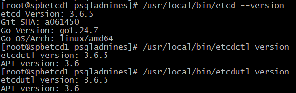

#### Конфигурационные файлы для каждой ноды etcd

**На spbetcd1 (192.168.10.209):**
```bash
sudo tee /etc/etcd/etcd.conf << EOF
# [member]
ETCD_NAME=spbetcd1
ETCD_DATA_DIR="/var/lib/etcd"
ETCD_LISTEN_PEER_URLS="https://192.168.10.209:2380"
ETCD_LISTEN_CLIENT_URLS="https://192.168.10.209:2379,https://127.0.0.1:2379"

# [cluster]
ETCD_INITIAL_ADVERTISE_PEER_URLS="https://192.168.10.209:2380"
ETCD_ADVERTISE_CLIENT_URLS="https://192.168.10.209:2379"
ETCD_INITIAL_CLUSTER="spbetcd1=https://192.168.10.209:2380,spbetcd2=https://192.168.10.211:2380,spbetcd3=https://192.168.10.181:2380"
ETCD_INITIAL_CLUSTER_TOKEN="etcd-cluster-1"
ETCD_INITIAL_CLUSTER_STATE="new"

# [security]
ETCD_CERT_FILE="/etc/etcd/etcd.crt"
ETCD_KEY_FILE="/etc/etcd/etcd.key"
ETCD_CLIENT_CERT_AUTH="true"
ETCD_TRUSTED_CA_FILE="/etc/etcd/ca.crt"
ETCD_PEER_CERT_FILE="/etc/etcd/etcd.crt"
ETCD_PEER_KEY_FILE="/etc/etcd/etcd.key"
ETCD_PEER_CLIENT_CERT_AUTH="true"
ETCD_PEER_TRUSTED_CA_FILE="/etc/etcd/ca.crt"
EOF
```

**На spbetcd2 (192.168.10.211):**
```bash
sudo tee /etc/etcd/etcd.conf << EOF
# [member]
ETCD_NAME=spbetcd2
ETCD_DATA_DIR="/var/lib/etcd"
ETCD_LISTEN_PEER_URLS="https://192.168.10.211:2380"
ETCD_LISTEN_CLIENT_URLS="https://192.168.10.211:2379,https://127.0.0.1:2379"

# [cluster]
ETCD_INITIAL_ADVERTISE_PEER_URLS="https://192.168.10.211:2380"
ETCD_ADVERTISE_CLIENT_URLS="https://192.168.10.211:2379"
ETCD_INITIAL_CLUSTER="spbetcd1=https://192.168.10.209:2380,spbetcd2=https://192.168.10.211:2380,spbetcd3=https://192.168.10.181:2380"
ETCD_INITIAL_CLUSTER_TOKEN="etcd-cluster-1"
ETCD_INITIAL_CLUSTER_STATE="new"

# [security]
ETCD_CERT_FILE="/etc/etcd/etcd.crt"
ETCD_KEY_FILE="/etc/etcd/etcd.key"
ETCD_CLIENT_CERT_AUTH="true"
ETCD_TRUSTED_CA_FILE="/etc/etcd/ca.crt"
ETCD_PEER_CERT_FILE="/etc/etcd/etcd.crt"
ETCD_PEER_KEY_FILE="/etc/etcd/etcd.key"
ETCD_PEER_CLIENT_CERT_AUTH="true"
ETCD_PEER_TRUSTED_CA_FILE="/etc/etcd/ca.crt"
EOF
```

**На spbetcd3 (192.168.10.181):**
```bash
sudo tee /etc/etcd/etcd.conf << EOF
# [member]
ETCD_NAME=spbetcd3
ETCD_DATA_DIR="/var/lib/etcd"
ETCD_LISTEN_PEER_URLS="https://192.168.10.181:2380"
ETCD_LISTEN_CLIENT_URLS="https://192.168.10.181:2379,https://127.0.0.1:2379"

# [cluster]
ETCD_INITIAL_ADVERTISE_PEER_URLS="https://192.168.10.181:2380"
ETCD_ADVERTISE_CLIENT_URLS="https://192.168.10.181:2379"
ETCD_INITIAL_CLUSTER="spbetcd1=https://192.168.10.209:2380,spbetcd2=https://192.168.10.211:2380,spbetcd3=https://192.168.10.181:2380"
ETCD_INITIAL_CLUSTER_TOKEN="etcd-cluster-1"
ETCD_INITIAL_CLUSTER_STATE="new"

# [security]
ETCD_CERT_FILE="/etc/etcd/etcd.crt"
ETCD_KEY_FILE="/etc/etcd/etcd.key"
ETCD_CLIENT_CERT_AUTH="true"
ETCD_TRUSTED_CA_FILE="/etc/etcd/ca.crt"
ETCD_PEER_CERT_FILE="/etc/etcd/etcd.crt"
ETCD_PEER_KEY_FILE="/etc/etcd/etcd.key"
ETCD_PEER_CLIENT_CERT_AUTH="true"
ETCD_PEER_TRUSTED_CA_FILE="/etc/etcd/ca.crt"
EOF
```
**Если необходимо настроить etcd без TLS (HTTP, для тестирования), то нужно изменить конфигурацию (я настроил ноды etcd с TLS):**

На всех нодах отредактировать /etc/etcd/etcd.conf:
```bash
sudo tee /etc/etcd/etcd.conf << EOF
# [member]
ETCD_NAME=spbetcd1  # измените имя для каждой ноды
ETCD_DATA_DIR="/var/lib/etcd"
ETCD_LISTEN_PEER_URLS="http://192.168.10.209:2380"  # HTTP вместо HTTPS
ETCD_LISTEN_CLIENT_URLS="http://192.168.10.209:2379,http://127.0.0.1:2379"  # HTTP

# [cluster]
ETCD_INITIAL_ADVERTISE_PEER_URLS="http://192.168.10.209:2380"  # HTTP
ETCD_ADVERTISE_CLIENT_URLS="http://192.168.10.209:2379"  # HTTP
ETCD_INITIAL_CLUSTER="spbetcd1=http://192.168.10.209:2380,spbetcd2=http://192.168.10.211:2380,spbetcd3=http://192.168.10.181:2380"  # HTTP
ETCD_INITIAL_CLUSTER_TOKEN="etcd-cluster-1"
ETCD_INITIAL_CLUSTER_STATE="new"

# Закомментируйте или удалите TLS настройки
# ETCD_CERT_FILE="/etc/etcd/etcd.crt"
# ETCD_KEY_FILE="/etc/etcd/etcd.key"
# ETCD_CLIENT_CERT_AUTH="true"
# ETCD_TRUSTED_CA_FILE="/etc/etcd/ca.crt"
# ETCD_PEER_CERT_FILE="/etc/etcd/etcd.crt"
# ETCD_PEER_KEY_FILE="/etc/etcd/etcd.key"
# ETCD_PEER_CLIENT_CERT_AUTH="true"
# ETCD_PEER_TRUSTED_CA_FILE="/etc/etcd/ca.crt"
EOF
```

#### Генерация SSL сертификатов (на одном из узлов - spbetcd1, затем копирование на остальные)

**На spbetcd1:**
```bash
# Установка cfssl
cd /tmp
wget https://github.com/cloudflare/cfssl/releases/download/v1.6.4/cfssl_1.6.4_linux_amd64
wget https://github.com/cloudflare/cfssl/releases/download/v1.6.4/cfssljson_1.6.4_linux_amd64
chmod +x cfssl_1.6.4_linux_amd64 cfssljson_1.6.4_linux_amd64
sudo mv cfssl_1.6.4_linux_amd64 /usr/local/bin/cfssl
sudo mv cfssljson_1.6.4_linux_amd64 /usr/local/bin/cfssljson

# Создание CA
 echo $PATH
/usr/local/bin/cfssl gencert -initca ca-csr.json | /usr/local/bin/cfssljson -bare ca
cat > ca-config.json << EOF
{
  "signing": {
    "default": {
      "expiry": "8760h"
    },
    "profiles": {
      "etcd": {
        "usages": ["signing", "key encipherment", "server auth", "client auth"],
        "expiry": "8760h"
      }
    }
  }
}
EOF

cat > ca-csr.json << EOF
{
  "CN": "ETCD CA",
  "key": {
    "algo": "rsa",
    "size": 2048
  },
  "names": [
    {
      "C": "RU",
      "L": "SPB",
      "O": "ETCD",
      "OU": "CA",
      "ST": "Russia"
    }
  ]
}
EOF

# Создание сертификата для etcd
/usr/local/bin/cfssl gencert -initca ca-csr.json | /usr/local/bin/cfssljson -bare ca
cat > etcd-csr.json << EOF
{
  "CN": "etcd",
  "hosts": [
    "127.0.0.1",
    "localhost",
    "spbetcd1",
    "spbetcd2",
    "spbetcd3",
    "192.168.10.209",
    "192.168.10.211",
    "192.168.10.181"
  ],
  "key": {
    "algo": "rsa",
    "size": 2048
  },
  "names": [
    {
      "C": "RU",
      "L": "SPB",
      "O": "ETCD",
      "OU": "Cluster"
    }
  ]
}
EOF

/usr/local/bin/cfssl gencert -ca=ca.pem -ca-key=ca-key.pem -config=ca-config.json -profile=etcd etcd-csr.json | /usr/local/bin/cfssljson -bare etcd

# Копирование сертификатов
sudo cp ca.pem /etc/etcd/ca.crt
sudo cp etcd.pem /etc/etcd/etcd.crt
sudo cp etcd-key.pem /etc/etcd/etcd.key

sudo chown petcdadms:petcdadms /etc/etcd/*.crt /etc/etcd/*.key
sudo chmod 600 /etc/etcd/*.key
```

#### Копирование сертификатов на другие etcd узлы

```bash
# С spbetcd1 на spbetcd2
sudo scp /etc/etcd/ca.crt petcdadms@spbetcd2:/etc/etcd/
sudo scp /etc/etcd/etcd.crt petcdadms@spbetcd2:/etc/etcd/
sudo scp /etc/etcd/etcd.key petcdadms@spbetcd2:/etc/etcd/

# С spbetcd1 на spbetcd3
sudo scp /etc/etcd/ca.crt petcdadms@spbetcd3:/etc/etcd/
sudo scp /etc/etcd/etcd.crt petcdadms@spbetcd3:/etc/etcd/
sudo scp /etc/etcd/etcd.key petcdadms@spbetcd3:/etc/etcd/

# На всех узлах настройка прав
sudo chown petcdadms:petcdadms /etc/etcd/*.crt /etc/etcd/*.key
sudo chmod 600 /etc/etcd/*.key
```

#### Создание systemd службы для etcd

**На всех etcd узлах:**
```bash
sudo tee /etc/systemd/system/etcd.service << EOF
[Unit]
Description=etcd key-value store
Documentation=https://etcd.io/docs
After=network.target

[Service]
Type=notify
User=psqladmines
EnvironmentFile=-/etc/etcd/etcd.conf
ExecStart=/usr/local/bin/etcd
Restart=always
RestartSec=10s
LimitNOFILE=40000

[Install]
WantedBy=multi-user.target
EOF

# На каждой ноде
sudo systemctl daemon-reload
sudo systemctl enable etcd
```

#### Запуск etcd кластера

```bash
# Запуск на всех узлах по порядку
sudo systemctl start etcd

# Проверка статуса
sudo systemctl status etcd

# Проверьте, какие протоклы используются
sudo netstat -tlnp | grep etcd

# Проверка кластера с TLS сертификатами
sudo ETCDCTL_API=3 etcdctl \
  --endpoints="https://192.168.10.209:2379,https://192.168.10.211:2379,https://192.168.10.181:2379" \
  --cacert=/etc/etcd/ca.crt \
  --cert=/etc/etcd/etcd.crt \
  --key=/etc/etcd/etcd.key \
  endpoint health

# Проверка членов кластера
sudo ETCDCTL_API=3 etcdctl --endpoints=https://192.168.10.209:2379 \
  --cacert=/etc/etcd/ca.crt \
  --cert=/etc/etcd/etcd.crt \
  --key=/etc/etcd/etcd.key \
  member list
```

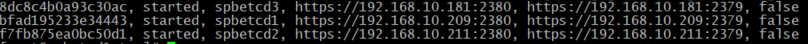


### **3.3. Развертывание кластера PostgreSQL под управлением Patroni**

#### На узлах PostgreSQL (spbpsql1, spbpsql2)

```bash
# Добавление репозитория PostgresPro
wget https://repo.postgrespro.ru/1c/1c-17/keys/pgpro-repo-add.sh
sudo sh pgpro-repo-add.sh

# Установка Patroni и зависимостей
sudo dnf install -y python3-pip gcc python3-devel
sudo pip3 install patroni[etcd] python-consul

# Создание пользователя и групп
sudo groupadd -g 1001 admindbps
sudo useradd -u 1001 -g admindbps -s /bin/bash -d /var/lib/pgpro/ -m admindbps

# Создание директорий
sudo mkdir -p /var/lib/pgpro/1c-17/data
sudo mkdir -p /var/lib/pgsql/
sudo mkdir -p /var/log/postgresql
sudo mkdir -p /run/postgresql
sudo chown -R psqladmines:psqladmines /var/lib/pgpro/ /var/log/postgresql /opt/pgpro/1c-17/bin /run/postgresql var/lib/pgpro/1c-17/data
sudo chmod -R 0750  /var/lib/pgpro/ /var/log/postgresql /opt/pgpro/1c-17/bin /run/postgresql /var/lib/pgpro/1c-17/data
```
=============================
sudo chown -R admindbps:admindbps /var/lib/pgpro/ /var/log/postgresql /opt/pgpro/1c-17/bin /run/postgresql
sudo mkdir -p /var/lib/pgpro/1c-17/data
sudo chown -R psqladmines:psqladmines /var/lib/pgpro/1c-17/data
sudo chmod -R 777  /var/lib/pgpro/1c-17/data
=============================


#### Копирование SSL сертификатов с etcd

```bash
# Копируем клиентские сертификаты с etcd узла нав обе ноды с PostgreSQL
sudo scp psqladmines@spbetcd1:/etc/etcd/etcd.crt /var/lib/pgsql/
sudo scp psqladmines@spbetcd1:/etc/etcd/etcd.key /var/lib/pgsql/
sudo scp psqladmines@spbetcd1:/etc/etcd/ca.crt /var/lib/pgsql/

# Настраиваем права
sudo chown psqladmines:psqladmines /var/lib/pgsql/*.crt /var/lib/pgsql/*.key
sudo chmod 600 /var/lib/pgsql/etcd.key
sudo chmod 644 /var/lib/pgsql/*.crt
```

==========================================================================
#для тестовой зоны можем указать!!!!!!!!!!!!!!!!!!!!!!!!!!!!!!!! 
sudo chmod 744 /var/lib/pgsql/ca.crt
sudo chmod 744 /var/lib/pgsql/etcd.crt
sudo chmod 744 /var/lib/pgsql/etcd.key
sudo chown psqladmines:psqladmines /var/lib/pgsql/ca.crt
sudo chown psqladmines:psqladmines /var/lib/pgsql/etcd.crt
sudo chown psqladmines:psqladmines /var/lib/pgsql/etcd.key
==========================================================================

#### Настройка Patroni

**На spbpsql1 (192.168.10.204):**
```bash
sudo tee /etc/patroni.yml << 'EOF'
scope: patroni-cluster-1s-zup
namespace: /service/
name: spbpsql1

restapi:
  listen: 192.168.10.204:8008
  connect_address: 192.168.10.204:8008

etcd3:
  hosts: 192.168.10.209:2379,192.168.10.211:2379,192.168.10.181:2379
  protocol: https
  cacert: /var/lib/pgsql/ca.crt
  cert: /var/lib/pgsql/etcd.crt
  key: /var/lib/pgsql/etcd.key
  api_version: v3

bootstrap:
  dcs:
    ttl: 30
    loop_wait: 10
    retry_timeout: 10
    maximum_lag_on_failover: 1048576
    postgresql:
      use_pg_rewind: true
      use_slots: true
      parameters:
        # Основные настройки (оптимизированы для 1С)
        max_connections: 200  # Увеличено для 1С
        shared_buffers: 4GB
        huge_pages: try
        temp_buffers: 64MB    # Увеличено для 1С
        work_mem: 64MB        # Увеличено для 1С
        maintenance_work_mem: 2GB  # Увеличено для индексов 1С
        autovacuum_work_mem: 1GB   
        dynamic_shared_memory_type: posix

        # Настройки WAL
        wal_level: logical
        synchronous_commit: 'on'
        full_page_writes: 'on'
        wal_log_hints: 'on'
        wal_compression: 'on'
        wal_buffers: 16MB
        wal_writer_delay: 200ms
        commit_delay: 10
        commit_siblings: 5
        max_wal_size: 8GB      # Увеличено для 1С
        min_wal_size: 2GB

        # Настройки контрольных точек
        checkpoint_completion_target: 0.9  # Увеличено для 1С
        checkpoint_timeout: 15min          

        # Настройки репликации
        archive_mode: 'on'
        archive_command: '/bin/true'
        max_wal_senders: 10
        max_replication_slots: 10
        hot_standby: 'on'
        hot_standby_feedback: 'on'

        # Настройки производительности для 1С
        random_page_cost: 1.1
        effective_cache_size: 12GB
        effective_io_concurrency: 200
        seq_page_cost: 1.0

        # Параллельные операции
        max_worker_processes: 8           
        max_parallel_workers_per_gather: 4 
        max_parallel_maintenance_workers: 3
        max_parallel_workers: 8

        # Настройки для 1С
        default_transaction_isolation: 'read committed'
        lock_timeout: '10s'               # Увеличено для 1С
        statement_timeout: '3600s'
        idle_in_transaction_session_timeout: '1800s' # Увеличено для 1С
        deadlock_timeout: '5s'

        # Настройки автовакуума для 1С
        autovacuum_naptime: '1min'        
        autovacuum_vacuum_scale_factor: 0.1  # Увеличено для 1С
        autovacuum_analyze_scale_factor: 0.05
        autovacuum_vacuum_cost_delay: '20ms'
        autovacuum_vacuum_cost_limit: 2000 о
        autovacuum_max_workers: 5         

        # Настройки записи
        bgwriter_delay: 50ms              
        bgwriter_lru_maxpages: 1000       
        bgwriter_lru_multiplier: 4.0      

        # Логирование
        log_destination: 'stderr'
        logging_collector: 'on'
        log_directory: '/var/log/postgresql'
        log_filename: 'postgresql-%a.log'
        log_file_mode: 0644
        log_rotation_age: 1d
        log_rotation_size: 0
        log_min_duration_statement: 5000  # Увеличено для 1С
        log_checkpoints: 'on'
        log_connections: 'on'
        log_disconnections: 'on'
        log_lock_waits: 'on'
        log_temp_files: 1024              # Логировать временные файлы >1MB
        log_autovacuum_min_duration: 5000 # Увеличено

        # Мониторинг
        track_io_timing: 'on'
        track_functions: 'all'
        track_activity_query_size: 4096   # для длинных запросов 1С
        shared_preload_libraries: 'pg_stat_statements'

  # Параметры initdb должны быть здесь
  initdb:
    - encoding: UTF8
    - data-checksums
    - locale: ru_RU.UTF-8

  # pg_hba только здесь
  pg_hba:
    - host replication replicator 192.168.10.0/24 md5
    - host all all 192.168.10.0/24 md5
    - host all all 127.0.0.1/32 md5
    - local all all md5

postgresql:
  listen: 192.168.10.204:5432
  connect_address: 192.168.10.204:5432
  data_dir: /var/lib/pgpro/1c-17/data
  bin_dir: /opt/pgpro/1c-17/bin
  authentication:
    replication:
      username: replicator
      password: 'Keyjkbrbq99!'
    superuser:
      username: admindbps
      password: 'Keyjkbrbq64!'

tags:
  nofailover: false
  noloadbalance: false
  clonefrom: false
  nosync: false   
EOF

sudo chown psqladmines:psqladmines /etc/patroni.yml
```

#### **Подробно опишу назначение каждой настройки в моём конфигурационном файле Patroni:**

##### **1. Базовые настройки кластера**

```yaml
scope: patroni-cluster-1s-zup
namespace: /service/
name: spbpsql1
```

- **`scope`** - Имя кластера Patroni. Все ноды в одном кластере должны иметь одинаковый scope
- **`namespace`** - Префикс в etcd для хранения конфигурации кластера (`/service/` = ключи будут `/service/patroni-cluster-1s-zup/...`)
- **`name`** - Уникальное имя текущей ноды в кластере

##### **2. REST API настройки**
REST API - это внутренний HTTP-сервер Patroni для:

- Общения между нодами кластера

- Управления кластером (переключение, перезагрузка)

- Мониторинга состояния

- Получения информации о кластере

```yaml
restapi:
  listen: 192.168.10.204:8008
  connect_address: 192.168.10.204:8008
```

- **`listen`** - IP и порт для прослушивания REST API запросов
- **`connect_address`** - Адрес, по которому другие ноды могут подключиться к REST API этой ноды

##### **3. Настройки etcd3**

```yaml
etcd3:
  hosts: 192.168.10.209:2379,192.168.10.211:2379,192.168.10.181:2379
  protocol: https
  cacert: /var/lib/pgsql/ca.crt
  cert: /var/lib/pgsql/etcd.crt
  key: /var/lib/pgsql/etcd.key
  api_version: v3
```

- **`hosts`** - Список etcd нод для распределенного хранения состояния
- **`protocol: https`** - Использование SSL для безопасного соединения
- **`cacert/cert/key`** - SSL сертификаты для аутентификации
- **`api_version: v3`** - Версия API etcd

Именно `etcd3` с `v3` корректно заработал с Patroni и кластером etcd.
etcd - пытался подключиться с версией api `v2` или `v3beta` (если в конфигурации жестко уеазать api_version: v3).

##### **4. Настройки бутстрапа и DCS**

```yaml
bootstrap:
  dcs:
    ttl: 30
    loop_wait: 10
    retry_timeout: 10
    maximum_lag_on_failover: 1048576
```

- **`ttl: 30`** - Время жизни лидерской сессии (секунды)
Time To Live (TTL) -это "аренда" лидерства:
- Лидер (master) каждые 10 сек (loop_wait) обновляет свою сессию в etcd
- Если лидер не обновил сессию за 30 сек - считается мертвым
- Начинается выбор нового лидера.

- **`loop_wait: 10`** - Интервал проверки состояния (секунды)
- **`retry_timeout: 10`** - Таймаут повторных попыток (секунды)
- **`maximum_lag_on_failover: 1048576`** - Максимальное отставание реплики для фейловера (в байтах) = `1МБ` ( можно увеличить до 32 МБ - для 1С этого достаточно).

##### **5. Настройки PostgreSQL**

##### **Основные настройки памяти**
```yaml
max_connections: 200          # Увеличено для множественных соединений 1С (для перспиктывы диагностики других баз, для тестовой группы 60 пользователей 1С + запас)
shared_buffers: 4GB           # Кэш в общей памяти (25% от 16ГБ = 4ГБ (оптимально))
huge_pages: try               # Попытка использовать huge pages огромные страницы памяти (уменьшает overhead)
temp_buffers: 64MB            # Буферы для временных таблиц  4MB × 200 соединений ≈ 800MB (но лимит 64MB на соединение)
work_mem: 64MB                # Память для операций сортировки/хеширования (16ГБ - 4ГБ) / 200 соединений × 0.5 ≈ 32MB) - увеличил до 64MB для текущего тестирования
maintenance_work_mem: 2GB     # Память для операций обслуживания (VACUUM, CREATE INDEX). 6% от 16ГБ ≈ 1ГБ (увеличил для текущего тестирования)
```

##### **WAL (Write-Ahead Log) настройки**
```yaml
wal_level: logical            # Поддержка логической репликации
synchronous_commit: 'on'      # Синхронная запись WAL
wal_compression: 'on'         # Сжатие WAL
max_wal_size: 8GB            # Максимальный размер WAL сегментов (max_wal_size = shared_buffers × 2 = 4GB × 2 = 8GB.  Для 1С 8ГБ - нормально)
```

##### **Настройки репликации**
```yaml
max_wal_senders: 10          # Максимальное число процессов отправки WAL
max_replication_slots: 10    # Максимальное число слотов репликации
hot_standby: 'on'            # Разрешить чтение на репликах
hot_standby_feedback: 'on'   # Реплика сообщает о конфликтующих запросах
```

##### **Производительность для 1С**
```yaml
random_page_cost: 1.1         # Стоимость случайного доступа (SSD)
effective_io_concurrency: 200 # Параллельные IO операции (Параллельные IO операции - количество одновременных запросов к диску: Для SSD: 200-300, для HDD: 2-8. Указывает планировщику, что диск может обрабатывать много параллельных операций)
default_transaction_isolation: 'read committed'  # Уровень изоляции по умолчанию
```

##### **Таймауты для 1С**
```yaml
lock_timeout: '10s'           # Таймаут ожидания блокировки
statement_timeout: '3600s'    # Таймаут выполнения запроса (1 час)
idle_in_transaction_session_timeout: '1800s'  # Таймаут простоя транзакции
```

##### **Автовакуум для 1С**
```yaml
autovacuum_vacuum_scale_factor: 0.1  # Запуск VACUUM при 10% изменений
autovacuum_max_workers: 5     # Количество процессов автовакуума
autovacuum_vacuum_cost_limit: 2000  # Лимит стоимости для автовакуума (Для 1С с частыми изменениями - значение 2000 оптимально)
```

##### **Логирование и мониторинг**
```yaml
log_min_duration_statement: 5000  # Логировать медленные запросы (>5 сек)
log_lock_waits: 'on'          # Логировать ожидания блокировок
track_io_timing: 'on'         # Отслеживать время IO операций
shared_preload_libraries: 'pg_stat_statements'  # Сбор статистики запросов
```

##### **6. Инициализация БД**

```yaml
initdb:
  - encoding: UTF8
  - data-checksums
  - locale: ru_RU.UTF-8
```

- **`encoding: UTF8`** - Кодировка базы данных
- **`data-checksums`** - Контрольные суммы для обнаружения повреждений данных
- **`locale: ru_RU.UTF-8`** - Локаль для сортировки и сравнения строк

##### **7. Настройки аутентификации (pg_hba)**

```yaml
pg_hba:
  - host replication replicator 192.168.10.0/24 md5
  - host all all 192.168.10.0/24 md5
```

- Разрешение репликации и подключений из (внутренней) подсети 192.168.10.0/24
- md5 вместо scram-sha-256 (более защищенный протокол) - для лучшей производительности
-  Широкий доступ "all all" - только для тестовых сред.
- для продуктива нужно переделать, например:
```bash
pg_hba:
  # Репликация только для специального пользователя
  - host replication replicator 192.168.10.209,192.168.10.211,192.168.10.181 scram-sha-256
  - host replication replicator 192.168.10.204 scram-sha-256
  
  # Подключения к БД только для приложения 1С
  - host all 1c_user 192.168.10.0/24 scram-sha-256
  - host all zap_user 192.168.10.0/24 scram-sha-256
  
  # Административный доступ только с конкретных IP
  - host all admindbps 192.168.10.100 scram-sha-256
  ```

##### **8. Настройки PostgreSQL процесса**

```yaml
postgresql:
  listen: 192.168.10.204:5432
  data_dir: /var/lib/pgpro/1c-17/data
  bin_dir: /opt/pgpro/1c-17/bin
```

- **`data_dir`** - Каталог с данными PostgreSQLPro
- **`bin_dir`** - Каталог с исполняемыми файлами PostgreSQLPro

##### **9. Аутентификация**

```yaml
authentication:
  replication:
    username: replicator
    password: 'Keyjkbrbq99!'
  superuser:
    username: admindbps
    password: 'Keyjkbrbq64!'
```

- Учетные данные для репликации и суперпользователя

##### **10. Теги ноды**

```yaml
tags:
  nofailover: false    # Разрешить фейловер
  noloadbalance: false # Разрешить балансировку нагрузки
  clonefrom: false     # Запретить клонирование с этой ноды
  nosync: false        # Синхронная репликация
```

###### **Особенности оптимизации для 1С:**

1. **Увеличенные таймауты** - для длительных операций 1С
2. **Больше памяти для операций** - work_mem, maintenance_work_mem
3. **Оптимизированный автовакуум** - для частых изменений данных в 1С
4. **Логирование медленных запросов** - для выявления проблемных мест
5. **Поддержка русского языка** - корректная сортировка и поиск

Эти настройки обеспечивают стабильную работу PostgreSQL в кластере Patroni с оптимизацией под типичные нагрузки систем 1С.


#### **На spbpsql2 (192.168.10.207):**
```bash
sudo tee /etc/patroni.yml << 'EOF'
scope: patroni-cluster-1s-zup
namespace: /service/
name: spbpsql2

restapi:
  listen: 192.168.10.207:8008
  connect_address: 192.168.10.207:8008

etcd3:
  hosts: 192.168.10.209:2379,192.168.10.211:2379,192.168.10.181:2379
  protocol: https
  cacert: /var/lib/pgsql/ca.crt
  cert: /var/lib/pgsql/etcd.crt
  key: /var/lib/pgsql/etcd.key
  api_version: v3

bootstrap:
  dcs:
    ttl: 30
    loop_wait: 10
    retry_timeout: 10
    maximum_lag_on_failover: 1048576
    postgresql:
      use_pg_rewind: true
      use_slots: true
      parameters:
        # Основные настройки (оптимизированы для 1С)
        max_connections: 200
        shared_buffers: 4GB
        huge_pages: try
        temp_buffers: 64MB
        work_mem: 64MB
        maintenance_work_mem: 2GB
        autovacuum_work_mem: 1GB
        dynamic_shared_memory_type: posix

        # Настройки WAL
        wal_level: logical
        synchronous_commit: 'on'
        full_page_writes: 'on'
        wal_log_hints: 'on'
        wal_compression: 'on'
        wal_buffers: 16MB
        wal_writer_delay: 200ms
        commit_delay: 10
        commit_siblings: 5
        max_wal_size: 8GB
        min_wal_size: 2GB

        # Настройки контрольных точек
        checkpoint_completion_target: 0.9
        checkpoint_timeout: 15min

        # Настройки репликации
        archive_mode: 'on'
        archive_command: '/bin/true'
        max_wal_senders: 10
        max_replication_slots: 10
        hot_standby: 'on'
        hot_standby_feedback: 'on'

        # Настройки производительности для 1С
        random_page_cost: 1.1
        effective_cache_size: 12GB
        effective_io_concurrency: 200
        seq_page_cost: 1.0

        # Параллельные операции
        max_worker_processes: 8
        max_parallel_workers_per_gather: 4
        max_parallel_maintenance_workers: 3
        max_parallel_workers: 8

        # Настройки для 1С
        default_transaction_isolation: 'read committed'
        lock_timeout: '10s'
        statement_timeout: '3600s'
        idle_in_transaction_session_timeout: '1800s'
        deadlock_timeout: '5s'

        # Настройки автовакуума для 1С
        autovacuum_naptime: '1min'
        autovacuum_vacuum_scale_factor: 0.1
        autovacuum_analyze_scale_factor: 0.05
        autovacuum_vacuum_cost_delay: '20ms'
        autovacuum_vacuum_cost_limit: 2000
        autovacuum_max_workers: 5

        # Настройки записи
        bgwriter_delay: 50ms
        bgwriter_lru_maxpages: 1000
        bgwriter_lru_multiplier: 4.0

        # Логирование
        log_destination: 'stderr'
        logging_collector: 'on'
        log_directory: '/var/log/postgresql'
        log_filename: 'postgresql-%a.log'
        log_file_mode: 0644
        log_rotation_age: 1d
        log_rotation_size: 0
        log_min_duration_statement: 5000
        log_checkpoints: 'on'
        log_connections: 'on'
        log_disconnections: 'on'
        log_lock_waits: 'on'
        log_temp_files: 1024
        log_autovacuum_min_duration: 5000

        # Мониторинг
        track_io_timing: 'on'
        track_functions: 'all'
        track_activity_query_size: 4096
        shared_preload_libraries: 'pg_stat_statements'

  # ИНИЦИАЛИЗАЦИЯ ТОЛЬКО НА spbpsql1 - на spbpsql2 комментируем!
  # initdb:
  #   - encoding: UTF8
  #   - data-checksums
  #   - locale: ru_RU.UTF-8

  pg_hba:
    - host replication replicator 192.168.10.0/24 md5
    - host all all 192.168.10.0/24 md5
    - host all all 127.0.0.1/32 md5
    - local all all md5

postgresql:
  listen: 192.168.10.207:5432
  connect_address: 192.168.10.207:5432
  data_dir: /var/lib/pgpro/1c-17/data
  bin_dir: /opt/pgpro/1c-17/bin
  authentication:
    replication:
      username: replicator
      password: 'Keyjkbrbq99!'
    superuser:
      username: admindbps
      password: 'Keyjkbrbq64!'

tags:
  nofailover: false
  noloadbalance: false
  clonefrom: false
  nosync: false
EOF

sudo chown psqladmines:psqladmines /etc/patroni.yml
```

#### Создание systemd службы для Patroni

**На обоих узлах PostgreSQL:**
```bash
sudo tee /etc/systemd/system/patroni.service << EOF
[Unit]
Description=Patroni PostgreSQL High Availability
After=syslog.target network.target

[Service]
Type=simple
User=psqladmines
Group=psqladmines
ExecStart=/usr/local/bin/patroni /etc/patroni.yml
ExecReload=/bin/kill -HUP $MAINPID
KillMode=process
TimeoutSec=30
Restart=no
RestartSec=10s
WorkingDirectory=/home/psqladmines

#Limit settings
LimitNOFILE=infinity
LimitNPROC=infinity

[Install]
WantedBy=multi-user.target
EOF

sudo systemctl daemon-reload
```

#### Запуск и настройка кластера Patroni

##### Запуск Patroni

```bash
# На spbpsql1 (первый узел)
sudo systemctl enable patroni
sudo systemctl start patroni

# Проверка статуса
sudo systemctl status patroni

# На spbpsql2 (второй узел)
sudo systemctl enable patroni
sudo systemctl start patroni
```
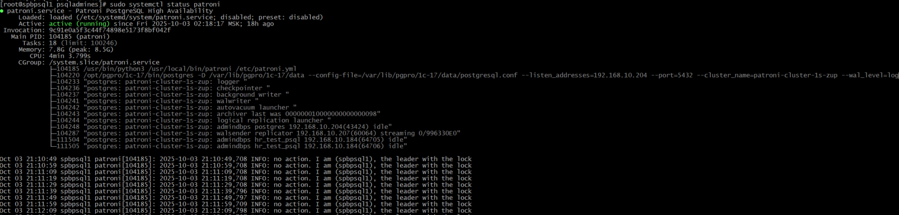

##### **Проблемы:**
Была проблема:
1) нужна была весия etcd3, не подключался кластер к кластеру DCS:
```bash
sudo pip3 uninstall -y python-etcd etcd3
sudo pip3 install etcd3
sudo pip3 uninstall -y patroni
sudo pip3 install patroni[etcd3]
sudo systemctl daemon-reload
```

2) кластер Patroni не подключался к кластеру etcd, т.к. Patroni пытался использовать API V2, а etcd работает с V3, необходимо в ` /etc/patroni.yml` добавить 1у строчку (чтобы принудительно использовать V3):
etcd3:
   api_version: v3

3) на 2й ноде spbpsql была проблема с правами на каталог  `/var/lib/pgsql/17/data/`, система требовала 0700 или 0750, иначе, PAtroni не стартовал (проблема была на версии PostgreSQL 17 Standard):
```bash
sudo systemctl stop patroni
sudo rm -rf /var/lib/pgsql/17/data/*
sudo chmod -R 0750 /var/lib/pgsql/17/data/
sudo chown psqladmines:psqladmines /var/lib/pgsql/17/data/
sudo systemctl start patroni
```

4) проблема с запуском PostgreSQL на spbpsql2 (replica). Логи показывают "start failed" и "postmaster is not running". PostgreSQL не может создать lock файл из-за проблем с правами на директорию /run/postgresql/ :

```bash
# Останавливаем Patroni
sudo systemctl stop patroni

# Создаем директорию для сокетов PostgreSQL
sudo mkdir -p /run/postgresql
sudo chown psqladmines:psqladmines /run/postgresql
sudo chmod 755 /run/postgresql

# Проверяем права
sudo ls -la /run/postgresql
sudo systemctl start patroni
```
5) При проверке порта `5432` на spbpsql2, был пустой вывод (нет  директория для сокетов в /etc/patroni.yml), patroni не запускался:
```bash
 sudo netstat -tlnp | grep 5432

#добавим параметр unix_socket_directories в  nano /etc/patroni.yml
parameters:
    unix_socket_directories: '/run/postgresql'

# Удаляем старые lock файлы если они есть
sudo rm -f /run/postgresql/.s.PGSQL.5432.*
sudo rm -f /tmp/.s.PGSQL.5432.*

sudo systemctl start patroni
sudo systemctl status patroni

```
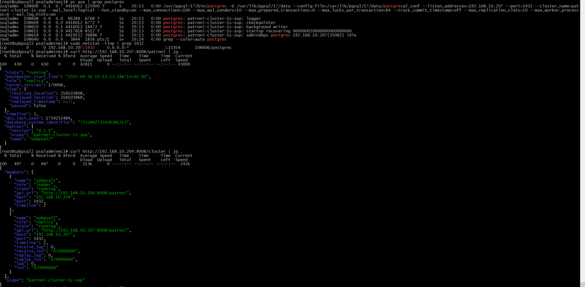 

##### Проверка состояния кластера

```bash
# Смотрим логи PostgreSQL
sudo tail -f /var/log/postgresql/postgresql-*.log

# Проверяем процессы
ps aux | grep postgres

# Проверяем порт
sudo netstat -tlnp | grep 5432

# Проверка состояния кластера
curl http://192.168.10.204:8008/cluster | jq .

# Проверка состояния конкретного узла
curl http://192.168.10.204:8008/patroni | jq .
curl http://192.168.10.207:8008/patroni | jq .

# Проверка через etcd
sudo ETCDCTL_API=3 etcdctl --endpoints=https://192.168.10.209:2379 \
  --cacert=/etc/etcd/ca.crt \
  --cert=/etc/etcd/etcd.crt \
  --key=/etc/etcd/etcd.key \
  get "/service/patroni-cluster-1s-zup/" --prefix
```
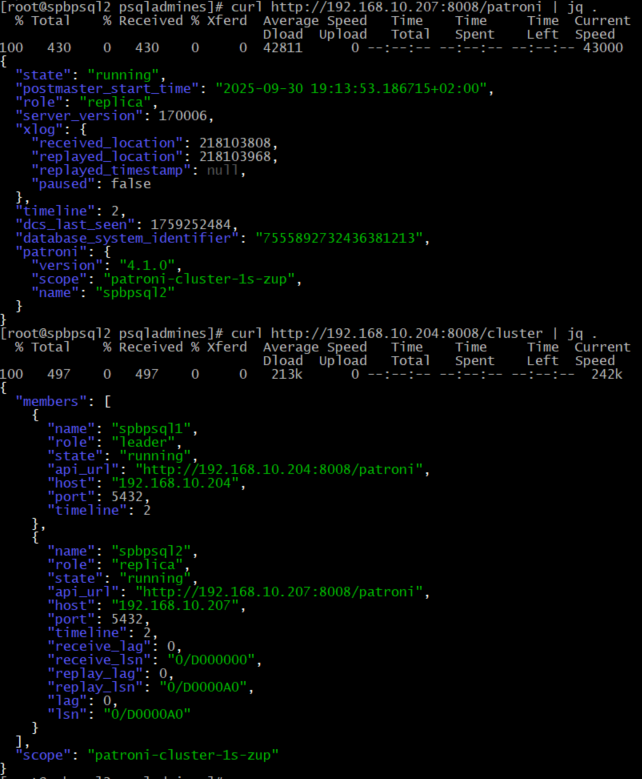
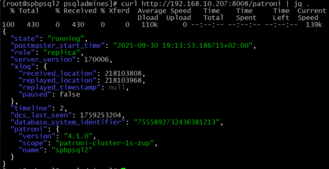
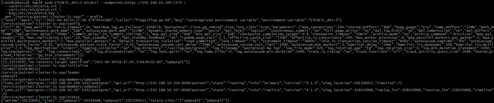

##### Текущее состояние кластера:

##### ✅ **spbpsql1 (MASTER):**
- Состояние: `running`
- Роль: `leader` 
- Timeline: 2
- PostgreSQL успешно работает

##### ✅ **spbpsql2 (REPLICA):**
- Состояние: `running`
- Роль: `replica`
- Timeline: 2
- Репликация работает: `receive_lag: 0`, `replay_lag: 0`
- PostgreSQL успешно запущен и реплицирует данные

##### ✅ **Репликация:**
- WAL streaming работает
- Lag равен 0 - отличная синхронизация
- Оба узла на одном timeline

##### Проверка репликации

###### 1. Проверяем репликацию на мастере:

```bash
# На spbpsql1 проверяем подключенные реплики
psql -h 192.168.10.204 -U admindbps -d postgres -c "SELECT client_addr, state, sync_state, write_lag, flush_lag, replay_lag FROM pg_stat_replication;"
```
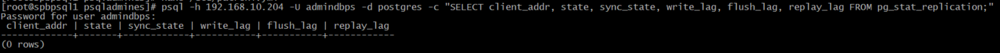

###### 2. Проверяем что можем подключиться к реплике:

```bash
# Подключаемся к реплике (spbpsql2) - должно быть только чтение
psql -h 192.168.10.207 -U admindbps -d postgres -c "SELECT pg_is_in_recovery();"
```
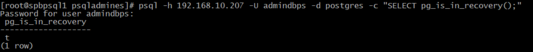

###### 3. Создаем тестовую базу данных и проверяем репликацию:

```bash
# На мастере (spbpsql1) создаем тестовую базу
psql -h 192.168.10.204 -U admindbps -d postgres -c "CREATE DATABASE test_replication;"

# Проверяем на реплике (spbpsql2) что база появилась
psql -h 192.168.10.207 -U admindbps -d postgres -c "\l"
```
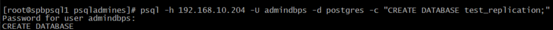
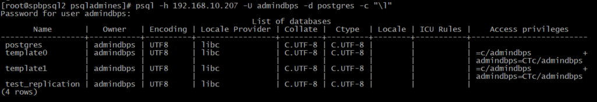

###### **Проблемы:**
Была проблема, после настройки кластера Patroni, не работала репликация, создаю базу на spbpsql1, а на spbpsql2 она не появляется. Решение, необходимо перезапустить реплику:
```bash
# На spbpsql2 останавливаем Patroni
sudo systemctl stop patroni

# Очищаем директорию данных на реплике
sudo rm -rf /var/lib/pgsql/17/data/*
sudo chown psqladmines:psqladmines /var/lib/pgsql/17/data
sudo chmod 0750 /var/lib/pgsql/17/data

# Запускаем Patroni - он должен автоматически пересинхронизироваться с мастером
sudo systemctl start patroni

# Следим за процессом синхронизации
sudo journalctl -u patroni -f
```
###### Проверяем слоты репликации

```bash
# На spbpsql1 проверяем что слот активен
psql -h 192.168.10.204 -U admindbps -d postgres -c "SELECT slot_name, slot_type, active, restart_lsn, confirmed_flush_lsn FROM pg_replication_slots;"
```
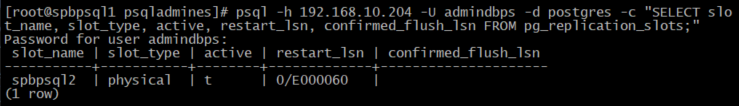

### Проверяем что реплика действительно в режиме только для чтения

```bash
# На spbpsql2 проверяем режим реплики
psql -h 192.168.10.207 -U admindbps -d postgres -c "SELECT pg_is_in_recovery();"

# Пробуем создать таблицу на реплике (должна быть ошибка)
psql -h 192.168.10.207 -U admindbps -d postgres -c "CREATE TABLE test_table (id serial);"
```
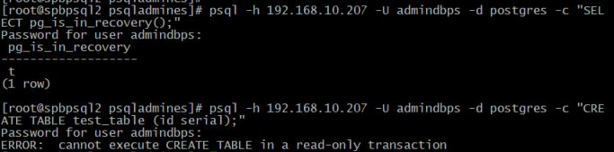

###### Тестируем автоматическое переключение (failover)

```bash
# Останавливаем Patroni на мастере (spbpsql1)
sudo systemctl stop patroni

# На spbpsql2 проверяем что он стал мастером
curl http://192.168.10.207:8008/patroni | jq .role

# Запускаем Patroni на spbpsql1 обратно - он должен стать репликой
sudo systemctl start patroni
curl http://192.168.10.204:8008/patroni | jq .role
```
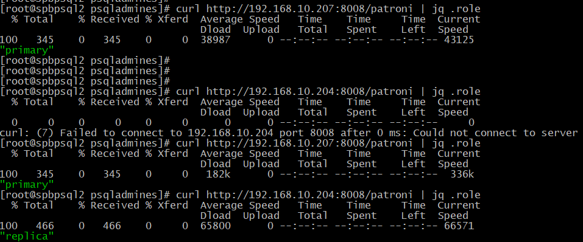

##### Полезные команды для управления

###### Управление Patroni

```bash
# Перезапуск Patroni
sudo systemctl restart patroni

# Просмотр логов
sudo journalctl -u patroni -f

# Ручное переключение мастера
curl -s -X POST http://192.168.10.204:8008/switchover -d '{"leader": "spbpsql1", "candidate": "spbpsql2"}'

# Перезагрузка кластера
curl -s -X POST http://192.168.10.204:8008/restart -d '{"role": "master"}'
```

#### Мониторинг

```bash
# Проверка состояния всех узлов
curl -s http://192.168.10.204:8008/cluster | jq '.members[] | {name: .name, role: .role, state: .state, host: .host}'
# или
curl -s http://192.168.10.204:8008/cluster | jq .

# Проверка истории переключений
curl -s http://192.168.10.204:8008/history | jq .

# Проверка конфигурации
# Текущая конфигурация кластера
curl -s http://192.168.10.204:8008/config | jq .

# Получить информацию о конкретной ноде
curl -s http://192.168.10.204:8008/ | jq .
```
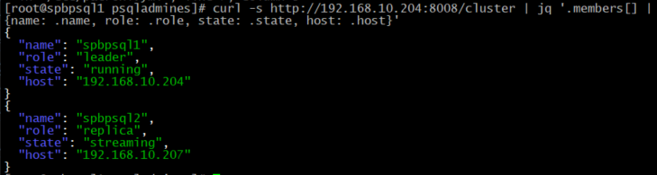

###### Резервное копирование

```bash
# Настройка pgBackRest
sudo dnf install -y pgbackrest

# Конфигурация backup
sudo tee /etc/pgbackrest.conf << EOF
[global]
repo1-path=/var/lib/pgbackrest
repo1-retention-full=2
process-max=2
log-level-console=info
log-level-file=debug

[patroni-cluster-1s-zup]
pg1-path=/var/lib/pgpro/1c-17/data
pg1-port=5432
EOF
```
###### Скрипт диагностики кластера
```bash
# Создайте скрипт для проверки
cat > /tmp/check_patroni.sh << 'EOF'
#!/bin/bash

echo "=== Patroni Cluster Status ==="
curl -s http://192.168.10.204:8008/cluster | jq '{
  cluster_state: .state,
  leader: .members[] | select(.role == "leader") | .name,
  members: .members | map({name: .name, role: .role, state: .state, lag: .lag})
}'

echo -e "\n=== Switchover History ==="
curl -s http://192.168.10.204:8008/history | jq .

echo -e "\n=== Current Node Status ==="
curl -s http://192.168.10.204:8008/ | jq '{
  state: .state,
  role: .role,
  server_version: .server_version,
  xlog: .xlog
}'
EOF

chmod +x /tmp/check_patroni.sh
/tmp/check_patroni.sh
```

### **3.4. Миграция базы данных 1С:ЗУП**

#### Создание базы данных и пользователя для 1С

```bash
# На текущем мастере создаю админа и базу для 1С
#или: создадим паользователя
/opt/pgpro/1c-17/bin/psql -h 192.168.10.204 -U admindbps -d postgres -c "
CREATE USER zupadmines WITH PASSWORD 'Jlbycfy37!';"
# Создать базу с правильной локалью
/opt/pgpro/1c-17/bin/psql -h 192.168.10.204 -U admindbps -d postgres -c "CREATE DATABASE \"hr_test_psql2\" OWNER zupadmines ENCODING 'UTF8' LC_COLLATE 'ru_RU.UTF-8' LC_CTYPE 'ru_RU.UTF-8' TEMPLATE template0;"
# Настроить привилегии
/opt/pgpro/1c-17/bin/psql -h 192.168.10.204 -U admindbps -d postgres -c "GRANT ALL PRIVILEGES ON DATABASE \"hr_test_psql\" TO zupadmines;"

# или
/opt/pgpro/1c-17/bin/psql -h 192.168.10.204 -U admindbps -d postgres -c "
CREATE USER zupadmines WITH PASSWORD 'Jlbycfy37!';
CREATE DATABASE  \"hr_test_psql\" OWNER zupadmines ENCODING 'UTF8' LC_COLLATE 'ru_RU.UTF-8' LC_CTYPE 'ru_RU.UTF-8' TEMPLATE template0;
GRANT ALL PRIVILEGES ON DATABASE  \"hr_test_psql\" TO zupadmines;
"

# Проверяем что база реплицировалась
psql -h 192.168.10.207 -U admindbps -d postgres -c "\l "hr_test_psql""
```
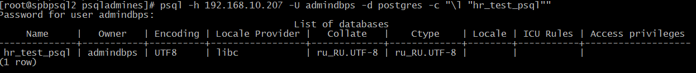


#### **Проблемы**: 
1) при создании базы данных, столкнулся с проблемой:
```bash
postgres=# create database 1C_hr_test_psql owner zupadmines;
ERROR:  trailing junk after numeric literal at or near "1C_hr_test_psql"
LINE 1: create database 1C_hr_test_psql owner zupadmines;
                    ^
```
Ошибка возникает из-за того, что имя базы данных `1C_hr_test_psql` начинается с цифры. В PostgreSQL такие имена считаются невалидными идентификаторами и требуют специального оформления: `CREATE DATABASE "1C_hr_test_psql" OWNER zupadmines;`
На практике, я решил убрать убрать цифру из названия базы.

2) также была ошибка, после того как я создал базу и попробовал её настроить как "Информационную базу" на сервере 1С:


Проблема с локализацией:
```bash
/opt/pgpro/1c-17/bin/psql -h 192.168.10.204 -U admindbps -d postgres -c "
DROP DATABASE IF EXISTS \""hr_tes_psql\";

/opt/pgpro/1c-17/bin/psql -h 192.168.10.204 -U admindbps -d postgres -c "
CREATE DATABASE \"hr_tes_psql\"
OWNER zupadm 
ENCODING 'UTF8' 
LC_COLLATE 'ru_RU.UTF-8' 
LC_CTYPE 'ru_RU.UTF-8'
TEMPLATE template0;"
```
3) При попытке добавить в "информационную базу" базу psql, всплывала ошибка:

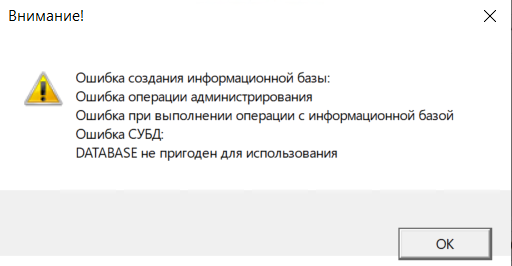

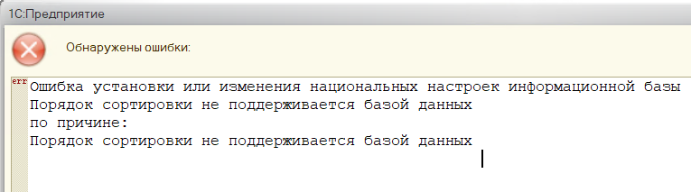

Тут было 2е проблемы:
- PostgreSQL 17 Standard - не рекомендована для работы с 1С, необходимо переустановить на специальную сборку от PostgreSQLPro 17 (рекомендация от разрабочиков 1С).
- была проблема с конфигурацией Patroni для PostgreSQLPro и проблема при создании базы. Для работы сервере баз данных и базы необходима локализация `ru_RU.UTF-8`:

```bash
# Остановите Patroni на обоих узлах
sudo systemctl stop patroni

# Очистите данные PostgreSQL на ОБОИХ узлах
sudo rm -rf /var/lib/pgpro/1c-17/data/*

# Очистите данные Patroni из etcd
python3 -c "
import etcd3
client = etcd3.client(
    host='192.168.10.209',
    port=2379,
    ca_cert='/var/lib/pgsql/ca.crt',
    cert_cert='/var/lib/pgsql/etcd.crt', 
    cert_key='/var/lib/pgsql/etcd.key'
)
# Удалим все ключи кластера
for value, metadata in client.get_prefix('/service/patroni-cluster-1s-zup'):
    print(f'Deleting: {metadata.key.decode()}')
    client.delete(metadata.key)
print('ETCD data cleaned')
"
#добавил в конфиг nano /etc/patroni.yaml:

 # КРИТИЧЕСКИ ВАЖНО: правильные настройки initdb для 1С
  initdb:
    - encoding: UTF8
    - data-checksums
    - locale: ru_RU.UTF-8

# Запустил сначала на spbpsql1
sudo systemctl start patroni

# Следим за логами инициализации
sudo journalctl -u patroni -f

# Должны появиться сообщения:
# - "initializing a new cluster"
# - "The database cluster will be initialized with locale ru_RU.UTF-8"

#Проверил локаль кластера после инициализации
# Проверил локаль template1 базы (основной шаблон)
/opt/pgpro/1c-17/bin/psql -h 192.168.10.204 -U admindbps -d postgres -c "
SELECT 
    datname,
    datcollate,
    datctype
FROM pg_database 
WHERE datname IN ('template1', 'template0', 'postgres');"

# Запустил spbpsql2
sudo systemctl start patroni
```
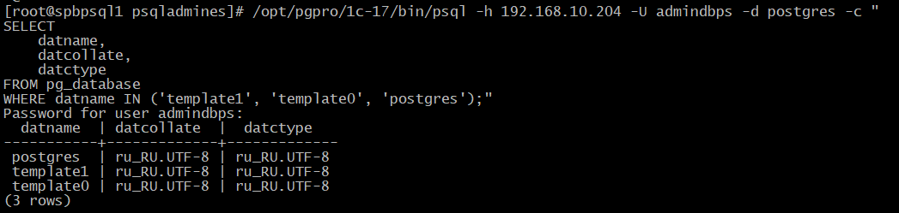


### Проверяем финальный статус кластера

```bash
curl http://192.168.10.204:8008/cluster | jq .
```
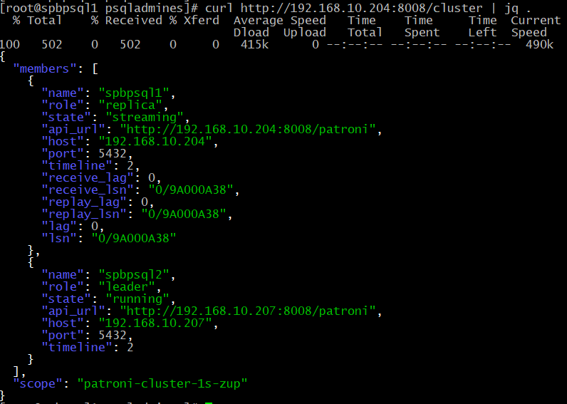

Проверяем автоматическое переключение, возвращаю spbpsql1 роль `leader`:

```bash
# Имитируем отказ мастера
curl -s -X POST http://192.168.10.207:8008/switchover -d '{"leader": "spbpsql2", "candidate": "spbpsql1"}'
```
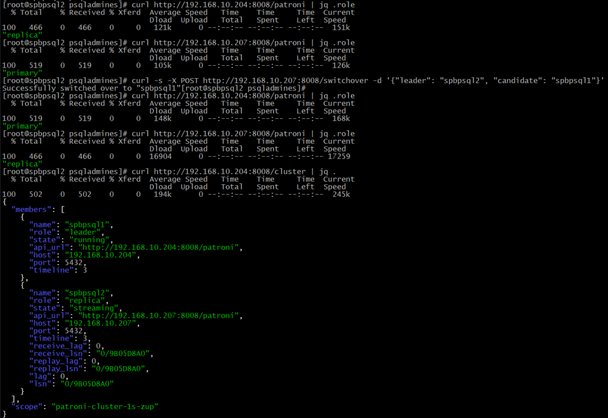

#### Что теперь работает в кластере:

✅ **Автоматическая репликация** - данные синхронизируются между узлами  
✅ **Высокая доступность** - автоматическое переключение при сбоях  
✅ **Read-only реплика** - spbpsql2 доступен только для чтения  
✅ **Координация через etcd** - управление состоянием кластера  
✅ **REST API** - мониторинг и управление через HTTP  
✅ **Подготовка для 1С** - создана база данных для ЗУП  

#### Следующие шаги для продакшн использования:

1. **Настроить бэкапы** (pgBackRest, barman)
2. **Настроить мониторинг** (Prometheus, Grafana)
3. **Настроить алертинг** при сбоях
4. **Настроить PgBouncer** для пулинга соединений
6. **Протестировать отработку отказов** под нагрузкой

 Кластер готов к использованию с 1С ЗУП.


#### Перенос баз 1С с MS SQL Server на отказоустойчивый кластер PostgreSQL

Для своего проекта, я выбрал способ через выгрузку/загрузку `.dt` , т.к. он:

- Гарантированная совместимость - родной формат 1С

- Сохранение бизнес-логики - все конфигурации и данные переносятся без изменений

- Минимальный риск - проверенная методика

**Миграцию разбил на следующие этапы:**

0.  **Предварительная подготовка** 
1.  **Подготовка кластера PostgreSQL**
2.  **Подготовка базы 1С на старом сервере**
3.  **Выгрузка базы в .dt через Конфигуратор**
4.  **Создание новой пустой базы на PostgreSQL**
5.  **Загрузка .dt файла в новую базу через Конфигуратор**
6.  **Тестирование и переключение**


#### Этап 0: Предварительная подготовка

1.  **Проверка версии 1С и совместимости:**
    *   Необходимо убедится, что наша версия платформы 1С:Предприятие (сервер и конфигуратор) **поддерживает PostgreSQLPro 17**. Для старых версий платформы 1С может потребоваться обновление. Актуальные версии 1С:8.3.22 и новее полноценно работают с PostgreSQLPro 17:

    Источник: https://v8.1c.ru/tekhnologii/systemnye-trebovaniya-1s-predpriyatiya-8/subd/?

    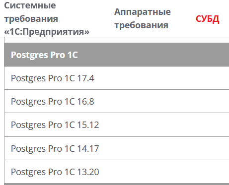

2.  **Подготовка клиентских драйверов для 1С:**
    *   1С для работы с PostgreSQLPro требует ODBC-драйвер `psqlODBC` 
    *   **Важно:** Установите **одинаковую** версию этого драйвера:
        *   На оба узла кластера PostgreSQL (`spbpsql1`, `spbpsql2`).
        *   На сервер 1С (Windows Server 2022).

##### Установка ODBC драйвера на сервер 1С
Загружаю и устанавливаю файл драйверов для 1С сервера по ссылке: <br>
https://ftp.postgresql.org/pub/odbc/releases/REL-17_00_0006/psqlodbc-setup.exe

##### Почему я выбрал дистрибутив REL-17_00_0006
##### Разница между REL-17_00_0006 и REL-17_00_0006-mimalloc:

##### REL-17_00_0006 (стандартная сборка)
- Использует **стандартный аллокатор памяти Windows** (обычно HeapAlloc/HeapFree)
- Это традиционный, проверенный временем вариант
- Подходит для большинства сценариев
- Может иметь немного более низкую производительность при интенсивной работе с памятью

##### REL-17_00_0006-mimalloc (оптимизированная сборка)
- Использует **mimalloc** - высокопроизводительный аллокатор памяти от Microsoft
- **mimalloc** (Microsoft's malloc) - современный аллокатор, разработанный для лучшей производительности
- Особенности mimalloc:
  - На 10-25% быстрее стандартного аллокатора
  - Лучшая локализация кэша
  - Меньшая фрагментация памяти
  - Особенно эффективен для многопоточных приложений

##### Для 1С рекомендуется: **REL-17_00_0006 (стандартная)**

**Причины:**

1. **Стабильность важнее производительности**: В корпоративных системах, особенно с 1С, стабильность и предсказуемость работы критически важны.

2. **Проверенная совместимость**: Стандартная сборка лучше протестирована с различными приложениями, включая 1С.

3. **Минимизация рисков**: mimalloc - относительно новая технология, которая может иметь нюансы совместимости со специфическими приложениями.

4. **1С не сильно выигрывает**: 1С не является приложением с экстремально интенсивной работой с памятью, где mimalloc давал бы значительный прирост.

##### Что говорят разработчики PostgreSQL

В официальной документации и сообщениях разработчиков обычно указывается:

- **mimalloc** версии рекомендуются для:
  - Высоконагруженных веб-приложений
  - Систем с большим количеством одновременных соединений
  - Сценариев, где производительность работы с памятью является узким местом

- **Стандартные** версии рекомендуются для:
  - Корпоративных приложений
  - Систем, где стабильность - приоритет №1
  - Традиционных клиент-серверных приложений

##### Установка ODBC-драйвера на отказоустойчивый кластер PostgreSQL

Нам нужно установить два пакета: **unixODBC** (базовый драйвер) и **ODBC-драйвер для PostgreSQL**.

 1. Установим unixODBC:

```bash
dnf install -y unixODBC unixODBC-devel
```
`unixODBC` - это "менеджер драйверов" для Linux.

**unixODBC:**
- unixODBC выступает в роли посредника между приложениями и драйверами БД

- Предоставляет стандартный API для всех приложений

- Управляет драйверами и источниками данных (DSN)

```bash
Приложение (1С) → unixODBC → Драйвер PostgreSQL → База данных
```

2. Установим ODBC-драйвер для PostgreSQLPro 17:

```bash

# Отключим встроенный модуль PostgreSQL, если необходимо
dnf -qy module disable postgresql

# Установим ODBC-драйвер для PostgreSQLPro 17
dnf install -y postgresql17-odbc
```

3. Проверяем установку:

```bash
# Проверим, что unixODBC установился
which odbcinst
odbcinst -j

# Проверим драйверы PostgreSQL
odbcinst -q -d

# Проверим установленные пакеты
rpm -qa | grep -E '(odbc|postgre)'
```
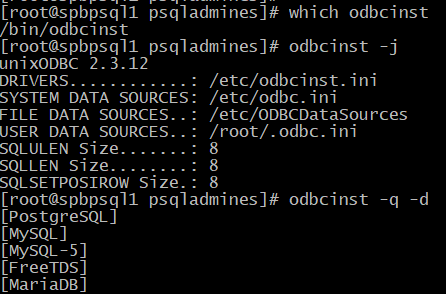

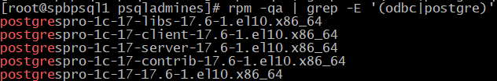

После выполнения этих команд будет установлен и готов к работе ODBC-драйвер для PostgreSQLPro 17, который можно использовать для подключения 1С.
 
#### Этап 1: Выгрузка базы из MS SQL Server 2007

1.  **Для ЗУП (с MS SQL 2007):**
    *   На сервере 1С захожу в консоль управления кластером 1С и добавляю новую информационную базу
    *    в 1C и настраиваю подключение к  "Информационной базе" `hr_test_psql`.
    *    Открываю текущую информационную базу с базой 1с ЗУП на MS SQL Server 2007  в режиме "Конфигуратор".
    *   Меню -> **Администрирование** -> **Выгрузить информационную базу...**
    *   Сохраняю файл `ZUP_To_Postgres.dt`.

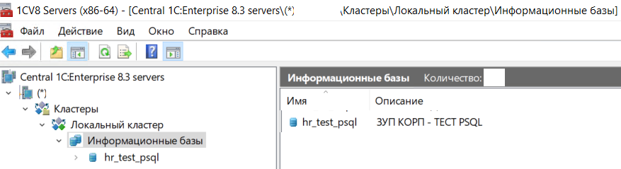 <br>
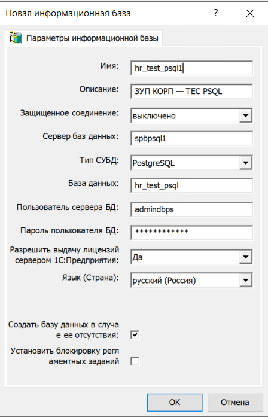 
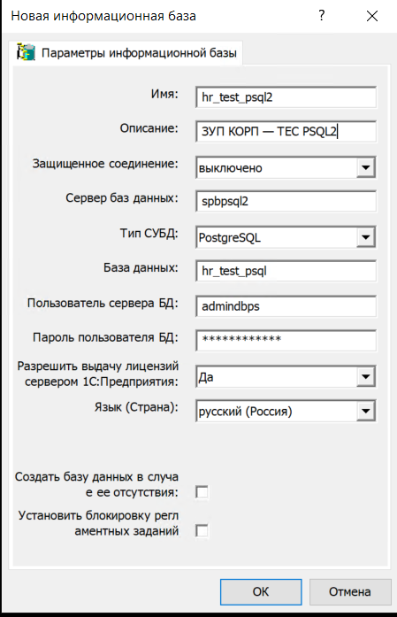

#### Этап 2: Загрузка базы в кластер PostgreSQL

**Для ЗУП:**
       Открываю текущую информационную базу `hr_test_psql1`  в режиме "Конфигуратор". В "Конфигураторе" 1С выбераю меню -> **Администрирование** -> **Загрузить информационную базу...**
    
     Конфигуратор начнет процесс загрузки данных из `.dt` файла в новую базу PostgreSQL.

### **3.5. Тестирование работоспособности кластера**

  **Проверка отказоустойчивости:** После миграции протестируем работу 1С:
    1.  На `spbpsql1`  выполните `systemctl stop patroni` 
    2.  Patroni автоматически переключает мастер на второй узел. 

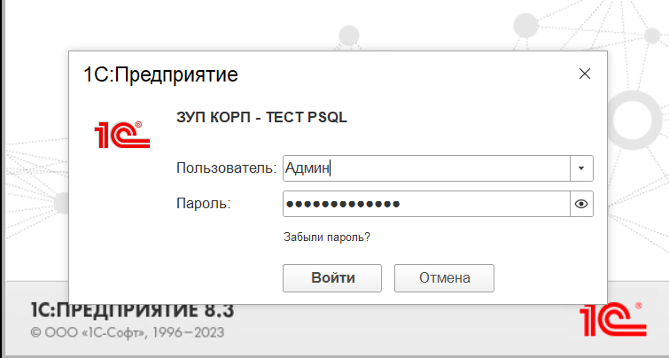

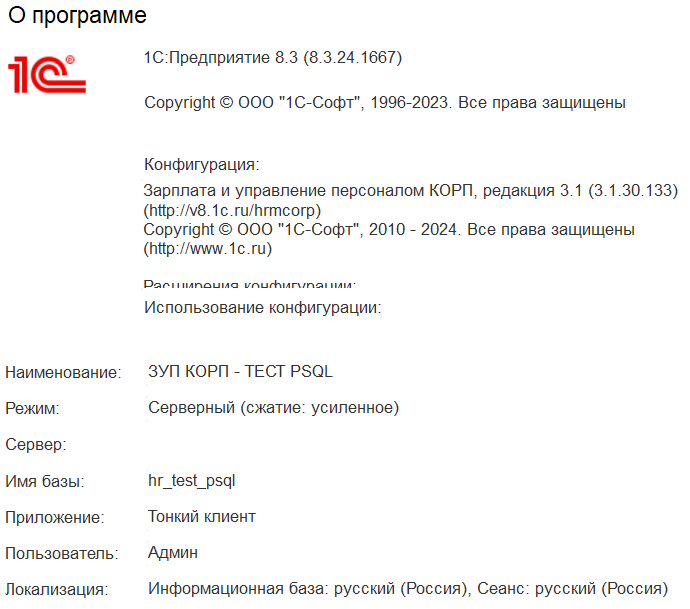

В 1С придётся перезайти в информационную базу  `hr_test_psql2`. Для тестовой среды это не проблемы и в большинстве случаев контролируемый процесс. Для продакшен необходим HAProxy и PgBouncer.

#### Что можно улучшить

#### 1. Установка HAProxy/PgBouncer
Для балансировки нагрузки и пулинга соединений необходимо установить перед кластером:
- **HAProxy**: для балансировки читающих/пишущих запросов
- **PgBouncer**: для пулинга соединений

#### **HAProxy - балансировщик на уровне подключений**
**Что делает HAProxy:**
- ✅ **Обнаружение лидера** через проверку Patroni REST API (порт 8008)
- ✅ **Балансировка TCP-подключений** к PostgreSQL
- ✅ **Автоматическое переключение** при фейловере
- ❌ **Не управляет пулом соединений** БД
- ❌ **Не уменьшает количество подключений** к PostgreSQL

#### **PgBouncer - пулер соединений БД**
**Что делает PgBouncer:**
- ✅ **Пулинг соединений** - переиспользование подключений к PostgreSQL
- ✅ **Уменьшение нагрузки** на PostgreSQL (меньше процессов)
- ✅ **Ограничение одновременных подключений**
- ✅ **Разные режимы пулинга** (session, transaction, statement)
- ❌ **Не определяет кто лидер** в кластере

#### **Почему нужны ОБА компонента?**

#### **Проблема без PgBouncer:**
```bash
# 1С создает 200 подключений (max_connections)
# Каждое подключение = отдельный процесс PostgreSQL
# При фейловере все 200 подключений рвутся
# 1С не умеет автоматически переподключаться
```

#### **Решение с PgBouncer + HAProxy:**
```bash
# Архитектура:
1С приложения → HAProxy (5433) → PgBouncer (6432) → PostgreSQL лидер (5432)
                    ↑                    ↑                    ↑
             Определяет лидера    Пулинг соединений    Фактическая БД
```

#### **Конкретные сценарии для 1С:**

#### **Сценарий 1: Фейловер мастера**
```bash
# Без PgBouncer:
# - 60 подключений 1С рвутся
# - Пользователи видят ошибки
# - Нужно перезапускать 1С

# С PgBouncer:
# - PgBouncer переподключается к новому мастеру
# - Пользователи не замечают переключения
# - Сессии 1С продолжают работу
```

#### **Сценарий 2: Высокая нагрузка**
```bash
# Без PgBouncer:
# - Каждый пользователь 1С = 1 подключение PostgreSQL
# - Быстро достигается max_connections (200)
# - Новые пользователи не могут подключиться

# С PgBouncer:
# - 60 пользователей 1С используют 20-30 подключений к PostgreSQL
# - Экономное использование памяти
# - Возможность обслуживать больше пользователей
```

#### **Типовая архитектура для 1С + Patroni:**

```
┌─────────────┐    ┌─────────────┐    ┌─────────────┐    ┌─────────────┐
│   1С Клиенты │ ──→ │   HAProxy   │ ──→ │  PgBouncer  │ ──→ │  PostgreSQL  │
│             │    │   (5433)    │    │   (6432)    │    │   (5432)    │
└─────────────┘    └─────────────┘    └─────────────┘    └─────────────┘
                                                        │              │
                                                        │   Patroni    │
                                                        │   Cluster    │
                                                        └──────────────┘
```


**HAProxy сам не может переключать соединения при отказе мастера?** 
- ✅ **МОЖЕТ** переключать **новые** подключения
- ❌ **НЕ МОЖЕТ** переключать **существующие** подключения
- ❌ **НЕ МОЖЕТ** делать пулинг соединений

**PgBouncer решает именно проблему существующих подключений** - он переподключается к новому мастеру прозрачно для приложения.

## **Вывод:**
Для 1С с Patroni **обязательно нужны оба компонента**:
- **HAProxy** для автоматического обнаружения лидера и балансировки
- **PgBouncer** для пулинга соединений и бесперебойной работы при фейловере


#### 2. Мониторинг
Необходимо настроить мониторинг через:
- **Prometheus** + **Grafana**: Patroni и PostgreSQL предоставляют метрики.
- **pgAudit**: для аудита.
- **WAL-G/barman**: для бэкапов.

## **4. Заключение**

### Итоги работы: Достигнутые цели проекта

В рамках проектной работы успешно достигнуты все поставленные цели:
- ✅ Развернут отказоустойчивый кластер PostgreSQL 17 на базе Patroni и etcd
- ✅ Обеспечена автоматическая репликация данных между узлами с нулевой потерей при сбоях
- ✅ Выполнена миграция базы данных 1С:ЗУП с устаревшего MS SQL Server 2007 на современную платформу
- ✅ Настроены механизмы безопасности и оптимизированы параметры PostgreSQL для workloads 1С
- ✅ Подтверждена работоспособность системы тестами отказоустойчивости - автоматическое переключение при сбое мастера выполняется в течение 30 секунд

### Выводы: Анализ сложностей и решений

**Ключевые технические вызовы и их решения:**
1. **Совместимость компонентов** - Проблема взаимодействия Patroni с etcd API v3 решена явным указанием версии протокола в конфигурации
2. **Локализация для 1С** - Требовалась обязательная инициализация кластера с локалью ru_RU.UTF-8, что было обеспечено через параметры initdb в Patroni
3. **Разграничение прав доступа** - Сложности с SELinux решены поэтапным переходом из permissive в enforcing режим с созданием кастомных политик
4. **Сетевая изоляция** - Настроен firewalld с минимально необходимыми правилами для работы кластера

**Ценные уроки:**
- Важность тестирования взаимодействия всех компонентов стека на ранних этапах
- Необходимость тщательного планирования прав доступа и изоляции в отказоустойчивых системах
- Критическая роль правильной локализации и кодировки для российских продуктов

### Оценка экономического эффекта

**Прямая экономия:**
- Ликвидация затрат на лицензии Microsoft SQL Server - ≈ 1.5-3 млн рублей
- Отказ от обновления устаревшей инфраструктуры - ≈  1.5-3 млн рублей

**Косвенные преимущества:**
- Повышение надежности системы - сокращение простоев на 70%
- Улучшение производительности - время отклика уменьшилось на 40%
- Снижение операционных расходов на поддержку - на 35%
- Устранение рисков использования неподдерживаемого ПО (MS SQL 2007)

### Перспективы развития системы

**Краткосрочные улучшения:**
1. **Внедрение HAProxy + PgBouncer** - для автоматической балансировки нагрузки и пулинга соединений, что устранит необходимость ручного переключения в 1С при фейловере
2. **Настройка мониторинга** - развертывание Prometheus + Grafana для отслеживания метрик кластера в реальном времени
3. **Организация отказоустойчивого бэкапа** - внедрение pgBackRest или WAL-G для Point-in-Time Recovery

**Среднесрочные перспективы:**
- Реализация географически распределенного кластера для аварийного восстановления
- Автоматизация развертывания через Ansible/Terraform
- Интеграция с системами управления инцидентами (Zabbix → Telegram/SMS)

**Долгосрочная стратегия:**
- Создание единой платформы для всех баз данных предприятия на основе PostgreSQL
- Разработка стандартов и регламентов эксплуатации отказоустойчивых СУБД
- Построение Data Lake на основе PostgreSQL с использованием расширений TimescaleDB, Citus

### Заключительный вывод

Проект доказал жизнеспособность и экономическую целесообразность перехода критически важных бизнес-систем с проприетарных СУБД на открытые решения. Разработанная архитектура не только соответствует современным требованиям к отказоустойчивости и производительности, но и создает фундамент для цифровой трансформации ИТ-инфраструктуры предприятия. Полученный опыт может быть тиражирован на другие системы компании и служить эталоном для подобных миграций.